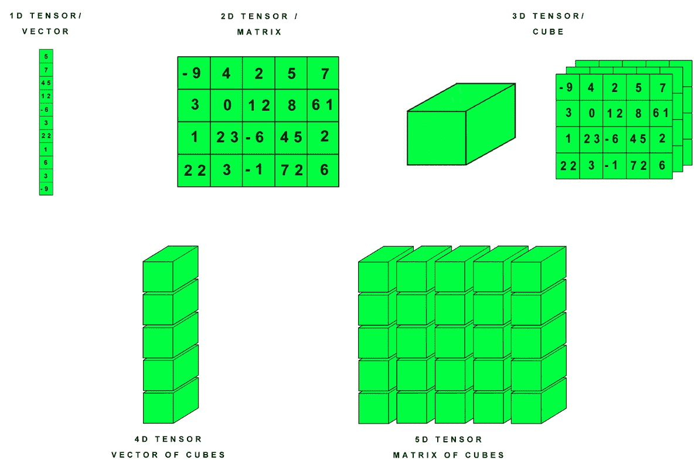
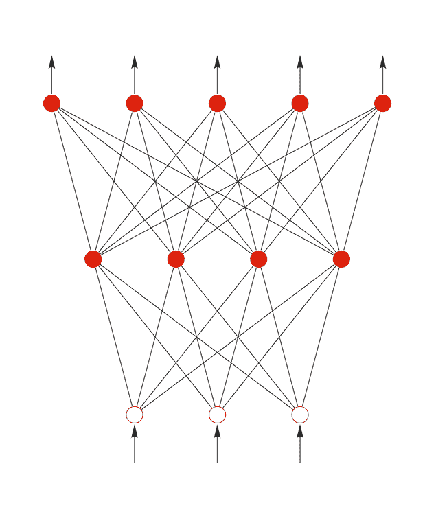
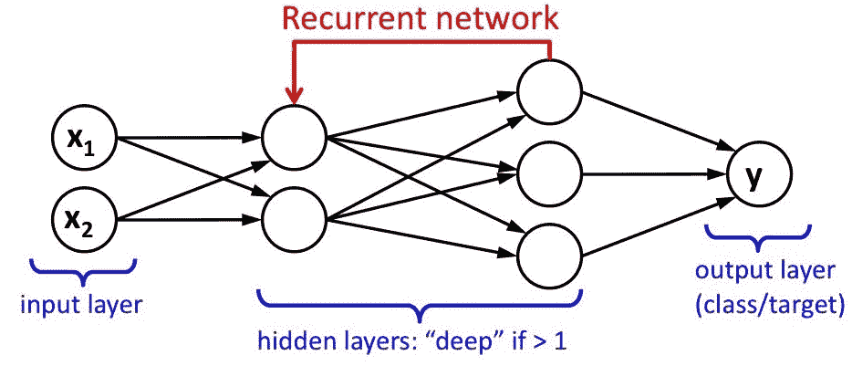
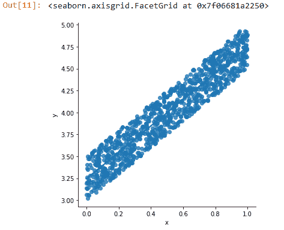
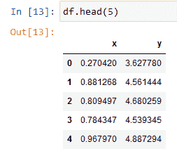

# 在 PyTorch 中使用数据

> 原文：<https://medium.com/oracledevs/working-with-data-in-pytorch-fa2641e37d17?source=collection_archive---------0----------------------->

欢迎阅读本系列的第二篇文章，在这篇文章中，我们将探讨 PyTorch 和 TensorFlow 之间的异同，以及如何使用这两个库处理数据。

在本文中，我们将深入研究 PyTorch。

值得注意的是，PyTorch 被认为是一个 Python 库，这意味着它与 Python 中已经存在的数据科学堆栈集成得非常好。它比 TensorFlow 有一些优势:

*   它比 TensorFlow 更新
*   它与 Torch 框架(一个 Lua 生态系统的社区维护包，用于机器学习、并行处理、数据操作和计算机视觉)相关，Python 实现更新了 PyTorch 的用户群
*   这是脸书工程师用的
*   它使用**张量**，这可以被认为是 NumPy 数组(或计算机优化矩阵)的 GPU 等价物。



# PyTorch 基础—神经网络

神经网络(NN)的实现就像人脑中的神经元一样工作:

*   我们有称为感知器的人工神经元
*   感知器就像神经元一样，通过轴突(在神经网络中称为**配置**)与其他神经元连接，以双向传输数据

在神经网络中，感知器由一系列输入组成，产生一个输出。所以我们总是有一个输入层和一个输出层；由我们程序员来决定这些层如何通信以及以何种顺序通信。

有两种类型的神经网络:

*   前馈 NNs:数据从输入层移动到输出层(是否通过隐藏层，视问题而定)；当数据到达输出层时，神经网络已经完成了它的工作。
*   递归 NNs:数据不会在输出层停止。而不是这样做，它再次循环进入先前遍历的层，执行指定数量的循环。需要注意的是，计算梯度是基于[链规则](https://tutorial.math.lamar.edu/classes/calcI/ChainRule.aspx)，这需要一点高等数学背景。然而，PyTorch 已经善良地实现了他们自己的“自动梯度计算器”，称为**亲笔签名的**，它自动完成大部分数学工作。我们稍后会详细讨论这种叫做[自动微分](https://blog.paperspace.com/pytorch-101-understanding-graphs-and-automatic-differentiation/)的技术。

这是一个前馈神经网络的图像，我们只能看到从输入(下图)到输出(上图)的正向步骤:



这是一个递归神经网络的图像。请注意，如果我们有一个以上的隐藏层，我们可以将 NN 称为**深 NN** 。



# 张量

在 PyTorch 中，我们有**张量**。如前一篇文章所述，PyTorch 张量与 NumPy 数组完全等价。就像 numpy 库一样，操作张量将允许我们对现有数据执行优化操作。遇到由 GPU 执行 PyTorch 张量是相当常见的(因为 GPU 比 CPU 本身有更多的处理单元)，尽管认为它不能在 CPU 中执行是一种常见的误解。

# 加载数据

要加载数据，我们可以遵循几个步骤:

*   从 Python 兼容的标准库中加载数据集，就像使用*熊猫*从 CSV 文件中读取，然后将数据集转换成张量。
*   使用 **torchvision** 包，它允许我们使用多处理实现来加载和准备数据集。

本着展示 PyTorch 如何工作的精神，我们将从可预加载的内置数据集列表中加载一个[著名数据集](https://image-net.org/):

# 内置数据集

```
import argparse
# we get the number of threads we want
parser = argparse.ArgumentParser()
parser.add_argument('-t', '--threads', help='Number of threads to use', required=True)
args = parser.parse_args() # we load the image net dataset
imagenet_data = torchvision.datasets.ImageNet('./imagenet/')# By using the DataLoader function, we can load the dataset in n batch sizes (by default 1) 
# shuffle is used to randomize the dataset's row order
data_loader = torch.utils.data.DataLoader(imagenet_data, batch_size=4, shuffle=True, num_workers=args.threads)
```

你可以在这里找到内置数据集列表。

# PyTorch 中的自动微分

关于神经网络的复杂之处在于它们是如何构建的。如果我们开始学习，为了理解神经网络，学习微分方程和积分的强化课程会很复杂。

自动微分是 PyTorch 实现和创造的一种技术。这使得神经网络成为一个数学上非常复杂的话题，迫使人们计算递归神经网络的梯度。

# 执行线性回归

我们将使用 PyTorch 执行 ML 中最简单的回归任务之一:线性回归。

首先，我们导入生成人工数据所需的所有包。为此，我们将使用 numpy 的随机函数:

```
import numpy as np
import pandas as pd# we define the 3 components of linear regression
# y = mx + b (m = slope, b = intercept)
# y is what we need to predict (dependent variable)
m = 1.5
b = 3x = np.random.rand(1024)
randomness = np.random.rand(1024) / 2 # adding some randomness.
y = m*x + b + randomness # we have our linear regression formula with the added randomness# create an empty dataframe and populate it.
df = pd.DataFrame()
df['x'] = x
df['y'] = y
```

我们绘制当前随机数据:

```
import seaborn as snssns.lmplot(x = 'x', y = 'y',
    data = df)
```



我们继续创建一个能够预测目标变量“y”的神经网络。我们已经在 **df** 数据框架中获得了这些数据。注意，如前所述，我们能够在一个**熊猫**对象和一个 PyTorch 对象之间进行转换。

```
import torch
import torch.nn as nn
from torch.autograd import Variable # we import autograd for automatic differentiation
# as mentioned in the last article, we create our object with an init constructor,
# and the forward function to define the NN's configuration. In this case, we'll just have one step from the 
# input layer to the output layer (linear).
class LinearRegressorNN(nn.Module): def __init__(self, input_dim, output_dim):
      super(LinearRegressionModel, self).__init__()
      # linear equation is of the form Wx = B where W is a weight, x is the input and B is the output.
      # it's the simplest form of PyTorch
      self.linear = nn.Linear(input_dim, output_dim) # nn.Linear is required for linear regression def forward(self, x):
      out = self.linear(x)
      return out
```

作为提醒，下面是我们存储在 dataframe **df** 中的数据格式的描述:



由于我们只有一个特征和一个目标变量(特征是自变量 x，目标是因变量 y)，我们将维度定义为:

```
input_dim = x_train.shape[1]
output_dim = y_train.shape[1]
# we create an object of our above class
model = LinearRegressorNN(input_dim, output_dim)# the loss function will ultimately determine how gradients are calculated.
# in recurrent NNs, gradients are computed by applying the chain rule from the loss function backwards.
criterion = nn.MSELoss() # we define our loss function as the mean squared error
[w, b] = model.parameters()
print(w, b)
```

这将被归类为**前馈线性回归 NN** ，因为我们没有计算任何梯度或使用自动签名。

正如我们所见，处理数据(即使这是一个非常简单的线性回归问题)并不难，即使对于初学者来说也是如此。我们只需要让 NNs 的主要概念深入人心。在下一篇文章中，我们将做一些类似的事情，但是使用 TensorFlow，之后我们将能够通过在文章系列结束时执行基准测试来比较两个库的性能。

敬请期待！

# 我如何开始学习 OCI？

请记住，你可以随时免费注册 OCI！您的 Oracle Cloud 帐户提供多项始终免费的服务和 300 美元免费积分的免费试用，可用于所有符合条件的 OCI 服务，最长 30 天。这些总是免费的服务是无限期的。免费试用服务可能会一直使用到您的 300 美元免费点数用完或 30 天到期，以先到者为准。你可以[在这里免费报名](https://signup.cloud.oracle.com/?language=en&sourceType=:ow:de:te::::&intcmp=:ow:de:te::::)。

# 加入对话！

如果你对甲骨文开发人员在他们的自然栖息地发生的事情感到好奇，来[加入我们的公共休闲频道](https://join.slack.com/t/oracledevrel/shared_invite/zt-uffjmwh3-ksmv2ii9YxSkc6IpbokL1g?customTrackingParam=:ow:de:te::::RC_WWMK220210P00062:Medium_nachoLoL5)！我们不介意成为你的鱼缸🐠

# 许可证

由[伊格纳西奥·吉尔勒莫·马丁内兹](https://www.linkedin.com/in/ignacio-g-martinez/)[@贾斯珀兰](https://github.com/jasperan)撰写，由[艾琳·道森](https://www.linkedin.com/in/dawsontech/)编辑

版权所有 2022 Oracle 和/或其附属公司。

根据通用许可许可证(UPL)1.0 版进行许可。

详见[许可证](https://github.com/oracle-devrel/leagueoflegends-optimizer/blob/main/LICENSE)。