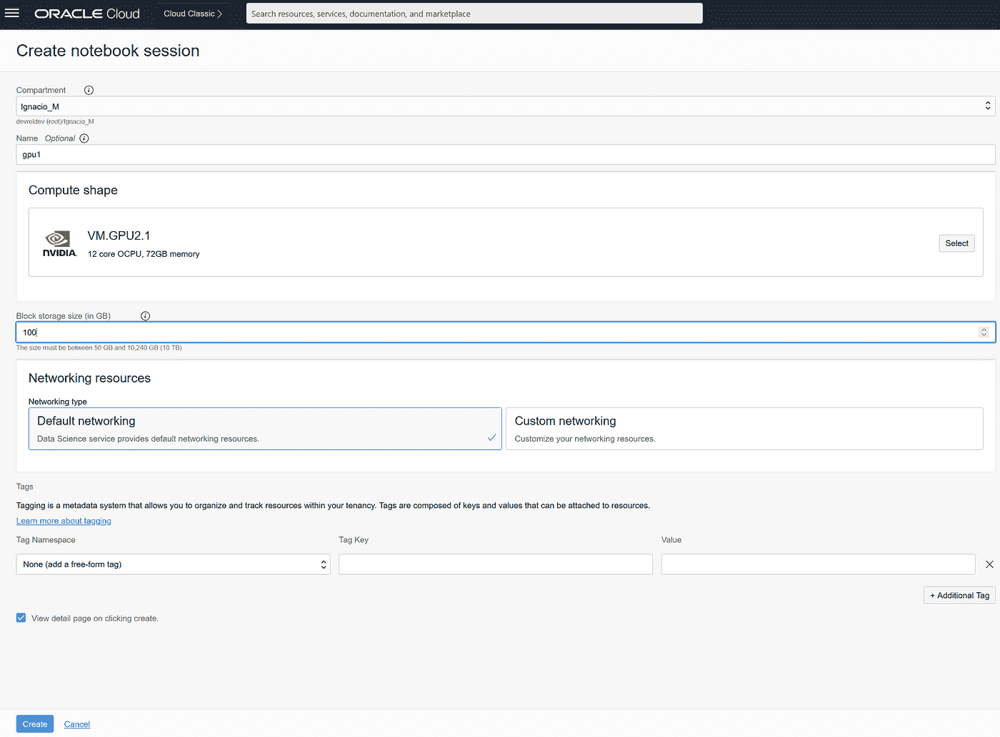
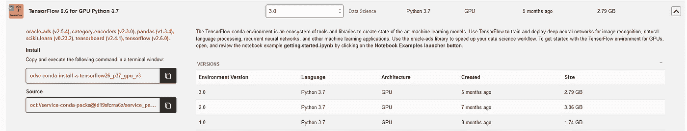
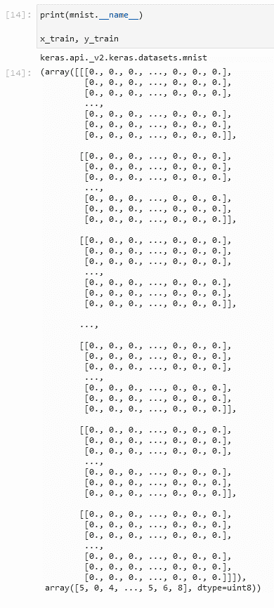

# 在 TensorFlow 中使用数据

> 原文：<https://medium.com/oracledevs/working-with-data-in-tensorflow-a0656f616f4f?source=collection_archive---------1----------------------->

欢迎阅读本文章系列的第三篇文章！在本文中，我们将深入使用 TensorFlow 设置一个简单的项目，这与我们在文章系列中一直在做的事情(使用 PyTorch)相反。希望我们能看到两个库中的开发相对来说有多容易。

作为一个提醒，让我们有一些关于 TensorFlow 的初始信息。TensorFlow 是一个开源平台，由谷歌在 2015 年创建。从这个原始平台开始，开发了多个库，允许在各种编程语言中使用 TensorFlow 平台，如 Python、JavaScript，甚至移动设备。它为希望将机器学习的最新技术变为现实的开发人员和研究人员提供了一个全面的工具生态系统。

# 建立 OCI

为了在 OCI 建立 TensorFlow，我们将在 OCI 创建一个[数据科学](https://www.oracle.com/data-science/service/)笔记本，我们将能够从云中访问它，从而省去我们在本地建立项目的麻烦。我们将遵循的过程与我们在系列文章的第一篇文章[中遵循的步骤非常相似。如果你在 OCI 建立数据科学笔记本时遇到了麻烦，一定要看看那篇文章。](https://github.com/jasperan/pytorch-tensorflow/blob/main/1_getting_started_with_pytorch_on_oci.md)

首先，我们设置一个 OCI 数据科学环境，并通过前往 OCI 控制台并导航到 **OCI 数据科学**来实例化数据科学服务:


在我们到目前为止创建的唯一项目中，我们可以有几个笔记本会话；并且这些会话每个都有各自的存储。在我们的项目中，我们将创建一个新的笔记本会话，并在其中安装 TensorFlow 环境。



访问笔记本，我们从官方环境浏览器安装 TensorFlow 环境:



为了安装它，我们在终端中使用相应的预构建标识符运行命令。在撰写本文时，TensorFlow 2.7 是 CPU 可用的最新版本；以及面向 GPU 的 TensorFlow 2.6。

# TensorFlow 基础知识—使用 Keras 加载数据

值得注意的是，[在本系列的第一篇文章](https://github.com/jasperan/pytorch-tensorflow/blob/main/1_getting_started_with_pytorch_on_oci.md)中，我们加载了一个初始数据集(众所周知的虹膜数据集)，并从头开始创建了一个神经网络，以便准确预测虹膜的类型(setosa、versicolor 或 virginica)。我们通过 PyTorch 库实现了这一点，该库包括一个定制的数据集加载器。

就像 PyTorch 一样，TensorFlow 也“喜欢”将其数据集加载到 tensors 中；然而，[官方文档](https://www.tensorflow.org/tutorials)指向使用 **keras** 作为数据加载库。发现 Keras 和 TensorFlow 互换使用是很常见的，因为 Keras 简化了 TensorFlow 的使用。

您可能会问自己:为什么要改变我们加载数据的机制？Keras 和 TensorFlow 都是机器学习 NN 技术/库。然而，Keras **封装了**张量流。它是 TensorFlow 库的包装器，旨在使神经网络的开发更加容易。然而，这是有代价的，那就是速度。如果您决定使用 Keras 而不是 TensorFlow，请考虑在标准 TensorFlow 库之上构建的任何东西都将导致模型吞吐量/机器预测吞吐量方面的不准确性，因为在访问 TensorFlow 本身之前，所有东西都将通过 Keras 进行过滤。

记住这一点，您可以使用任何可用的数据加载库自由地加载数据。

我选择只使用 Keras 作为数据加载库，而不是我们以前用于开发的库(包括 iris NN)。

因此，这里有一个使用 Keras 库加载数据是多么容易的例子。对于本例，我们将使用 MNIST 数字分类数据集。这是 60000 幅灰度图像的数据集，尺寸为 28x28 像素，其中每幅图片代表数字 0 到 9 的图像，测试集大小为 10.000 幅图像。 **load_data** 函数自动将 mnist 数据集划分为以下训练/测试规模:

```
import tensorflow as tf
mnist_dataset = tf.keras.datasets.mnist# we split into train and tests using the load_data function 
(x_train, y_train), (x_test, y_test) = mnist_dataset.load_data()
x_train, x_test = x_train / 255.0, x_test / 255.0>>> Downloading data from https://storage.googleapis.com/tensorflow/tf-keras-datasets/mnist.npz
>>> 11493376/11490434 [==============================] - 0s 0us/step
>>> 11501568/11490434 [==============================] - 0s 0us/step
```

你可能会问为什么我们要把数据除以 255.0。这样做是为了将每个像素值(在数据集中的范围是从 0 到 255)归一化为从 0 到 1 的值(基本上我们是在应用归一化)。公平地说，这是不必要的，因为神经网络最终会自己学习如何规范化数据。然而，为了建立良好的软件实践并自己处理输入数据，我们在处理数据之前应用这个非常基本的规范化。

如果我们打印现有的当前数据，我们将得到一个 28x28 的数组作为输入数据(我们的特性)和一个整数作为标签(像素实际代表的数量):



# 训练模型

现在，我们将专注于训练模型。我们说过，每一行数据代表一幅图像。这张图片的尺寸是 28x28 像素，等于 784。因此，我们将创建一个具有 784 个输入的张量流模型，并将这些输入连接到一个密集层(隐藏层)，这意味着我们正在创建一个递归神经网络。因此，自动微分和复杂梯度计算将在内部自动执行。隐藏层将具有 128 个节点并重新激活，然后将连接到 10 个节点的输出层(另一个密集层)。

选择初始参数是一门复杂的艺术。例如，当我开始学习 AI 和 ML 时，我总是想知道人们是如何得出初始参数的，我认为这是一项具有挑战性的任务。在与非常广泛地使用神经网络的人交谈时，我被告知，这个初始数字通常是半随机地执行的(脑子里有一些想法)，没有给予它太多的思考。如果神经网络能够利用这些初始参数进行学习，我们不需要执行任何其他操作，如果神经网络在学习指定数量的时期时遇到困难，可以尝试一些故障排除策略(可以考虑在机器学习中执行超参数化):

*   更改输入参数，如组成隐藏层的节点数，并尝试不同的值
*   改变深层神经网络的架构(提醒:深层神经网络只是一个具有多个隐藏层的神经网络)
*   改变损失函数
*   更改优化器
*   更改激活功能

最佳地执行这些事情需要大量的实践和尝试/错误，所以不要在开始时气馁，即使你不知道在开始时输入哪些值。

```
model = tf.keras.models.Sequential([
        # 1st layer: flatten the input. From a 28x28 array, we get a vector of 784 elements
        tf.keras.layers.Flatten(input_shape=(28, 28)),
        # 2nd layer: we create a dense layer with 128 nodes and ReLU activation
        tf.keras.layers.Dense(128, activation='relu'),
        # 3rd layer: we regularize the model (more about this below*)
        tf.keras.layers.Dropout(0.2),
        # 4th layer: we finish with another dense layer with 10 nodes.
        tf.keras.layers.Dense(10)
])loss_fn = tf.keras.losses.SparseCategoricalCrossentropy(from_logits=True)model.compile(optimizer='adam',
              loss=loss_fn,
              metrics=['accuracy'])model.fit(x_train, y_train, epochs=10, batch_size=1024)
```

这为我们的模型训练了 10 个时期。如果损失没有显著减少，我们可以尝试增加时期的数量。请记住，对于每个时期，我们将使神经网络的参数由前一次迭代更新并更新，以便向神经网络提供反馈并随着时间的推移而改进。我个人见过在几周内运行了几十万个时期的模型，所以不要害怕添加时期。从理论上讲，包含的时代越多，数据集的精度就越高(一般来说)。

```
>>> Epoch 1/10
59/59 [==============================] - 1s 5ms/step - loss: 2.9121 - accuracy: 0.3993
>>> Epoch 2/10
59/59 [==============================] - 0s 6ms/step - loss: 1.1435 - accuracy: 0.8094
>>> Epoch 3/10
59/59 [==============================] - 0s 5ms/step - loss: 0.7380 - accuracy: 0.8539
>>> Epoch 4/10
59/59 [==============================] - 0s 6ms/step - loss: 0.5890 - accuracy: 0.8713
>>> Epoch 5/10
59/59 [==============================] - 0s 5ms/step - loss: 0.5113 - accuracy: 0.8818
>>> Epoch 6/10
59/59 [==============================] - 0s 5ms/step - loss: 0.4630 - accuracy: 0.8894
>>> Epoch 7/10
59/59 [==============================] - 0s 5ms/step - loss: 0.4298 - accuracy: 0.8949
>>> Epoch 8/10
59/59 [==============================] - 0s 5ms/step - loss: 0.4052 - accuracy: 0.8989
>>> Epoch 9/10
59/59 [==============================] - 0s 5ms/step - loss: 0.3864 - accuracy: 0.9025
>>> Epoch 10/10
59/59 [==============================] - 0s 5ms/step - loss: 0.3712 - accuracy: 0.9053
```

上面介绍的漏失层是深度神经网络中常用来防止过拟合的层，它基于一种称为随机正则化的正则化技术。主要思想是寻找试图学习噪声模式的 NN 的某些参数。这是通过随机丢弃一部分输入神经元来实现的，通常是大约 20–50%的神经元(这取决于层中存在的神经元数量)。这试图检测哪些神经元增加了噪声，哪些神经元实际上增加了预测值。

# 导出模型

为了导出和重用模型，我们可以制作一个名为 **SaveModel** 的函数，该函数被认为是 TensorFlow 2.x 的标准，它被 TensorFlow 开发团队正式推荐为共享预训练模型的“格式”。

幸运的是，Keras 隐藏了 TensorFlow 的许多复杂性([在 TensorFlow 中执行要比在 Keras](https://www.tensorflow.org/guide/saved_model) 中复杂一点)，并允许我们非常容易地做到这一点:

```
my_first_model_path = './firstmodel/'
tf.saved_model.save(model, my_first_model_path)
# or: model.save(my_first_model_path)
```

之后，我们可以在保存模型后将其重新导入到另一个对象中:

```
new_model = tf.saved_model.load(my_first_model_path)>>> <tensorflow.python.saved_model.load.Loader._recreate_base_user_object.<locals>._UserObject at 0x7f917c4ab7d0>
```

正如我们所见，使用 TensorFlow 并不太难。在我个人看来，TensorFlow 在加载/导出数据方面似乎更容易使用，训练模型也更容易(这要归功于联合使用 Keras 和 TensorFlow 生态系统)。

所以，现在是你开始的时候了。

前往 OCI，创建一个免费帐户开始吧！如果你想不花一分钱就开始，在 OCI 的计算机上安装本地笔记本服务器，然后安装 TensorFlow！如果你遇到了麻烦，你可以随时给我发信息(我总是很感激信息和问题)，我会尽我所能帮助你。

在本系列的后续文章中，我们将测量两个库的性能，并在分析数据集时关注两个库的性能/吞吐量分析！会很有见地的，我保证。

敬请期待！

# 我如何开始学习 OCI？

请记住，你可以随时免费注册 OCI！您的 Oracle Cloud 帐户提供多项始终免费的服务和 300 美元免费积分的免费试用，可用于所有符合条件的 OCI 服务，最长 30 天。这些永远免费的服务在**无限期**内有效。免费试用服务可能会一直使用到您的 300 美元免费点数用完或 30 天到期，以先到者为准。你可以[在这里免费注册](https://signup.cloud.oracle.com/?language=en&sourceType=:ow:de:te::::&intcmp=:ow:de:te::::)。

# 加入对话！

如果你对 Oracle 开发人员在他们的自然环境中发生的事情感到好奇，请加入我们的公共休闲频道！我们不介意成为你的鱼缸🐠

# 许可证

由[伊格纳西奥·吉尔勒莫·马丁内兹](https://www.linkedin.com/in/ignacio-g-martinez/)[@贾斯珀兰](https://github.com/jasperan)撰写，由[艾琳·道森](https://www.linkedin.com/in/dawsontech/)编辑

版权所有 2021 Oracle 和/或其附属公司。

根据通用许可许可证(UPL)1.0 版进行许可。

详见[许可证](https://github.com/oracle-devrel/leagueoflegends-optimizer/blob/main/LICENSE)。