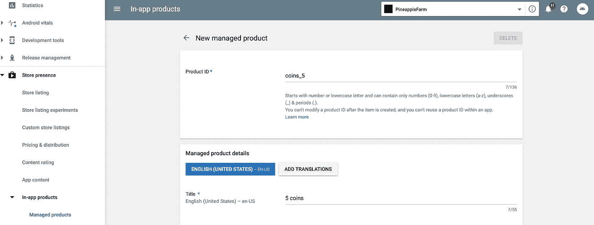

# 使用 Google Play 计费—第 1 部分

> 原文：<https://medium.com/androiddevelopers/working-with-google-play-billing-part-1-83fa255fe3f2?source=collection_archive---------0----------------------->


Illustration my [Molly Hensley](https://dribbble.com/Molly_Hensley)

对于许多 Android 应用程序来说，主要收入来源是通过应用程序销售数字内容。这种形式可以是销售特定于应用程序的物品，如游戏的硬币，或允许用户在有限时间内访问高级功能的订阅计划。在你的 Android 应用中实现销售这些项目的方法是使用 Google Play Billing，这是一个帮助应用开发者销售数字内容的工具和服务集合。

这篇博文是 Google Play Billing 3 新系列的第一篇。我们将从探索基础开始，然后用更复杂的用例和最佳实践的例子来跟进。

让我们先来熟悉一下 Google Play 计费的一些关键组件。

1.  [**Google Play 控制台**](https://developer.android.com/distribute/console)——Google Play 控制台除了是你发布安卓应用的地方，也是你设置你想要在应用中销售的不同类型内容的地方。通过 Play Console，您可以配置要销售的项目，包括它们的价格点，以及每种产品的其他高级配置，如免费试用期。
2.  [**Google Play 计费库**](https://developer.android.com/google/play/billing/billing_library_overview) —这是您集成到您的 Android 应用程序中的库。使用这个库连接 Google Play 来执行任务，比如在用户购买商品时处理购买流程。
3.  [**Google Play 开发者 API**](https://developers.google.com/android-publisher) —这是一组 REST APIs，你可以用它们来和 Google Play 进行通信。使用这些 API，您可以查询和管理您的应用程序销售的商品。其中，这些 API 对于验证用户的购买不是欺诈性的或者检查订阅是否仍然有效非常有用。在本系列的下一篇文章中，我们将更深入地研究这些 API。

在第一篇文章中，我们将重点介绍如何设置您的环境，以便开始在您的 Android 应用程序中销售商品。

1.  第一步也是最重要的一步是设置您的 Android 应用程序以使用 Google Play 计费库。

通过在您的`app/build.gradle`文件中添加以下依赖项，在您的应用中实现 Google Play 计费:

```
implementation ‘com.android.billingclient:billing:3.0.0’
```

添加库依赖项后，构建应用程序的发布 APK，并将其上传到 Google Play 控制台。

2.上传 APK 后，您可以使用 Google Play 控制台开始添加应用内产品，以便在您的应用中销售。在“Store Presence”下，您会看到一个应用内产品部分。您可以在这里设置两种类型的项目:

*   被管理产品(或一次性购买)
*   捐款

创建新的被管理产品和订购时，您需要输入产品 ID，或项目的 *SKU* 。我们将在下一步中看到，这个相同的产品 ID 将在您的应用程序代码中再次使用。创建被管理产品之前，请确保仔细规划您的产品 id。产品 id 对于您的应用程序必须是唯一的，并且在创建后不能更改或重复使用。



为了让测试更快更容易，你可以[将你的 Google 账户添加到你的 Google Play 开发者账户](https://developer.android.com/google/play/billing/billing_testing#testing-purchases)的许可测试部分。这将允许您使用调试版本和调试签名进行测试，只要包名与 Play Store 中的 APK 匹配。

3.在 Play Console 中设置好产品后，您可以通过在应用程序中查询产品的详细信息来查看设置是否成功。

如果一切顺利，你应该可以在游戏控制台上看到你刚刚添加的产品的[细节](https://developer.android.com/reference/com/android/billingclient/api/SkuDetails)！

在本系列的下一篇文章中，我们将看看如何带领用户完成一次性产品的购买流程。

如果你想查看游戏计费的资源，你可以访问官方文档[这里](https://developer.android.com/google/play/billing/billing_overview)。在这里，我们还收集了一些示例，展示了实施计费库[的最佳实践。这篇博文的代码示例可以在](https://github.com/android/play-billing-samples) [Github](http://github.com/calren) 找到。