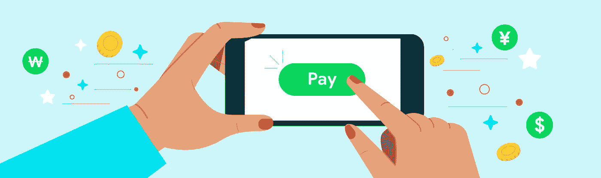

# 使用 Google Play 计费—第 2 部分

> 原文：<https://medium.com/androiddevelopers/working-with-google-play-billing-part-2-b859b55426d2?source=collection_archive---------1----------------------->

这是关注将 Google Play 的计费系统集成到您的 Android 应用程序的系列文章中的第二篇。如果您想从头开始，请查看关于如何设置您的 Android 应用程序以开始使用 Google Play 计费库的第一篇博客文章。

在本帖中，我们将进一步了解一次性购买的生命周期，即销售和授权用户在你的应用中购买的数字产品的过程。为了简单起见，我们现在将集中于一次性购买。在下一篇文章中，我们将详细研究订阅购买的更复杂的生命周期。

一次性产品既可以是*耗材*也可以是*非耗材*。可消耗的产品意味着用户可以再次购买。例如，如果您的应用程序是一个允许用户购买硬币的游戏，您可以将硬币变成一个可消费的产品，以便用户可以多次购买。非消耗品意味着用户只能购买一次。非消耗性产品的一个很好的例子是包括额外应用内功能的高级升级。

在 Google Play 控制台中配置好应用内产品后，销售产品的流程如下:

让我们来分解这个过程的每一步。

1.**设置计费客户端**—`BillingClient`类允许你的应用与播放计费库通信。你的应用需要做的第一件事是通过调用`[startConnection()](https://developer.android.com/reference/com/android/billingclient/api/BillingClient#startconnection)`建立与 Google Play 的连接。

连接不能保证保持活跃，所以你的应用程序还必须通过覆盖`[onBillingServiceDisconnected()](https://developer.android.com/reference/com/android/billingclient/api/BillingClientStateListener#onBillingServiceDisconnected())` )回调来处理重新连接，以确保应用程序在发出任何进一步请求之前连接到 Google Play。

2.**获取用户已购买的商品** —一旦`BillingClient`成功设置，您的应用程序现在可以通过调用`[queryPurchases()](https://developer.android.com/reference/com/android/billingclient/api/BillingClient#querypurchases)`来查询用户之前购买的商品。

3.**展示待售产品** —在[之前的帖子](/googleplaydev/working-with-google-play-billing-part-1-387677bd632b)中，我们讨论了如何在 Google Play 控制台中设置产品，并在您的应用程序中查询这些产品。一旦您调用`[querySkuDetailsAsync()](https://developer.android.com/reference/com/android/billingclient/api/BillingClient#queryskudetailsasync)`来获得每个产品的`[SkuDetails](https://developer.android.com/reference/com/android/billingclient/api/SkuDetails)`，您就可以使用这些信息来相应地设置您的 UI。

4.**启动购买流程—** 当用户点击某个产品进行购买时，您的应用程序应该通过使用该产品的`[SkuDetails](https://developer.android.com/reference/com/android/billingclient/api/SkuDetails)`调用`[launchBillingFlow()](https://developer.android.com/reference/com/android/billingclient/api/BillingClient#launchbillingflow)`，向用户呈现 Google Play 购买屏幕。这将弹出一个类似如下的屏幕:

5.**处理购买结果—** 当用户退出 Google Play 购买屏幕时(点击“购买”按钮完成购买，或点击“返回”按钮取消购买)，`[onPurchaseUpdated()](https://developer.android.com/reference/com/android/billingclient/api/PurchasesUpdatedListener#onPurchasesUpdated(com.android.billingclient.api.BillingResult,%20java.util.List%3Ccom.android.billingclient.api.Purchase%3E))`回调将购买流程的结果发送回您的应用程序。根据`[BillingResult.responseCode](https://developer.android.com/reference/com/android/billingclient/api/BillingClient.BillingResponseCode)`，您可以确定用户是否成功购买了产品。如果`responseCode == OK`，那就意味着购买成功完成。

`onPurchaseUpdated()`传回一个[购买](https://developer.android.com/reference/com/android/billingclient/api/Purchase)对象的列表，其中包含用户通过应用程序购买的所有商品。在许多其他字段中，每个购买对象都包含`sku`、`purchaseToken`和`isAcknowledged`属性。使用这些字段，对于每个采购对象，您可以确定它是需要处理的新采购还是不需要进一步处理的现有采购。

6.**验证并确认购买** —使用 Play Billing Library 3.0 时，您的应用程序需要确认成功的购买，以完成购买流程。**如果你的应用程序在 72 小时内没有确认购买，用户将被退款，并将无法再访问他们最初购买的产品。**

如果您的应用程序有验证服务器组件，您应该只在成功验证后确认购买。验证购买不是必需的，但在销售应用内产品时被视为最佳实践。关于如何打击欺诈性购买的更多信息，请查看本指南。

验证购买后，您的应用程序需要确认购买。

*   非消耗品必须通过呼叫`[acknowledgePurchase()](https://developer.android.com/reference/com/android/billingclient/api/BillingClient#acknowledgepurchase)`来确认
*   消耗性产品必须标记为“已消耗”,以便用户可以选择再次购买。这是通过`[consumeAsync()](https://developer.android.com/reference/com/android/billingclient/api/BillingClient#consumeasync)`功能完成的。调用`consumeAsync()`也会将采购设置为已确认，因此只要调用`consumeAsync()`就不需要调用消耗性产品的`acknowledgePurchase()`。

7.**授予用户产品—** 完成上述步骤后，您的应用现在可以授予用户他们购买的应用内产品了！

如果你想查看 Google Play 计费库的资源，你可以在这里访问官方文档。在这里，我们还收集了一些示例，展示了实施计费库[的最佳实践。这篇博文的代码示例可以在 Github](https://github.com/android/play-billing-samples) 上找到。

如果您的应用程序当前未使用 Play Billing Library 3，请务必查看我们的[迁移指南](https://developer.android.com/google/play/billing/migrate)，迁移您的应用程序以使用最新的 Play Billing Library。