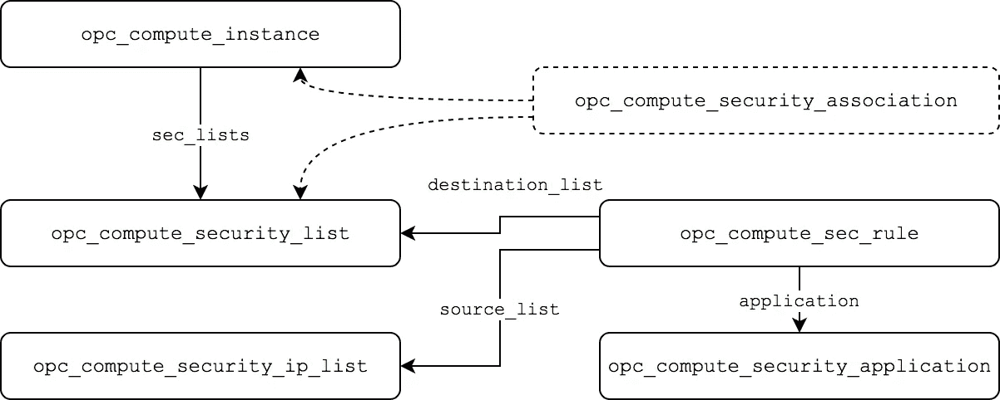

# 在 Terraform 中使用 Oracle 云基础架构经典安全规则:第 1 部分—共享网络

> 原文：<https://medium.com/oracledevs/working-with-oracle-cloud-infrastructure-classic-security-rules-in-terraform-part-1-shared-155675ada6b5?source=collection_archive---------0----------------------->

本文提供了使用`[opc](https://www.terraform.io/docs/providers/index.html)` Terraform 提供者处理安全定义的概述。

[Oracle Cloud infra structure Classic](https://cloud.oracle.com/classic)(以及 Oracle Cloud at Customer)服务提供了两种网络选项- **共享网络**和 **IP 网络**。对于本文的第 1 部分，我们将关注共享的网络安全资源。

> 另请参见[在 Terraform 中使用 Oracle 云基础设施经典安全规则:第 2 部分— IP 网络](/oracledevs/working-with-oracle-cloud-infrastructure-classic-security-rules-in-terraform-part-2-ip-networks-b36c48d87330)

建议熟悉[共享网络安全概念](https://docs.oracle.com/en/cloud/iaas/compute-iaas-cloud/stcsg/network-settings.html)。Terraform 支持的共享网络安全资源有:

*   `[opc_compute_security_list](https://www.terraform.io/docs/providers/opc/r/opc_compute_security_list.html)`
*   `[opc_compute_sec_rule](https://www.terraform.io/docs/providers/opc/r/opc_compute_sec_rule.html)`
*   `[opc_compute_security_ip_list](https://www.terraform.io/docs/providers/opc/r/opc_compute_security_ip_list.html)`
*   `[opc_compute_security_application](https://www.terraform.io/docs/providers/opc/r/opc_compute_security_application.html)`
*   `[opc_compute_security_association](https://www.terraform.io/docs/providers/opc/r/opc_compute_security_association.html)`

为了理解它们是如何协同工作的，让我们来看看它们之间的一般关系。



一个**计算实例**上的共享网络接口可以与一个或多个**安全列表**相关联。**安全规则**为**安全 IP 列表**和**安全列表**之间或者两个安全列表(*未显示*)之间的**安全应用**流量定义了入口和出口流量行为。

# 定义安全列表

安全列表是与特定实例或实例组直接关联的资源(我们稍后将介绍如何定义该关联)。值得注意的是，安全列表是围绕着*所有与该安全列表相关联的实例的墙。安全列表不限制同一安全列表中实例之间的通信。*

```
*resource "opc_compute_security_list" "my-security-list" {
  name                 = "my-security-list"
  policy               = "DENY"
  outbound_cidr_policy = "PERMIT"
}*
```

*`policy`属性定义默认的入口流量过滤，而`outbound_cidr_policy`定义如何过滤出口流量。在此示例中，允许来自实例的所有入站流量和阻止以及出站流量。*

*然后可以添加安全规则以应用特定的流量策略。在这个例子中，我们将添加一个安全规则来允许进入的 SSH 流量(TCP 端口 22)。*

```
*resource "opc_compute_sec_rule" "allow-ssh" {
  name             = "Allow-ssh-access"
  application      = "/oracle/public/ssh"
  source_list      = "seciplist:/oracle/public/public-internet"
  destination_list = "seclist:${opc_compute_security_list.my-security-list.name}"
  action           = "permit"
}*
```

*让我们对这种配置进行分解，以了解发生了什么。*

*`**application**`定义此规则适用的特定流量类型和端口。许多默认的安全应用程序类型都是预先定义的，包括:*

```
*/oracle/public/all
/oracle/public/icmp
/oracle/public/http
/oracle/public/https
/oracle/public/mysql
/oracle/public/rdp
/oracle/public/ssh*
```

*完整列表可在计算控制台的“安全应用程序”部分找到。或者，可以定义和引用`opc_compute_security_application`资源(参见下面的**定义安全应用**)。*

*`**source_list**`确定交通来源。这可以是对安全 IP 列表或其他安全列表资源的引用。`seciplist:`或`seclist:`前缀用于区分被引用的资源类型。在这个例子中，我们使用预定义的安全 IP 列表`/oracle/public/public-internet`来允许来自任何主机的流量。如果我们希望限制在特定的子网或 IP 地址范围内，那么我们可以定义并引用一个`opc_compute_security_ip_list`资源(请参见下面的**定义安全 IP 列表**)。*

*`**destination_list**`为以上定义的安全列表。是安全列表是目标这是入口规则，如果安全列表被设置为源，我们将定义和出口规则。*

*`**action**`设置为`permit`，因此此规则优先于安全列表中为入口流量设置的默认`DENY`策略，以允许此规则定义的流量。*

## *定义安全 IP 列表*

*如上所述，安全 IP 列表定义了如何基于源或目的 IP 地址应用安全规则。`ip_entries`可以是单个 IP 地址，也可以是子网 CIDR。*

```
*resource "opc_compute_security_ip_list" "my-ip-list1" {
  name       = "my-ip-list1"
  ip_entries = ["172.16.0.0/24" "192.168.0.1", "192.168.10.1"]
}*
```

*安全 IP 列表然后可以在一个或多个安全规则中被引用，作为目的地列表的源，例如*

```
*resource "opc_compute_sec_rule" "allow-ssh" {
  name             = "Allow-ssh-access"
 **source_list      = "seciplist:${****opc_compute_security_ip_list****.****my-ip-list1****.name}"**
  destination_list = "seclist:${opc_compute_security_list.my-security-list.name}"
  ...
}*
```

## *定义安全应用程序*

*安全应用程序根据 IP 流量类型`ICMP`、`UDP`或`TCP`以及目的端口定义特定的流量分类。*

```
*resource "opc_compute_security_application" "ssh" {
  name     = "ssh"
  protocol = "tcp"
  dport    = "22"
}*
```

*安全应用程序然后可以在一个或多个安全规则中被引用，例如*

```
*resource "opc_compute_sec_rule" "allow-ssh" {
  name        = "Allow-ssh-access"
 **application = "${****opc_compute_security_application****.ssh.name}"
  ...** }*
```

# *将安全性列表与实例相关联*

*有两种方法可以将安全列表与 Terraform 配置中的实例相关联，要么直接在作为`networking_info`配置一部分的`opc_compute_instance`定义中设置安全列表，要么使用`opc_compute_security_association`资源。*

***在为您的配置选择最合适的方法时应小心谨慎，因为两者之间存在一些微妙的差异。***

*通常首选的方法是直接在计算实例资源定义中声明安全列表。*

```
*resource "opc_compute_instance" "my-instance" {
  name = "myinstance"
  ...
  networking_info {
 **shared_network = true**
 **sec_lists      = [ "${opc_compute_security_list.my-security-list.name}" ]**
  }
}*
```

*   ***PRO** :计算实例`sec_lists`中定义的安全列表在实例创建时关联，这意味着当执行任何 cloud-init、opc-init 或 Terraform provisioner 初始化脚本时，它们都在适当的位置。*
*   ***缺点**:从接口`sec_lists`中添加或删除安全列表将强制重新创建实例。*

*或者，可以定义一个显式的`opc_compute_security_association`资源，将一个安全列表与一个实例相关联。*

```
*resource "opc_compute_security_association" "my-security-list" {
  name    = "my-instance_my-security-list"
  vcable  = "${opc_compute_instance.my-instance.vcable}"
  seclist = "${opc_compute_security_list.my-security-list.name}"
}*
```

*   ***PRO** :安全列表关联允许将安全列表添加到已经运行的实例中，而无需强制重新创建实例。*
*   ***CON** :安全列表关联在实例启动后*才会应用，这意味着当 cloud-init 或 opc-init 脚本试图运行时，流量可能会被阻塞。**

## *小心`the "**default**" security list`*

*最后一点需要注意。当定义具有共享网络接口的计算实例资源时，如果`sec_lists`属性是*而不是*定义的，则计算实例将自动与`default`安全列表相关联。*

*当使用 Terraform 配置实例时，这通常不是我们想要的行为。如前所述，流量在同一个安全列表内的实例之间不受*和*的限制(也就是说，同一个地区或区域内与`default`相关的所有实例都可以访问与`default`相关的所有实例)。这也是为什么一般推荐在实例定义中设置`sec_lists`的原因之一。*

*在第 2 部分中，我们将看看如何定义 IP 网络的安全规则*