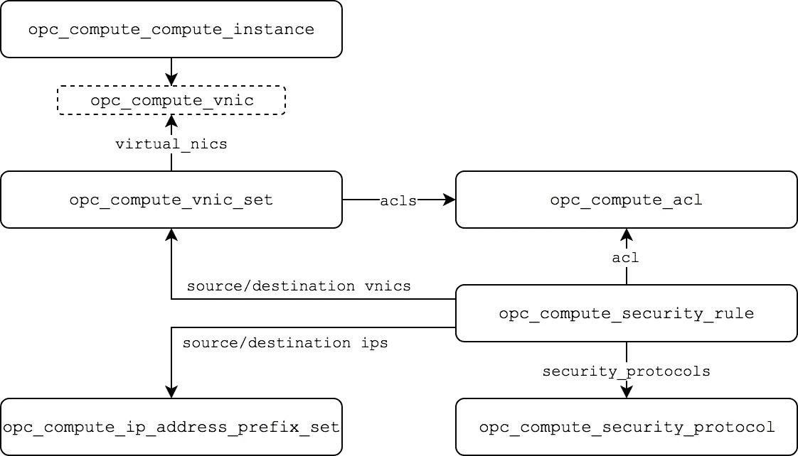

# 在 Terraform 中使用 Oracle 云基础架构经典安全规则:第 2 部分— IP 网络

> 原文：<https://medium.com/oracledevs/working-with-oracle-cloud-infrastructure-classic-security-rules-in-terraform-part-2-ip-networks-b36c48d87330?source=collection_archive---------1----------------------->

本文提供了使用`[opc](https://www.terraform.io/docs/providers/index.html)` Terraform 提供者处理安全定义的概述。

[Oracle Cloud infra structure Classic](https://cloud.oracle.com/classic)(以及 Oracle Cloud at Customer)服务提供了两种网络选项— **共享网络**和 **IP 网络**。在本文的第 2 部分，我们将关注 IP 网络安全资源。

> 另请参见[在 Terraform 中使用 Oracle 云基础设施经典安全规则:第 1 部分—共享网络](/oracledevs/working-with-oracle-cloud-infrastructure-classic-security-rules-in-terraform-part-1-shared-155675ada6b5)

建议熟悉 [IP 网络](https://docs.oracle.com/en/cloud/iaas/compute-iaas-cloud/stcsg/ip-networks.html#GUID-7299731F-7AEB-41F2-9938-2066CE7648F2)和[访问控制概念](https://docs.oracle.com/en/cloud/iaas/compute-iaas-cloud/stcsg/access-control-interfaces-ip-networks.html)。Terraform 中支持的 IP 网络安全相关资源有:

*   `[opc_compute_acl](https://www.terraform.io/docs/providers/opc/r/opc_compute_acl.html)`
*   `[opc_compute_ip_address_prefix_set](https://www.terraform.io/docs/providers/opc/r/opc_compute_ip_address_prefix_set.html)`
*   `[opc_compute_security_protocol](https://www.terraform.io/docs/providers/opc/r/opc_compute_security_protocol.html)`
*   `[opc_compute_security_rule](https://www.terraform.io/docs/providers/opc/r/opc_compute_security_rule.html)`
*   `[opc_compute_vnic_set](https://www.terraform.io/docs/providers/opc/r/opc_compute_vnic_set.html)`

为了理解它们是如何协同工作的，让我们来看看它们之间的一般关系。



一个**计算实例**可以有多个 IP 网络接口，或**VNIC**，每个 VNIC 可以在一个 **VNIC 集中**。**ACL**将**安全规则**关联到 **VNIC 集。安全规则**定义了由**安全协议**识别的流量在 **IP 地址前缀集**和 **VNIC 集**之间或 VNIC 集之间的进出流量行为。

# **定义一个 ACL**

ACL 是用于将一个接口(或一组接口)与安全规则相关联的主要资源。ACL 资源定义本身非常简单，但是它是将多个安全规则关联到。

```
resource "opc_compute_acl" "my-acl" {
  name = "my-acl"
}
```

# **定义安全规则**

安全规则定义流量处理，以允许或拒绝来自指定源或发往指定目的地的流量。一个常见的安全规则是允许特定端口的入站流量。在本例中，我们定义了一条规则，允许来自指定范围或 IP 地址的 SSH 进入。

```
resource "opc_compute_security_rule" "ssh" {
  name                    = "Allow-ssh-ingress"
  flow_direction          = "ingress"
  acl                     = "${opc_compute_acl.my-acl.name}"
  src_ip_address_prefixes = ["${opc_compute_ip_address_prefix_set.prefixset1.name}"]
  security_protocols      = ["${opc_compute_security_protocol.ssh.name}"]                       }resource "opc_compute_ip_address_prefix_set" "prefixset1" {
  name     = "my-ip-prefix-set"
  prefixes = ["172.16.0.0/24", "192.168.0.1/31", "192.168.10.1/31"]
}resource "opc_compute_security_protocol" "ssh" {
  name        = "ssh"
  dst_ports   = ["22"] 
  ip_protocol = "tcp"
}
```

`**flow_direction**`表示该规则适用于入站流量还是出站流量(从实例/接口的角度)。

`**acl**`是与此规则关联的 ACL。

`**src_ip_address_prefixes**`是一个或多个 IP 地址前缀集的列表，用于对入站流量的来源进行分类。可以省略此属性以允许所有 IP 地址。可选的`src_vnic_set`属性也可以用于识别另一个 VNIC 集的源流量。等效`dst_ip_address_prefixes` `dst_vnic_set`启用基于流量目的地的分类。

`**security_protocols**`是用于根据 IP 流量类型`ICMP`、`TCP`或`UDP`和端口对流量进行分类的安全协议资源列表。

对于第二个示例，让我们定义一个安全规则，以允许**从一个接口到任何 IP 地址的所有**出口流量。

```
resource "opc_compute_security_rule" "egress" {
  name               = "Allow-all-egress"
  flow_direction     = "egress"
  acl                = "${opc_compute_acl.my-acl.name}"
  security_protocols = ["${opc_compute_security_protocol.all.name}"]                       }resource "opc_compute_security_protocol" "all" {
  name        = "all"
  ip_protocol = "all"
}
```

# 将 ACL 关联到实例

现在我们有了一个用两个安全规则定义的 ACL，让我们将它与一个实例相关联。创建一个虚拟网卡集，其中包含 ACL 应该应用到的所有虚拟网卡。要向 VNIC 集添加实例接口，最好在实例`network_info`配置中设置`vnic_sets`属性，以便在实例创建时应用 ACL。

```
resource "opc_compute_vnic_set" "my-vnic-set" {
  name         = "my-vnic-set"
 **applied_acls = ["${opc_compute_acl.my-acl.name}"]**
}resource "opc_compute_instance" "my-instance" {
  name       = "my-instance"
  shape      = "oc3"
  image_list = "/oracle/public/OL_7.2_UEKR4_x86_64"
  ssh_keys = ["${opc_compute_ssh_key.my-ssh-key.name}"] networking_info {
    index      = 1
    ip_network = "${opc_compute_ip_network.my-ip-network.name}"
 **vnic_sets  = ["${opc_compute_vnic_set.my-vnic-set.name}"]**
  }
}
```

与共享网络接口上的安全列表关联一样，实例中的`vnic_sets`定义的一个缺点是，向/从接口添加或删除 VNIC 集将强制重新创建实例。

要将 ACL 与已经运行的实例相关联，可以将 VNIC 添加到 VNIC 集资源中。如果 VNIC 使用默认命名。

```
resource "opc_compute_vnic_set" "my-vnic-set" {
  name         = "my-vnic-set"
applied_acls = ["${opc_compute_acl.my-acl.name}"] **virtual_nics = ["${opc_compute_instance.my-instance.name}/${opc_compute_instance.my-instance.id}/eth1"]**
}
```

或者，如果在实例`networking_info`配置中已经明确设置了`vnic`名称属性，则在 VNIC 集中使用相同的名称。

```
resource "opc_compute_vnic_set" "my-vnic-set" {
  name         = "my-vnic-set"
applied_acls = ["${opc_compute_acl.my-acl.name}"] **virtual_nics = ["the_vnic_name"]**
}
```

## 小心`the "default" VNIC Set`

同样，类似于第 1 部分中讨论的共享网络接口的`sec_lists`属性的行为。当使用 IP 网络接口定义计算实例资源时，如果`vnic_sets`属性是*而不是*定义的，则计算实例将自动与`default` VNIC 集相关联。

由于`default` VNIC 集在 Terraform 配置之外，这通常不是我们想要的行为。因此，通常建议在实例定义中设置`vnic_sets`。

*注意——免费层用户可能会体验到其帐户所含服务的变化。*