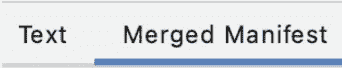

# 使用包可见性

> 原文：<https://medium.com/androiddevelopers/working-with-package-visibility-dc252829de2d?source=collection_archive---------3----------------------->

在 Android 中，我们正在进行更改，以增强用户隐私和平台安全性，为我们的用户提供更安全的体验。针对 Android 11 (API 级别 30)或更高版本的应用程序将只能看到安装在设备上的应用程序的[过滤列表。为了访问过滤列表之外的应用程序，应用程序将需要使用 Android 清单中的`<queries>`元素直接声明它们需要与之交互的应用程序。这篇博文将介绍如何适应这一特性的最佳实践。](https://developer.android.com/training/package-visibility/automatic)

# 查询并与应用程序交互:

有多种不同的方式来查询应用程序并与之交互:

*   如果您知道想要查询或与之交互的特定应用程序集，请将它们的[包](https://developer.android.com/training/package-visibility/declaring#package-name)名称包含在`<queries>`元素内的一组`<package>`元素中。

*   如果您的应用程序需要查询或与一组服务于特定目的的应用程序交互，但您可能不知道要包含的特定包名，您可以在您的`<queries>`元素中列出[意图过滤器签名](https://developer.android.com/training/package-visibility/declaring#intent-filter-signature)。然后你的应用程序可以发现具有匹配的`<intent-filter>`元素的应用程序。

*   如果您需要查询一个[内容提供者](https://developer.android.com/training/package-visibility/declaring#provider-authority)但是不知道具体的包名，您可以在一个`<provider>`元素中声明提供者权限。

我们通过只查询您需要交互的包来鼓励数据最小化。`QUERY_ALL_PACKAGES`或相当宽泛的`<intent>`元素应该只由需要这种级别信息的应用程序使用。我们的[新包可见性政策](https://support.google.com/googleplay/android-developer/answer/10446026)引入了新`QUERY_ALL_PACKAGES`权限的批准流程，该权限控制对设备上已安装应用的完整清单的访问。

# 活动标志:

大多数常见的用例根本不要求你的应用程序具有包可见性。对于很多场景，如果没有 app 可以打开这个意图，可以使用`startActivity()`并捕捉异常。

虽然你可以在目标不可见的情况下启动任何活动，但你无法在启动之前查询该活动的可用性，也无法了解将启动哪个特定应用，因为这是一个[隐含意图](https://developer.android.com/guide/components/intents-filters#Types)。相反，如果问题没有解决，您将在启动时收到通知。如果你想更好地选择打开的内容，你可以使用标志。

使用标志的一个常见例子是[自定义标签](https://developer.chrome.com/docs/android/custom-tabs/overview/)，它允许开发者自定义浏览器的外观和感觉，并对 web 内容体验有更多的控制。如果可用，链接将在非浏览器应用程序中正确打开，但在高级情况下，当开发人员希望在使用自定义选项卡之前选择性地处理本机应用程序中的内容时，标记会有所帮助。简而言之，这个标志帮助开发人员确定是否有一个本地应用程序可以导航，并且从那里他们可以按照他们想要的方式处理它。

## 标志 _ 活动 _ 要求 _ 非浏览器

此标志仅在解析为非浏览器的结果时启动意图。如果不存在这样的结果，将抛出一个`[ActivityNotFoundException](https://developer.android.com/reference/android/content/ActivityNotFoundException)`,然后你的应用程序可以在一个自定义标签中打开该 URL。

如果一个意图包括这个标志，当调用将直接启动一个浏览器应用或者调用将向用户显示一个歧义消除对话框，其中唯一的选项是浏览器应用时，对`startActivity()`的调用导致抛出一个`ActivityNotFoundException`。要了解关于标志的更多信息，请参见[基于用例配置包可见性](https://developer.android.com/training/basics/intents/package-visibility-use-cases#let-non-browser-apps-handle-urls)。

# 自定义共享表

我们建议使用系统共享表，而不是自定义表。您可以自定义系统共享表，而无需应用可见性。更多信息请参考本文件。

# 调试包可见性

您可以很容易地检查您的清单，以查看所有查询包括在内。为此，请转到您的清单文件并选择“合并清单”。

您还可以启用包过滤的日志消息来查看默认可见性如何影响您的应用程序:

# 后续步骤:

有关包可见性的更多信息，请查看以下资源:

*   [包装可见性—文档](https://developer.android.com/training/package-visibility)
*   [Android 11 中的包可见性——博文](/androiddevelopers/package-visibility-in-android-11-cc857f221cd9)

## 编码快乐！