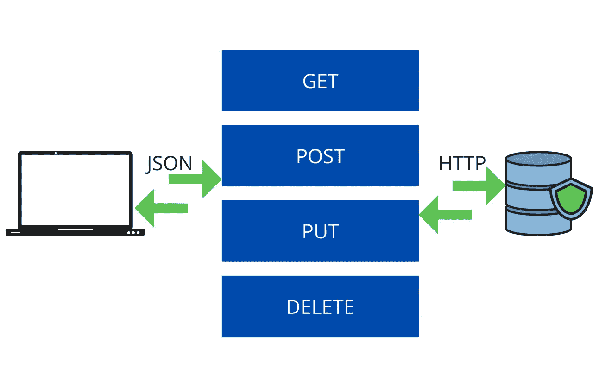
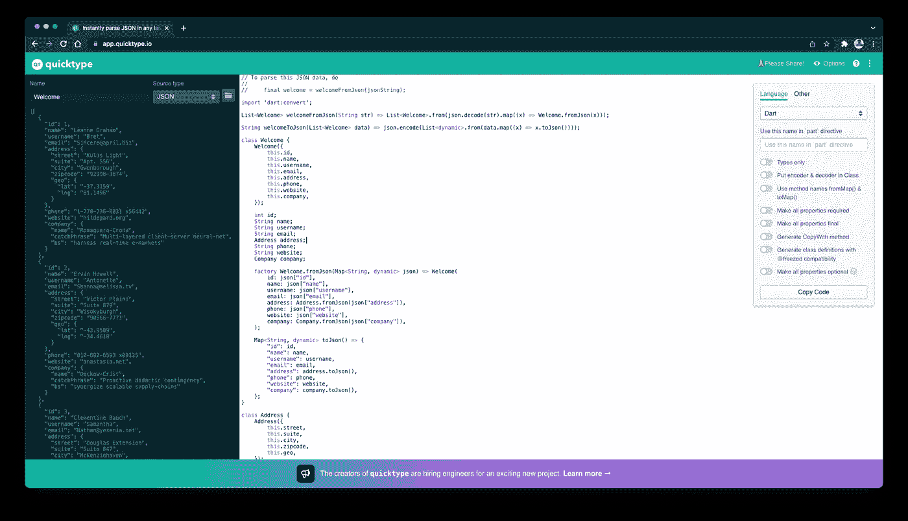
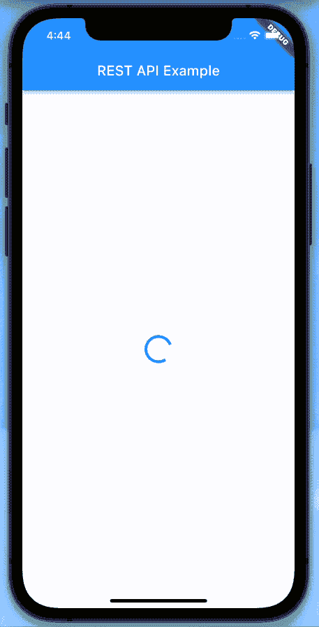

# 使用 REST API—Flutter💙

> 原文：<https://medium.com/google-developer-experts/working-with-rest-apis-flutter-f3c8c673f1dc?source=collection_archive---------0----------------------->

数据，数据，数据。我们在当今世界看到的任何地方都只是数据。那么我们如何在我们的应用程序中获取数据呢？如何在我们的应用程序中集成 API？我们去看看吧！


我们有很多方法在应用程序中显示数据:

*   静态资料
*   从文件中

另一种形式来自数据库或公共 API。

最常用的形式来自数据库或公共 API。即使您想从数据库中加载数据，您也会有 API，但它们可以是私有的。所以，让我们看看你如何集成，从一个公共 API 获取数据，并在你的 flutter 应用程序中使用它！

# API 是如何工作的？



用户应用程序可以通过 HTTP 请求联系任何数据库。因此，我们可以创建对数据库的 GET、POST、PUT 或 DELETE HTTP 请求。作为回报，数据库以 JSON、HTML 或 XML 的形式向我们发送数据、结果或响应。JSON 格式被广泛使用。然后，我们将 JSON 解析成适当的模型类，并在我们的应用程序中使用它。

# 将 API 集成到 Flutter 应用程序中

为了集成一个 API，我们有几个步骤可以轻松地遵循:

步骤 1:获取 API URL 和端点。

第二步:在 app 中添加相关包(http，dio，chopper 等。).

步骤 3:创建一个存储 URL 和端点的常量文件。

步骤 4:创建一个模型类来解析 JSON。

步骤 5:创建一个处理 API 调用的文件，并编写特定的方法来获取数据并解析它。

第六步:使用应用程序中的数据。

在本文中，我们将通过一个例子来学习。我们将使用 [JSONPlaceholder](https://jsonplaceholder.typicode.com/) API，它提供假 API 供我们练习。

那么，让我们开始工作吧！

## 步骤 1:获取 API URL 和端点。

要获得 API URL(称为基本 URL)和端点，请访问 [JSONPlaceholder](https://jsonplaceholder.typicode.com/) 网站，您会发现他们提供的不同 API。我们今天将使用他们拥有的用户 API。因此，

基本 URL:https://jsonplaceholder.typicode.com
API 端点:/users

当您有一个数据库或 API 提供者时，所有 API 的基本 URL 保持不变，但是端点会根据 API 而变化。在许多 API 提供者中，你必须获得一个私有密钥(API 密钥或访问密钥),要么通过简单地创建一个帐户，要么它可以是一个付费帐户。该 API 键将被附加到基本 URL 的后面。因此，新的基本 URL 将是:

新的基本 URL = BaseUrl/apiKey

例如:https://jsonplaceholder.typicode.com/abcdefghijklmnopqrxyz

## 第二步:在 app 中添加相关包(http，dio，chopper 等。)

在[**pub.dev**](http://pub.dev) 中有很多可用的包，我们可以用来在 Flutter 中集成 API。最广泛使用的软件包是:

*   [http](https://pub.dev/packages/http)
*   [dio](https://pub.dev/packages/dio)
*   [斩波器](https://pub.dev/packages/chopper)

还有很多…但是，http 是最基本的，也是最容易使用的。其他包主要是 http 包的包装，并提供额外的功能。

现在，一旦您创建了一个新的 flutter 项目，请转到 pubspec.yaml 文件并将 http 包添加到其中。您的文件应该如下所示:

## 步骤 3:创建一个存储 URL 和端点的常量文件。

现在，是时候创建一个名为`constants.dart`的简单文件来保存所有的 URL 和端点。在我们的例子中，我们只有一个端点，但是有一个单独的文件是一个很好的实践。您的文件将如下所示:

这里，我们创建了一个名为 ApiConstants 的类，并创建了 2 个静态变量，这样我们就可以访问它们，而无需创建类似于`ApiConstants.baseUrl`的类的实例。

## 步骤 4:创建一个模型类来解析 JSON。

访问数据的一种方法是直接使用密钥。然而，创建一个模型类、解析 JSON 并从 JSON 响应中获取一个对象是一种很好且简单的方法。

直接访问数据:

```
final data = json[0]['id'];
```

在这里，我们试图访问 JSON 响应的第 0 条记录的`id`。只有当您的记录和条目有限时，这才是容易的。

现在，要创建一个模型类，首先，您需要从 API 获得完整的 JSON 响应。要得到那个，只要去[https://jsonplaceholder.typicode.com/users](https://jsonplaceholder.typicode.com/users)你将能够获得完整的 JSON 响应，因为这是一个公共 API。现在，在私有 API 或自定义后端 API 的情况下，要么它将在文档中可用，要么您可以使用 [Postman](https://www.postman.com/) 来点击 API 并获得响应。

现在，一旦有了响应，就可以使用简单的方法创建模型类了。转到[https://app . quick type . io](https://app.quicktype.io/)，在左侧粘贴 JSON 响应。在右边的选项中，选择`Dart`，你的模型类就生成了！然后，您可以更改该类的名称。



您的模型类文件将如下所示:

## 步骤 5:创建一个处理 API 调用的文件，并编写特定的方法来获取数据并解析它。

现在，创建一个名为`api_service.dart`的文件来处理 API 调用。

现在，在上面的文件中，我们创建了一个名为`getUsers`的函数，它返回`List<UserModel>`。第一步是命中 GET HTTP 请求。下一步是检查 API 调用是否成功。这可以使用`response.statusCode`进行检查。如果 API 调用成功，statusCode 将为 200。如果 statusCode 是 200，那么我们使用我们创建的模型类中可用的方法`userModelFromJson`将 JSON (response.body)转换成一个`List<UserModel>`，然后返回模型对象。

## 第六步:使用应用程序中的数据。

我们已经为 API 创建了所有需要的文件和方法，我们可以称之为我们的应用程序后端。现在是时候在我们的 UI 上加载这些数据了。我们不会做太多，只是一个方法调用并在 UI 中加载结果。

现在，在上面的代码中，我们创建了一个对象`List<UserModel>`，然后在`initState`中我们调用了一个方法来从我们的 API 中获取数据。在方法中，我添加了`Future.delayed`，这样我们就可以模拟 API 的时间响应。我们使用的这个 API 是假的，因此它非常快。然而，真正的 API 没有那么快。因此，在 API 响应可用之前，显示加载程序就成了我们的职责。一旦响应可用，我们重新构建 UI 来显示数据。在这里，我刚刚展示了模型类中的一些数据。

## 输出:



## 想自己试试吗？随意克隆 [GitHub 库](https://github.com/AbhishekDoshi26/rest_api_example)！

## 最初发表于 [CodeMagic 博客](https://blog.codemagic.io/rest-api-in-flutter/)。

## 希望你喜欢这篇文章！

如果你喜欢，你可以 [**请我喝杯咖啡**](https://www.buymeacoffee.com/abhishekdoshi26) **！**

[](https://www.buymeacoffee.com/abhishekdoshi26)

# 不要忘记通过以下方式与我联系:

*   [**Instagram**](https://www.instagram.com/abhishekdoshi26/)
*   [**推特**](https://twitter.com/AbhishekDoshi26)
*   [**领英**](https://www.linkedin.com/in/AbhishekDoshi26)
*   [GitHub](https://github.com/AbhishekDoshi26)

> 不要停止，直到你呼吸！💙
> -阿布舍克·多希