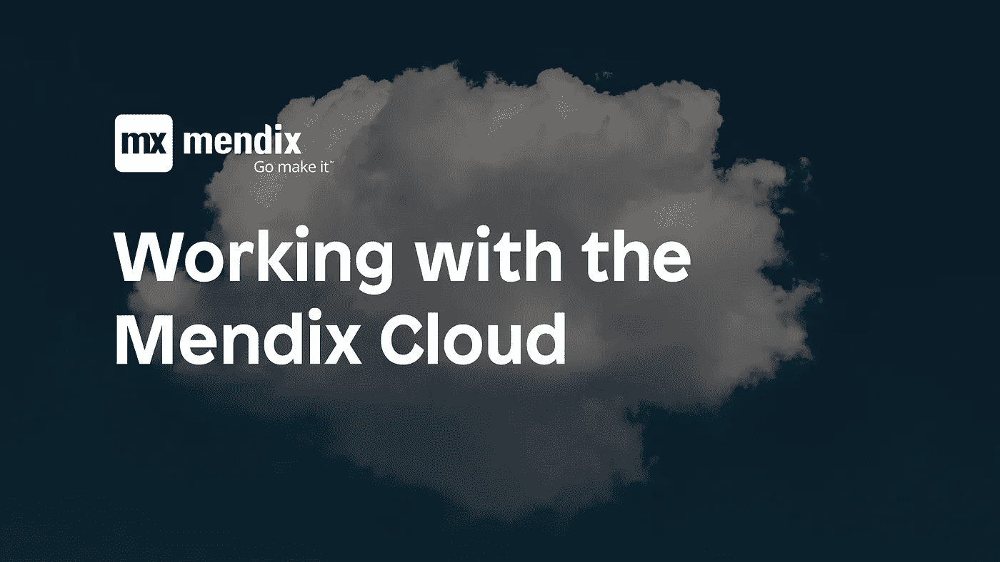

# 使用 Mendix 云

> 原文：<https://medium.com/mendix/working-with-the-mendix-cloud-75080b5cd05a?source=collection_archive---------3----------------------->

作为工程副总裁，我有机会接触许多技术、语言和平台。我们的主要应用平台之一是 [Mendix](https://www.mendix.com) 。我们将这个低代码/无代码平台用于我们的几个企业应用程序。

2018 年 8 月，我的工程团队将我们的应用从 Mendix v3 云迁移到了 Mendix v4 云。我写这篇文章是在我们完成搬迁并出来透透气后不久，但从未与社区分享过。

作为一个规模虽小但不断增长的 Mendix 社区的成员，我尽可能地回馈社会，我目前的角色让我对如何在商业中使用 Mendix 有了相当独特的看法。

我们了解到的另一件事是，云 v3 和云 v4 计算环境的时区*不同*。在最初的讨论中，我们没有想到要问这个问题，在搬家过程中也没有。不幸的是，我们错过了这一点，我们所有的夜间流程都必须修改为使用 UTC，而不是我们的本地时区。我们仍在处理与时区相关的问题，以及翻译方面的挑战。

如果时间在您的应用程序中有特殊的意义，请确保在迁移到新的计算环境时询问差异。

转到 2018 年 11 月的原始文章:

# 天下没有不散的宴席

近 18 个月来，我们已经在 Mendix v3 云环境中运行了一个应用程序。今年 8 月，我们将我们的 Mendix 6.10 应用程序迁移到了 Mendix v4 云。总的来说，这是一次成功的迁移，新的环境为我们的企业应用程序提供了所需的动力。在此，我想分享我们的过程，规划，经验和教训。

# 我们的流程

我们的流程始于 2018 年 6 月，意识到我们的增长将在年底前超过 v3 云中最大的可用环境。

> 旁注:我们正在进行一些架构上的改变，但是这些改变有很长的路要走，可能不会在年底前完成。我们已经完全接受了微服务应用模型，并且我们正在最新的 Mendix 7 版本中编写每个新的应用。那是以后的事了。

这种理解迫使我们考虑如何使用云 v3，以及迁移到云 v4 需要做些什么。我们与 Mendix 专家服务部门进行了多次对话，并花了很多时间审查我们的应用程序、我们使用的模块和云 v4 文档。

如果你还没有花时间去评估 Cloud v4，那你就等着享受吧。有许多增强功能，使新平台更有价值。我最喜欢的特性之一是容器中有三个以上环境的能力。您不再局限于测试、验收和生产。如果您有更复杂的部署和用户接受过程，Cloud v4 现在可以支持您！如果您需要一个专用的报告环境，您也可以选择。

# 规划

我们的 Mendix 应用程序是一套定制工具，用于管理我们的企业；用于处理成千上万笔交易、管理代理并确保我们的客户能够管理其业务的工具。移动数百名员工和数千名客户所依赖的应用程序并不是一件容易的事情。

我们计划过程的第一步包括列出我们能想到的所有步骤。我们有一个很棒的团队，在软件、DevOps、开发和 Mendix 方面有着丰富的经验。随着时间的推移，我们建立了一个多步骤计划:

1.  转换计划
2.  沟通计划
3.  联系人列表
4.  V4 设置
5.  自定义运行时设置
6.  常数
7.  V4 回归测试
8.  预定事件
9.  切换脚本
10.  V4 烟雾测试
11.  回滚脚本

我的[下拉框](https://www.dropbox.com/s/txtsnp3voaocvps/mendix%20application%20cloud%20v4%20migration.xlsx?dl=0)中有这个电子表格的样本版本。

我们创建了一个谷歌表单，为我们计划的每一步都提供了一个标签。这允许所有团队成员之间的协作和共享。我们建立了定期更新会议和工作会议的节奏，以汇集成功所需的细节。

转换计划包含一份很长的清单，列出了在进行迁移时需要考虑的事项。这个页面在整个过程中充当了我们的“总括”角色。当一个团队成员想到一个潜在的问题，或者我们需要记住的事情，我们会把它添加到这个列表中。

我们计划中最重要的一步是转换脚本。当我们回顾迁移过程时，我们一直在做这个工作。在我们第一次模拟迁移中，我们讨论了我们需要做的事情，发现至少缺少十个步骤。在我们的规划会议和与 Mendix 的审查会议中，我们对该脚本进行了修改。

我们计划并执行了一次测试迁移。在全面迁移的前一周，我们将应用程序部署到我们的验收环境中。这让我们很好地了解了每一步所需的时间，并确保我们以正确的顺序完成了所有正确的步骤。

我们与 Mendix Cloud 团队、支持和专家服务安排了时间，以确保我们的测试运行顺利进行。在我们迁移的时候，有很多步骤我们自己无法完成。作为我们流程的一部分，我们依靠 Mendix 团队来完成这些步骤。

# 切换体验

我们有一个地理上分散的工程和 IT 团队，Mendix 云团队主要位于荷兰。为同时满足我们业务需求的技术资源寻找合适的时间是一项创造性的工作。

最终，我们在一个周六的早上 7 点开始了我们的迁移和应用程序切换。我们的沟通计划要求系统在周六全天不可用，保证在周一早上正常运行。

我们的预迁移测试告诉我们，我们需要大约 7 个小时的工作才能成功完成迁移。我们在整个活动中使用了 Google Hangout，许多团队成员整天都参与其中。当其他团队成员需要采取行动时，会根据需要邀请他们。我们还有一位来自 Mendix Cloud 团队的代表，几乎整个上午都和我们在一起。事实证明，这对于沟通和完成最初的迁移步骤非常有帮助。

我们有一个非常大的数据库，在我们的应用程序中有相当数量的文件。我们的文件从 v3 到 v4 的同步花了几个小时。与 Mendix Cloud 团队一起审查进度和讨论潜在问题的能力令人放心，并使流程看起来更容易。

我们还发现，我们在测试运行期间执行的许多步骤被带到了我们的生产迁移中。我们能够提前完成一些文件同步，并且能够验证环境常数。

> 冒烟测试是一种软件测试，由一组非详尽的测试组成，旨在确保最重要的功能正常工作。

我们计划中最重要的一步是[冒烟测试](https://en.wikipedia.org/wiki/Smoke_testing_(software))我们的应用程序。我们每天都在处理文件。我们必须确保我们的应用程序的所有方面在新环境中都能正常工作。我们有一个计划，并且有合适的人来进行测试。在这个领域，我们召集了更多的人来验证应用程序的特定领域。

我们还跟踪了在这个测试阶段所做的任何更改。这是我们的生产系统，我们必须回滚所做的任何更改，以保持应用程序没有测试数据。如果您要进行冒烟测试，请记住回滚！

我们很幸运，我们的迁移按计划进行。我们遇到了一些小问题，但能够在没有任何不当延误的情况下解决这些问题。在开始迁移之前，我们就任何流程的 90 分钟“超时”阈值达成一致。如果我们达到了这一点，我们将开始回滚过程，并返回到应用程序的 v3 版本。显然，这不是我们想要发生的事情，但是有一个计划，提前达成一致使得关于我们过程的对话变得容易得多。

# 经验教训

我们花了一个多月的时间为我们的迁移做准备，我们仍然错过了一些关键的细节。我们没有升级应用程序中使用的社区模块。有几个模块针对云 v4 进行了更新，我们被迫在过渡到云 v4 后的几天内进行这些升级，以解决应用程序的问题。

我们未能与 Mendix 团队一起审查已知的错误。SSO 和亚马逊 S3 连接存在一个已知问题。S3 文件存储的默认连接数设置为 50，将这些连接释放回池时会出现问题。当连接池已满时，我们立即遇到了文件访问问题和单点登录问题。

Mendix 7.15 中有一个设置[com . Mendix . storage . S3 . max connections](https://docs.mendix.com/developerportal/deploy/mxcloudv4#other-considerations)。不幸的是，这个设置没有被移植到 6.10.15，这使得我们的应用程序无法使用它。这是我们应该提前了解的事情。我们不知道问，Mendix 没有考虑我们的 Mendix Modeler 版本。如果你还在运行 6.10，你会注意到现在有一个 6.10.16 版本，它包含了 s3。MaxConnections 设置。如果您在应用程序中大量使用文件存储功能，您会希望确保这是可用的。

我们也未能理解新环境的资源规模。尽管与 Mendix Support 进行了多次对话，以确保我们的新环境足够大、足够强，但我们仍然弄错了。在 Cloud v3 中，我们有 S、M、L 和其他易于理解的 t 恤尺寸。它们都是相互关联的，但意思很清楚。在 Cloud v4 中，环境有名字，比如 Magento，它不会告诉你太多。快速的 Google 搜索表明这个词有很多意思，但是没有任何关于它如何与 Mendix v4 云环境的环境资源相关联的信息。

当我们在迁移后的星期一早上达到真实用户负载时，我们的应用程序明显太小了。这导致了糟糕的用户体验，以及在繁忙的星期一出现意外的、当然也是不必要的停机。Mendix 团队召集了各种力量来帮助做出必要的改变，并将适量的资源应用到环境中。然而，加上 S3 的关系问题，这是一个非常漫长的一周！

# 结论

我们工程团队的主要任务之一是回馈社区。我不知道你们中有多少人仍在使用云 v3，并考虑迁移到 v4。我希望这篇文章能够帮助您踏上云 v4 之旅。希望你的行动会比我们的更好，你的用户会得到他们应得的体验。