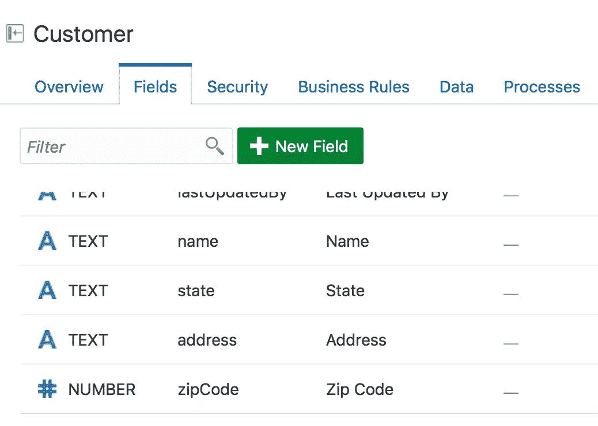
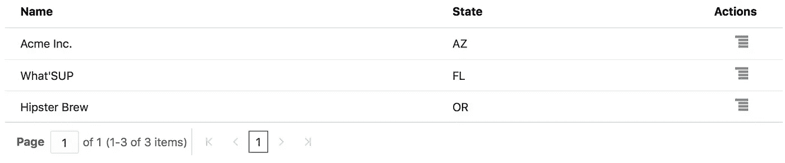
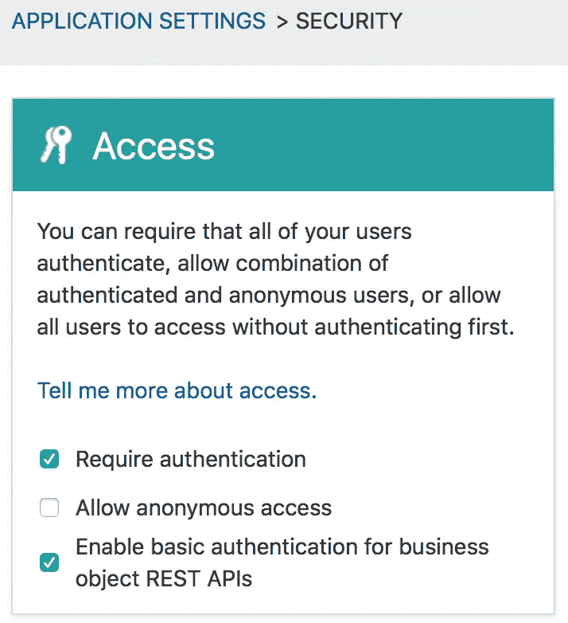
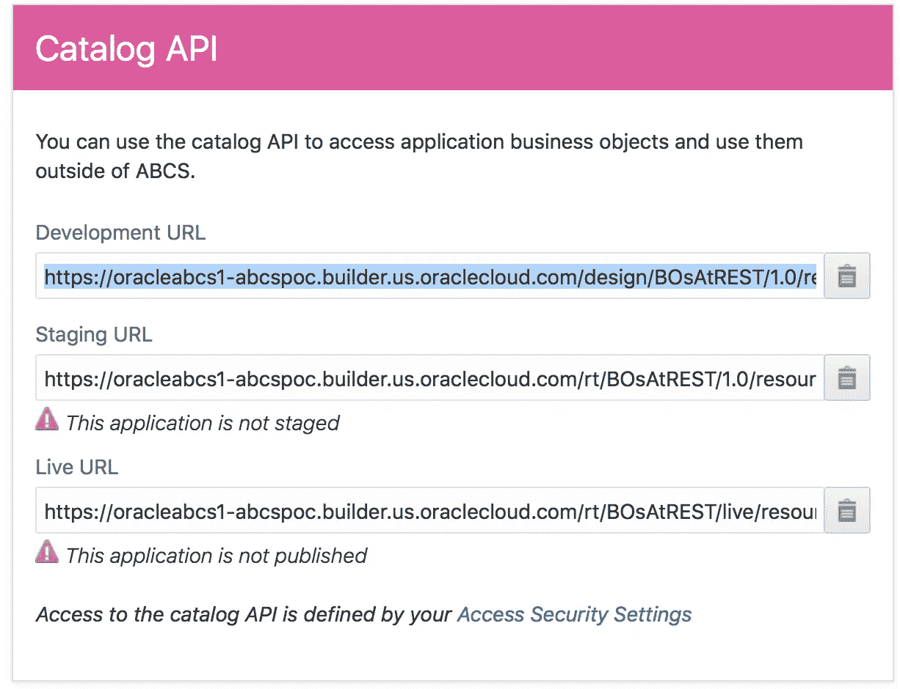
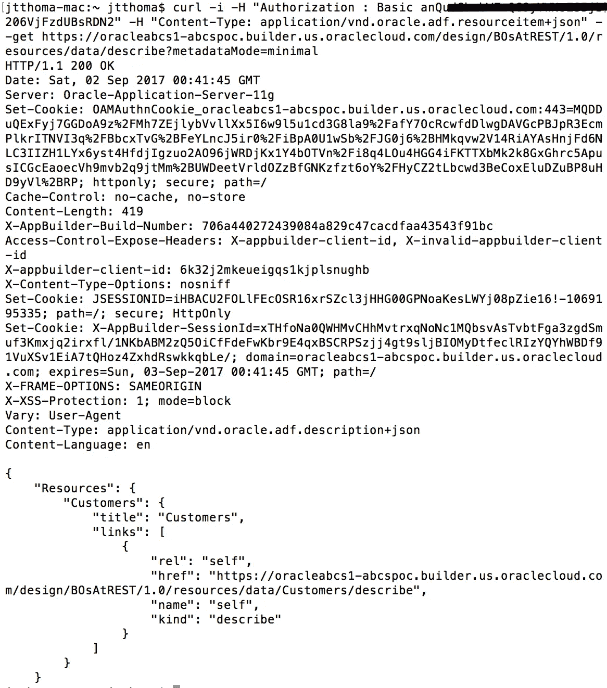
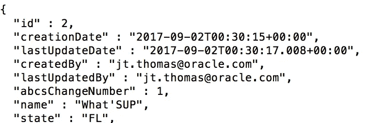

# 使用 Visual Builder 业务对象 REST APIs

> 原文：<https://medium.com/oracledevs/working-with-visual-builder-business-object-rest-apis-b0be6aad52f3?source=collection_archive---------0----------------------->

在 Visual Builder 云服务中，可以通过 REST 访问您的业务对象。这篇博客展示了如何使用 cURL 命令行工具从外部资源使用这些 REST APIs。

提醒一下，Visual Builder 中的业务对象(BOs)是一组字段，用户可以在这些字段上执行 CRUD(创建-读取-更新-删除)操作。通常，这些 CRUD 操作是在 Visual Builder 生成的用户界面表单中执行的。然而，外部服务也可能调用那些使用 REST 的业务对象。例如，流程云服务(PCS)流程可能需要在流程完成后更新业务对象，比如将状态字段从“已请求”更改为“已批准”

首先，让我们在 Visual Builder 数据设计器中定义一个简单的业务对象。这个业务对象称为 Customer，包含两个字段:Name 和 State。

让我们通过运行应用程序并输入一些新客户来添加几行数据。

在 Visual Builder 中多一个设置，我们就可以远程访问这些对象了。在“应用程序”>“安全性”页面中，设置“为业务对象 REST APIs 启用基本身份验证”。

现在让我们使用一个外部工具来访问 REST APIs。为了便于说明，我将在 MacOSX 终端命令行中使用 curl。首先，我们需要知道 API 调用的端点。这可以在 Catalog API 下的 Application > General 页面中找到。

由于这个应用程序正在开发中，我们将选择包含描述文件的顶部 URL，并将为我们提供端点。

[https://Oracle ABC S1-ABC spoc . builder . us . Oracle cloud . com/design/bosa trest/1.0/resources/data/describe？元数据模式=最小](https://oracleabcs1-abcspoc.builder.us.oraclecloud.com/design/BOsAtREST/1.0/resources/data/describe?metadataMode=minimal)

**第 1 部分:资源端点和 GET 请求**

curl 请求需要一个带有 base64 编码的 username:password 的基本标头，该标头是具有已验证用户角色的用户的。还需要一个将内容类型设置为 application/vnd . Oracle . ADF . resources item+JSON 的附加头。

下面的截图显示了请求和输出。(出于安全考虑，部分用户令牌已被隐藏)。

在这个输出中，我们看到一个名为 Customer 的资源。如果我们要调用描述端点，我们也将看到允许的字段和动作。但更重要的是，我们可以通过这个输出来确定业务对象的端点。

[https://Oracle ABC S1-ABC spoc . builder . us . Oracle cloud . com/design/bosa trest/1.0/resources/data/Customers](https://oracleabcs1-abcspoc.builder.us.oraclecloud.com/design/BOsAtREST/1.0/resources/data/Customers)

对该端点调用相同的 GET 请求，响应将包含该业务对象中的所有数据行。要仅查看其中一行，请添加主键，它是业务对象端点之后的那一行的 id。

[https://Oracle ABC S1-ABC spoc . builder . us . Oracle cloud . com/design/bosa trest/1.0/resources/data/Customers](https://oracleabcs1-abcspoc.builder.us.oraclecloud.com/design/BOsAtREST/1.0/resources/data/Customers)/2

[**第二部分:对业务对象的创建、更新和删除操作**](/@jtoracle/working-with-visual-builder-business-object-rest-apis-part-2-create-update-and-delete-84e16e3ee60b)