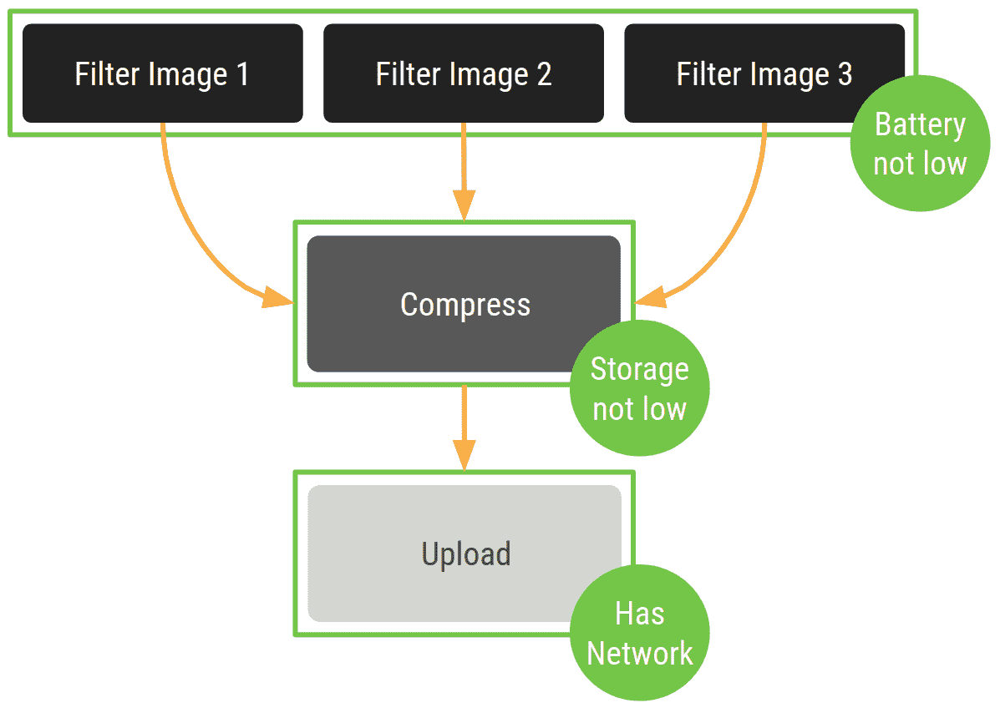
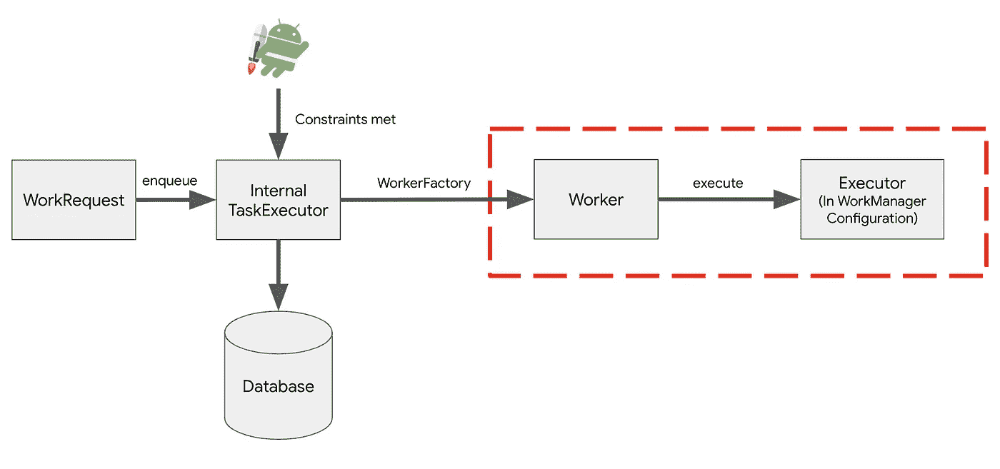
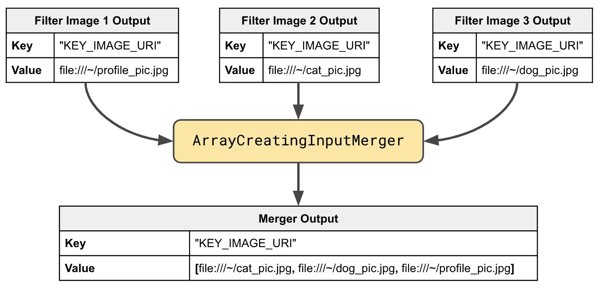
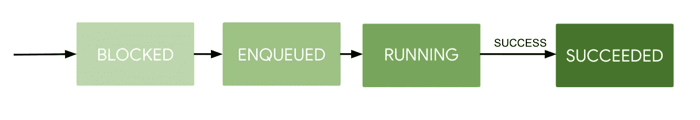
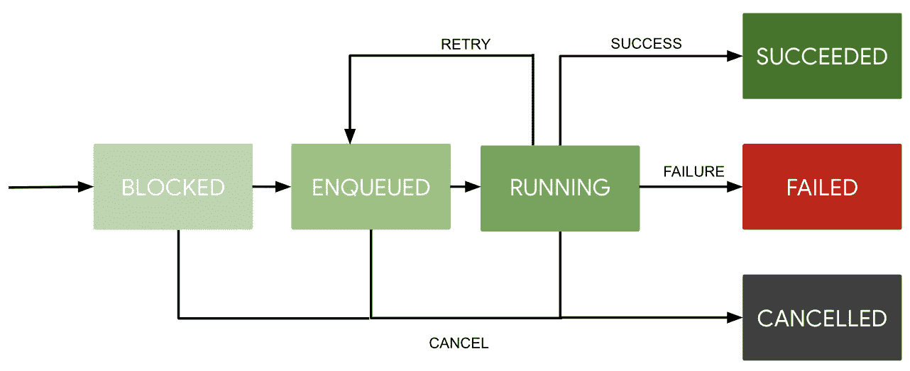

# 工作管理器基础

> 原文：<https://medium.com/androiddevelopers/workmanager-basics-beba51e94048?source=collection_archive---------0----------------------->


Illustration by [Virginia Poltrack](https://twitter.com/VPoltrack)

欢迎来到我们的工作管理器系列的第二篇文章。WorkManager 是一个 [Android Jetpack](https://developer.android.com/jetpack/) 库，当工作的约束得到满足时，它运行可推迟的、有保证的后台工作。对于许多类型的后台工作，WorkManager 是当前的最佳实践。[在第一篇博文](/androiddevelopers/introducing-workmanager-2083bcfc4712)中，我们讨论了什么是工作管理器以及何时使用工作管理器。

在这篇博文中，我将介绍:

*   将后台任务定义为工作
*   定义具体工作应该如何运行
*   运行您的工作
*   使用链条进行从属工作
*   观察你的工作状态

我还将解释 WorkManager 的幕后**发生了什么，以便您可以就如何使用它做出明智的决定。**

# 从一个例子开始

假设你有一个图像编辑应用程序，可以让你给图像加滤镜，然后上传到网上让全世界看到。您希望创建一系列应用滤镜、压缩图像，然后上传它们的后台任务。在每个阶段，都有一个需要检查的约束条件——过滤图像时有足够的电池，压缩图像时有足够的存储空间，上传图像时有网络连接。



The example, visualized

这是一个任务示例:

*   **Deferrable** ，因为你不需要它立即发生，事实上可能想要等待一些约束条件被满足(比如等待网络连接)。
*   需要**保证**运行，不管应用程序是否存在，因为如果你的用户过滤后的图片不与外界分享，他们会非常不高兴！

这些特征使我们的图像过滤和上传任务成为 WorkManager 的完美用例。

# 添加工作管理器依赖项

这篇博文中的代码片段是在 Kotlin 中，使用了 KTX 库(KoTlin 扩展)。库的 KTX 版本提供了[扩展函数](https://developer.android.com/reference/kotlin/androidx/work/package-summary#extension-functions-summary)以获得更简洁和习惯的 Kotlin。您可以使用 KTX 版本的 WorkManager，使用此依赖关系:

```
dependencies {
 def work_version = "1.0.0-beta02"
 implementation "android.arch.work:work-runtime-ktx:$work_version"
}
```

你可以在这里找到库[的最新版本](https://developer.android.com/topic/libraries/architecture/adding-components#workmanager)。如果想使用 Java 依赖，只需去掉“-ktx”。

# 定义你的工作是什么

在我们开始将多个任务链接在一起之前，让我们先关注如何执行一项工作。我将放大上传任务。首先，您需要创建自己的`[Worker](https://developer.android.com/reference/androidx/work/Worker)`类的实现。我将调用我们的类`UploadWorker`，并覆盖`[doWork(](https://developer.android.com/reference/androidx/work/Worker.html#doWork()))`方法。

`Worker`年代:

*   定义你的工作实际上**做什么**。
*   接受输入并产生输出。输入和输出都表示为键值对。
*   总是返回代表成功、失败或重试的值。

下面的例子展示了如何实现一个上传图像的`Worker`:

需要注意两件事:

*   输入和输出作为`[Data](https://developer.android.com/reference/androidx/work/Data)`传递，本质上是原语类型和数组的映射。对象应该非常小——实际上输入/输出的总大小是有限制的。这由`[MAX_DATA_BYTES](https://developer.android.com/reference/androidx/work/Data.html#MAX_DATA_BYTES)`设定。如果你需要传递更多的数据进出你的`Worker`，你应该把你的数据放在其他地方，比如一个[房间数据库](https://developer.android.com/training/data-storage/room/)。举个例子，我传入的是上面图片的 URI，而不是图片本身。
*   在代码中，我展示了两个返回示例，`[Result.success()](https://developer.android.com/reference/androidx/work/ListenableWorker.Result#success())`和`[Result.failure()](https://developer.android.com/reference/androidx/work/ListenableWorker.Result#failure())`。还有一个`[Result.retry()](https://developer.android.com/reference/androidx/work/ListenableWorker.Result#retry())`选项，它将在稍后重试您的工作。

# 定义你的工作应该如何运行

a `Worker`定义工作**做什么**，而 a `[WorkRequest](https://developer.android.com/reference/androidx/work/WorkRequest)`定义**工作应该如何以及何时运行**。

这里有一个为你的`UploadWorker`创建一个`[OneTimeWorkRequest](https://developer.android.com/reference/androidx/work/OneTimeWorkRequest)`的例子。也有可能有重复的`[PeriodicWorkRequest](https://developer.android.com/reference/androidx/work/PeriodicWorkRequest)`:

这个`WorkRequest`接受`imageData: Data`对象作为输入并尽快运行。

假设`UploadWork`不应该总是立即运行——它应该只在设备有网络连接的情况下运行。您可以通过添加一个`[Constraints](https://developer.android.com/reference/androidx/work/Constraints.Builder)`对象来做到这一点。您可以像这样创建一个约束:

以下是其他受支持约束的示例:

最后，还记得`Result.retry()`吗？我前面说过，如果一个`Worker`返回`Result.retry()`，WorkManager 将重新安排工作。当您创建新的`WorkRequest`时，您可以自定义补偿标准。这允许您定义何时应该重试工作。

[回退标准](https://developer.android.com/reference/kotlin/androidx/work/WorkRequest.Builder#setbackoffcriteria)由两个属性定义:

*   [**退避策略**](https://developer.android.com/reference/androidx/work/BackoffPolicy) ，默认为指数型，但可以设置为线性。
*   **持续时间**，默认为 30 秒。

使用约束、输入和自定义回退策略将上传工作排队的组合代码为:

# 运行工作

这很好，但是你还没有真正安排好你的工作。下面是您需要告诉 WorkManager 安排您的工作的一行代码:

您首先需要获得`[WorkManager](https://developer.android.com/reference/androidx/work/WorkManager)`的实例，它是负责执行您的工作的单例。调用`[enqueue](https://developer.android.com/reference/androidx/work/WorkManager#enqueue(androidx.work.WorkRequest))`开始了`WorkManager`跟踪和调度工作的整个过程。

# 幕后——工作如何运行

那么你能指望`WorkManager`为你做什么呢？默认情况下，`WorkManager`会:

*   从主线程中运行你的工作**(这假设你正在扩展`Worker`类，如上面的`UploadWorker`所示)。**
*   **保证**你的工作会执行(它不会忘记运行你的工作，即使你重启设备或者 app 退出)。
*   根据用户 API 级别的**最佳实践运行(如[上一篇文章](/androiddevelopers/introducing-workmanager-2083bcfc4712)中所述)。**

让我们探索一下 WorkManager 如何确保您的工作脱离主线程运行并保证执行。在幕后，工作管理器包括以下部分:

*   **内部 TaskExecutor** : 单线程`[Executor](https://developer.android.com/reference/java/util/concurrent/Executor)`处理所有入队工作的请求。如果你不熟悉`Executors`，你可以在这里阅读更多关于它们的信息[。](https://developer.android.com/reference/java/util/concurrent/Executor)
*   **工作管理器数据库**:一个本地数据库，跟踪你所有工作的所有信息和状态。这包括工作的当前状态、工作的输入和输出以及工作的任何约束。该数据库使 WorkManager 能够保证您的工作能够完成，如果您用户的设备重新启动并且工作中断，可以从数据库中提取工作的所有详细信息，并且可以在设备再次启动时重新开始工作。
*   **worker factory * ***:**一个创建你的`Worker`实例的默认工厂。我们将在以后的博客文章中解释为什么以及如何配置它。**
*   ****默认执行人**** : 运行您的工作的默认执行人，除非您另外指定。这确保了默认情况下，您的工作在主线程之外同步运行。**

****这些部件可以被覆盖以具有不同的行为。**

****

**Credit: [Working with WorkManager](https://youtu.be/83a4rYXsDs0) Presentation Android Developer Summit 2018**

**当您将`WorkRequest`加入队列时:**

1.  **内部 TaskExecutor 立即将您的`WorkRequest`信息保存到 WorkManager 数据库中。**
2.  **稍后，当`WorkRequest`的`Constraints`被满足时(可能是立即)，内部 TaskExecutor 告诉`WorkerFactory`创建一个`Worker`。**
3.  **然后默认的`Executor`从主线程中调用你的`Worker`的`doWork()`方法**。****

**这样，默认情况下，您的工作既保证了执行，又保证了脱离主线程运行。**

**现在，如果您想使用默认的`Executor`之外的其他机制来运行您的工作，您可以这样做！对于协同程序(`CoroutineWorker`)和 RxJava ( `[RxWorker](https://developer.android.com/reference/androidx/work/RxWorker)`)作为工作方式，有现成的支持。**

**或者您可以通过使用`[ListenableWorker](https://developer.android.com/reference/androidx/work/ListenableWorker)`来指定工作是如何执行的。`Worker`实际上是`ListenableWorker`的一个实现，默认在默认的`Executor`上运行你的工作，因此是同步的。所以如果你想完全控制你的工作的线程策略或者异步运行工作，你可以子类化`ListenableWorker`(细节将在后面的文章中讨论)。**

**WorkManager 不厌其烦地将所有工作信息保存到数据库中，这一事实使得它非常适合需要保证执行的任务。这也使得 WorkManager 对于不需要这种保证，只需要在后台线程上执行的任务来说是大材小用。例如，假设你已经下载了一张图片，你想根据这张图片改变你的用户界面的颜色。这是应该在主线程之外运行的工作，但是，因为它与 UI 直接相关，如果您关闭应用程序，就不需要继续。所以在这种情况下，不要使用工作管理器——坚持使用更轻量级的东西，比如 [Kotlin 协程](https://codelabs.developers.google.com/codelabs/kotlin-coroutines/#0)或者创建自己的`Executor`。**

# **使用链条进行从属工作**

**我们的过滤器示例包含不止一个任务——我们想要过滤多个图像，然后压缩，然后上传。如果您想依次或并行运行一系列的`WorkRequest`，您可以使用[链](https://developer.android.com/topic/libraries/architecture/workmanager/advanced#chained)。示例图显示了一个链，其中有三个并行运行的筛选器任务，随后是按顺序运行的压缩任务和上传任务:**

****

**有了 WorkManager，这变得非常简单。假设您已经用适当的约束创建了所有的工作请求，代码如下所示:**

**三个过滤图像`WorkRequest`并行执行。一旦所有三个过滤器`WorkRequests`都完成(且仅当所有三个都完成时)，`compressWorkRequest`发生，随后是`uploadWorkRequest`。**

**链的另一个简洁特征是一个`WorkRequest`的输出作为下一个`WorkRequest`的输入。因此，假设您正确设置了输入和输出数据，就像我在上面的`UploadWorker`示例中所做的那样，这些值将会自动传递。**

**为了处理并行运行的三个过滤器工作请求的输出，您可以使用一个`[InputMerger](https://developer.android.com/reference/androidx/work/InputMerger)`，特别是`[ArrayCreatingInputMerger](https://developer.android.com/reference/androidx/work/ArrayCreatingInputMerger)`。这看起来像:**

**注意，`InputMerger`被添加到`compressWorkRequest`中，而不是并行运行的三个过滤器请求。**

**让我们假设每个过滤器工作请求的输出是映射到图像 URI 的关键字“KEY_IMAGE_URI”。添加`ArrayCreatingInputMerger`的作用是从并行运行的请求中获取输出，当这些输出具有匹配的**键**时，它会创建一个包含所有输出值的数组，映射到单个键。看起来像这样:**

****

**A visual of what an `ArrayCreatingInputMerger` does**

**因此，`compressWorkRequest`的输入将最终成为映射到过滤图像 URIs 数组的“KEY_IMAGE_URI”对。**

# **观察您的工作请求状态**

**观察工作最简单的方法是使用`[LiveData](https://developer.android.com/reference/android/arch/lifecycle/LiveData)`类。如果你不熟悉`LiveData`，它是一个生命周期感知的可观察数据容器，在这里有更详细的描述。**

**调用`[getWorkInfoByIdLiveData](https://developer.android.com/reference/androidx/work/WorkManager.html#getWorkInfoById(java.util.UUID))`返回一个`[WorkInfo](https://developer.android.com/reference/androidx/work/WorkInfo)`的`LiveData`。`WorkInfo`包括输出数据和代表工作状态的枚举。当工作成功完成时，其'`[State](https://developer.android.com/reference/kotlin/androidx/work/State)`为`SUCCEEDED`。例如，当工作完成时，您可以通过编写如下观察代码来自动显示该图像:**

**需要注意一些事情:**

*   **每个`WorkRequest`都有一个[唯一 id](https://developer.android.com/reference/androidx/work/WorkRequest.html#getId()) ，该唯一 id 是查找相关`WorkInfo`的一种方式。**
*   **当`WorkInfo`改变时，观察和被通知的能力是`LiveData`提供的一个特征。**

**工作有一个生命周期，由不同的`[State](https://developer.android.com/reference/kotlin/androidx/work/State)`表示。当观察`LiveData<WorkInfo>`时，你会看到那些状态；例如，您可能会看到:**

****

**The “happy path” or work States**

**工作经历的“快乐路径”状态有:**

1.  **`BLOCKED`:只有当工作在一个链中，并且不是链中的下一个工作时，才会出现这种状态。**
2.  **`ENQUEUED`:只要工作链中的下一个工作符合运行条件，工作就进入此状态。这部作品可能还在等待`Constraint`号的接应。**
3.  **`RUNNING`:此状态下，工作正在积极执行。对于`Worker` s，这意味着已经调用了`doWork()`方法。**
4.  **`SUCCEEDED`:当`doWork()`返回`Result.success()`时，工作进入此终止状态。**

**现在当工作是`RUNNING`时，你可能会调用`Result.retry()`。这将导致工作返回到`ENQUEUED`。工作也可以`CANCELLED`在任何点。**

**如果工作结果是`Result.failure()`而不是成功，其状态将在`FAILED`结束。因此，状态的完整流程图如下所示:**

****

**(Credit: [Working with WorkManager](https://youtu.be/83a4rYXsDs0) Presentation Android Developer Summit 2018)**

**要获得精彩的视频解释，请查看 [WorkManager Android 开发者峰会演讲](https://youtu.be/83a4rYXsDs0?t=1144)。**

# **结论**

**这是工作管理器 API 的基础。使用我们刚刚介绍的片段，您现在可以:**

*   **创建具有输入和输出的`Worker`。**
*   **使用`WorkRequest`、`Constraint`启动输入和回退策略，配置`Worker`将如何运行。**
*   **入队`WorkRequest` s**
*   **了解`WorkManager`在默认情况下，在线程和保证执行方面做了什么。**
*   **创建复杂的相互依赖的工作链，按顺序和并行运行。**
*   **使用`WorkInfo`观察您的`WorkRequest`状态。**

**想自己试试 WorkManager 吗？看看 codelab，它在 [Kotlin](https://codelabs.developers.google.com/codelabs/android-workmanager-kt/index.html?index=..%2F..index#0) 和 [Java](https://codelabs.developers.google.com/codelabs/android-workmanager/index.html?index=..%2F..index#0) 中。**

**在我们继续这个系列的时候，请继续关注更多关于 WorkManager 主题的博客文章。有什么问题或你想让我们回答的吗？请在评论区告诉我们！**

***感谢* [*皮埃特罗·马吉。*](/@pmaggi)**

# **工作经理的资源**

*   **[文档](https://developer.android.com/topic/libraries/architecture/workmanager/)**
*   **[参考指南](https://developer.android.com/reference/androidx/work/package-summary)**
*   **[工作管理器 1.0.0-beta02 发行说明](https://developer.android.com/jetpack/docs/release-notes#january_15_2019)**
*   **Codelab: [Kotlin](https://codelabs.developers.google.com/codelabs/android-workmanager-kt/index.html?index=..%2F..index#0) 和 [Java](https://codelabs.developers.google.com/codelabs/android-workmanager/index.html?index=..%2F..index#0) 。**
*   **[源代码(AOSP 的一部分)](https://android.googlesource.com/platform/frameworks/support/+/master/work)**
*   **[使用 work manager(2018 年 Android 开发峰会)演示文稿](https://www.youtube.com/watch?v=83a4rYXsDs0)**
*   **[问题跟踪器](https://issuetracker.google.com/issues?q=componentid:409906)**
*   **[关于 StackOverflow 的工作管理器问题](https://stackoverflow.com/questions/tagged/android-workmanager)**
*   **[谷歌的 Power 博客文章系列](https://android-developers.googleblog.com/search/label/Power%20series)**