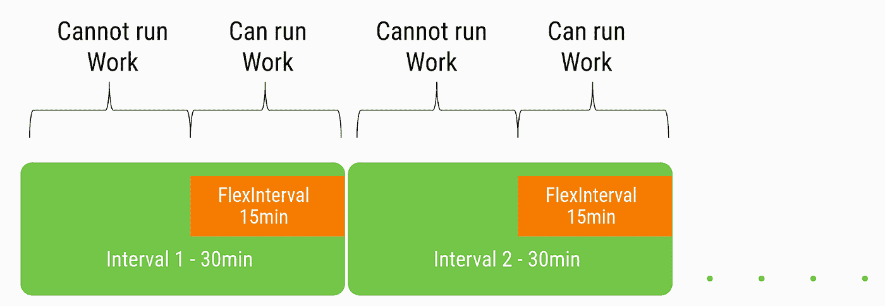
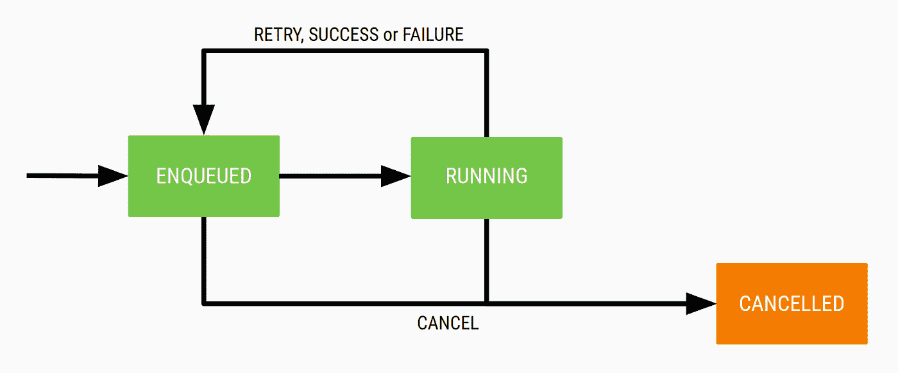

# 工作管理器周期

> 原文：<https://medium.com/androiddevelopers/workmanager-periodicity-ff35185ff006?source=collection_archive---------0----------------------->


Illustration by [Virginia Poltrack](https://twitter.com/VPoltrack)

欢迎来到我们的工作管理器系列的第四篇文章。WorkManager 是一个 Android Jetpack 库，它使得调度必须可靠运行的可推迟的异步任务变得容易。这是目前 Android 上大多数后台工作的最佳实践。
如果您一直在关注，我们已经讨论了:

*   [什么是工作管理器，什么时候使用工作管理器](/androiddevelopers/introducing-workmanager-2083bcfc4712)。
*   [如何使用工作管理器 API 调度工作](/androiddevelopers/workmanager-basics-beba51e94048)
*   [工作管理器的 Kotlin 扩展和](/androiddevelopers/workmanager-meets-kotlin-b9ad02f7405e) `[CoroutineWorker](/androiddevelopers/workmanager-meets-kotlin-b9ad02f7405e)`

在这篇博文中，我将介绍:

*   定义定期工作
*   取消工作
*   自定义工作管理器配置

# 重复工作

在之前的博客中，我们已经看到你可以使用`[OneTimeWorkRequest](https://developer.android.com/reference/androidx/work/OneTimeWorkRequest)`来安排工作，但是如果你希望你的工作定期重复，你可以使用`[PeriodicWorkRequest](https://developer.android.com/reference/androidx/work/PeriodicWorkRequest)`。

首先，我们来看看这两种类型的`WorkRequest`有什么区别:

*   最小周期长度为 15 分钟(与[作业调度器](https://developer.android.com/reference/android/app/job/JobScheduler)相同)
*   工人类不能在`PeriodicWorkRequest`中链接
*   在 v2.1-alpha02 之前，不可能创建具有初始延迟的`PeriodicWorkRequest`。

我在会议上遇到的一些最常见的问题是关于周期性工作的。在本文中，我将介绍周期性工作的基础知识、一些常见的用例以及一些常见的错误。此外，我们将介绍几种为工人类编写测试的方法。

# 应用程序接口

构建周期性工作请求的调用与我们看到的一次性工作没有太大的不同。我们有一个额外的参数来指定最小重复间隔:

```
val work = PeriodicWorkRequestBuilder<MyWorker>(1, TimeUnit.HOURS)
                   .build()
```

它被称为最小间隔，因为 Android 的电池优化，因为你可以限制延长重复之间的时间。例如，如果您指定工作仅在设备充电时运行，即使您的最小间隔已过，如果设备未充电，此工作也不会运行，直到设备接通电源。


PeriodicWorkRequest with a charging constraints

在这种情况下，我们向`PeriodicWorkRequest`添加一个收费约束，并对其进行排队:

```
val constraints = Constraints.Builder()
                   .setRequiresCharging(true)
                   .build()val work = PeriodicWorkRequestBuilder<MyWorker>(1, TimeUnit.HOURS)
                   .setConstraints(constraints)
                   .build()val workManager = WorkManager.getInstance(context)
workManager.enqueuePeriodicWork(work)
```

关于如何检索 WorkManager 实例的说明。

> 工作管理器 v2.1 已经废弃了`[WorkManager#getInstance()](https://developer.android.com/reference/androidx/work/WorkManager.html#getInstance())`，现在有了一个新的`[WorkManager#getInstance(context: Context)](https://developer.android.com/reference/androidx/work/WorkManager.html#getInstance(android.content.Context))`，它以同样的方式工作，但支持新的[按需初始化](https://developer.android.com/topic/libraries/architecture/workmanager/advanced/custom-configuration#on-demand)。在本文中，我将使用这种新语法，它要求我们传递一个上下文来检索 WorkManager 实例。

关于“最小间隔”的提醒。WorkManager 正在平衡两种不同的需求:应用程序及其`WorkRequest`，以及 Android 操作系统限制电池消耗的需求。出于这个原因，即使满足了对一个`WorkRequest`设置的所有约束，您的工作仍然会有一些额外的延迟。

Android 包括一套电池优化策略:当用户不使用设备时，操作系统会最大限度地减少活动以保存电池。如果您的设备处于[休眠模式](https://developer.android.com/training/monitoring-device-state/doze-standby)，则运行工作可能会延迟到下一个[维护窗口](https://developer.android.com/training/monitoring-device-state/doze-standby#understand_doze)。

# 区间和弹性区间

正如我们所看到的，工作管理器并不是以精确的时间间隔执行。如果这是您的需求，那么您就找错了 API。鉴于重复间隔实际上是一个最小间隔，WorkManager 提供了一个额外的参数，您可以使用它来指定 Android 可以执行您的工作的窗口。

简而言之，您可以指定第二个间隔来控制何时允许您的定期工作器在重复周期的一部分内运行。第二个间隔(灵活间隔)位于重复间隔本身的末尾。

让我们看一个例子。假设您想要构建一个周期为 30 分钟的周期性工作请求。您可以指定一个小于此时间段的弹性时间间隔，比如 15 分钟的弹性时间间隔。

使用该参数构建`PeriodicWorkPequest`的实际代码是:

```
val logBuilder = PeriodicWorkRequestBuilder<MyWorker>(
                         30, TimeUnit.MINUTES, 
                         15, TimeUnit.MINUTES)
```

结果是，我们的工人将在下半段时间内被处决(灵活间隔时间总是位于重复周期的末尾):



PeriodicWorkRequest with a 30' Interval and a 15' flexInterval

请记住，这些计时总是取决于工作请求中包含的约束条件以及设备的状态。

要了解更多关于该功能的信息，您可以阅读`[PeriodicWorkRequest.Builder](https://developer.android.com/reference/androidx/work/PeriodicWorkRequest.Builder)` [文档](https://developer.android.com/reference/androidx/work/PeriodicWorkRequest.Builder)。

# 日常工作

因为周期间隔并不精确，所以您不能构建每天在特定时间执行的周期工作请求。即使我们放松精度也不行。

您可以指定一个 24 小时的期限，但是因为工作是根据安卓的电池优化策略来执行的，您只能期望您的工人在这个时间左右被执行。然后，您可以在第一天早上 5:00、第二天早上 5:25、第三天早上 5:15，然后第二天早上 5:30 执行，依此类推。随着时间的推移，误差会越来越大。

来自 [Evernote Android-Job](https://github.com/evernote/android-job) 库的开发人员有时会要求在指定时间运行日常工作。

目前，如果您需要每天大致在同一时间**处决一名工人，您最好的选择是使用带有初始延迟的`OneTimeWorkRequest`，以便在正确的时间执行:**

```
This is my new defaultval currentDate = Calendar.getInstance()
val dueDate = Calendar.getInstance()// Set Execution around 05:00:00 AM
dueDate.set(Calendar.HOUR_OF_DAY, 5)
dueDate.set(Calendar.MINUTE, 0)
dueDate.set(Calendar.SECOND, 0)if (dueDate.before(currentDate)) {
    dueDate.add(Calendar.HOUR_OF_DAY, 24)
}
val timeDiff = dueDate.timeInMillis — currentDate.timeInMillis
val dailyWorkRequest = OneTimeWorkRequestBuilder<DailyWorker> 
        .setConstraints(constraints) .setInitialDelay(timeDiff, TimeUnit.MILLISECONDS)
         .addTag(TAG_OUTPUT) .build()WorkManager.getInstance(context).enqueue(dailyWorkRequest)
```

**这将处理第一次执行。当我们成功完成时，我们需要将这项工作的下一次执行排队:**

```
class DailyWorker(ctx: Context, params: WorkerParameters) : Worker(ctx, params) { override fun doWork(): Result {
    val currentDate = Calendar.getInstance()
    val dueDate = Calendar.getInstance() // Set Execution around 05:00:00 AM
    dueDate.set(Calendar.HOUR_OF_DAY, 5)
    dueDate.set(Calendar.MINUTE, 0)
    dueDate.set(Calendar.SECOND, 0) if (dueDate.before(currentDate)) { 
      dueDate.add(Calendar.HOUR_OF_DAY, 24)
    } val timeDiff = dueDate.timeInMillis — currentDate.timeInMillis val dailyWorkRequest = OneTimeWorkRequestBuilder<DailyWorker>()
            .setInitialDelay(timeDiff, TimeUnit.MILLISECONDS)
            .addTag(TAG_OUTPUT)
            .build() WorkManager.getInstance(applicationContext)
            .enqueue(dailyWorkRequest)return Result.success()
  }
}
```

**请记住，工作者被执行的确切时间取决于您在工作请求中使用的约束以及 Android 平台所做的优化。**

# **定期工作的状态**

**我们发现，与一次性工作相比，周期性工作的区别之一是不可能用周期性工作请求来构建工作链。这种限制的原因是，在工作链中，当一个工人转换到`SUCCEEDED`状态时，您会从一个工人转换到链中的下一个工人。**

****

**`PeriodicWorkRequest` states**

> **周期性工作**永远不会**结束于`SUCCEEDED`状态；它会一直运行，直到被取消。当你从一个周期工作者调用`Result#success()`或`Result#failure()`时，它转换回`ENQUEUED`状态，等待下一次执行。**

**因此，当您处理周期性工作时，您不能构建链，甚至不能处理唯一的工作请求。在这种情况下，周期性的工作请求失去了追加工作的能力:您只能使用`KEEP`和`REPLACE`，而不能使用`APPEND`。**

# **数据输入和输出**

**WorkManager 允许您将一个数据对象传递给 worker，并在成功或失败调用时返回一个新的数据对象(当您返回一个`Result#retry()`时，没有数据输出选项，因为 worker 执行是无状态的)。**

**在一次性工人链中，从一个工人返回的输出成为链中下一个工人的输入。正如我们已经看到的，周期性的工作不能在工作链中使用，因为它真的从来没有“成功地”完成；它只能以取消结束。**

**那么，我们在哪里可以看到和使用用`Result#success(outData)`返回的数据呢？**

**我们可以通过`PeriodicWorkRequest`的 WorkInfo 观察这些数据，但是只能观察到下一次执行周期性工作，并且我们只能依靠处于`ENQUEUED`状态的工人来检查其输出:**

```
val myPeriodicWorkRequest =
        PeriodicWorkRequestBuilder<MyPeriodicWorker>(1, TimeUnit.HOURS).build()WorkManager.getInstance(context).enqueue(myPeriodicWorkRequest)WorkManager.getInstance()
        .getWorkInfoByIdLiveData(myPeriodicWorkRequest.id)
        .observe(lifecycleOwner, Observer { workInfo -> 
  if ((workInfo != null) && 
      (workInfo.state == WorkInfo.State.ENQUEEDED)) {
    val myOutputData = workInfo.outputData.getString(KEY_MY_DATA)
  }
})
```

**如果您需要定期员工提供一些结果，这可能不是您的最佳选择。更好的选择是通过另一种媒介传递数据，比如数据库中的表。**

**有关如何检索工作状态的更多信息，您可以参考本系列的第二篇博文[和工作管理器文档:](/androiddevelopers/workmanager-basics-beba51e94048)[工作状态和观察工作](https://developer.android.com/topic/libraries/architecture/workmanager/how-to/states-and-observation)。**

# **独特的作品**

**一些工作管理器用例可能会陷入一种模式，即应用程序一启动就将一些工作排入队列。这可以是您希望定期运行的后台同步任务，也可以是计划的内容下载。不管它是什么，常见的模式是，应用程序一启动，它就需要排队。**

**我见过这种模式出现几次，在您的`Application#onCreate`中，开发人员创建一个工作请求并将其排队。一切都很好，直到你发现同一个工作运行了两次或更多次。如果没有取消，这对于永远不会到达最终状态的周期性工作尤其相关。**

**我们喜欢说，即使您的应用程序关闭或设备重启，WorkManager 也能保证您工作的执行。因此，在每次启动应用程序时让您的工作线程入队会导致每次都添加一个新的`WorkRequest`。如果你用的是`OneTimeWorkRequest`，这可能没什么大不了的。一旦工作运行完成，它就完成了。但是对于周期性工作，“完成”是一个不同的概念，您可以很容易地将多个周期性工作请求排入队列。**

**这种情况下的解决方案是使用`[WorkManager#enqueueUniquePeriodicWork()](https://developer.android.com/reference/androidx/work/WorkManager.html#enqueueUniquePeriodicWork(java.lang.String,%20androidx.work.ExistingPeriodicWorkPolicy,%20androidx.work.PeriodicWorkRequest))`将您的`WorkRequest`作为唯一工作排队:**

```
class MyApplication: Application() { override fun onCreate() {
    super.onCreate()
    val myWork = PeriodicWorkRequestBuilder<MyWorker>(
                         1, TimeUnit.HOURS)
                         .build() WorkManager.getInstance(this).enqueueUniquePeriodicWork(
        “MyUniqueWorkName”,
        ExistingPeriodicWorkPolicy.KEEP,
        myWork)
  }
}
```

**这可以避免您多次将工作排入队列。**

## **保留还是替换？**

**你选择这些政策中的哪一个，实际上取决于你对你的员工做了什么。就个人而言，我默认使用`KEEP`策略，因为它更轻量级，不需要替换现有的`WorkRequest`。它还避免了取消已经运行的工作线程的可能性。**

**只有在有充分理由的情况下，我才会切换到`REPLACE`策略(例如，如果我想从`doWork()`方法中重新调度`Worker`)。**

**如果您选择一个`REPLACE`策略，那么您的 Worker 应该能够优雅地处理停止，因为如果在 Worker 运行时有一个新的`WorkRequest`加入队列，那么 WorkManager 可能必须取消一个正在运行的实例。但是您无论如何都应该这样做，因为如果在 Worker 的执行过程中不再满足约束，WorkManager 可能会停止您的工作。**

**关于独特作品的更多信息，可以参考文档:[独特作品](https://developer.android.com/topic/libraries/architecture/workmanager/how-to/unique-work)。**

# **测试定期工作**

**[WorkManager 的测试文档](https://developer.android.com/topic/libraries/architecture/workmanager/how-to/testing)非常全面，涵盖了基本场景。在 WorkManager v2.1 发布后，现在有两种方法来测试您的员工:**

*   **`[WorkManagerTestInitHelper](https://developer.android.com/reference/androidx/work/testing/WorkManagerTestInitHelper)`**
*   **`[TestWorkerBuilder](https://developer.android.com/reference/androidx/work/testing/TestWorkerBuilder)`和`[TestListenableWorkerBuilder](https://developer.android.com/reference/androidx/work/testing/TestListenableWorkerBuilder)`**

**使用`WorkManagerTestInitHelper`您可以测试您的工人类模拟延迟，满足约束和周期要求。这种测试工人的方法的优点是，它可以处理工人将自己或另一个工人类排队的情况(就像我们在上面看到的示例中一样，我们实现了一个“DailyWorker ”,它在每天大致相同的时间运行。要了解这方面的更多信息，您可以阅读 WorkManager 的[测试文档](https://d.android.com/topic/libraries/architecture/workmanager/how-to/integration-testing)。**

**如果你需要测试一个`[CoroutineWorker](https://developer.android.com/reference/kotlin/androidx/work/CoroutineWorker.html)`、`[RxWorker](https://developer.android.com/reference/androidx/work/RxWorker.html)`或者`[ListenableWorker](https://developer.android.com/reference/androidx/work/ListenableWorker)`，使用`WorkManagerTestInitHelper`会有一些额外的复杂性，因为你不能依赖它的`SynchronousExecutor`。**

**为了更直接地测试这些类，WorkManager v2.1 包含了一组新的 WorkRequest builder:**

*   **`TestWorkerBuilder`直接调用工人类**
*   **`TestListenableWorkerBuilder`直接调用`ListenableWorker`、`RxWorker`或`CoroutineWorker`**

**这样做的好处是，您可以测试任何类型的工人类，因为在这种情况下，您可以直接运行它。**

**您可以在[文档](https://developer.android.com/topic/libraries/architecture/workmanager/how-to/testing-210)中读到更多关于这些的内容，并且您可以在[向日葵示例应用](https://github.com/googlesamples/android-sunflower/blob/master/app/src/androidTest/java/com/google/samples/apps/sunflower/worker/SeedDatabaseWorkerTest.kt)中看到使用这些新构建器的测试示例:**

```
import android.content.Context
import androidx.test.core.app.ApplicationProvider
import androidx.work.ListenableWorker.Result
import androidx.work.WorkManager
import androidx.work.testing.TestListenableWorkerBuilder
import com.google.samples.apps.sunflower.workers.SeedDatabaseWorker
import org.hamcrest.CoreMatchers.`is`
import org.junit.Assert.assertThat
import org.junit.Before
import org.junit.Test
import org.junit.runner.RunWith
import org.junit.runners.JUnit4@RunWith(JUnit4::class)
class RefreshMainDataWorkTest { private lateinit var context: Context @Before
  fun setup() {
    context = ApplicationProvider.getApplicationContext()
  } @Test
  fun testRefreshMainDataWork() {
    // Get the ListenableWorker
    val worker = TestListenableWorkerBuilder<SeedDatabaseWorker>(context).build() // Start the work synchronously
    val result = worker.startWork().get()
    assertThat(result, `is`(Result.success()))
  }
}
```

# **结论**

**我希望这篇文章对你有用，我很想知道你是如何使用 WorkManager 的，或者 WorkManager 的哪些特性可以得到更好的解释或记录。**

**你可以通过推特 [@pfmaggi](https://twitter.com/pfmaggi) 联系到我。**

# **工作经理的资源**

*   **[文档](https://developer.android.com/topic/libraries/architecture/workmanager/)**
*   **[参考指南](https://developer.android.com/reference/androidx/work/package-summary)**
*   **[工作管理器发行说明](https://developer.android.com/jetpack/androidx/releases/work)**
*   **[Codelab](https://codelabs.developers.google.com/codelabs/android-workmanager-kt/index.html)**
*   **[介绍 WorkManager 博客文章](/androiddevelopers/introducing-workmanager-2083bcfc4712)**
*   **[工作管理器基础博客文章](/androiddevelopers/workmanager-basics-beba51e94048)**
*   **[工作经理会见科特林博客文章](/androiddevelopers/workmanager-meets-kotlin-b9ad02f7405e)**
*   **[源代码(AOSP 的一部分)](https://android.googlesource.com/platform/frameworks/support/+/master/work)**
*   **[使用 work manager(2018 年 Android 开发峰会)演示文稿](https://www.youtube.com/watch?v=83a4rYXsDs0)**
*   **[问题跟踪器](https://issuetracker.google.com/issues?q=componentid:409906)**
*   **[关于 StackOverflow 的工作管理器问题](https://stackoverflow.com/questions/tagged/android-workmanager)**
*   **[谷歌的 Power 博客文章系列](https://android-developers.googleblog.com/search/label/Power%20series)**