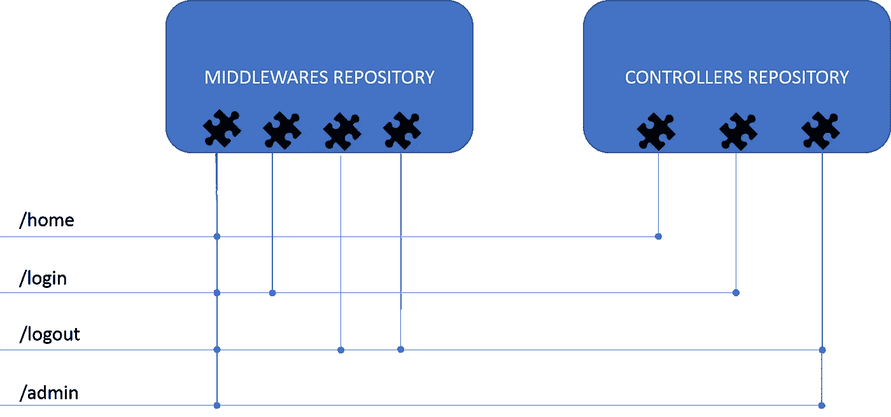

# 用 Go 插件编写一个 Web 服务

> 原文：<https://medium.com/quick-code/write-a-web-service-with-go-plug-ins-c0472e0645e6?source=collection_archive---------0----------------------->


[*意大利版！*](/quick-code/web-service-modulari-con-go-plug-in-7f59d4b15d61)

本文的目标是研究为什么以及如何构建一个模块化的 web 服务。

在一个自动化驱动的环境中，有许多条件将项目演进带入地狱。其中一些来自非模块化环境。

即使你在一个微服务架构上，用一种编译过的语言，所有这些情况都会导致重新构建整个服务项目:

*   编辑项目单个部分的工作方式。
*   优化单个端点的纵向扩展。

此外，你会面临一些不舒服的情况:

*   将您在一个服务中的相同行为重用到另一个服务中。
*   *你可能只能使用一种编程语言。*
*   如果你有一个团队，你需要分享整个项目(离岸项目中的这件小事可能非常糟糕)。

借助插件架构，您可以将服务开发为一组组件，从而能够:

*   拥有职能专用团队
*   具有滚动更新的组件的分离部署。
*   在多个项目中重用一个组件。
*   通过配置必须包含的 winch 组件，自定义如何扩展服务。
*   最后但同样重要的是，您可以用构建库的每种语言来开发组件！

# 体系结构

以 web 服务为例，我们可以将我们的项目分成以下几个部分:

*   核心:它将读取配置、加载组件、监听和服务 HTTP。
*   控制器:一个 HTTP 处理函数。
*   中间件:检查请求是否被授权访问控制器的组件。


这样，如果您将核心更新到 HTTPS，您可以只重新部署核心文件，并且只为需要符合 HTTPS 标准的服务重新部署*。同样，如果你更新 JWT 插件来使用一个新的散列方法，你只需要重新部署插件并重新加载核心。使用[最佳 Golang 教程](https://blog.coursesity.com/best-golang-tutorials/)在线学习或提高您的 Golang 技能。*

# **架构组件**

## 控制器

控制器是一个 HTTP 处理函数，它将逻辑应用于请求，以构建并返回响应。

## 中间件

这种类型的对象产生于需要做的事情，如过滤、跟踪或记录传入的请求，而不涉及管理它的所有项目。

一种中间件可以是 IP 过滤器:您希望只允许特定的 IP 访问您的服务。当请求到达您的服务器时，您可以直接检查源 IP 是否在您的白名单中。这样，你就不用加载服务的其他部分了。

其中一个优势是降低了在恶意情况下暴露细节的风险。


示例:让我们创建另一个检查访问头的中间件。现在，*链接*它与以前的 IP 中间件，只有在我们的 IP 池授权的用户可以访问服务。

因此，如果控制器的第一步是查询您的数据库中的用户数据，那么您就不会受到 SQL 注入的攻击。这是因为如果所有先决条件都满足，您就不会开始与 DB 通信。

## 核心

如前所述，对于这个项目，我们使用[插件](https://golang.org/pkg/plugin/)功能来分离组件。对于我们的范围，核心组件将负责加载控制器和中间件插件，使用配置文件将其映射到端点，最后启动 HTTP 侦听器。

所有其他路由将返回“404 未找到”。



Mapping middlewares and controller to an endpoint

这种级别的独立性很容易被云用例所接受:


# 履行

让我们从一个基本的*内核*开始，它带有一个*控制器(HTTP 函数处理器)*来响应我们的家:

在此基础上，添加实现中间件所需的结构:

The middleware type

…and a Chain function that provide a mechanism to concatenate middlewares

现在构建一个示例中间件:方法中间件检查 HTTP 方法和作为参数传递的方法之间的匹配。否则，返回一个 400 错误请求。

本例中的参数是一系列被认可的 HTTP 方法，我们需要对它们进行分割和检查:

是时候在链内附加中间件了，在函数参数中传递您希望允许的 HTTP 方法。

然后将这个链传递给我们的基本 HTTP 服务中的 HandlerFunc:

完整的[示例源代码在这里](https://github.com/Bebbolus/gomiddleware)

# 插件

> 注意:它只能在 Linux 上工作，但是容器提供了一个很好的解决方法。

一个插件的包需要是“主”的。像这样，包看不到“真正的”主包中的实体，比如类型和函数。所以，作为一个建议，尽可能保持插件的愚蠢。

在插件内部，您必须导出一个变量或函数作为要加载的符号

要构建插件，我们需要使用-buildmode=plugin 标志并指定结果名称

```
$go build -buildmode=plugin -o first.so first.go
```

> 你已经创建了你的第一个插件！

在您的 path ad 中搜索，您将看到 first.so 文件，这是一个**标准库，您可以用支持它的任何语言导入它。**

我为你感到骄傲，我的小学徒…让我们把它用在围棋上:

创建一个新文件“main.go ”,并加载您之前创建的库文件:

添加符号搜索代码:

现在，您可以从“main.go”中的插件使用您的功能:

奔跑

```
$ go run main.go
```

你会看到的

```
Hello FROM PLUGIN!!!
```

[此处示例源代码](https://github.com/Bebbolus/gomiddleware)

是时候继续“Oop 风格”了，从插件中获得不止一个功能。

使用一种类型来改进 first.go 插件，通过这种类型，您可以将函数作为方法附加，然后导出一个变量符号，将该类型作为对象引用:

现在，您必须以一种更安全的方式来更改导入的类型。

# 插件实现

这时你知道:

*   项目目标是什么
*   目标架构是什么
*   核心是什么
*   什么是控制器
*   什么是中间件
*   如何构建插件并使用它

您已经准备好构建“控制器”插件了！

在我们的存储库中创建一个插件文件夹:

```
$mkdir plugins
```

在里面我们创建了两个文件夹，一个用于中间件，一个用于控制器

```
$cd plugins
$mkdir controller
$mkdir middlewares
```

## 构建控制器

在`plugins/controllers`文件夹中创建`general.go`:

## 构建中间件

现在导出你之前做的方法中间件，在插件里面。

在`plugins/middlewares`文件夹下创建`method.so`:

构建插件:

```
$go build -buildmode=plugin -o plugins/middlewares/method.so plugins/middlewares/method.go$go build -buildmode=plugin -o plugins/controllers/genearal.so plugins/controllers/genearal.go
```

# 导入插件

要导入插件，您将从一个配置文件中加载它，该配置文件将端点映射到中间件和控制器。

`routes.json`的样貌是这样的:

通过这种方式创建文件，您可以将**几个**中间件附加到一个路由，并在几个路由中使用一个中间件。

## 阅读配置

现在，您可以继续读取配置并将其映射到一个 struct(使用[这个](https://mholt.github.io/json-to-go/)工具可以非常简单地将 json 转换成 go struct):

让我们创建一个函数来读取 JSON:

## 加载插件

当您从插件中调用导出的类型方法时，我们需要采用一些约定，我选择了:

*   具有方法 Fire()的控制器类型
*   具有方法 Pass()的中间件类型

进入配置，我们可以动态地链接库:

> 来自”插件。Open”文档:如果一个路径已经打开，那么现有的*插件将被返回，它对于多个 goroutines 的并发使用是安全的。

负载控制器插件:

加载要在路线上附加的中间件模块:

现在，我们可以将所有这些放在一起，启动 web 服务器并测试我们的服务。

```
$go build -o start -v
```

你可以在完整的[资源库中看到](https://github.com/Bebbolus/gostron)具有的其他功能:

*   创建插件支架的脚本
*   makefile 来构建全部并清除全部
*   标准实施测试