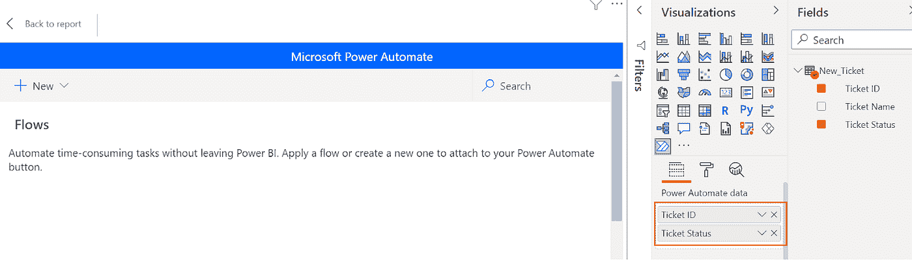

# 使用 Power Automate Visual 在 Power BI 中写回

> 原文：<https://medium.com/globant/write-back-in-power-bi-using-power-automate-visual-a8fae577c9c4?source=collection_archive---------2----------------------->

**简介**

[微软 Power BI](https://docs.microsoft.com/en-us/power-bi/fundamentals/power-bi-overview) 每个月都在为其用户增加新的趋势创新。2021 年 4 月，微软宣布了用于 Power BI 报告的 [Power Automate visual](https://powerbi.microsoft.com/en-us/blog/announcing-the-new-power-automate-visual-for-power-bi-reports/) ，该报告有助于 Power BI 与 Power Automate 及其流程集成，允许最终用户与另一批应用程序进行交互，如微软团队、SharePoint Online、Adobe PDF 服务、Twitter 等。

在本文中，我将向您展示如何使用 Power Automate visual 将数据从 Power BI 仪表板写回 SharePoint Excel 文件源(将数据从 Power BI 工具更新到原始源)。我假设您已经具备 Power BI 基础或中级知识，并且已经知道如何连接到 SharePoint Excel，以及如何将报告发布到 [Power BI 服务](https://powerbi.microsoft.com/en-us/)。我将介绍为我们的 Sharepoint Excel 数据源启用写回功能的所有步骤。

在我开始解释它是如何工作的之前，让我给你一些关于我从我的一个客户那里收到的需求的背景。

**问题陈述**

我为我的客户开发了一个非常好的仪表板，为他们的票务管理系统提供所有有意义的数据洞察。总体而言，他们对报告非常满意。但是，他们只能使用控制面板来计划和决策与底层数据相关的行动项目，而不能在 Power BI 控制面板上立即执行。如果他们想要更改任何票证的状态，他们需要打开另一个应用程序，这导致在应用程序之间切换多次。

现在是时候看看如何使用 Power Automate 在 Power BI 中实现写回了。

让我带你走一遍这个过程，解释每一步。

**流程总结**

1.  导入 Excel 和 Power Automate Visual
2.  配置即时云流量
3.  添加刷新数据集步骤
4.  发布并测试它

下面是 SharePoint 网站上提供的示例表，其中包含新的票证数据。

我们将从 Power BI 中的 Sharepoint 导入相同的 Excel 数据，并了解如何实现写回功能，以便最终用户可以使用 Power automate visual 从 Power BI 本身更改票证的状态。(我不会关注从 SharePoint 站点向 Power BI 导入数据，因为我们的主要关注点是 Power Automate visual)。

**第一步。导入 Excel 和 Power Automate Visual**

1.我们需要将 SharePoint Excel 数据导入 Power BI。

2.点击可视化部分下的三个点，并选择**获取更多视觉效果**选项，因为 Power Automate 在 [AppSource](https://appsource.microsoft.com/en-us/marketplace/apps?product=power-bi-visuals) 中作为自定义视觉效果提供。

3.在 [AppSource](https://appsource.microsoft.com/en-us/marketplace/apps?product=power-bi-visuals) ，搜索 Power Automate。自定义视觉效果列表中将提供 Power Automate(预览)。单击“添加”按钮，将其添加到可视化窗格。

4.一旦 Power Automate visual 被**导入**(一个弹出窗口会告诉你这已经发生了)，它将出现在**可视化部分**。

5.点击 Power Automate visual，将其添加到**可视化窗格**。

**第二步。配置即时云流量**

1.要开始流程，点击**更多**选项，并点击**编辑**。

2.将**票证 ID** 和**票证状态**拖放到**字段部分**中。

3.点击**新建**按钮选项，选择**即时云流**。

4.我们可以开始构建我们的流程，在这个流程中，我们可以看到已经添加了第一步。

5.点击**新步骤**按钮，搜索**更新一行**动作。

6.逐一填写**更新一行**动作中的所有必填字段。

7.我已经将我的 Excel 文件复制到 **SharePoint 站点- >文档**下。将 SharePoint 站点 URL 复制到**更新一行**活动下**位置部分**中的 URL 中的站点名称和 Past。

8.在**文档库**部分，选择**文档**。

9.在**文件**部分，选择文件**新票**。

10.在**工作台**部分，选择工作台 **New_Ticket** 。

11.在**键列**部分，选择表格字段**票证 ID** ，因为根据票证 ID 我们将更改状态。

12.在**键值**部分，插入参数 **Power BI Data Ticket ID** ，该参数可作为参数使用，因为我们从 Power BI 数据集中拖放了 **Power Automate Visual** 中的 **Ticket ID** 。一旦您添加此步骤，Power Automate 将自动添加循环步骤，因为**适用于每个**，因此如果我们试图更改多个票证的状态，我们可以一次完成。

13.一旦您在**键值**部分添加 **Power BI 数据标签 ID** ，Power Automate 将自动添加循环步骤**应用于每个**，这样，如果我们试图更改多个标签的状态，我们可以一次完成。

14.在票证**状态**部分，将数值设为**活动**。这意味着无论**票证 ID** 用户选择哪个，我们都会直接在源 Excel 文件中将**票证状态**更改为活动。

15.在我们添加流程中的最后一步之前，我们需要**将**流程重命名为**写回**并保存它。然后**将**我们的 **PBIX** 文件发布到[我的工作区**中的**](https://powerbi.microsoft.com/en-us/) **[Power BI service](https://powerbi.microsoft.com/en-us/) 中。**

**步骤三。添加刷新数据集步骤**

我们将添加一个新步骤，即**刷新数据集**，这样，一旦用户更新票证状态，我们就可以刷新我们的 Power BI 数据集。

1.与前面的步骤相同，我们将设置**新步骤**选项，并在流程结束时添加**刷新数据集**步骤。点击**保存并应用**。

2.返回**可视化窗格**并格式化 **Power Automate 可视化**并将按钮名称更改为**使**激活。

**第四步。发布&测试一下**

最后，经过我们在这里投入的所有努力，现在我们将能够看到它实际上是如何工作的。

1.我们差不多完成了，现在**保存&发布**报告到**我的工作区**。

2.转到 **Power BI Service** 并打开报告..https://app.powerbi.com/

3.点击**票证 ID = 3** 使其成为后端 Excel 中的活动票证，并刷新报告以查看它是否也确实更改了后端 Excel 中的票证状态。

4.点击**激活**按钮触发流程。

5.让我们首先在后端源 Excel 文件中检查 **ticket id =3** 的状态是否已经更改。

太好了！

6.它在后端 Excel 中已经改变，现在让我们看看它是否也在 **Power BI service** 中被改变

厉害！

它也在**T5**power bi 服务**中工作。**

我们还可以选择多个票证 id，并一次性更改它们的状态。

**结论**

借助这一新的 **Power Automate Visual** 集成，Power BI 用户现在可以通过 Power BI 接口本身进行回写，因此 Power BI 现在不仅是一个显示数据洞察力的分析工具，还能够根据用户操作更改底层数据。

在这篇博客中，我们首先看到了一个包含票务信息的报告，但是最终用户无法更新后端 Excel 数据。为了更新数据，我们使用 Power Automate visual，以便最终用户可以从 Power BI 本身更改票据的状态。