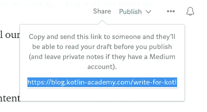

# 为 Kt 写作。学院

> 原文：<https://blog.kotlin-academy.com/write-for-kotlin-academy-abebd70937ce?source=collection_archive---------0----------------------->

卡帕头。学院是献给科特林的最大的出版物。目前，它已经:

*   超过 9600 名媒体用户，
*   我们的时事通讯上有超过 4500 封电子邮件；
*   Twitter 上大约有 3300 名粉丝(来自@MarcinMoskala 的推广)。

我们的使命是推广 Kotlin 并简化其学习。为了更好地完成这一使命，我们邀请您与我们一起撰写文章。

Image from [thewritinghole](http://thewritinghole.tumblr.com/)

# 为什么？

与我们合作将帮助你成长为一名作家。您将从我们这里获得:

*   推广我们的出版物和所有媒体，
*   关于文章的反馈，
*   文章内容的技术校对。

好的内容会帮助你成为更受欢迎和可靠的专家。有了良好的宣传和我们的支持，你的声音会被听到。你将能够在一项重要的事业中发言，或者宣传你所相信的重要观点。

# 什么？

卡帕头。Academy 致力于与 Kotlin 编程语言相关的材料。我们的读者对几种文章感兴趣:

*   探索科特林的特色。尤其是新的，像协程或 KAE 的新功能。
*   介绍 Kotlin 库以及它们如何帮助 Kotlin 项目。
*   制作多平台项目。特别是如果你将你的想法作为我们大规模多平台项目改进的例子，并在一篇文章中描述它。
*   科特林术语是我们从 Kt 开始就在描述的东西。学院。如果有其他 Kotlin 术语经常被错误使用，那么你可以写一篇关于它们的文章。你也可以自愿描述一个[计划条款](/kotlin-programmer-dictionary-2cb67fff1fe2)。
*   用 Kotlin 做更好东西的有趣方法。
*   还有什么我们在这里没有提到的，与科特林相关的，读者可能会感兴趣的。

如果你对你想写的文章有一些想法，你可以先问我们是否感兴趣。

# 怎么会？

你需要一个中型账户来写 KA。然后创造一个“新故事”，开始写作。在这篇文章被认为已经完成之前，这里有一个小的待办事项列表:

*   文章应该有图像。通过单击并按 Shift+F 将其设置为特色图像。它应该是您拍摄的照片或免费图像之一。或者，您可以添加一个描述，其中包含找到它的网站的链接。
*   重新检查和思考你的标题。让它有趣是非常重要的。
*   使用[检查文章的语法](https://app.grammarly.com/)(将内容复制粘贴到那里)。
*   使用[海明威编辑器](http://www.hemingwayapp.com/)检查你的文章。

完成后，点击屏幕顶部的“分享”按钮，复制链接。

发送此链接联系@kt.academy 或 marcinmoskala@gmail.com，告知您想要在 kt 上发表文章的信息。学院。我们会审核并回答您。

祝你写得好:)