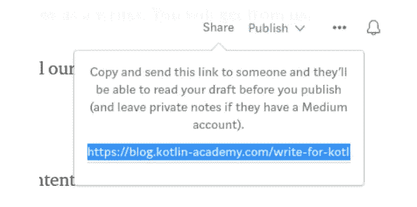

# 为我们写作！想要作者！

> 原文：<https://blog.kotlin-academy.com/write-for-us-authors-wanted-f195a59770d2?source=collection_archive---------0----------------------->

卡帕头。Academy 是公认的关于编程的出版物。

目前，它已经:

*   超过 10290 名媒体用户，
*   我们的时事通讯上有超过 4870 封电子邮件；
*   Twitter 上大约有 3500 名粉丝(加上来自 [@MarcinMoskala](https://twitter.com/marcinmoskala) 的推广——有超过 4860 名用户在关注他)。

你可能从关于 Kotlin 和 Android 的文章中知道我们，但我们也发布不同的主题。我们的使命是从总体上促进编程并简化其学习。为了更好地完成这一使命，我们邀请您与我们一起撰写文章。

# 为什么？

与我们合作将帮助你成长为一名作家。您将从我们这里获得:

*   推广我们的出版物和所有媒体，
*   关于文章的反馈，
*   文章内容的技术校对。

好的内容会帮助你成为更受欢迎和可靠的专家。有了良好的宣传和我们的支持，你的声音会被听到。你将能够在一项重要的事业中发言，或者宣传你所相信的重要观点。

# 什么？

不管您使用的是 Kotlin、Python、JavaScript、React 还是 TypeScript。也许你擅长测试、机器学习、Android 功能或其他主题。让我们知道！

如果你对你想写的文章有一些想法，你可以先问我们是否感兴趣。发邮件到 [contact@kt.academy](http://contact@kt.academy) 即可。

# 怎么会？

你需要一个中型账户来写 KA。然后创造一个“新故事”，开始写作。在这篇文章被认为已经完成之前，这里有一个小的待办事项列表:

*   文章应该有图像。通过单击并按 Shift+F 将其设置为特色图像。它应该是您拍摄的照片或免费图像之一。或者，您可以添加一个描述，其中包含找到它的网站的链接。
*   重新检查和思考你的标题。让它有趣是非常重要的。
*   使用[语法](https://app.grammarly.com/)检查文章的语法(将内容复制粘贴到那里)。
*   使用[海明威编辑器](http://www.hemingwayapp.com/)检查你的文章。

完成后，点击屏幕顶部的“分享”按钮，复制链接。

将此链接发送至 [contact@kt.academy](http://contact@kt.academy) ，告知您想要在 kt 上发表文章的信息。学院。我们会审核并回答您。

我们祝你写得好:)

