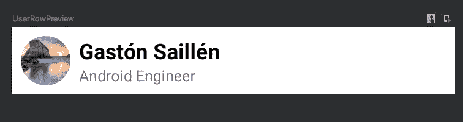

# 使用 Jetpack Compose 在一行代码中编写 RecyclerViews

> 原文：<https://medium.com/google-developer-experts/write-recyclerviews-in-one-line-of-code-with-jetpack-compose-82abdf0e8140?source=collection_archive---------2----------------------->

Image from : Linux: Changing the World One Line of Code at a Time

您是否曾经梦想过不需要处理 RecyclerView adapters 逻辑来显示一个简单的 UI 列表，而不需要适配器需要的所有样板代码？

请继续阅读，在这篇文章中，我们将发现 Jetpack Compose 的强大功能，只需一行代码就可以创建一个简单的用户列表。

自从 Jetpack Compose 的 alpha 版本在几周前发布以来，我开始了解它，并且很快就爱上了编写令人敬畏的 UI 组件的便利性。

在我们开始之前，我想介绍一下什么是 Jetpack Compose，正如文档中所述

> Jetpack Compose 是 Android 用于构建原生 UI 的现代工具包。它简化并加速了 Android 上的 UI 开发。借助更少的代码、强大的工具和直观的 Kotlin APIs，快速实现您的应用。

点击此链接，您可以阅读更多内容并了解 Jetpack Compose

来源:https://developer.android.com/jetpack/compose

# 该项目

现在，让我们构建一个简单的用户列表，其中包含用户照片、姓名和一些个人简介。

我们正在寻找一个类似这样的行

所以，让我们来建造它。

首先，我们将创建一个新的类，它将包含呈现用户列表所需的所有 UI 组件，在这里，我们将创建这些组件，它们将相互交互以呈现该视图。

如果你不熟悉 Jetpack Compose，我建议你遵循这个快速代码实验室 [Jetpack Compose 基础](https://codelabs.developers.google.com/codelabs/jetpack-compose-basics/#0)和[在 Jetpack Compose 中的布局](https://codelabs.developers.google.com/codelabs/jetpack-compose-layouts/index.html?index=..%2F..index#0)

# 构建行视图

在 Jetpack Compose 之前，我们在 XML 资源文件中构建这个组件，然后使用这个 XML 在 *onCreateViewHolder* 中展开这个视图，供以后在 onBindViewHolder 中使用。

现在有了 jetpack compose，我们不需要创建任何 XML 资源和任何将使用该组件的适配器，我们只需用 Kotlin 代码创建组件，如此而已。

我们将创建一个包含所有 UI 组件的类，如前所述，这个类将被命名为 **UserListScreen.kt**

# 定义行

要创建用户行，我们只需创建一个包含行、图像和列的 composable，这些放在一起将符合我们正在寻找的 UI，现在不需要理解 compose 是如何工作的，我们只需要将此函数注释为@Composable 并在其中调用 Composable 函数，其余的代码描述了它自己。

## 用户行

为了更好地理解，我已经将 UI 的不同部分分开了，但是正如我上面所说的，这个可组合的函数应该像这样返回给我们

这就是创建这个简单的行所需要的，我们只需将一个 **User** 对象和一个 **onUserClick** lambda 表达式作为这个函数的参数传递，它将处理点击，这是因为我们将从另一个可组合函数调用这个可组合函数来处理点击本身。

正如你所看到的，我们说过 UI 的可点击部分是整行，所以每次我们点击整行时，我们将使用被点击的**用户**对象启动这个 lambda 表达式，所以稍后，我们可以对它执行一些操作。

# 概观

现在，我们已经知道了如何显示列表中的每一项，以及如何管理这一行的单击，让我们在应该创建该列表的位置创建另一个可组合组件，现在，如果您想知道我们如何使用它，我们需要考虑声明一个 recycle view，为它附加一个适配器，编写适配器逻辑来处理数据列表，将行 UI 绑定到 viewHolder 方法，为 recycle view 设置一个布局管理器，所有这些都需要花费大量时间来呈现一个简单的列表。

# 喷气背包撰写救援

我们只需要显示使用 Jetpack Compose 的用户列表，现在，我们如何做到这一点，而不需要做你可能会问的所有上述步骤。

这个简单的代码就像这 5 行代码

嘿，等一下！！你告诉我只有一行代码！！

正如我在上面说过的，我们只是用一行代码用 LazyColumnFor 设置了一个垂直列表，这个可组合的函数获取一个项目列表(用户列表)，然后它调用我们在上面做的可组合的 UserRow 来在屏幕上垂直绘制每个用户行(因为是 Lazy **列** For)。

最后，我们在每一项的末尾添加了一个分隔线，这与我们需要应用于 RecyclerView 的**additemcodorator**相比只有一行。

# 包扎

因为这个例子使用了 ViewModel + LiveData，所以我将生成最后一个可组合的函数，它将负责把所有列表绘制到我们的 UI 中，注意上面的函数是如何私有的？我这样做是因为在 UserListScreen 中，我们将只公开将从我们的主线程调用的可组合函数来呈现该视图，所以我们只公开该视图的实际完整实现，而不是我们之前创建它时所做的所有可组合函数。

最后，在我们的 UI 线程(MainActivity 或 Fragment)中，我们调用这个可组合函数来显示我们的视图

为了本教程的简单性，我没有介绍如何实现 ViewModel，而是创建了一个存储库，其中包含了关于如何使用每个组件以及如何使用 LiveData 的 Jetpack Compose 示例

你可以在这里找到知识库

 [## gast sail/jet 示例

### 这是一个存储库，展示了如何通过例子创建 UI 的不同部分。

github.com](https://github.com/gastsail/JetExample) 

如果回购帮助了你，你可以在上面留下一个 [⭐ 【T1:)](https://emojipedia.org/star/)

# 重要的

由于我使用的是 1.0.0-alpha02 版本的 Compose，它可能取决于 API 的未来变化，我会尽量保持这篇文章是最新的，但是希望存储库也是最新的