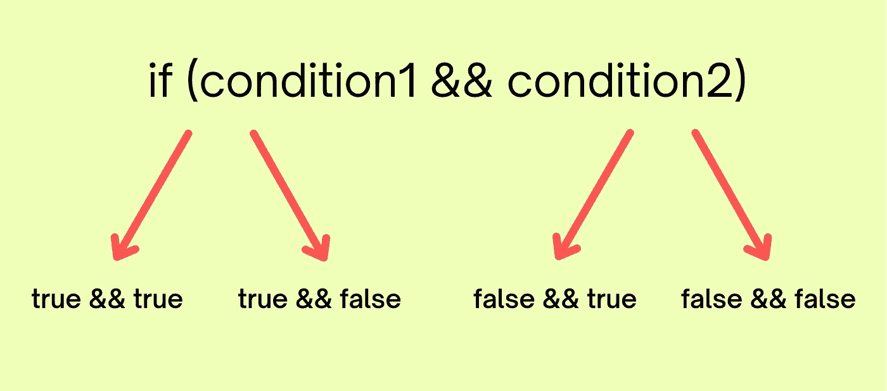

# 为所有遗漏的分支编写测试

> 原文：<https://blog.kotlin-academy.com/write-tests-for-all-your-missed-branches-3c74459ed512?source=collection_archive---------1----------------------->

在编写测试时，分支覆盖经常被忽略，但是如果你知道你的代码可以采用的所有路径，这将帮助你理解所有的边缘情况。在这篇博文中，您将了解如何识别缺失的分支，并为您的代码编写更好的测试。

让我们从基础开始。

## 什么是分行覆盖率？

> 分支覆盖率是一个度量标准，它表明代码库中的所有分支是否都经过了测试。“分支”是代码在决策语句——例如， **if** 语句——被评估后可能采取的执行路径之一。
> 
> 来源:https://linearb.io/blog/what-is-branch-coverage/

让我们从一个简单的例子开始，我们有一个基于`if`条件执行某些事情的方法

如果我们决定只为我们的方法编写下面的测试

该方法将具有 100%的代码覆盖率，因为该方法的所有行都是在运行测试时执行的，但是有一个缺失的分支，当`condition`为`false`时，我们没有添加测试。如果您添加另一个类似下面的测试，您将能够覆盖所有的分支。

现在，当我们的`if`条件变得有点复杂时，事情变得有点有趣了

你可能会想，如果你添加两个类似下面的测试，所有的分支都会被覆盖

但是如果你看过这个博客的封面图片，你会注意到实际上有 4 个分支。

*   `true && true`
*   `true && false`
*   `false && true`
*   `false && false`

您可以为您的代码编写以下测试，以实现 100%的分支覆盖率

现在让我们看另一个例子

在这个例子中，我们使用安全调用操作符(`?.`)。如果我们编写一个测试来检查`name`的值，我们将错过可以是`null`的分支。因此，每当我们使用安全调用操作符时，我们应该记住，它将创建两个分支，这两个分支都应该被测试。既然我们知道了这一点，我们的测试用例将会是这样的

即使您的测试已经覆盖了所有的分支，您也可以根据自己的理解添加更多的测试。在这篇博文中，我只强调了缺失的分支，但是可以编写更多的测试。我希望现在你对你的代码可以执行的所有路径/分支有了更好的理解，并且在编写单元测试时你会考虑这些边缘情况。

*如果您有反馈，请随时在* [*推特*](https://twitter.com/NikitBhandari) *上推文/发消息给我。*

 [## 尼基特·班达里

twitter.com/NikitBhandari](https://twitter.com/NikitBhandari) 

# 点击👏说“谢谢！”并帮助他人找到这篇文章。

了解卡帕头最新的重大新闻。学院，[订阅时事通讯](https://kotlin-academy.us17.list-manage.com/subscribe?u=5d3a48e1893758cb5be5c2919&id=d2ba84960a)，[观察 Twitter](https://twitter.com/ktdotacademy) 并在 Medium 上关注我们。

如果您需要 Kotlin 工作室，请查看我们如何帮助您: [kt.academy](https://kt.academy/) 。

