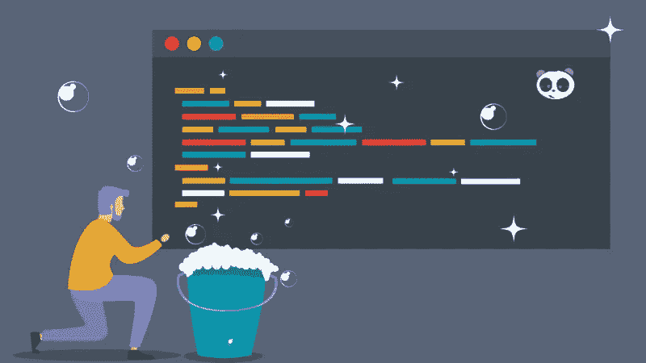
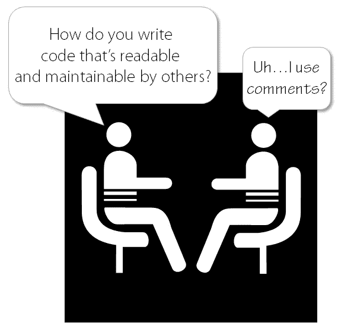
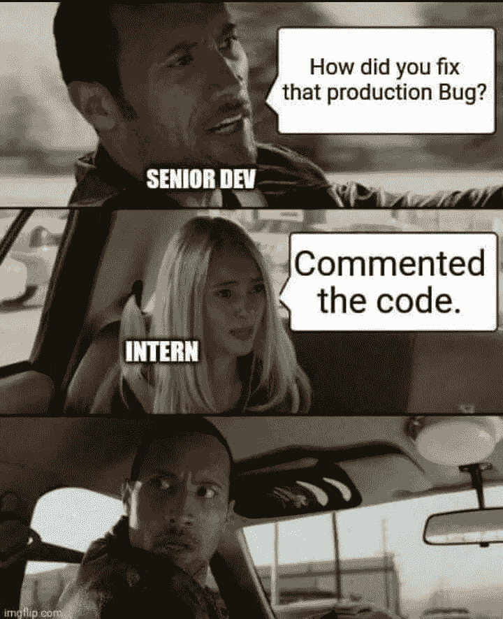
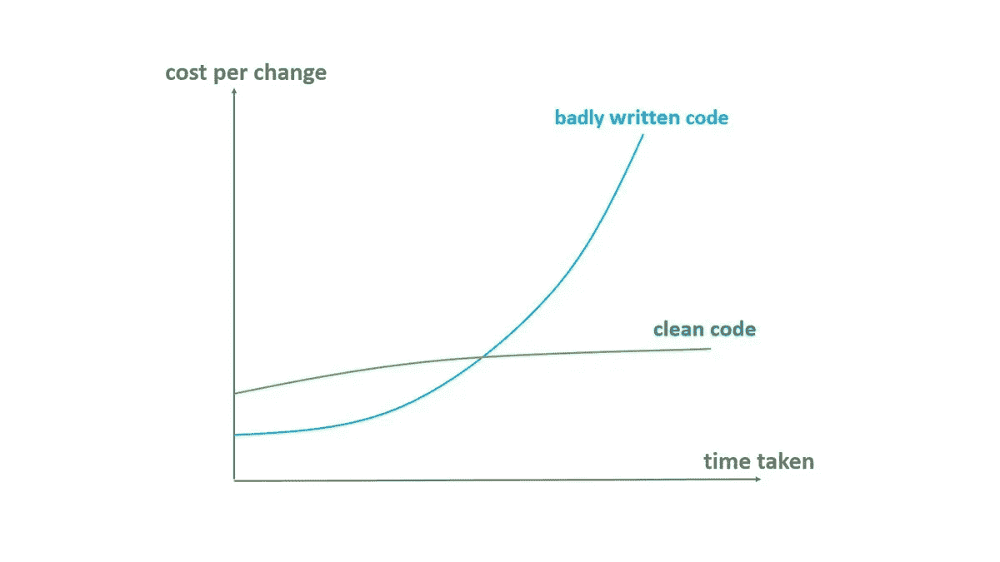

# 编写干净的代码及其重要性

> 原文：<https://medium.com/globant/writing-a-clean-code-and-why-it-matters-423f01b349?source=collection_archive---------2----------------------->



我经常遇到这样的问题:“干净的编码到底是什么？”，仅仅是使用适当的缩进、注释和代码重构吗？



嗯，肯定不止这些。所以，伙计们，在这篇文章中我们将讨论什么是干净的代码&为什么它在行业中如此重要。

先从**什么是干净代码说起。**

干净的代码就是写易于阅读、理解和修改的代码。无论读者是代码的原作者还是其他人，一个简单明了的代码减少了猜测的需要和潜在的误解。
代码应该遵循这些关键原则: **KISS** ，代表**K**eep**I**tS**S**tupid，以及 **DRY** ，**D**on t**R**EPE at**Y**yourself。问问自己，对于解决代码中的问题或复杂性，是否有更好的解决方案。
我们来解剖和阐述一下有利于代码干净的因素，比如:
**1。遵循正确的命名规则**

在命名一个变量、函数或类时，要记住它的用途，并使用描述性的、明确的名称。例如:

```
Dirty:
List<Integer> p = new ArrayList<Integer>() ;Clean:
List<Integer> prices = new ArrayList<Integer>() ;Dirty:
for (let i = 0; i <= 10; i++) {
	// do some thing
}

Clean:
const totalEmployees = 10;
for (let i = 0; i <= totalEmployees; i++) {
	// do some thing
}
```

在编写你的类的时候，用下面的准则来命名你的类

*   类别应该是名词，干净的:用户、帐户、产品
*   避免泛型类，因为它们会成为懒惰的开发人员可以利用的磁石，所以要具体。
    脏:实用程序，普通
    干净:付费实用程序

**命名方法要明确表达意图:** 方法名要把一切都说出来，而且多是动词，它要明确表达你的意图。

```
Dirty:
send();
insert();Clean:
sendEmail();
insertRegisteredEmployees();
```

**2。功能规则**

*   总是设法使它变小。不要把它做成一整块。如果你能把它分成独立的可重用的块，你应该总是这样做。
*   使函数参数尽可能少。

```
Dirty:
searchEmployee(String name, int age, int empId, String companyName, String position, String address);Clean:
searchEmployee(int empId);
```

*   使你的函数总是返回一致的类型。在任何情况下，您的函数都不应该返回不同的数据类型。

**3。避免缩写**

你需要避免缩写，因为它会产生歧义，使你的意图不明确，容易被误解。

```
Dirty:
regEmp();
calP();Clean:
registerEmployee();
calculateFinalPrice();
```

**4。使用棉绒检查**

大多数流行的编程语言在它们使用的流行 IDE 中都有 lint checkers。您还可以在您的特定项目上配置 lint。这些 lints 有助于避免一些小错误，如变量、类、方法命名、代码重复、缩进错误等。事先。确保以这样一种方式设置项目，当您将代码推送到 GitHub repo 时，它总是检查您的代码中是否有 lint 错误。

**5。编写代码注释**

这是一个程序员应该具备的基本美德之一。总是试着对你的代码进行注释，解释你的代码的意图。您应该避免注释掉代码并离开它。最好直接去掉。因为现在每个人都在使用 git，如果你需要的话，你可以很容易地查看历史和恢复你的代码。你不应该添加没有任何意义的不必要的评论。不要让你的评论变得多余，显然不要成为下面这样的人。



**6。遵循编码模式**

**干**:干代表“不要重复自己”。顾名思义，它不鼓励代码的重复。如果我们在项目中重复代码，如果有任何变化，我们将不得不在所有地方进行更改。

**KISS** : KISS 代表“保持简单，笨蛋”。如果你的代码简单易懂，那么它也很容易维护。毕竟编程语言更多的是要被我们人类理解，因为计算机只能理解 0 和 1。不要给你的代码带来不必要的复杂性。永远不要写一个让你在一个月后检查时挠头的代码。

YAGNI:YAGNI 代表“你不会需要它”。有时候，我们开发人员倾向于提前考虑事情，编写代码额外的特性，认为我们将来可能需要它们。你应该总是关注你现有的功能，而不是担心一些想象中的复杂功能，这些功能可能需要，也可能不需要，并且可能被删除或更改。

**实体设计原则:**这些是面向对象类设计的五个原则。它们是设计类结构时要遵循的一组规则和最佳实践。
在实心首字母缩写词之后，它们是:

*   单一责任原则
*   笔闭合原理
*   **L** 伊斯科夫替代原理
*   **I** 界面偏析原理
*   **D** 依赖反转原理

7。 **隐式和非显式比较布尔值**

最好含蓄地比较一下你的布尔，干巴巴的，我们举这两个例子:

*脏显比较:*

```
if (employeeRegistered == true ) {// do something }
```

*干净的隐式比较:*

```
if (employeeRegistered) {// do something }
```

隐式比较代码更少，在某种意义上更直观，当您或其他开发人员阅读它时。

**同样隐式赋值布尔值:** *脏:*

```
boolean goingToSchool ;if ( totalStudents > 20 ) { goingToSchool = true;
} else {goingToSchool = false;
}
```

*清洁:*

```
boolean goingToSchool = totalStudents > 20;
```

现在，这读起来像一个演讲“如果学生总数大于 20，我就去上学”并且有更少的行，你也没有一个单独的行用于初始化。

**8。** **避开神奇的数字！**

正如我们之前提到的，理解程序员的原始意图非常重要，当你有你只理解的幻数时，其他开发人员很难知道你的意图。举个例子:

*脏:*

```
if (age >= 18) {// do something }
```

18 是一个神奇的数字，您可能已经**猜到了**它，但是我们不希望您猜到它，我们希望您确信这是我们的意图，这里有一个更好的实现:

*清洁:*

```
int VOTING_AGE = 18;
if (age >= VOTING_AGE ) {// do something }
```

**9。错误处理**

错误处理是编程的一个重要部分。你不应该偷懒去处理错误。如果您实现了适当的错误处理，您的代码将继续运行而不会崩溃。一个未处理的错误会导致您的程序崩溃，最终用户丢失他们的工作，如果它支持堆栈跟踪错误，它甚至可以释放一些与您的项目或服务器相关的重要信息。

**10。实践*测试驱动开发***

[*测试驱动开发*](https://www.browserstack.com/guide/what-is-test-driven-development) 是一种敏捷实践，它要求程序员编写一个最初失败的自动化测试用例，定义期望的改进或功能。这个软件开发过程需要一个非常短但重复的开发周期，产生最少量的代码来通过测试。最后，它允许开发人员根据可接受的标准重构新代码。

为了应用 TDD，通常遵循以下步骤:

*   添加测试
*   运行所有测试，看看新的测试是否失败
*   写一些代码
*   运行测试
*   重构代码
*   重复

除了上面的这些步骤，你还可以通过确保你遵循了上面的要点来自我检查你自己的代码，从而进一步提高你的代码质量。总是重访你的代码，检查你是否能进一步优化它。请你的其他团队成员审查你的代码，并作为他们的反馈。因为你永远不想从别人那里得到伤害性的评论，所以当你检查你的团队成员的代码时，一定要给他们积极的反馈。不要一行一行地检查小错误，一定要使用 lint checkers 来自动化这些过程。

# 为什么重要？

软件行业中不可否认的一个事实是“**改变**”(不管你使用的是哪种编程语言、平台和框架)。

如果系统中的一个小的变更请求或者一个小的功能添加导致了现有代码的部分或者全部的重构，那么这个代码就不能被认为是“干净的”。

不同的人对现有代码块的频繁修改最终会违反一般的干净编码原则，并最终迫使您用新的设计重写整个代码。例如，频繁的修改通常会导致代码冗余、旧的误导性注释(在后续修改后不会更新)以及冗长的功能(很容易被分成多个逻辑块)。

本质上，代码必须遵循基本的设计原则以及其他通用的干净编码原则，以便支持业务需求的未来变化。



## 干净代码的好处是什么？

*   创建易于维护和扩展的代码
*   易于调试和重构
*   最终，你会写出牢不可破的代码
*   首先，编写干净的代码可能会耗费你的时间，但是最终你在维护上花费的时间会更少
*   其他人会更容易理解这一点。
*   测试起来会更容易。
*   会更容易保护。

```
*Clean code always looks like it was written by someone who cares. There is nothing obvious you can do to make it better. - Michael Feathers*
```