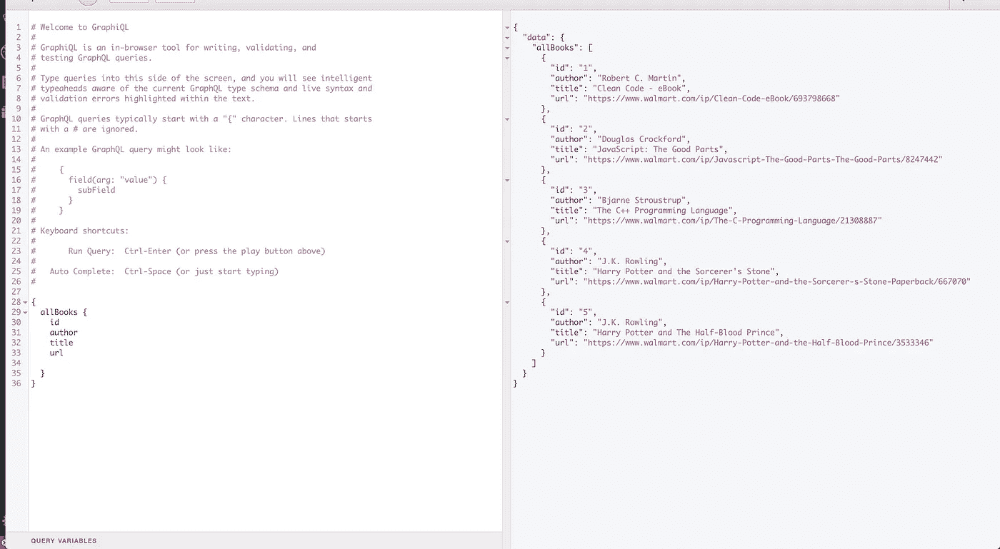

# 使用 Vanilla JS 使用 GraphQL

> 原文：<https://medium.com/walmartglobaltech/writing-a-graphql-client-in-vanilla-js-d2a09aee7c6c?source=collection_archive---------0----------------------->

GraphQL 是近年来出现的最令人兴奋的新技术之一。对于开发人员来说，它是一个很好的工具，可以控制他们从 API 中需要的数据。GraphQL 背后的基本思想是

> `得到你所需要的，不多不少'

这个概念有助于使您的 API 负载最小化，并帮助开发人员请求他们在应用程序中需要的数据，而不是由服务器驱动。

现在，假设我们正在编写一个 web 应用程序，它从 GraphQL 端点获取数据，并使用它来呈现网页。你想到的第一个解决方案是什么？

`npm i <popular-graphql-client-library>`？

现在，在你膨胀你的`node_modules`文件夹之前，想想你的用例。你真的想交图书馆税吗？尤其是如果你能在没有任何外部依赖的情况下解决你的问题？

尽管存在使用像 Apollo 或 Relay 这样的库的有效案例，但它们不一定是与 GraphQL API 通信的首选解决方案。使用普通的 JavaScript 特性，如 fetch、promises 和 string 模板，可以简化轻量级 GraphQL 客户端的编写。一些示例场景可能是构建一个具有最小依赖性的瘦客户机，或者构建一个原型解决方案。

让我们构建一个可以与 GraphQL API 通信并搜索书名的简单表单。我们将只使用 HTML5、CSS3 和 ES6 JavaScript。

首先，我有一个运行在`localhost:3000`上的 GraphQL 服务器，它返回五本书的列表。



我有一个简单的 HTML 页面，有一些样式


现在，在我们的`script.js`文件中，我们将选择表单并添加一个事件监听器。

```
const bookContainer = document.querySelector("#book-container");
const form = document.querySelector("#book-search");const loadBooks = (ev) => {
  ev.preventDefault();
}form.addEventListener("submit", loadBooks)
```

`loadBooks`函数将使用本地获取调用 GraphQL API。但在此之前，让我们添加一个函数来构造查询。

```
const getBooksQuery = keyword => `{ allBooks(filter: { q:"${keyword}"}) { author title url } }`;
```

我们的查询构建器函数返回一个字符串，该字符串将按关键字搜索书名并返回一个匹配列表。我们通过在查询中使用过滤器来实现这一点。因为我们只对作者信息、书名和呈现图书列表的 URL 感兴趣，所以我们只从 GraphQL 服务器请求这些字段。这就是 GraphQL 如何帮助我们只获取我们需要的数据。

我们将在提交处理程序中充实对服务器的调用。

首先，我们从输入表单中获取搜索关键字值，并创建一个`options`对象来发送 POST 请求。我们将关键字传递给查询构建器函数，并获取需要传递回 GraphQL API 的查询字符串。我们添加了一个`renderBooks`方法，它将在一个简单的卡片视图中显示图书列表。

这是它完整的样子。

最终结果:


其他一些可以处理的用例有:

*   使用片段——我们可以让函数以片段的形式返回字符串，并根据需要简单地将其添加到主查询中。
*   多个查询—每个查询都可以写成自己的函数。

仅此而已。现在，您可以与 GraphQL 服务器通信，并尽可能减少客户端代码，实现零依赖性。前进，建造令人敬畏的东西！