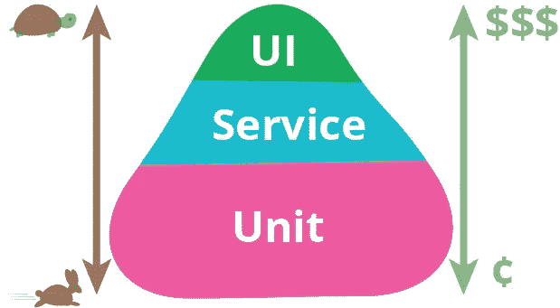

# 编写快速、确定和准确的 Android 集成测试

> 原文：<https://medium.com/airbnb-engineering/writing-fast-deterministic-and-accurate-android-integration-tests-c56811bd14e2?source=collection_archive---------1----------------------->

## OkReplay 简介——在测试中记录和重放 OkHttp 网络交互。

在 Airbnb，运送高质量的产品至关重要。为了实现这个目标，我们使用自动化测试在错误到达用户之前捕捉它们。在这篇文章中，我们将描述我们如何使用一种特定类型的自动化测试，UI 测试，来确保我们的 Android 应用程序的质量，并将宣布开源发布 [OkReplay](https://github.com/airbnb/okreplay) 。

我们对 Android UI 测试的选择是 [Espresso](https://google.github.io/android-testing-support-library/docs/espresso/) ，它可以说是最好的、最受欢迎的和推荐的用于编写集成测试的库。然而，可靠的测试套件所提供的额外信心可能会很快受到奇怪测试的影响，破坏每个人对它们的信任。事实上，[片石试验是毒药！](https://youtu.be/_5Sr4EYH7M8?t=9m34s)

集成测试在[测试金字塔](https://martinfowler.com/bliki/TestPyramid.html)的最顶端，但这并不意味着它们必须写得慢、脆弱或昂贵。它们应该由更大范围的服务和单元级测试来补充。

[Martin Fowler’s Test Pyramid](https://martinfowler.com/bliki/TestPyramid.html)

作为服务层测试的一个例子，我们可以构建一组 API 来提供测试夹具，这些夹具可以构建在测试执行期间使用的假域模型(例如:Ruby 的 [FactoryGirl](https://github.com/thoughtbot/factory_girl) 和 [Forgery](https://github.com/sevenwire/forgery) )。

回到 UI 测试，严重依赖网络的流程(例如:通常执行许多 API 请求)在测试执行期间经常受到网络不稳定性的影响。这是通过高翻转率观察到的，也就是说，在调用之间，测试从失败切换到成功的速率，反之亦然。暴露这种缺陷的方法之一是安排测试每小时运行一次，例如，有或没有代码变化，以测量它们的稳定性。基于我们的发现，我们开始研究如何从这个等式中去除网络变量。我们中的一些人熟悉令人敬畏的 VCR 库，它在 Ruby/Rails 中很流行，但是在 Android 中似乎没有类似的东西。于是 OkReplay 诞生了。

因为所有的 Airbnb 网络流量都通过 OkHttp，所以创建一个[拦截器](https://github.com/square/okhttp/wiki/Interceptors)来进行网络记录和回放似乎是最简单的方法。拦截器非常强大，可以根据需要修改网络调用，这正是我们所需要的。在寻找类似的解决方案时，我们还发现了令人敬畏的 [Betamax](https://github.com/betamaxteam/betamax) 项目，该项目旨在解决一个非常类似的问题，但在设计时并没有考虑 Android 或 OkHttp。不管怎样，由于那个项目的大部分目标与我们的需求相似，我们决定从它的代码库着手，并根据需要进行修改，以确保它对 Android 和 OkHttp 友好。其中一些目标是:

1.  与现有测试无缝集成
2.  对生产没有影响，也不会改变应用行为。它应该在测试过程中明确启用
3.  很少或没有对第三方库的依赖
4.  适用于 OkHttp、JUnit 和 Espresso
5.  记录的交互应该易于阅读、修改并提交给源代码控制
6.  不需要运行外部服务或代理就可以工作

Betamax 检查了几乎所有的箱子，除了 4 号和 6 号。另一个选项是 [Wiremock](http://wiremock.org/docs/record-playback/) ，但是它不满足第 6 项。幸运的是，扩展 Betamax 非常简单，因为它有令人敬畏的模块化架构和测试覆盖面。此外，有了明确定义的约束，特别是对 OkHttp 的硬依赖，允许我们构建一个更简单的解决方案，因为我们不需要为每个 Http 客户端解决它！

## 在后台

简而言之，OkReplay 归结为一个简单的 OkHttp 拦截器，当打开时，它会查看每个传出的请求，或者将它们与一组预先记录的“网络交互”进行匹配并重放它们，或者在网络响应一下来就捕获网络响应并保存它们。这些录音被称为“磁带”。这个术语是从 VCR 继承来的，在 VCR 中，磁带是以 [YAML 格式](http://yaml.org/)存储网络交互的简单文件。您可以将这些文件视为简单的测试装置。

对于 Android Espresso 测试，磁带默认存储在`src/androidTest/assets/tapes`中，并在测试执行期间使用 Android 的`AssetManager`作为常规资产加载(读取)。对于记录(写入)，它们存储在设备的外部存储目录中，并在测试执行后使用 OkReplay 自带的简单 Gradle 插件自动从设备中取出。发生这种区别是因为测试 APK 不能在运行时覆盖它自己的包内容来修改 YAML 资产文件，所以我们唯一的选择是把它写到外部存储器，并使用 Gradle 插件覆盖文件。磁带应易于阅读，并可根据需要进行修改。

Sample OkReplay tape

OkReplay 还有一些其他的关键因素。首先是`Recorder`，它由一个 JUnit `TestRule`组成，负责加载适当的测试磁带，启动和停止拦截器，并在测试完成后写入磁带文件。第二，`TapeLoader`，顾名思义，加载和写入(YAML)磁带文件。最后是`MatchRules`，它定义了基于一组预定义的内置规则或基于每个应用程序特定需求的定制逻辑来匹配请求的方法。

## 使用确定重放

使用 OkReplay 就像用`@OkReplay`注释测试方法一样简单，例如:

注释允许您选择性地指定一些配置选项，如磁带名、`TapeMode`和`MatchRules`。

在使用之前，您需要将`OkReplayInterceptor`添加到您的`OkHttpClient`实例中，并注册 OkReplay JUnit `TestRule`:

Setting up the TestRule

就是这样！使用 OkHttp 运行`testFoo()`时发出的任何网络请求将立即自动通过 OkReplay。默认情况下，`TestMode`是`READ_ONLY`，这意味着它会拒绝任何请求，直到您为它们录制了磁带。在这种情况下，在查看设备的 Logcat 输出时，您会看到如下所示的错误消息:

Error message on Logcat

运行时，默认情况下，OkReplay 不允许任何网络请求访问网络，除非`TapeMode`是“可写的”(无论是`READ_WRITE`还是`WRITE_ONLY`)。这是为了确保测试的可重复性和确定性。

一旦您记录了所有的交互，您甚至可以在设备处于飞行模式时运行您的测试，并且仍然可以看到它们正常工作，假设您没有任何其他对网络的硬依赖。

最后，由于 OkReplay 是一个只在测试时使用的库，您可以使用它的`no-op`变体作为`releaseCompile`依赖项，以确保您的发布应用程序附带了 OkReplayInterceptor 的存根版本。

## 结论

通过开源这个库并与更广泛的 Android 社区共享，我们希望激励开发人员编写更多的测试并更自信地发布高质量的应用程序！

一如既往，随时[叉它](https://github.com/airbnb/okreplay)，给我们发送反馈，错误报告和拉请求。如果你想加入我们，为像这样有趣的挑战寻找更多创造性的解决方案，[我们正在招聘](https://www.airbnb.com/careers/departments/position/2281)！😃