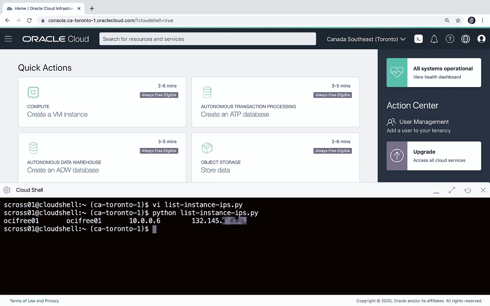

# 编写从 OCI 控制台云外壳运行的 Python 脚本

> 原文：<https://medium.com/oracledevs/writing-python-scripts-to-run-from-the-oci-console-cloud-shell-a0be1091384c?source=collection_archive---------2----------------------->

这篇文章的部分灵感来自 Reddit 上的一个[问题，询问如何列出所有 **Oracle 云基础设施**实例及其 IP 地址。](https://www.reddit.com/r/oraclecloud/comments/fx26qf/q_how_can_i_make_a_list_of_instances_plus_ip/)

一种方法是使用一个简单的 Python 脚本和**OCI**[**Python-SDK**](https://docs.cloud.oracle.com/en-us/iaas/Content/API/SDKDocs/pythonsdk.htm)，但是我也想找到一种方法从 OCI 控制台直接在 [**云外壳**](https://docs.cloud.oracle.com/en-us/iaas/Content/API/Concepts/cloudshellintro.htm) 中运行它，以最小化运行脚本所需的任何额外设置。

当您从 OCI 控制台启动**云外壳**时，会为您提供一个终端环境，其中预装了许多常用工具和实用程序，包括 OCI CLI 和 Python SDK。

当编写在云 shell 中运行的 Python 脚本时，我们可以利用 shell 现有的身份验证，避免在从外部环境执行脚本时通常需要手动配置单独 API 密钥的步骤。为此，我们在 shell 中加载现有的实例原则委托令牌，以创建 API 请求签名者。

```
#!/usr/bin/env pythonimport oci**# get the cloud shell delegated authentication token**
delegation_token = open('/etc/oci/delegation_token', 'r').read()**# create the api request signer**
signer = oci.auth.signers.InstancePrincipalsDelegationTokenSigner(
   delegation_token=delegation_token
)
```

然后使用`**signer**`创建一个经过验证的客户端，传递一个空字典来代替常规的`config`设置，例如创建搜索客户端:

```
**# create an authenticated api client** search_client = oci.resource_search.ResourceSearchClient(
   config={}, 
   signer=signer
)
```

使用这个搜索客户端，我们现在可以搜索当前区域中的所有实例。

*提示:如果您需要定位默认家庭区域之外的其他区域，您可以设置* `*config={"region":"ca-toronto-1"}*`

```
**# search for all instances**
resp = search_client.search_resources(
  oci.resource_search.models.StructuredSearchDetails(
    type="Structured",
    query="query instance resources"
  )
)
```

为了查询关于实例的更多详细信息并获得 IP 地址，我们需要两个额外的 API 客户机用于计算和网络资源。

```
compute_client = oci.core.ComputeClient({},signer=signer)
network_client = oci.core.VirtualNetworkClient({},signer=signer)
```

最后，为了获得每个实例的 IP 地址，我们查询该实例的所有 vnic 附件，然后对于每个 vnic，我们可以输出其公共和私有 IP 地址。

```
for instance in resp.data.items:
 **# for each instance get its vnic attachments**  resp = compute_client.list_vnic_attachments(
    compartment_id=instance.compartment_id,
    instance_id=instance.identifier
  ) for vnic_attachment in resp.data:
    **# for each vnic get the vnic details**
    vnic = network_client.get_vnic(vnic_attachment.vnic_id).data
 **# print tab separated list of instances and ips**
    print("\t".join([
      instance.display_name, 
      vnic.display_name,
      vnic.private_ip,
      vnic.public_ip
    ]))
```

下面是完整的脚本，您可以在您的云 shell 终端窗口中将其复制到一个`list-instance-ips.py`文件中。

```
#!/usr/bin/env pythonimport ocidelegation_token = open('/etc/oci/delegation_token', 'r').read()
signer = oci.auth.signers.InstancePrincipalsDelegationTokenSigner(
   delegation_token=delegation_token
)search_client = oci.resource_search.ResourceSearchClient({},signer=signer)
compute_client = oci.core.ComputeClient({},signer=signer)
network_client = oci.core.VirtualNetworkClient({},signer=signer)resp = search_client.search_resources(
  oci.resource_search.models.StructuredSearchDetails(
    type="Structured",
    query="query instance resources"
  )
)for instance in resp.data.items:
  resp = compute_client.list_vnic_attachments(
    compartment_id=instance.compartment_id,
    instance_id=instance.identifier
  ) for vnic_attachment in resp.data:
    vnic = network_client.get_vnic(vnic_attachment.vnic_id).data
    print("\t".join([
      instance.display_name, 
      vnic.display_name,
      vnic.private_ip,
      vnic.public_ip
    ]))
```

这是运行脚本的一个例子。我目前只有一个实例在我的自由层帐户中运行，所以输出并不特别有趣，但是您已经明白了。



# 更多信息

*   OCI [Python-SDK](https://docs.cloud.oracle.com/en-us/iaas/Content/API/SDKDocs/pythonsdk.htm)
*   [云壳](https://docs.cloud.oracle.com/en-us/iaas/Content/API/Concepts/cloudshellintro.htm)
*   [实例原则——从实例中调用服务](https://docs.cloud.oracle.com/en-us/iaas/Content/Identity/Tasks/callingservicesfrominstances.htm#ConfiguringtheSDKCLIorTerraform)

*注意——自由级用户可能会体验到其帐户所含服务的变化。*