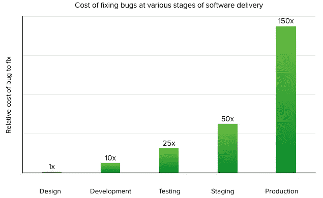
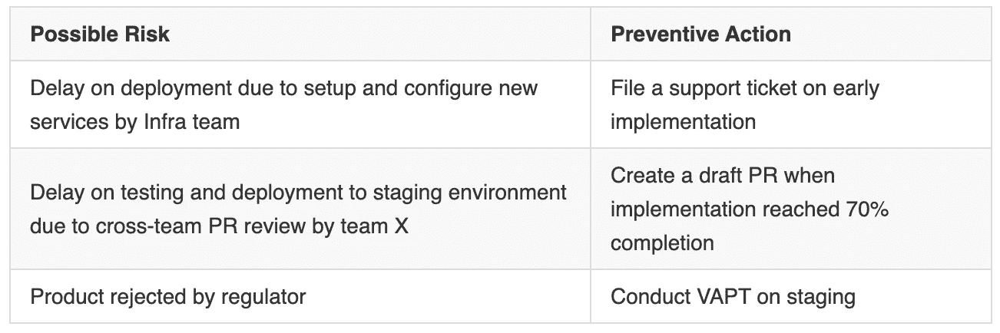

# 撰写技术规范，以及为什么它很重要

> 原文：<https://medium.easyread.co/writing-technical-specification-and-why-it-matters-b9ea78fbeb49?source=collection_archive---------0----------------------->

技术规范(或技术规范)将你从未知和向各方反复解释中拯救出来

Photo by [Startup Stock Photos](https://www.pexels.com/@startup-stock-photos?utm_content=attributionCopyText&utm_medium=referral&utm_source=pexels) from [Pexels](https://www.pexels.com/photo/writing-notes-idea-class-7103/?utm_content=attributionCopyText&utm_medium=referral&utm_source=pexels)

# 为什么是技术规格？

想象一下，如果您在收到项目需求后立即开始编码，您将要么在实现过程中反复更改设计，交付一个有问题的产品，要么甚至跳回到您开始的地方，因为结果“不是预期的”。更糟糕的是，如果你凭直觉给了一个承诺，然后你发现截止日期太早了，或者预算不够。

Chart picture by [Raygun](https://raygun.com/blog/massively-reduce-the-cost-of-bugs-with-raygun-error-tracking/)

还记得上面的图表吗？我相信你在某处以某种形式看到了它。基本上就是说“越早发现越便宜”。这同样适用于设计变更。

对我来说，技术规范是一份概述我们如何解决技术问题以实现目标的文件。通常，该文档在实施之前将由高级工程师或领导编写。

此外，以下是编写技术规范的好处:

*   **了解未知**，当你分解所有工作时，你会意识到可能的阻碍、潜在的性能问题、遗漏的东西(比如安全批准，或者你只是忘记更新特定的脚本)、可能的风险等等
*   **文档**，技术规范可以在任何需要的时候重新审查，例如在审计时(也可以作为决策/设计日志)
*   **工作共识**，获得技术规范评审人员的批准，意味着他们已经同意了这个解决方案
*   **减少向各方解释的工作量**，当你需要向团队成员或其他团队解释工作时，你可以随时带上这份技术说明书，让他们更容易理解
*   **更好的任务分配**，团队可以很容易地理解将要完成的工作，并对工作充满信心，因为技术规范已经得到所需各方的同意
*   **更快的开发和更好的质量**，事情都准备好了，团队知道在执行之前要做什么
*   **更好的估计，**因为你知道该怎么做
*   **更便宜的失败，**因为设计变更和 bug 会更早被检测出来

# 先决条件

需求是软件开发的核心，所以要确保需求清晰，你理解正确。我建议你把它写在一个文件里(如果没有的话)，并和你的项目经理或利益相关者就此达成一致。此外，我建议你查阅 SWEBOK 的“软件需求”部分，以更好地理解这个主题。

# 建议的格式

根据我的经验，下面的格式是最理想的技术规范格式，但是你可以根据你的要求随意修改，因为不同的上下文可能需要不同的处理。

## 头

*   **作者**，技术规范的作者姓名
*   **审核人**，技术规范的审核人姓名
*   **状态**，为`stable`或`draft`(默认)，设定读者的期望

## 目录

便于读者浏览文档。

## 介绍

*   **业务需求**，可以是相关需求文档的链接和故事/史诗链接。这是你的技术规格的目标，所以把它写出来真的很重要
*   术语表，任何与特定领域相关的术语，或者不是每个人都知道的术语

## 解决办法

*   **技术决策**，描述你为什么选择这个技术决策，包括概念证明、性能影响等
*   **实施**，描述当前状态和建议的变更，这些变更必须根据所做的技术决策来满足要求
*   **衡量标准**，工作的成功衡量标准列表，或者它可以是已完成的定义列表
*   **可能的风险**，任何可能损害/阻碍本解决方案的事情。建议包括这些组成部分:`Possible Risk`(什么是风险)、`Preventive Action`(可以采取的防止或降低风险的行动)。例如:

## 计划

*   **测试计划**，如何测试工作
*   **发布计划**(通常是清单)，如何将工作发布到生产，建议包括这些组件:`Who`(谁来做)，`Action`(要做什么)
*   **回滚计划，**作为出问题时的应急计划。建议包括这些组件:`Fail Type`(例如，部署错误、测试失败、SQL 错误)、`Scenario`(例如，无法执行迁移脚本)、`Solution`(例如，if this then that，if that then this)、`Appendix`(例如，清除迁移失败导致的损坏数据的脚本)

## 支持资源

任何能够支持技术规范的相关资源。

# 快到了！

记得让相关方审查你的技术规范，反复改进文档直到达成一致。然后，您可以将技术规格状态更改为`Stable`，并将工作分配给团队成员。

# 结论

在开发周期的早期，编写技术规范需要额外的努力。但是，从长远来看，这些好处是值得的。不过如果你还是怀疑或者不习惯，可以试着写在你项目的一两个史诗里，看看效果如何。此外，我还推荐你阅读[这篇文章](https://stackoverflow.blog/2020/04/06/a-practical-guide-to-writing-technical-specs/)来拓宽你的知识面。