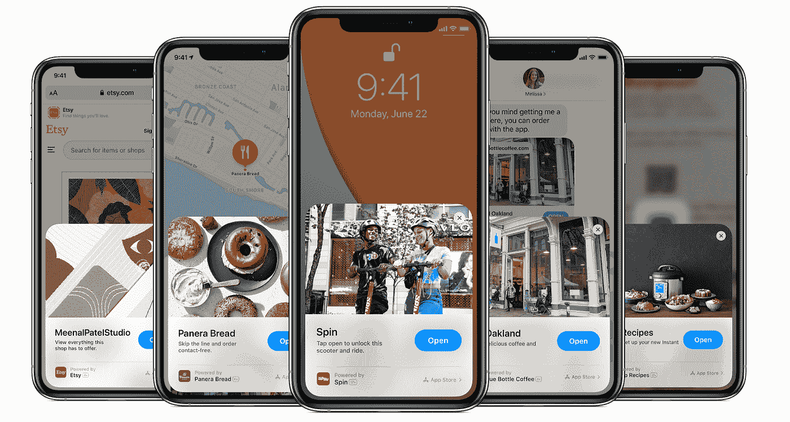
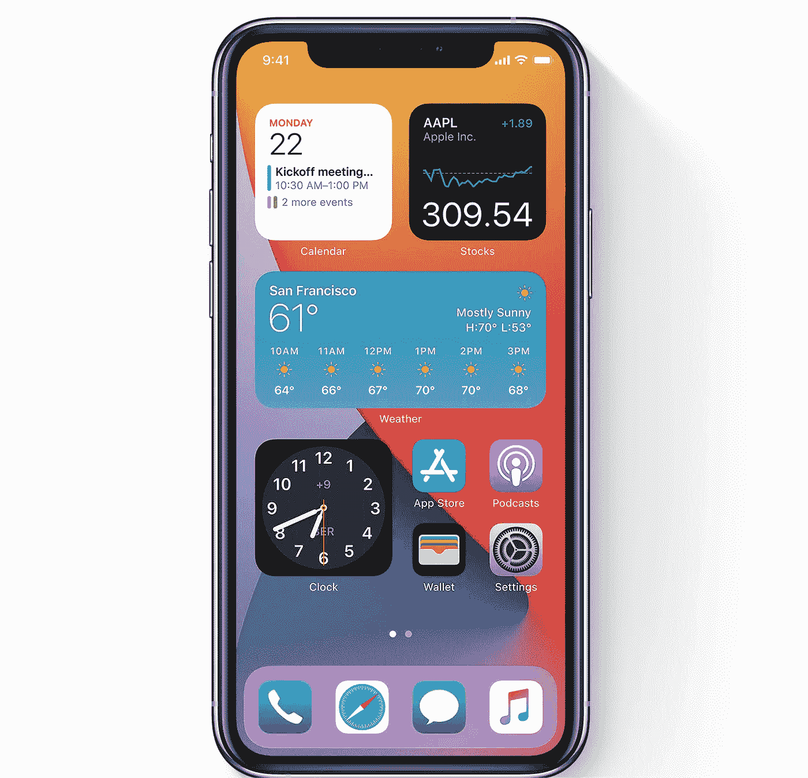
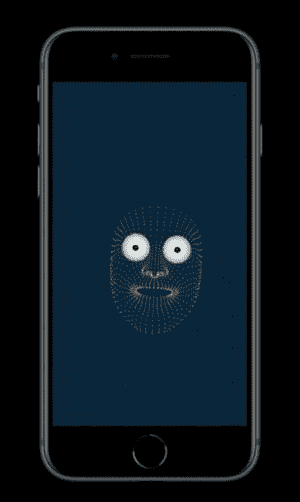
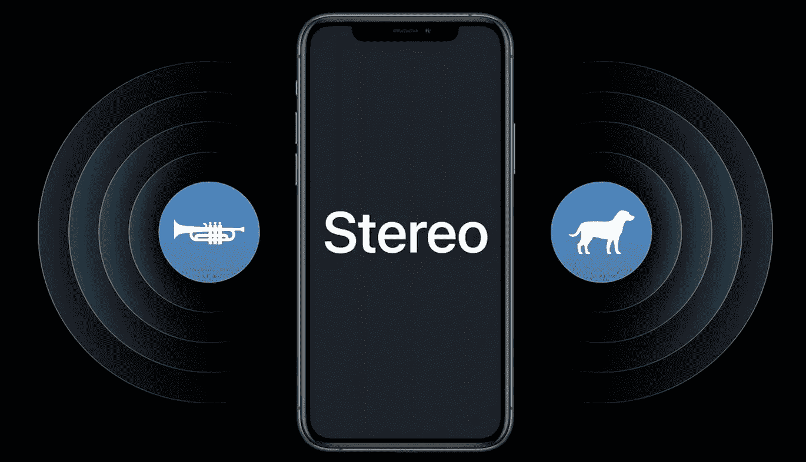
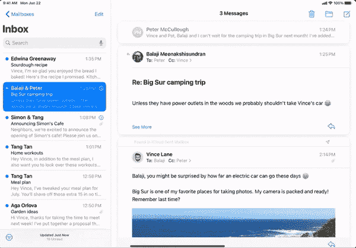
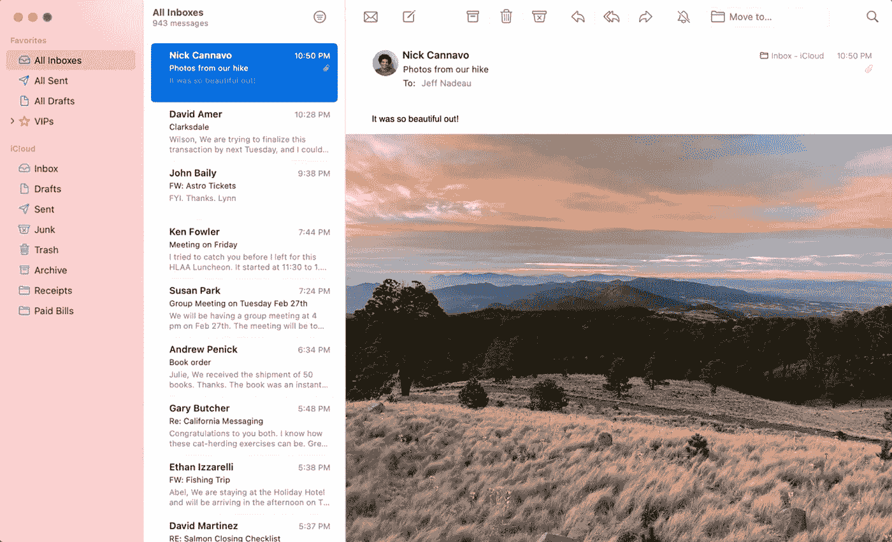
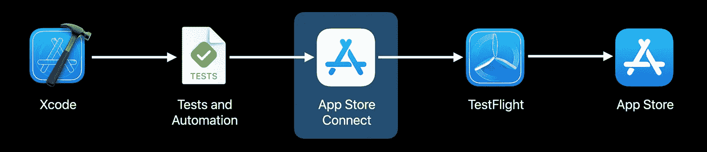
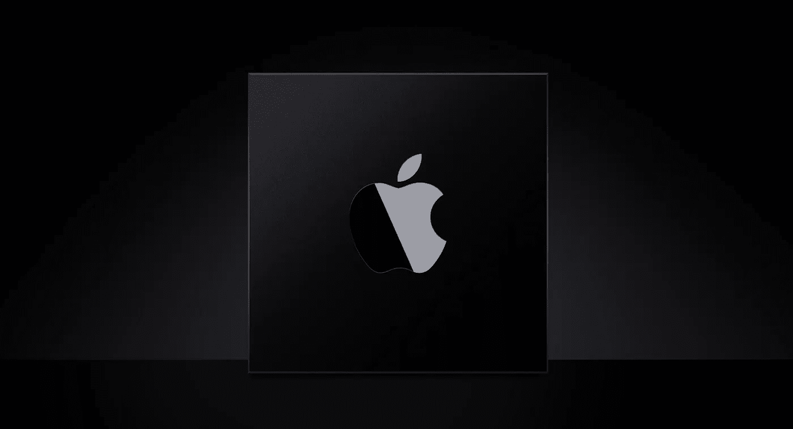

# WWDC 2020:从开发者的角度看🧐

> 原文：<https://medium.com/globant/wwdc-2020-announcement-view-from-a-developers-eye-c94770e85b09?source=collection_archive---------7----------------------->

From Developer’s point of view

在 WWDC-2020 主题活动中，苹果宣布了 iOS-14、iPadOS-14、watchOS-7 和 macOS-Big Sur (version-11)的许多酷功能，这些功能对消费者来说非常迷人和令人兴奋。

看看各自操作系统将提供的新功能。

*   [iOS 14 预览版](https://www.apple.com/ios/ios-14-preview/)
*   [iPadOS 预览](https://www.apple.com/ipados/ipados-preview/)
*   [macOS Big Sur 预告](https://www.apple.com/macos/big-sur-preview/)
*   [watchOS 7 预览版](https://www.apple.com/watchos/watchos-preview/)

> 我研究了苹果公司公开发布的内容，并从中获得了帮助，从而创作了这篇文章。

作为一名开发者，让我们看一看我们可以开始探索的所有有趣的 API，并为适应苹果操作系统新版本提供的新 API 而努力。

# 应用程序剪辑(iOS 14 以上版本)

应用程序剪辑是应用程序的一小部分，它可以在 Xcode-12 项目中使用 iOS-14 SDK 作为完整的应用程序来开发。由于它很小(大约 10 MB)，即使它不在设备上，应用程序剪辑也可以快速打开。当您准备好提交审核时，您将在 App Store Connect 中将其作为完整应用的一部分进行管理。

Source: Apple

用户将能够在几秒钟内从您的应用程序剪辑中体验小型产品功能。完成后，您可以提供下载完整应用程序的机会。

有一些有趣的 API 可以为我们的业务客户提供这一特性:

*   可发现的应用程序片段代码(NFC 标签、二维码、信息中的链接、Safari 横幅、地图中的位置卡)
*   App Clip 如何配合 Apple Pay 使用
*   App Clip 如何与使用 Apple 登录配合使用。

**资源:** - [App Clips 简介](https://developer.apple.com/app-clips/)
- [配置并链接你的 App Clips](https://developer.apple.com/videos/play/wwdc2020/10146/)
-[探索 App Clips](https://developer.apple.com/videos/play/wwdc2020/10174/)
- [设计你的 App Clips](https://developer.apple.com/videos/play/wwdc2020/10172)
- [精简你的 App Clips](https://developer.apple.com/videos/play/wwdc2020/10120)

# WidgetsKit (iOS 14+)

新的 WidgetKit 框架将使您能够为不同大小(小、中、大)的客户设计更复杂、更优雅的 widgets。

Source: Apple

您可以使用时间轴提供程序来配置小部件。时间轴提供者告诉 widget 何时更新小部件的内容。

因为它的 API 从 IOS 14 开始就有了。你必须冒险用 SwiftUI 设计你的部件。

有关更多详情，请查看以下链接:

**来源:** [框架文档](https://developer.apple.com/documentation/widgetkit)和 [Meet Widget Kit](https://developer.apple.com/videos/play/wwdc2020/10028/)

# **ARKit 4** (iOS 14+)

ARKit 帮助开发人员实现了许多与增强现实相关的令人兴奋的功能，以便与应用程序一起发布。借助 ARKit 4 的新 API，您可以在不同层面上增强用户体验。

Source Apple | Example of Location Anchor Ferry Building

Source Apple | Face Tracking

让我们来看看这些 API。

*   **位置锚**(世界追踪和地理追踪，通过 AR 在任何地理位置放置虚拟内容)
*   **深度 API** (当相机打开时，激光雷达扫描仪创建环境的拓扑图以收集图像的深度数据)
*   **物体放置**(光线投射的改进)
*   **面部跟踪**(它检测面部的所有深度，以便您可以轻松检测表情并实时停留任何内容。它要求设备中有真正的深度相机。)

**位置锚可用性:**

[目前支持城市](https://developer.apple.com/documentation/arkit/argeotrackingconfiguration/3571351-checkavailability?changes=latest_minor):旧金山湾区、纽约、洛杉矶、芝加哥、迈阿密。

**设备配置:**

*   A12 Bionic 和更新版本(iPhone XS、XS Max、XR +和 2019 版的 [iPad Air](https://en.wikipedia.org/wiki/IPad_Air_(2019)) 和 [iPad Mini](https://en.wikipedia.org/wiki/IPad_Mini_(5th_generation)) )。)
*   全球（卫星）定位系统

**资源:** - [API 文档](https://developer.apple.com/documentation/arkit)
- [探索 ARKit4](https://developer.apple.com/videos/play/wwdc2020/10611/)
- [追踪 AR 中的地理位置](https://developer.apple.com/documentation/arkit/tracking_geographic_locations_in_ar)

# Scribble (iOS 14+)

探索新的 **UIScribbleInteraction** 和**ui indirectscribble interaction**API，在你的应用中提供令人愉快的 Scribble 体验，将会非常有趣。

Source: Apple

它可以无缝地与标准文本控件(如 UITextField、UITextView、UISearchTextField、可编辑文本内容和 web 表单字段)一起工作，但不能用于密码。

**资源:** - [铅笔工具包](https://developer.apple.com/documentation/pencilkit) → [自定义带交互的涂鸦](https://developer.apple.com/documentation/pencilkit/customizing_scribble_with_interactions)
- [满足 iPad 涂鸦](https://developer.apple.com/videos/play/wwdc2020/10106/)
- [检查、修改、构建铅笔工具包图纸](https://developer.apple.com/videos/play/wwdc2020/10148/)

# 录制立体声音频(iOS 14+)

您可以创造多方向声音的幻觉，增加音频的深度和维度，带来身临其境的听觉体验。

Source Apple

您可以从移动设备的麦克风采集立体声音频，解决称为“输入方向”的新的特殊问题。 **AVAudioSession** API 可以帮助你学习如何提供更好的录音体验。

**资源:** -**-**-[用 AVAudioSession 录制立体声音频](https://developer.apple.com/videos/play/wwdc2020/10226/)-
-[概述和文档](https://developer.apple.com/documentation/avfoundation/avaudiosession/capturing_stereo_audio_from_built-in_microphones)

# 为 iPadOS14+和 macOS11+设计 iPad 应用程序

使用新的侧边栏来利用您的 iPad 应用程序，通过简化导航和促进强大的拖放交互来提高效率。

Source: Apple | Three Column Layout sidebar for all iPad, earlier It was only for large iPads

作为一名开发人员，你应该通过支持多点触控、铅笔、键盘和触控板来利用 iPad 的多功能交互机会。创建适应所有尺寸等级和方向的自适应布局，以支持出色的多任务处理体验。利用屏幕的每个像素为用户提供身临其境的体验。

就像修改 Mac 应用程序一样，你需要关注**布局**、**输入**、**工具条**和**工具条**。

例如，观察苹果在 macOS Big Sur 开发的应用程序，如照片、电子邮件、文件、日历、音乐和其他内置应用程序，以检查新的设计风格。

采用这些实践将使你的 iPad 应用程序更容易创建一个真正在 macOS 上感觉舒适的 Mac Catalyst 应用程序。

**资源:** - [Mac Catalyst](https://developer.apple.com/mac-catalyst/) (可从 Xcode 11 获得)
- [创建你的 iPad App 的 Mac 版](https://developer.apple.com/documentation/xcode/creating_a_mac_version_of_your_ipad_app)
- [为 iPad 设计](https://developer.apple.com/videos/play/wwdc2020/10206/)

# 为 macOS Big Sur 11+设计 Mac 应用程序

由于 macOS Big Sur 现在将采用新的外观和感觉，因此开发人员必须准备好调整他们的 Mac 应用程序，以适应 macOS Big Sur 的新设计及其视觉层次、设计模式和行为。

Source: Apple

开发者必须把主要精力放在新风格的侧边栏，它的控件，窗口字幕，工具栏，如导航工具栏项目，搜索工具栏项目，工具栏部分，强调颜色，文本风格和符号图像(SF 符号)的使用。

**资源:** [采用 macOS 的新外观](https://developer.apple.com/videos/play/wwdc2020/10104/)

# Xcode-12 中的 StoreKit 测试

对于正在为他们的应用程序进行应用内购买的开发人员来说，这是一个好消息，苹果已经推出了专用于 StoreKit 和应用内购买的开发和测试套件。

Source Apple | Now you can automate Store kit test environment unlike earlier we had to create Sandbox first to start developing for the In-App purchase feature.

**主要亮点有:**

*   测试应用内购买的本地环境，无需连接到 App Store 服务器。
*   设置一个测试环境，创建一个 StoreKit 配置文件，并准备在本地验证收据。
*   使用 StoreKitTest 框架测试各种应用内购买场景并自动化这些测试(如成功购买、失败购买、中断购买、外部交易和订阅优惠)。
*   沙盒环境中测试的改进。
*   你可以在 iOS 14，tvOS 14，watch OS 7，mac OS Big Sur 的所有模拟器中测试它，也可以在物理设备上测试。
*   用 XCTest 创建单元和 UI 测试
*   您可以在 Xcode 环境中完全控制 StoreKit，无需用户交互。
*   您可以触发订阅的续订，以便脱机测试方案。

**资源**:
-[Xcode 中的 StoreKit 测试简介](https://developer.apple.com/videos/play/wwdc2020/10659/)
- [在 Xcode 中设置 StoreKit 测试](https://developer.apple.com/documentation/xcode/setting_up_storekit_testing_in_xcode)
-[store kittest](https://developer.apple.com/documentation/storekittest)
-[使用 Xcode 和沙箱在开发的各个阶段进行测试](https://developer.apple.com/documentation/storekit/in-app_purchase/testing_at_all_stages_of_development_with_xcode_and_sandbox)

# 苹果电脑芯片

苹果公司宣布，他们将在 MAC 电脑中使用自己的苹果硅芯片，而不是基于英特尔的芯片。

Source Apple

从 6 月 22 日起，开发人员可以申请[通用应用快速启动计划](https://developer.apple.com/programs/universal/)，为 macOS Big Sur 构建、测试和优化您的下一代通用应用(支持基于英特尔的 MAC 和苹果芯片)。

正如苹果在活动中宣布的那样，第一款采用定制硅的 Mac 可能会在 2020 年底推出，预计将在未来两年内过渡其整个产品线。

# **更多令人兴奋的 API 还有很多:**

- [分发二进制框架— XCode-12](https://developer.apple.com/videos/play/wwdc2020/10147/)
- [让你的 app 可视化访问](https://developer.apple.com/videos/play/wwdc2020/10020/)
- [遇见附近的互动](https://developer.apple.com/videos/play/wwdc2020/10668/)
- [遇见 Safari Web 扩展](https://developer.apple.com/videos/play/wwdc2020/10665/)
- [Vision 和 Core ML](https://developer.apple.com/documentation/vision/building_a_feature-rich_app_for_sports_analysis)
- [一键账户安全升级](https://developer.apple.com/videos/play/wwdc2020/10666/)

对于最新的 API，还有很多需要学习和实践的地方。有关更多详情，请查看以下来源:

*   [WWDC 2020 主题演讲](https://developer.apple.com/videos/play/wwdc2020/101/)
*   最新的开发者文档，包括教程、示例代码、文章和 API 参考。
*   [2020 年大会的 100 多个会议视频。](https://developer.apple.com/videos/)