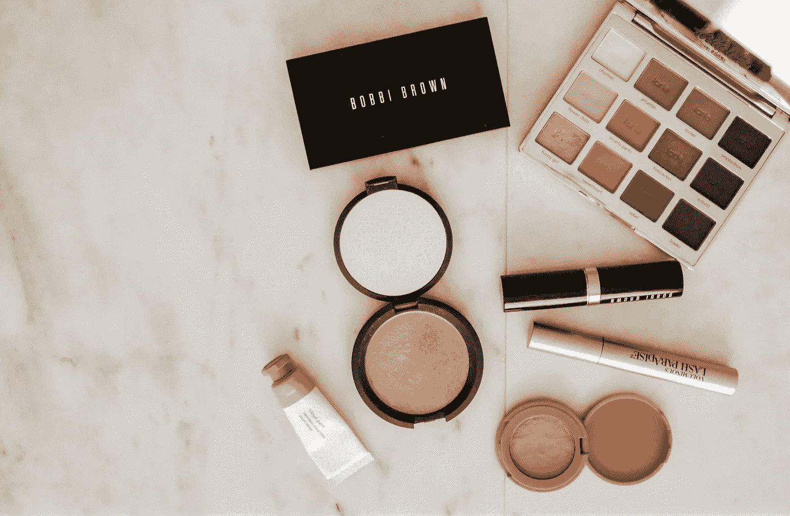
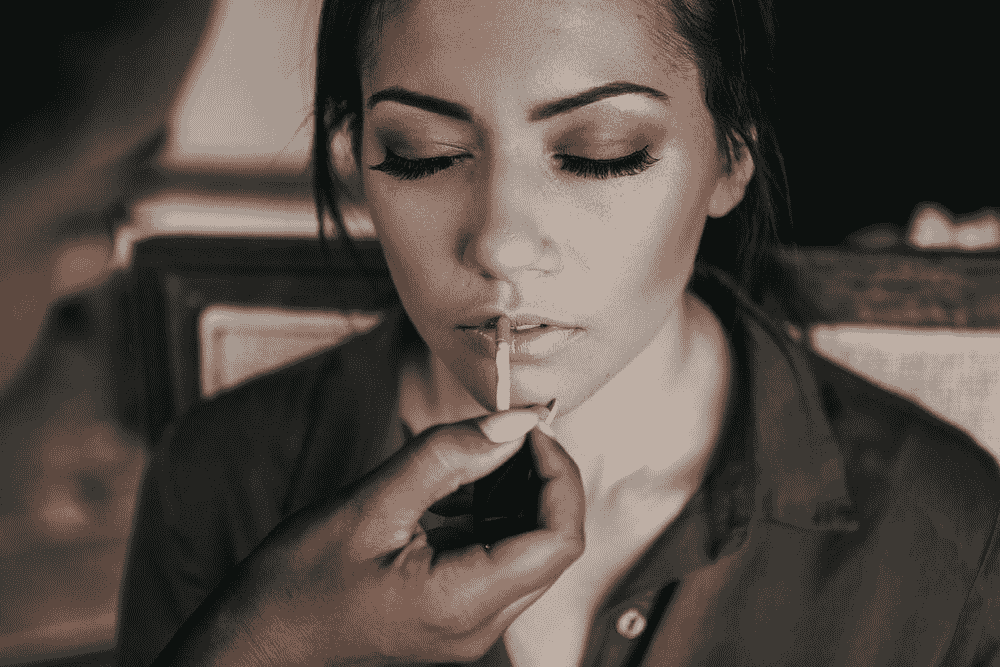
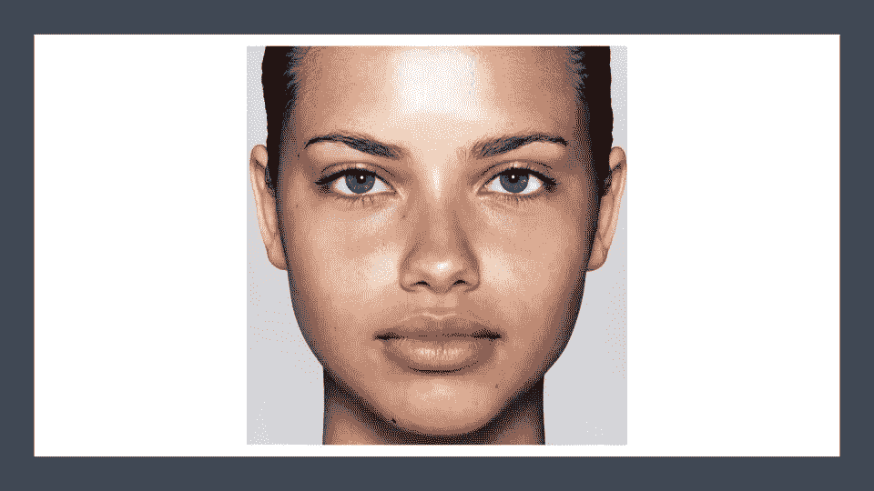
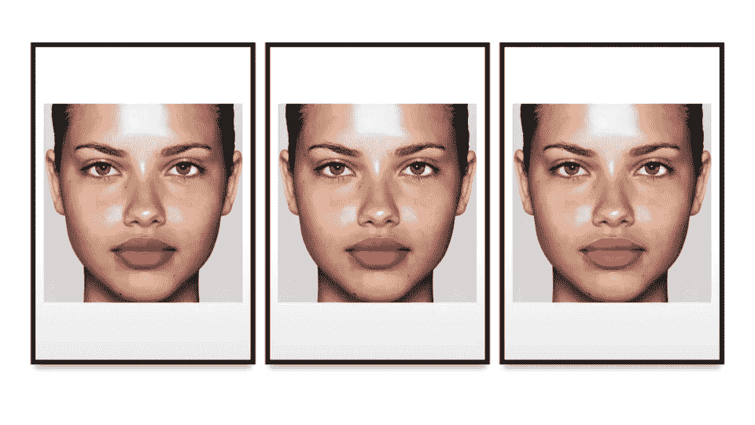
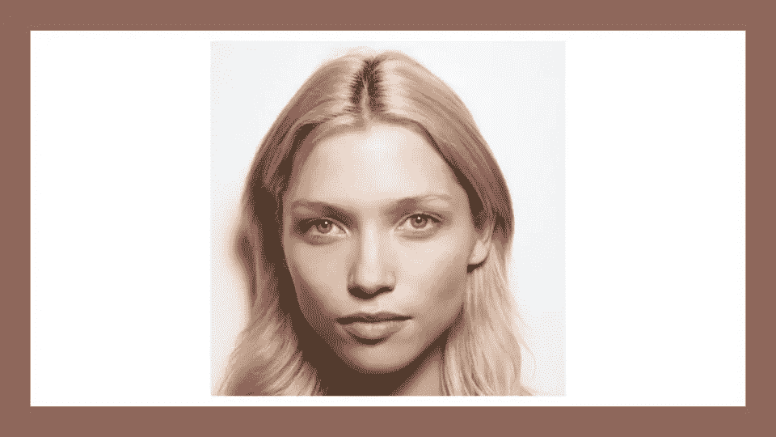
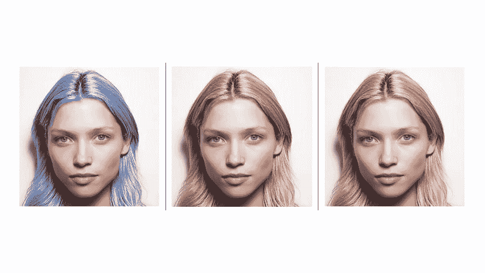

# WYOM:化你自己的妆

> 原文：<https://medium.com/walmartglobaltech/wyom-wear-your-own-makeup-a9a667cbe195?source=collection_archive---------3----------------------->



Image by [Unsplash](https://unsplash.com/photos/ceWgSMd8rvQ)

***《欢乐是最好的妆容》~*** *安妮·拉莫特*

我同意这样的想法，没有比微笑更好的珠宝，也没有比快乐更好的化妆品。然而，依我拙见，来自物理学的“射线的可逆性”的概念在现实生活中也是有效的。有时候，在你的态度上化一点妆会给生活带来活力。因为做自己喜欢的事情的自由是一个人能体验到的真正的快乐。


技术正在帮助我们应对日常挑战。从早上在闹钟的帮助下醒来，到智能音箱背诵催眠曲帮助婴儿入睡，一切都是科技的礼物。作为一名工程师，我被赋予了让人们的生活变得更容易的权力，以及比人工智能更好的手段。赋予电子机器视觉的力量，并做出精明的决定来克服现实生活中的障碍，这种魔力是真正的实现感。放心吧，它比迈克尔的虚拟朋友哈维*(办公室——S3 旅行推销员)*有用得多，也聪明得多。

电子商务已经存在了几十年，各种组织一直致力于为客户提供愉快、便捷的在线购物体验。平台参与度和客户旅程的质量决定了在线零售系统的成功。在线购买化妆品和美容产品是一个棘手的问题，因为没有对产品的实际感觉和理解颜色的能力。顾客必须完全依靠自己的视觉来决定适合自己的商品。此外，在形成产品认知的过程中有太多的模糊性。通常，收到的产品与商品页面的感觉不一致，这是由于在视觉上解读真实产品规格时的矛盾心理。疫情让购买美容产品的过程变得更具挑战性。它剥夺了消费者先试后买的购买习惯。

***“困难之中蕴藏着机遇”~阿尔伯特·爱因斯坦***



Image by [Unsplash](https://unsplash.com/photos/1dwRuFgDr0o)

# 什么是 WYOM？

```
WYOM(Wear Your Own Makeup) is an augmented reality tool powered by AI. It enables the customers to upload and visualize a try on of the beauty products on the images uploaded by them
```

# 为什么我们需要 WYOM(虚拟化妆试穿)？

现代技术让人们可以在智能手机屏幕上测试数百种产品。这在时尚和美容行业尤为突出:即使在疫情出现之前，人们也不愿意尝试接触别人身体的产品。远程测试和订购产品被证明是增加销售的有效方法。该功能往往会带来实质性的业务影响:

*   *据报道，虚拟彩妆试戴客户购买彩妆产品的可能性增加 3 倍，订单规模预计大 20%。*
*   *虚拟试妆方便购物，提升用户参与度。客户参与度预计将增加到七倍*
*   56%的用户在进入新页面时的第一反应是浏览产品图片，而不是阅读标题、描述或向下滚动页面以获得更全面的概述。WYOM 将有助于减少客户不确定性和产品退货。因此，提高客户忠诚度和保留率
*   *用户可以马上选择合适的产品，节省了大量重新包装不需要的商品的费用。在某些情况下，AR 试用会减少高达 36%的退货。*

# 死刑

双边分割网络的定制修改用于实时语义分割，以识别我们的嘴唇和头发的焦点区域。语义分割需要丰富的空间信息和相当大的感受野。通过 BiSeNet 的空间路径保留空间信息并生成高分辨率特征。同时，语境路径有助于识别足够的感受野。因此，所获得的特征被融合以识别将被用于进一步智能色彩着色的目标区域。我们采用高斯模糊和应用颜色掩蔽技术，给它一个自然的外观。



Original Image Without Makeup ([Source](https://in.pinterest.com/pin/649222102502716565/))

我为 WYOM 创建了一个原型，其中包括尝试唇色和发色，作为美容产品类别的一部分。

让我们假设给定的图像是由顾客提供的，用于虚拟的唇色试穿。

因此，基于产品样本，将获得以下具有所需唇色的图像，以获得更好的消费者参与度和改善的色调感知，从而提高保留率和客户忠诚度。



Resultant Images from WYOM Lip color Try-On

如果仔细观察，连嘴唇的皱皮都是自然晕染的。



Original Image Without Makeup ([Source](https://in.pinterest.com/))

同样的，我们也用电商染发产品的色度给头发打了阴影。

在使用 WYOM 生成的结果图像中，发丝的色调和流动看起来很自然



Resultant Images from WYOM Haircolor Try-On

# 总结


It’s me wearing Hot Pink lip color applied using WYOM

美容产品是给每个人的。不管有人以前是否使用过美容产品，看到这些产品的效果真的很迷人。

这篇文章揭示了美容行业的一些创新。我们讨论了电子商务零售商如何利用领先的人工智能趋势来管理业务和提高底线。

我们迫不及待地想改变顾客对其他美容产品的体验，如眼妆、指甲油、轮廓等。可能性是巨大的。我们正踏上为顾客带来终极虚拟改造的道路。敬请关注下一次零售变革。

# 其他文章

[](/walmartglobaltech/tête-à-tête-the-chatbot-creator-56a5b9b36c2) [## 聊天机器人的创造者

### “我相信，在本世纪末，文字的使用和一般受过教育的观点将会发生如此大的变化，以至于……

medium.com](/walmartglobaltech/tête-à-tête-the-chatbot-creator-56a5b9b36c2) [](/walmartglobaltech/ai-in-e-commerce-automated-video-generation-1b93b9d17ba8) [## 电子商务中的人工智能:自动视频生成

### “第一步是确定某事是可能的；那么概率就会发生。”

medium.com](/walmartglobaltech/ai-in-e-commerce-automated-video-generation-1b93b9d17ba8) [](/walmartglobaltech/neural-networks-exposed-hello-world-5a2f5984f936) [## 神经网络暴露:你好世界！

### 我认为自己是一名工程师，一名问题解决者，在他成长的岁月里爱上了人工智能和数据科学。一直想要…

medium.com](/walmartglobaltech/neural-networks-exposed-hello-world-5a2f5984f936) 

# 推荐人和证明人:

 [## 美容品牌如何通过虚拟试妆获利[案例研究]

### 随着封锁和人们更喜欢呆在家里，人们不太可能在美容产品上花费。在…

www.banuba.com](https://www.banuba.com/blog/case-study-how-beauty-brands-profit-with-virtual-makeup-try-on) [](https://hbr.org/2020/10/how-ar-is-redefining-retail-in-the-pandemic) [## AR 如何重新定义疫情的零售业

### 在这些困难时期，我们为所有读者免费提供了一些冠状病毒文章。得到 HBR 所有的…

hbr.org](https://hbr.org/2020/10/how-ar-is-redefining-retail-in-the-pandemic) [](https://arxiv.org/abs/1808.00897) [## BiSeNet:用于实时语义切分的双边切分网络

### 语义分割需要丰富的空间信息和相当大的感受野。然而，现代方法…

arxiv.org](https://arxiv.org/abs/1808.00897)