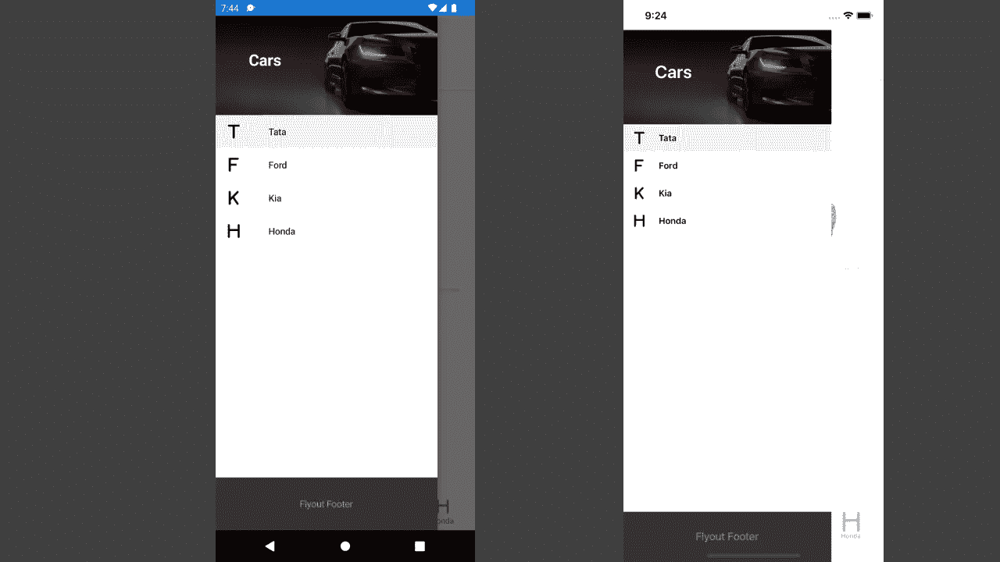
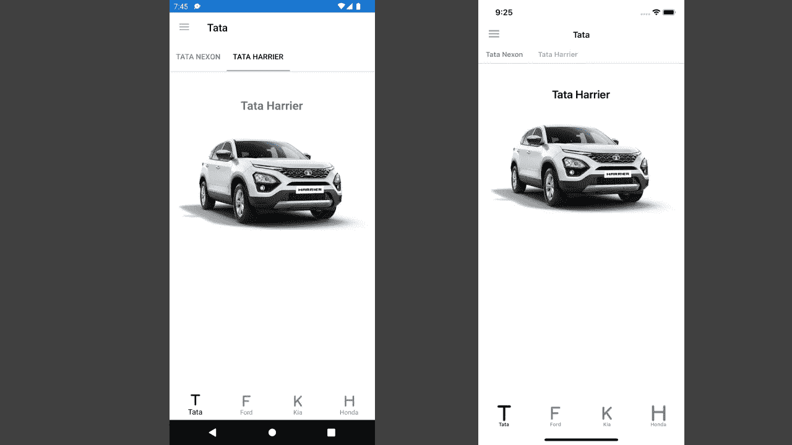

# Xamarin。表单外壳:导航

> 原文：<https://medium.com/globant/xamarin-forms-shell-navigation-d1179bfa2e4a?source=collection_archive---------0----------------------->


Photo by [Mick Haupt](https://unsplash.com/@rocinante_11?utm_source=medium&utm_medium=referral) on [Unsplash](https://unsplash.com?utm_source=medium&utm_medium=referral)

# **简介**

Xamarin。Form Shell 旨在提高移动开发人员的工作效率，降低移动应用程序的复杂性。Shell 为您的应用程序提供了一个容器。那个容器包括一个`MasterDetailPage`、一个`TabbedPage`和一个`NavigationPage`或者它们的组合。Shell 还提供了搜索功能。它有基于 URI 的导航，使用路线导航到应用程序中的任何页面，而不必遵循导航层次结构。此外，它还提供了向后导航的能力，而不必访问导航堆栈上的所有页面。

Xamarin 的基本特征。表单外壳包括:

*   描述应用程序视觉层次的单一位置。
*   常见的导航用户体验。
*   基于 URI 的路由
*   集成的搜索处理程序
*   应用渲染速度提高
*   降低内存消耗

Xamarin。Forms Shell 在 iOS 和 Android 上完全可用，但在通用 Windows 平台(UWP)上仅部分可用。壳牌目前正在 UWP 进行实验。

# **xa marin 中的视觉层次。表单外壳应用程序**

Xamarin 的视觉层次结构。窗体外壳应用程序在扩展外壳类 AppShell.xaml 的类中描述。该类由三个主要的分层对象组成，它们是:

`**1\. FlyoutItem**` **或** `**TabBar**`

*   一个`**FlyoutItem**`代表弹出菜单中的一个或多个项目，当应用程序的导航模式需要弹出菜单时应该使用。
*   一个`**TabBar**`代表底部标签栏，当应用程序的导航模式以底部标签开始并且不需要弹出时应该使用。

`**2\. Tab:**`代表分组内容，可通过底部标签导航。

*   每个`**Tab**`对象都是`FlyoutItem`对象或`TabBar`对象的子对象。

`**3\. ShellContent:**`表示每个页签的`**ContentPage**`对象。

这些对象用于组织应用程序视觉层次结构。本文提到的例子中使用了这些对象。

# **快速启动**

Visual Studio 为 Shell 提供了一个新的模板项目，但是您也可以快速地将 Shell 添加到任何应用程序中。

要将 Shell 添加到任何应用程序中，您可以遵循以下步骤:

1.  向名为`**AppShell.xaml**`的库项目添加一个新的 XAML 文件
2.  用`**Shell**`类型而不是`ContentPage`来扩展类。文件背后的 XAML 和代码应该如下所示:

AppShell.xaml

```
<Shell ae it" href="http://xamarin.com/schemas/2014/forms" rel="noopener ugc nofollow" target="_blank">http://xamarin.com/schemas/2014/forms"
       xmlns:x="[http://schemas.microsoft.com/winfx/2009/xaml](http://schemas.microsoft.com/winfx/2009/xaml)"
       x:Class="MyApp.AppShell"></Shell>
```

AppShell.xaml.cs

```
namespace MyApp
{
    public partial class AppShell : Shell
    {
        public AppShell()
        {
            InitializeComponent();
        }
    }
}
```

3.在 App.xaml.cs 文件中，将 AppShell 类对象设置为 MainPage 属性。App.xaml.cs 类应该如下所示:

```
namespace MyApp
{
    public partial class App : Application
    {
        public App()
        {
            InitializeComponent();
            MainPage = new AppShell();
        }
        ...
    }
}
```

4.根据应用程序的导航要求，可以从**弹出菜单或底部标签栏菜单中决定导航类型。**以下是 Xamarin 中导航类型的详细信息。窗体外壳应用程序。

**弹出菜单:**

弹出菜单也称为侧抽屉或汉堡菜单。弹出菜单由可选的标题、菜单项(可选)和弹出项组成。在弹出菜单中，侧面板是可折叠的，可以通过点击应用程序屏幕左上方的汉堡菜单图标(三条水平线图标)来打开。

下面是 Android 和 iOS 上弹出菜单的截图:



Flyout Menu

上述弹出菜单的代码应该如下所示:

**AppShell.xaml**

```
<?xml version="1.0" encoding="UTF-8" ?>
<Shell
    ae it" href="http://xamarin.com/schemas/2014/forms" rel="noopener ugc nofollow" target="_blank">http://xamarin.com/schemas/2014/forms"
    xmlns:x="[http://schemas.microsoft.com/winfx/2009/xaml](http://schemas.microsoft.com/winfx/2009/xaml)"
    xmlns:views="clr-namespace:Cars_XShell.Views"
    xmlns:controls="clr-namespace:Cars_XShell.Controls"
    x:Class="Cars_XShell.AppShell">

    <Shell.FlyoutHeader>
        <controls:FlyoutHeader/>
    </Shell.FlyoutHeader>

    <Shell.FlyoutFooter>
        <controls:FlyoutFooter/>
    </Shell.FlyoutFooter>

    <FlyoutItem FlyoutDisplayOptions="AsMultipleItems">
          <Tab Title="Tata" Icon="icon_t.png">
            <ShellContent 
                Title="Tata Nexon" Icon="icon_t.png"
                ContentTemplate="{DataTemplate views:TataNexon}"/>
            <ShellContent 
                Title="Tata Harrier" Icon="icon_t.png"
                ContentTemplate="{DataTemplate views:TataHarrier}"/>
        </Tab>
        <ShellContent Title="Ford" Icon="icon_f.png"
                      ContentTemplate="{DataTemplate views:Ford}"/>
        <ShellContent Title="Kia" Icon="icon_k.png"
                      ContentTemplate="{DataTemplate views:Kia}"/>
        <ShellContent Title="Honda" Icon="icon_h.png"
                      ContentTemplate="{DataTemplate views:Honda}"/>
    </FlyoutItem>
</Shell>
```

**标签栏:**

该导航菜单是传统的底部标签栏菜单，如下面的屏幕截图所示:



Tabbed Menu

标签栏上的每个标签都显示一个`ContentPage`。但是，如果底部选项卡包含多个页面，则页面可通过顶部选项卡栏导航。

上述选项卡式栏菜单的代码应该如下所示:

```
<Shell
    ae it" href="http://xamarin.com/schemas/2014/forms" rel="noopener ugc nofollow" target="_blank">http://xamarin.com/schemas/2014/forms"
    xmlns:x="[http://schemas.microsoft.com/winfx/2009/xaml](http://schemas.microsoft.com/winfx/2009/xaml)"
    xmlns:views="clr-namespace:Cars_XShell.Views"
    xmlns:controls="clr-namespace:Cars_XShell.Controls"
    x:Class="Cars_XShell.AppShell">

    <Shell.FlyoutHeader>
        <controls:FlyoutHeader/>
    </Shell.FlyoutHeader>

    <Shell.FlyoutFooter>
        <controls:FlyoutFooter/>
    </Shell.FlyoutFooter>

    <TabBar FlyoutDisplayOptions="AsMultipleItems">
        <Tab Title="Tata" Icon="icon_t.png">
            <ShellContent 
                Title="Tata Nexon" Icon="icon_t.png"
                ContentTemplate="{DataTemplate views:TataNexon}"/>
            <ShellContent 
                Title="Tata Harrier" Icon="icon_t.png"
                ContentTemplate="{DataTemplate views:TataHarrier}"/>
        </Tab>
        <ShellContent Title="Ford" Icon="icon_f.png"
                      ContentTemplate="{DataTemplate views:Ford}"/>
        <ShellContent Title="Kia" Icon="icon_k.png"
                      ContentTemplate="{DataTemplate views:Kia}"/>
        <ShellContent Title="Honda" Icon="icon_h.png"
                      ContentTemplate="{DataTemplate views:Honda}"/>
    </TabBar>
</Shell>
```

# **xa marin 中的导航。表单外壳应用程序**

Xamarin。Forms Shell 支持基于 URI 的导航。它使用路由导航到应用程序中的任何页面。它还提供向后导航到导航堆栈中任何页面的功能。

下面是在 **Shell** 类中定义的导航相关属性:

*   `**BackButtonBehavior**`:定义后退按钮行为的附加属性。
*   `**CurrentItem**`:提供当前选择的项目。
*   `**CurrentPage**`:提供当前呈现的页面。
*   `**CurrentState**`:提供`Shell`的当前导航状态。
*   `**Current**`:是`Application.Current.MainPage`的类型转换别名。

`**GoToAsync()**`方法用于在 Xamarin Shell 应用程序中执行导航。执行导航时会触发以下事件:

1.  `Navigating`当将要执行导航时触发事件
2.  `Navigated`导航完成时触发事件

# **路线**

Xamarin。窗体外壳应用程序支持基于 URI 的导航。导航 URI 由以下三个部分组成:

*   一个 *route:* 一个 **Route** 属性用于定义作为外壳视觉层次结构的一部分存在的内容的路径。它用于为 AppShell.xaml 文件中定义的页面定义路径。
*   一个*页面:* **页面**不存在于 shell 可视化层次结构中(没有在 AppShell.xaml 文件中定义的页面)也可以被推送到导航堆栈上。这些路由可以在 AppShell.xaml.cs 文件中注册，然后用于导航到所需的注册页面。
*   一个或多个*查询参数:*查询参数是导航时可以传递给目的页面的参数。

当导航 URI 包括所有三个组件时，其结构应该如下所示:

```
***//route/page?queryParameters***
```

# **登记路线**

注册路由有两种方式:

1.  通过在 AppSell.xaml 文件中定义路线。在应用程序的可视层次结构中定义的页面也遵循这一点。
2.  通过在 AppShell.xaml.cs 文件中显式注册路由。这种方法特别适用于没有在应用程序的可视层次结构中定义的页面。

路线可以定义在`**FlyoutItem**`**`**TabBar**`**`**Tab**`**和`**ShellContent**`对象上，通过它们的`Route`属性。******

****下面是在 AppShell.xaml 文件中定义路由的示例:****

```
**<Shell ...>
    <FlyoutItem ...
                Route="cars">
        <Tab ...
             Route="tata">
            <ShellContent ...
                          Route="tataNexon" />
            <ShellContent ...
                          Route="tataHarrier" />
        </Tab>
        <ShellContent ...
                      Route="ford" />
        <ShellContent ...
                      Route="kia" />  
        <ShellContent ...
                      Route="honda" />
    </FlyoutItem>

    ...
</Shell>**
```

****以上示例创建了以下路线层次结构:****

```
**cars
  tata
    tataNexon
    tataHarrier
  ford
  kia
  honda**
```

****例如，为了导航到`tataHarrier`路线的`ShellContent`对象，绝对路线 URI 是`//cars/tata/tataHarrier`。****

****类似地，为了导航到`ford`路线的`ShellContent`对象，绝对路线 URI 是`//ford`。****

******明确注册路由******

****在`Shell`子类构造函数中，或者在路由被调用之前运行的任何其他位置，额外的路由可以被显式地注册到任何没有在 Shell 可视化层次结构中表示的页面。****

****这是通过`[Routing.RegisterRoute](https://docs.microsoft.com/en-us/dotnet/api/xamarin.forms.routing.registerroute)()`方法实现的:****

****下面是注册未在外壳应用程序可视层次结构中定义的页面路由的示例:****

```
**Routing.RegisterRoute(“cardetails”, typeof(CarDetailPage));**
```

****或者，如果需要，可以在不同的路由层次结构中注册页面:****

```
**Routing.RegisterRoute(“car/details”, typeof(CarDetailPage));**
```

# ******执行导航******

****为了执行导航，在 shell 对象上调用`**GoToAsync**`方法。为了调用 GoToAsync 方法进行导航，必须获得对 Shell 对象的引用。这个引用可以通过将`**App.Current.MainPage**`属性赋给 shell 对象，或者通过`**Shell.Current**`方法来获得。`**GoToAsync**`方法返回一个`**Task**`，它将在导航动画完成后立即完成。****

******绝对路线******

****通过指定有效的绝对 URI 作为`**GoToAsync**`方法的参数，可以进行导航:****

```
**await Shell.Current.GoToAsync(“//cars/ford”);**
```

****上面的例子将导航到`ford`路线的页面，该路线在`ShellContent`对象中定义。该`ShellContent`对象是`FlyoutItem`对象的子对象，其路线为`cars`。****

****这表现在下面的代码片段中:****

```
**<Shell ...>
    <FlyoutItem ...
                Route="cars">
        **<ShellContent ...
                      Route="ford" />**
       ... </FlyoutItem>

    ...
</Shell>**
```

******相对路线******

****也可以通过指定一个有效的相对 URI 作为`[GoToAsync](https://docs.microsoft.com/en-us/dotnet/api/xamarin.forms.shell.gotoasync)`方法的参数来进行导航。****

****路由系统将尝试找到与 URI 匹配的页面，并相应地导航到该页面。如果应用程序中的所有路线都是唯一的，则只需将唯一的路线名称指定为相对 URI，即可进行导航。****

****以下示例导航到`**cardetails**`路线的页面:****

```
**await Shell.Current.GoToAsync(“cardetails”);**
```

****在这个例子中，沿着层级向上搜索`cardetails`路线，直到找到匹配的页面。当找到页面时，它被推送到导航栈。****

****支持几种路由格式:****

1.  *****路线- >* 路线层次将从当前位置向上搜索指定路线。匹配的页面将被推送到导航堆栈。****
2.  ****/ *路线- >* 路线层次将从指定路线开始，从当前位置向下搜索。匹配的页面将被推送到导航堆栈。****
3.  ****// *路线- >* 将从当前位置向上搜索指定路线的路线层次。匹配的页面将替换导航堆栈。****
4.  ****/// *路线- >* 将从当前位置向下搜索指定路线的路线层次。匹配的页面将替换导航堆栈。****

******向后导航******

1.  ****可以通过指定“..”来执行向后导航作为`[GoToAsync](https://docs.microsoft.com/en-us/dotnet/api/xamarin.forms.shell.gotoasync)`方法的参数:****

```
**await Shell.Current.GoToAsync(“..”);**
```

****2.使用“..”向后导航也可以与路线结合使用:****

```
**await Shell.Current.GoToAsync(“../route”);**
```

****在上面的例子中，执行向后导航，然后导航到指定的路线。****

****3.同样，也可以多次向后导航，然后导航到指定的路线:****

```
**await Shell.Current.GoToAsync(“../../route”);**
```

****在上面的例子中，向后导航执行两次，然后导航到指定的路线。****

****4.此外，向后导航时，数据可以通过查询属性传递:****

```
**await Shell.Current.GoToAsync($"..?parameterToPassBack={parameterValueToPassBack}");**
```

****在上面的示例中，执行向后导航，并将查询参数值传递给上一页的查询参数。****

******将查询参数传递给导航 URI******

****在 Xamarin 中执行导航时，数据可以在 URI 中作为查询参数传递。窗体外壳应用程序。****

****在导航 URI 中传递查询参数时，可以遵循以下 URI 格式:****

```
**route?nameofparameter={value of parameter}**
```

****要将多个查询参数传送至导航 URI，请遵循以下格式:****

```
**route?nameofparameter1={value of parameter1}&nameofparameter2={value of parameter2}**
```

****例如，当用户选择`ElephantsPage`上的大象时，在示例应用程序中执行以下代码:****

```
**async void OnCollectionViewSelectionChanged(object sender, SelectionChangedEventArgs e)
{
    string carName = (e.CurrentSelection.FirstOrDefault() as Car).CarName;
    await Shell.Current.GoToAsync($"cardetails?name={carName}");
}**
```

******如何接收页面中传递的参数？******

****使用参数路由的页面，页面的类需要为每个查询参数用一个`QueryPropertyAttribute`修饰，并且为每个接收查询参数创建属性。****

****下面是 **CarDetailPage** 的例子，其中页面上将要接收查询参数 **Name** :****

```
**[QueryProperty(nameof(Name), "name")]
public partial class CarDetailPage : ContentPage
{
    public string Name
    {
        set
        {
            // Custom logic
        }
    }
    ...    
}**
```

******后退按钮定制:******

****在 Xamarin。窗体外壳应用程序，后退按钮的外观和行为可以定制。****

****以下是可以自定义的属性，用于更新 Xamarin Shell 应用程序中后退按钮的外观和行为:****

*   ****`Command:`定义点击后退按钮时可以调用的命令。****
*   ****`CommandParameter:`定义了可以传递给命令的参数。****
*   ****`IconOverride:`定义后退按钮的图标。****
*   ****`IsEnabled:`表示后退按钮是否启用。默认值为`true`。****
*   ****`TextOverride:`定义用于后退按钮的文本。****

****以下代码显示了重新定义后退按钮外观和行为的示例:****

```
**<ContentPage ...>    
    <Shell.BackButtonBehavior>
        <BackButtonBehavior Command="{Binding BackCommand}"
                            IconOverride="back.png" />   
    </Shell.BackButtonBehavior>
    ...
</ContentPage>**
```

******总结******

****Xamarin。Forms Shell 将构建应用程序的一些复杂性抽象到一个直观的 API 中，使移动应用程序开发人员可以轻松管理导航，并将更多精力放在 Xamarin 应用程序的功能上。本文将带您了解如何从 Xamarin 开始。窗体外壳应用程序。它还让您了解 Xamarin Shell 的主要特性，以及如何在 Xamarin 中管理导航。窗体外壳应用程序。****

****示例源代码:[https://github.com/ajpalan/Cars_XamarinShell](https://github.com/ajpalan/Cars_XamarinShell)****

****参考资料:****

****[](https://docs.microsoft.com/en-us/xamarin/xamarin-forms/app-fundamentals/shell/navigation) [## Xamarin。窗体外壳导航- Xamarin

### 下载示例 Xamarin。Forms Shell 包括一个基于 URI 的导航体验，使用路线导航到任何…

docs.microsoft.com](https://docs.microsoft.com/en-us/xamarin/xamarin-forms/app-fundamentals/shell/navigation) [](https://docs.microsoft.com/en-us/xamarin/xamarin-forms/app-fundamentals/shell/introduction) [## Xamarin。表单外壳简介- Xamarin

### 下载示例 Xamarin。Forms Shell 通过提供……降低了移动应用程序开发的复杂性

docs.microsoft.com](https://docs.microsoft.com/en-us/xamarin/xamarin-forms/app-fundamentals/shell/introduction) [](https://www.telerik.com/blogs/introduction-to-xamarin.forms-shell) [## Xamarin 简介。表单外壳

### 新的 Xamarin。Forms Shell 旨在提高移动开发人员的工作效率。应用程序内容组织和导航是…

www.telerik.com](https://www.telerik.com/blogs/introduction-to-xamarin.forms-shell) [](https://www.knowledgehut.com/blog/software-testing/xamarin-forms-shell) [## Xamarin 表单简介- Shell

### Xamarin Forms Shell 通过提供以下基本功能降低了移动应用程序开发的复杂性…

www.knowledgehut.com](https://www.knowledgehut.com/blog/software-testing/xamarin-forms-shell)****