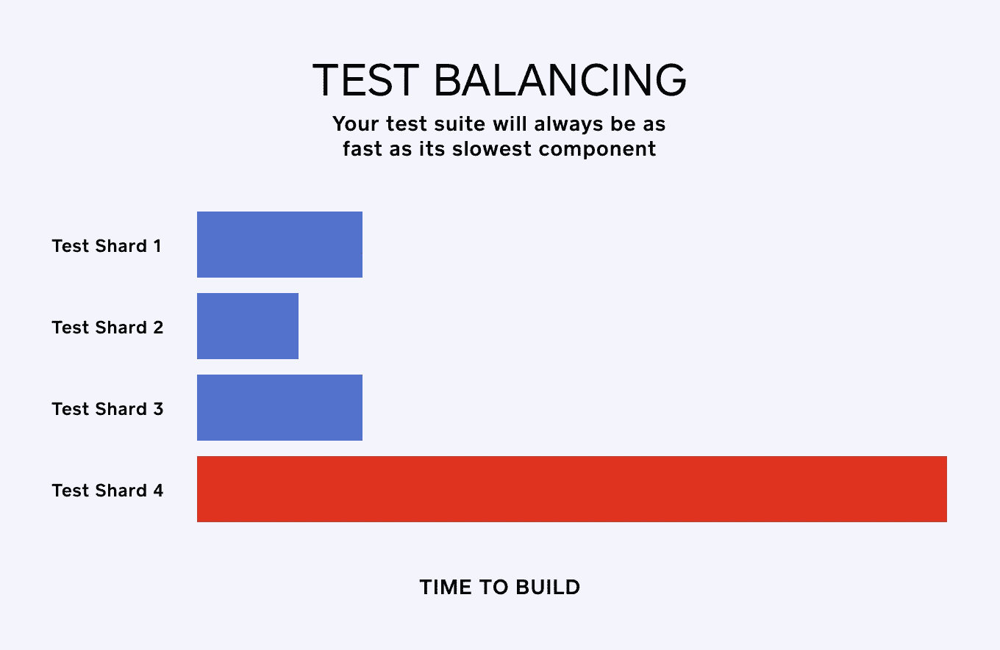
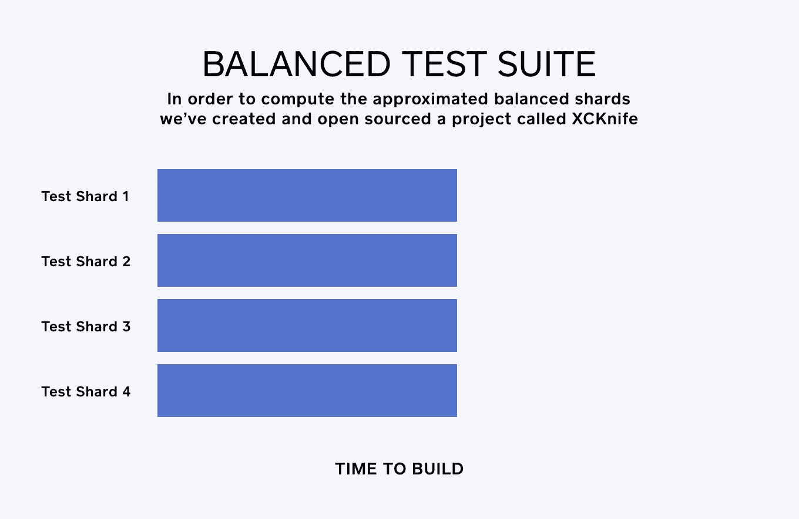
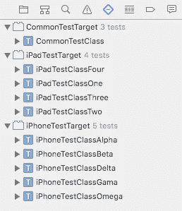
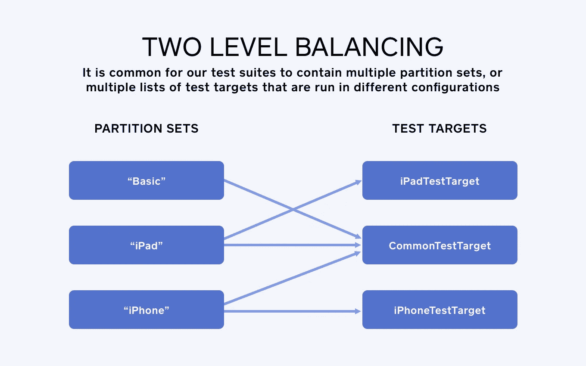
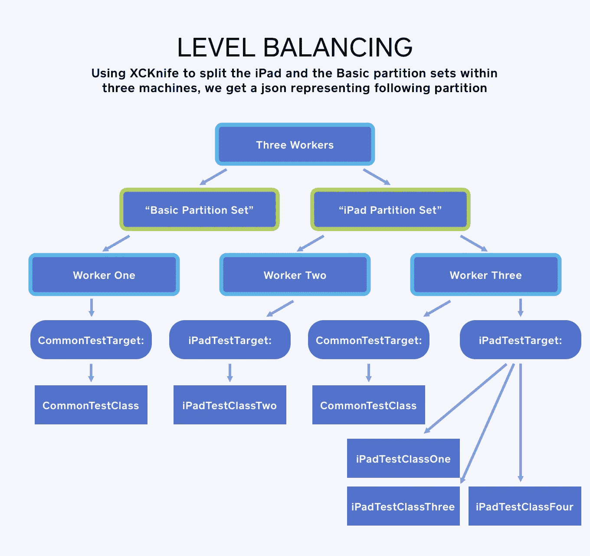
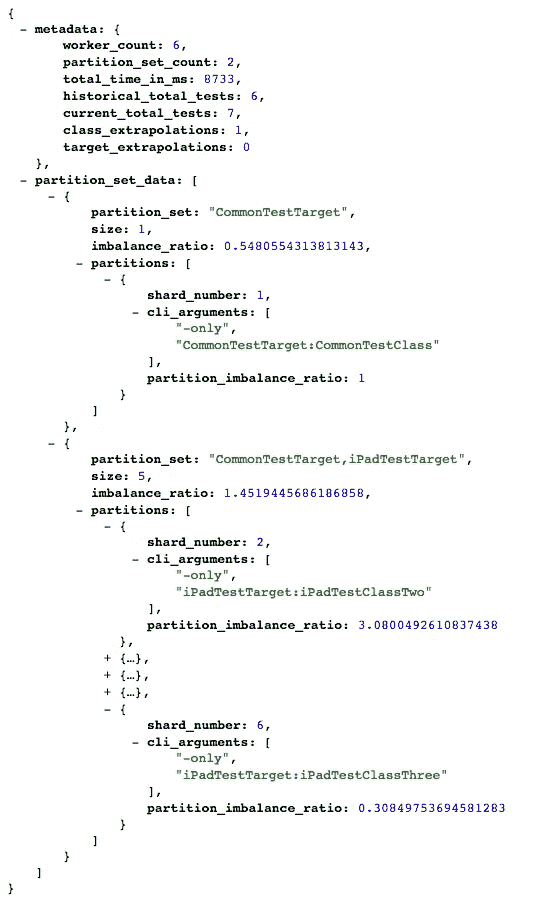
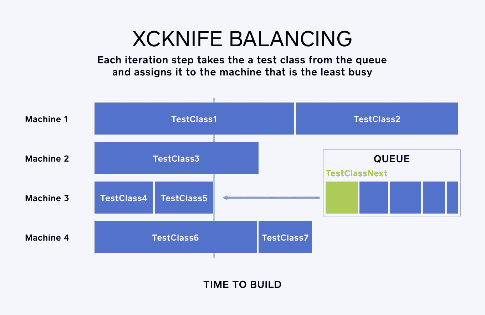
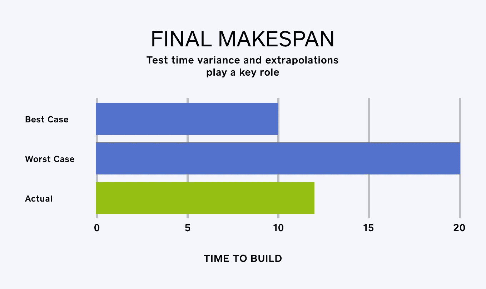
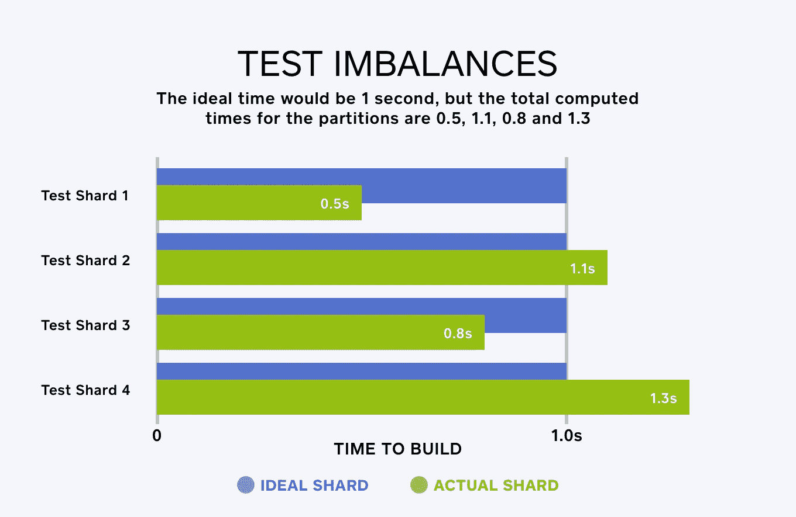

# XCKnife:更快的 iOS 分布式测试

> 原文：<https://medium.com/square-corner-blog/xcknife-faster-distributed-tests-for-ios-e1eb6c23a6d5?source=collection_archive---------3----------------------->

## 优化跨机器 XCTest 运行的简单工具

*作者写的*[](https://twitter.com/metaphysicaldev)**。**

> *注意，我们已经行动了！如果您想继续了解 Square 的最新技术内容，请访问我们的新家[https://developer.squareup.com/blog](https://developer.squareup.com/blog)*

*在 Square，我们高度重视工程师的效率。随着我们的代码库的增长，我们的测试套件达到数万个测试，我们的工程师越来越长时间地等待他们的构建在我们的持续集成系统中是绿色的。*

*我们最近优化了我们的内部测试基础设施，使我们的 iOS 测试套件能够轻松高效地分布在数十台机器上。为了给我们的工程师提供最快的拉请求测试结果，我们还必须适当地平衡测试碎片，因为你的测试套件总是和它最慢的组件一样快。*

**

# *平衡测试碎片*

*完美平衡的测试套件应该是这样的:*

**

*生成一个完美平衡的分片测试等价于一个已知的调度任务和机器的困难问题。对它进行近似[足够快](https://books.google.com/books?id=RxvrDwBUzcIC&pg=PA544&lpg=PA544&dq=scheduling+graham%27s+algorithm+2+approximation&source=bl&ots=wUbmNtrmQ6&sig=M_qz2mJ0RpzlaziOBKjsHXObyaw&hl=en&sa=X&ved=0ahUKEwjuqdjj2IfNAhVW7mMKHT-yBOI4ChDoAQgiMAE#v=onepage&q=scheduling%20graham%27s%20algorithm%202%20approximation&f=false)，并且我们根据经验观察到它偏离最佳分区大约 10%。*

*为了计算近似的平衡碎片，我们创建了一个名为 [XCKnife](https://github.com/square/xcknife) 的项目，目前我们正在开源这个项目。XCKnife 以最小化总执行时间的方式划分 [XCTestCase](https://developer.apple.com/library/tvos/documentation/DeveloperTools/Conceptual/testing_with_xcode/chapters/04-writing_tests.html) 测试(又名 [*makespan*](https://en.wikipedia.org/wiki/Makespan) )。在使用它之后，我们看到在我们最大的项目上 CI 测试构建速度提高了 30%。*

*XCKnife 通过利用 Xctool 的 [json-stream](https://github.com/facebook/xctool#included-reporters) reporter 输出来获得历史计时信息和当前测试套件定义。 [Xctool](https://github.com/facebook/xctool) 是脸书创造的开源工具，作为苹果 xcodebuild 的替代品，让测试 iOS 和 Mac 产品变得更加容易。*

*XCKnife 生成了一个只传递给 Xctool 的 [-only 测试参数](https://github.com/facebook/xctool#testing)的参数列表，但是也可以使用适当的测试分区生成多个 xcschemes。*

*XCKnife 还自动处理删除的测试和测试目标，并推断新测试的预期时间。*

# *两级平衡*

*我们的测试套件通常包含多个*分区集、*或者在不同配置下运行的多个测试目标列表。例如，给定下面的测试结构(来自[这个样本项目](https://github.com/danielribeiro/xcknife-exemplar)):*

**

*三个测试目标(_CommonTestTarget_、 *iPadTestTarget* 和 *iPhoneTestTarget* )都有一个测试类列表，每个测试类都采用不同的计时数据。我们可以将这些测试目标分成三个分区集，例如:*

**

*使用 XCKnife 在 3 台机器内分割 *iPad* 和*基本*分区集，我们得到一个 json 表示如下分区:*

**

*XCKnife 将对大多数类而不是方法进行分区，否则它将不止一次调用类的初始化，这并不总是安全的，例如，如果您使用改变状态的网络连接(像对外部有状态 web 服务进行 Rest 调用)。*

# *如何使用 XCKnife*

*XCKnife 有可执行文件和 Ruby gem 两种版本。您可以通过以下方式安装它:*

```
*$ gem install xcknife*
```

*作为一种工具:*

*$ xc knife-p common test target-p common test target，iPadTestTarget 6 示例/xc knife-exemplar-historical-data . JSON-stream 示例/xcknife-exemplar.json-stream*

*这会产生 json 形式的分区信息:*

**

*作为红宝石:*

```
*require 'xcknife'**def** **compute_shards**(historical_file, current_file)
  knife **=** XCKnife**::**StreamParser**.**new(6, **[[**"CommonTestTarget"**]**,
    **[**"CommonTestTarget", "iPadTestTarget"**]]**)
  knife**.**compute_shards_for_file(historical_file, current_file)
**end***
```

*有关使用 XCKnife 的更多详细示例，请参考文档。*

# *它是如何工作的*

*用于平衡单个分区集的[2-近似法](https://books.google.com/books?id=RxvrDwBUzcIC&pg=PA544&lpg=PA544&dq=scheduling+graham%27s+algorithm+2+approximation&source=bl&ots=wUbmNtrmQ6&sig=M_qz2mJ0RpzlaziOBKjsHXObyaw&hl=en&sa=X&ved=0ahUKEwjuqdjj2IfNAhVW7mMKHT-yBOI4ChDoAQgiMAE#v=onepage&q=scheduling%20graham%27s%20algorithm%202%20approximation&f=false)是一种贪婪算法，在排序步骤 O(N logN)之后为 O(N ),其中所有测试类按照它们计算的时间排序，并放入一个队列中，时间最长的类在前面。每个迭代步骤从队列中取出一个测试类，并将其分配给最不忙的机器。*

**

*2-近似值意味着每个分区集的最终完成时间如下所示:*

**

*当然，测试时间差异和推断在这里也起着关键作用。*

# *理解失衡*

*XCKnife 将报告两个分区集之间及其内部分区的测试不平衡。这些都是根据理想情况(平均时间)报告的，不一定能够实现。例如，如果您有两个测试类的两个分区，每个分区有一个测试方法，预期时间为 1 秒和 11 秒，平均时间为 6 秒，但是因为我们不能将测试方法分成两部分，所以理想的场景是无法实现的。*

*下面的图表举例说明了一种情况，其中理想的时间是 1 秒，但是分区的总计算时间是 0.5、1.1、0.8 和 1.3:*

**

# *承认*

*感谢[迪米特里斯·库佐吉奥加斯](https://twitter.com/dnkoutso)和[贾斯汀·马丁](https://github.com/justinseanmartin)在整个项目中对设计和代码进行审查。*

# *贡献*

*要发送投稿，请前往 [XCKnife 的 GitHub 页面](https://github.com/square/xcknife#contributing)。*

*在 WWDC 期间，Square 的 iOS 工程团队邀请您加入我们的闪电对话之夜，并与您的 iOS 工程师同事一起享用美食和饮料。6 月 14 日星期二，欢迎加入我们的 SF 包厢——下午 5:30 开门。RSVP [*此处*](https://squareioseng.splashthat.com/) *预留您的名额！**

*[](https://twitter.com/metaphysicaldev) [## 丹尼尔·里贝罗(@metaphysicaldev) |推特

### 来自丹尼尔·里贝罗的最新推特(@metaphysicaldev)。工程师@广场。加州旧金山

twitter.com](https://twitter.com/metaphysicaldev)*