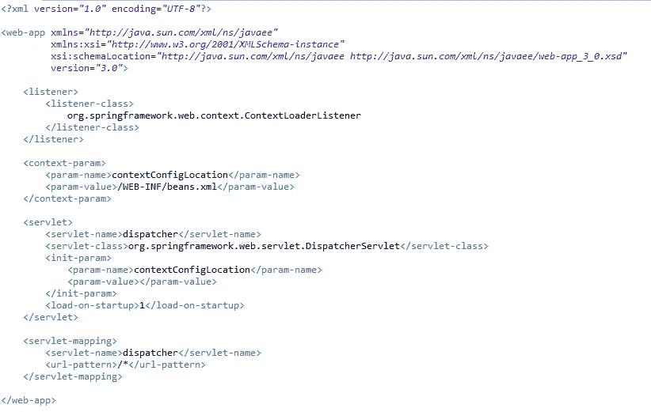
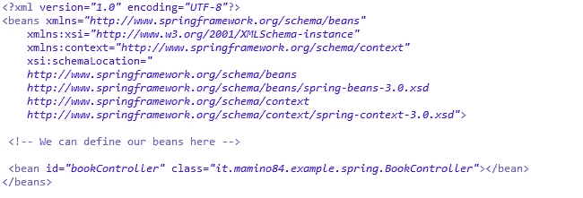
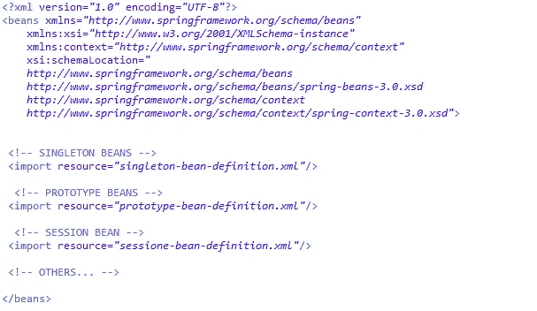
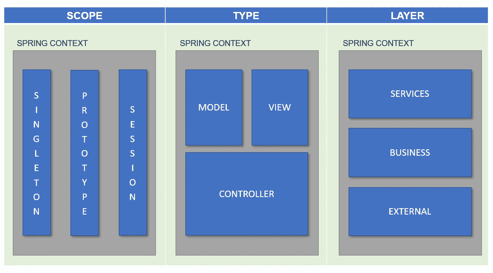
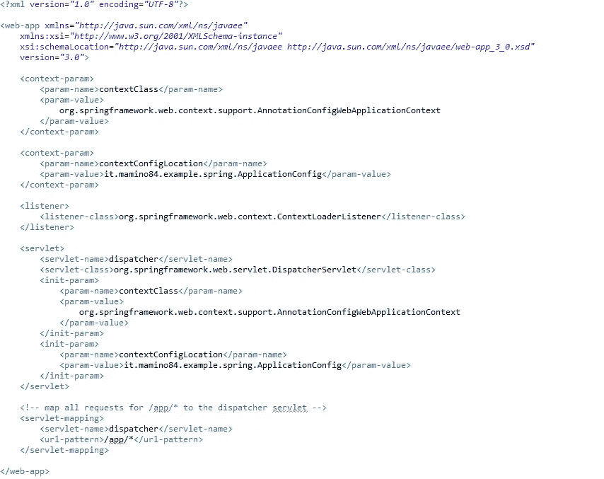
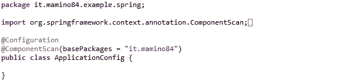

# Spring 框架中的 XML 还是@nnotations？这就是困境

> 原文：<https://medium.com/quick-code/xml-or-nnotations-this-is-the-dilemma-6c00cfbf8746?source=collection_archive---------2----------------------->

## 如何在 Spring 项目中选择最佳的 beans 配置

Photo by [Mathew Schwartz](https://unsplash.com/@cadop?utm_source=medium&utm_medium=referral) on [Unsplash](https://unsplash.com?utm_source=medium&utm_medium=referral)

## 介绍

当你开始着手一个新的 Java Web 项目，而你的客户告诉你“请使用 **Spring Framework…** ”时，你脑海中的马戏就开始了…

Photo by [William Fitzgibbon](https://unsplash.com/@willfitz88?utm_source=medium&utm_medium=referral) on [Unsplash](https://unsplash.com?utm_source=medium&utm_medium=referral)

> …..跳舞的猴子使用@nnotation 来定义 bean，或者受过训练的狮子在正确的 XML 文件上缩进 bean 的配置…

在这个故事中，我将尝试描述定义 Spring 上下文 Bean 的两种方法，而不是 **XML config 和@nnotation** ，对于每种方法，我都将尝试向您解释我的观点。

首先，我们需要有一个 Java EE Web 项目，包含 Maven 和 Spring 框架…

***走吧！***

## 用 XML 定义 beans

在我们的项目中，我们需要编辑 *web.xml* 文件，以包含 **Spring servlet:**

Definition of the web.xml for xml configuration

Spring servlet 拦截请求和响应，调度程序设法在 **Spring 上下文**中操作它。Spring 上下文*包含*并且*管理*Spring bean 的生命周期。

引入 servlet 后，我们需要创建一个根 XML 文件，servlet 使用它来启动 Spring 上下文:

Bean definition file beans.xml

在这个文件中，我们可以包含我们打算在 Web 应用程序中使用的所有 beans。

Spring 框架允许将不同的 bean XML 配置文件导入到一个父*文件中:这样就可以创建这个文件的有组织的结构，并间接地创建 bean 的结构。*

Example of root file to define beans

根据 web 应用程序的体系结构，有许多组织配置文件的方法，例如，可以将 beans 分组为:

*   **作用域**:正如我们所知，Spring beans 可以被配置为具有不同的生命周期独立性(单例、原型、会话等)。).如果 bean 可以根据其作用域按比例划分，并且架构更倾向于以作用域为中心的愿景*(bean 很容易根据其作用域而不是其功能或用途来识别),建议将 bean 分离到为作用域划分的不同 XML 文件中。例如，我们将有一个文件*singleton-bean-definition . XML*，它将包含应用程序中包含的所有 singleton beans，对于其他范围也是如此。*
*   **类型:**例如，在服务器端实现 MVC 模式的架构中，需要模型、视图和控制器 Beans。这是三种不同类型的 Bean，它们可以适应 Spring 上下文，在这种情况下，可以将 XML 配置文件分成三个文件，每个文件代表体系结构中 Bean 的类型。
*   **层**:在多层架构中，例如 REST 服务 API，您可以通过层的逻辑分离来组织 beans。首先是代表服务入口点的 bean，其次是包含业务逻辑的 bean，最后但同样重要的是包含对外部服务或数据库的访问的 bean。

Logical representation of the bean structure and of the xml configuration files

这些是最常见的分组方式，但是还有许多其他的分类取决于结构和架构的哲学。

## @nnotations 对 beans 的定义

如果我们决定不使用 xml 配置文件来组织我们的项目结构，可以遵循另一种方式:class @annotation。

使用 class @annotation 可以初始化和配置 Spring 上下文，直接在 Java 类上添加正确的 annotation 属性。

首先，我们需要创建代表 Spring 上下文根的应用程序配置类，并添加对 *web.xml* 文件的引用。

Definition of the web.xml for annotation configuration

因为 beans 不是在 xml 文件中收集的，并且只能通过注释来识别，所以需要一个配置类来启动 Spring 上下文并扫描所有包以搜索带注释的类:

Configuration root class

这个类由 web 应用程序触发(在 web.xml 中引用),当实例化时，启动上下文，扫描包并激活创建的 beans。

Bean 分散在项目中:如果开发人员发现某个类必须成为 Spring Bean，就在该类上添加@注释。

同样，在这个场景中，有许多方法来组织类和/或包，以尝试遵循一个通用的准则，例如，您可以使用以下提示:

*   **类名后缀**:在类名上添加一个后缀来隐式地标识 Bean 的类型是很有用的。例如，在 MVC 架构中，可以将 Bean 类命名为*{ class } controller Bean . Java*、 *{class}ModelBean.java* 和 *{class}ViewBean.java* 。通过这种方式，您可以轻松地识别或搜索项目中的 Bean，并从页面中检测与其连接的 Bean。
*   **命名显式包**:也可以通过包标识收集 Spring Bean 聚类。例如，在 REST 应用程序中，您以这种方式命名包*it . mamino 84 . example . Bean . business*，它包括层业务的所有 Spring Bean，而与它们的作用域无关。

使用注释来标记 Spring Bean 在 web 应用程序中更为普遍，尤其是在采用 SpringBoot 框架的架构中。

## 是时候决定了！Xml 还是@nnotations？

两种配置都很相似，很容易交换:有没有可能从 xml 配置切换到@nnotation 并返回，但是最好在项目的设计阶段就做出这个选择。

XML 配置中可用的每个特性在@ nnitations 中也可用。

**XML 配置**，在我看来更可取:

*   在**更严格的** **架构**的背景下，因为你在项目开始时就定义了解决方案，在这个过程中每个开发者都需要遵守它
*   在有 5 个或更多开发人员的项目中保证一个更简单和集中的方式来定义和配置 beans
*   在团队和项目中，使用更加严格的方法来实现应用程序(例如。:瀑布式),因为所有 Beans 的定义都可以在项目的第一阶段完成，之后您只需要管理很少的更新

**@annotation** 配置更适合这些情况:

*   在**灵活架构**的情况下，使用这种方法是明智的，因为您可以在开发过程中的每一个时刻将一个类升级为 Bean
*   在拥有 5 个或更少开发人员的团队中，因为有必要呆在一起，也许在同一个房间，并且共享关于什么类需要成为 Bean 的决策，或者例如分配给 Bean 的正确范围
*   在采用瀑布不同的**方法的团队中(例如敏捷)，因为团队不一定会有更多的开发人员，也不会在项目开始时强加所有的决策，但是 Spring 上下文将被逐个运行**

通过这些分类，可以有更多的混合场景来实现 Spring Web 应用程序。

***感谢您的宝贵时间！***

**参考** : [弹簧框架参考文件](https://docs.spring.io/spring/docs/4.3.25.RELEASE/spring-framework-reference/htmlsingle/)

**跟我上 GitHub** : [XML 项目](https://github.com/Mamix84/jtips/tree/master/SpringXmlConfig)和[注释项目](https://github.com/Mamix84/jtips/tree/master/SpringAnnotationConfig)