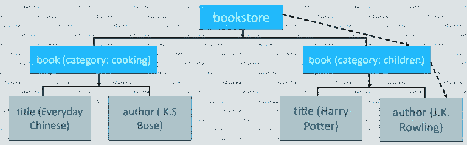

# 如何在 Selenium 中创建有效的 XPath？

> 原文：<https://medium.com/edureka/xpath-in-selenium-cd659373e01a?source=collection_archive---------0----------------------->


XPath in Selenium — Edureka

如果你想知道在网页上找到元素的最简单的方法，那么你已经找到了完美的地方。在 selenium 中定位元素的最佳方式是使用 XPath。在这篇关于 Selenium 中的 XPath 的文章中，我将简要介绍如何创建正确有效的 XPath 及其各种类型。

以下是本文将要涉及的主题:

*   什么是 XPath？
*   XML 文档
*   XPath 的语法
*   XPath 的类型
*   XPath 函数
*   使用 Eclipse 进行元素搜索

# 什么是 XPath？


XPath 也称为 XML Path，是一种查询 XML 文档的语言。在硒中定位元素是一个重要的策略。它由一个路径表达式和一些条件组成。在这里，您可以轻松地编写 XPath 脚本/查询来定位网页中的任何元素。它被设计成允许 XML 文档的导航，目的是选择单个元素、属性或 XML 文档的某些其他部分进行特定处理。它还生产可靠的定位器。

现在，让我们了解如何为 XML 文档编写 XPath。

# XML 文档

XML 文档具有树状结构。下图是一个 XML 文档的例子，其中有不同的标签和属性。它从一个名为 bookstore 的标签开始，这个标签也是一个元素或节点。


正如您在这里看到的，*书店*节点有一个子节点*图书*。接下来是一个名为 category 的属性，其值为 Cooking。而这个图书节点又有两个子节点，即标题和作者。现在，让我们以树状结构来可视化这个 XML 文档。这里，书店是一个根节点，它有两个 book 类型的子节点。第一类书是烹饪，第二类书是儿童。如下图所示，两者都有两个标签，即标题和作者。



在这里，我将从根节点开始，即书店，然后我将找到一本书，其类别是儿童。一旦我到达正确的节点，下一步将选择一个带有作者标签的节点。所以 XPath 可以写成这样:

```
bookstore/book[@category='children']/author
```

这是一个 XPath 查询，用于查找类别为儿童的书籍的作者。现在让我们理解 XPath 查询的语法。

# Xpath 的语法

下图描述了 XPath 语法及其术语。


*   **//** :用于选择当前节点。
*   ***标记名*** :是特定节点的标记名。
*   ***@*** :用于选择属性。
*   ***属性*** :节点的属性名称。
*   ***值*** :是属性的值

在这篇文章的下一部分中，我将借助一些实际例子来讨论不同类型的 XPath。

# Xpath 的类型

XPath 有两种类型，它们是:

1.  绝对 XPath
2.  相对 XPath

首先，让我们了解一下绝对 XPath。

## 绝对 XPath

这是找到元素的直接方法，但是绝对 XPath 的缺点是，如果元素的路径有任何改变，那么, **XPath** 就会失败。*比如*:**/html/body/div[1]/section/div[1]/div**

## 相对 XPath

对于**相对 XPath，**路径从 HTML DOM 结构的中间开始。它以双正斜杠(//)开始，这意味着它可以在网页**的任何地方搜索元素。** *例如*:**//输入[@id='ap_email']**

现在，让我们借助一个例子来理解这一点。我将启动谷歌浏览器，导航到 google.com。这里，我将尝试使用 XPath 定位搜索栏。在检查 web 元素时，您可以看到它有一个输入标记和属性，如 class 和 id。现在，我将使用标记名和这些属性来构造 XPath，XPath 反过来将定位搜索栏。


在这里，你只需要点击元素标签，并按 Ctrl + F 打开 chromes 开发者工具中的搜索框。接下来，您可以编写 XPath、字符串选择器，它将尝试基于该标准进行搜索。如上图所示，它有一个输入标签。

现在我从//输入开始。这里//input 意味着 tagname。现在，我将使用 *name* 属性，并将单引号中的‘q’作为它的值。这给出了如下 XPath 表达式:

```
//input[@name=’q’]
```


正如您在上面的图片中看到的，在编写 XPath 时，它突出显示了元素，这意味着这个特定的元素是使用 XPath 定位的。

现在，让我们继续阅读本文，理解 Selenium 中使用的不同函数。

# XPath 函数

使用 Selenium 的自动化绝对是一项伟大的技术，它提供了许多方法来识别 web 页面上的对象或元素。但有时我们确实会面临识别页面上具有相同属性的对象的问题。一些这样的情况可能是:元素具有相同的属性和名称，或者有多个按钮具有相同的名称和 id。在这种情况下，很难指示 selenium 识别网页上的特定对象，这就是 XPath 函数的用处。

## XPath 函数的类型

硒有多种功能。下面，我列出了三个最常用的函数:

1.  包含()
2.  以()开头
3.  文本()

首先，我将告诉您如何在 XPath 查询中使用 contains()函数。

## 包含():

它是 XPath 表达式中使用的方法。当任何属性的值动态改变时，例如登录信息，这种方法开始使用。它可以用可用的部分文本定位 web 元素。让我向您展示如何使用 contains()方法。


我将再次打开 google.com 并选择一个标签来检查它的元素选项卡。那么下一步是什么？

正如你在上面的源代码片段中看到的，它有一个标签，后面跟着它的属性。现在假设，我想使用 XPath 定位它的 *src* 属性。为了做到这一点，我将从//开始，后面跟着*输入标签*，然后我将使用*选择属性，*后面跟着它的属性名 *src。*最后，我将复制粘贴 *src* 的值。但是这样做，我们的 XPath 会变得太长。

并且，这是构造一个*部分 XPath 查询*的最大原因之一。由于一个 *src* 属性在其值中包含 URL，因此当您重新加载页面时，它的值或 URL 的某些部分可能会发生变化。所以这里的底线是，属性值的一部分是静态的，而其余部分是动态的，在这种情况下，我们通常更喜欢使用部分 XPath。

Xpath 查询看起来像:

```
//img[contains(@src,’content’)]
```

现在，让我们进一步理解一些 XPath 函数。

## 以()开头:

此函数用于查找 web 元素，该元素的属性值在刷新或 web 页面上的任何其他动态操作时发生变化。在这种情况下，我们匹配属性的起始文本来定位属性已经动态改变的元素。
例如:在网页上，特定元素的 ID 会动态变化，如“id1”、“id2”、“id3”等。，但其余文本将保持不变。

现在，让我们尝试使用同一个对象来演示它。在这里，您必须将 contains()改为 starts-with()。


如图所示 *src* 属性以 ***https*** 开头。它将定位以 ***https*** 开头的元素。因此，这就是如何使用 starts-with 函数来定位网页上的特定元素。

Xpath 查询看起来像:

```
//img[starts-with(@src,'https')]
```

现在我们再来理解一个函数文本()。

## text():

该表达式与 text 函数一起使用，以定位具有精确文本的元素。让我们看一个使用 text()的小例子。


我的条件是

> *“进入该文档内的任意位置，不考虑标签，但是，它必须包含值为* **搜索 Google** 或**键入 URL 的文本”**

*星号(*)* 表示具有相同值的任何标签。这给了我一个看起来像这样的 XPath 查询:

```
//*[text()='Search Google or type a URL']
```

这就是你如何使用 text()函数。现在让我们尝试在一个 XPath 查询中一起使用两个函数，即 *contains()* 和 *text()* 。


正如您在上面的代码片段中看到的，首先我使用了 contains()，并将第一个参数作为 text()传递。现在，text()应该保存一个值*搜索 Google 或者键入一个 URL* 。您可能注意到了，我没有使用@因为 **text()** 是一个函数而不是一个属性。这就是如何一起使用两个 XPath 函数。

在本文的下一部分，我们将看到如何注册 chrome 的驱动程序，以及如何使用 Eclipse 向 search element 发送关键字。

# 使用 Eclipse 进行元素搜索

对于谷歌 chrome，你需要在你的系统中安装一个 [chrome 驱动](http://chromedriver.chromium.org/downloads)。现在让我们仔细看看代码。如你所见，我已经用 *System.setproperty()* 设置了 chrome 驱动的路径。然后我使用 *driver.get()* 导航到**ebay.com**。此外，我使用 XPath 定位网页的搜索框。现在，使用 *sendkeys()，*我将发送搜索值作为**吉他**重定向到特定的搜索页面。

```
package Edureka;
import java.util.concurrent.TimeUnit;
import org.openqa.selenium.By;
import org.openqa.selenium.WebDriver;
import org.openqa.selenium.WebElement;
import org.openqa.selenium.chrome.ChromeDriver;
public class CustomXpath {
public static void main(String[] args) {
System.setProperty("webdriver.chrome.driver", "C:\\Selenium-java-edureka\\chromedriver_win32\\chromedriver.exe");
WebDriver driver = new ChromeDriver();
driver.manage().window().maximize();
driver.manage().deleteAllCookies();
driver.manage().timeouts().pageLoadTimeout(40, TimeUnit.SECONDS);
driver.manage().timeouts().implicitlyWait(30, TimeUnit.SECONDS);
driver.get("[https://www.ebay.com/](https://www.ebay.com/)");
driver.findElement(By.xpath("//input[[@id](http://twitter.com/id)='gh-ac']")).sendKeys("Guitar"); //xpath for search box
WebElement searchIcon = driver.findElement(By.xpath("//input[[@id](http://twitter.com/id)='gh-btn']"));//xpath for search button
searchIcon.click();
}
}
```

当你运行上述 [Java](https://www.edureka.co/blog/java-tutorial?utm_source=medium&utm_medium=content-link&utm_campaign=xpath-in-selenium) 程序时，chrome 驱动会启动谷歌 Chrome 并重定向到 ebay.com，自动为你提供首选搜索。您可以参考下面的输出图像:


我希望这能让您清楚地了解 Selenium 中的 XPath 是如何工作的。因此，它把我们带到了这篇文章的结尾。如果你想查看更多关于人工智能、DevOps、道德黑客等市场最热门技术的文章，那么你可以参考 [Edureka 的官方网站。](https://www.edureka.co/blog/?utm_source=medium&utm_medium=content-link&utm_campaign=xpath-in-selenium)

请留意本系列中的其他文章，它们将解释硒的各个方面。

> 1.[硒教程](/edureka/selenium-tutorial-77879a1d9af1)
> 
> 2.[Selenium web driver:TestNG For Test Case Management&报告生成](/edureka/selenium-webdriver-tutorial-e3e6219f21ad)
> 
> 3.[构建数据驱动、关键字驱动的&混合 Selenium 框架](/edureka/selenium-framework-data-keyword-hybrid-frameworks-ea8d4f4ce99f)
> 
> 4.[硒中的定位器](/edureka/locators-in-selenium-f6e6b282aed8)
> 
> 5.[等待硒](/edureka/waits-in-selenium-5b57b56f5e5a)
> 
> 6.[为分布式硒测试设置硒网格](/edureka/selenium-grid-tutorial-ef342799c484)
> 
> 7.[硒使用 Python](/edureka/selenium-using-python-edc22a44f819)
> 
> 8.[使用 LambdaTest 进行跨浏览器测试](/edureka/cross-browser-testing-9299b04ce277)
> 
> 9.[使用 Selenium 进行跨浏览器测试](/edureka/cross-browser-testing-using-selenium-90b1911c6d60)
> 
> 10.[在 Selenium 中处理多个窗口](/edureka/handle-multiple-windows-in-selenium-727ba5f8f6a7)
> 
> 11.[硒中页面对象模型](/edureka/page-object-model-in-selenium-bc4d7c8c4203)
> 
> 12.[硒项目](/edureka/selenium-projects-b2df15d35fe2)
> 
> 13. [QTP vs 硒](/edureka/qtp-vs-selenium-338f3d3bbfa7)
> 
> 14.[硒 vs RPA](/edureka/selenium-vs-rpa-84159dbcd0f2)
> 
> 15. [Selenium WebDriver 架构](/edureka/selenium-webdriver-architecture-565e2db26dd5)
> 
> 16.[在 Selenium 中处理异常](/edureka/exceptions-in-selenium-369c38155e7d)
> 
> 17.[使用黄瓜&硒](/edureka/cucumber-selenium-tutorial-aefec05f4733)进行网站测试

*原载于 2019 年 1 月 25 日 www.edureka.co**T21*[。](https://www.edureka.co/blog/xpath-in-selenium)