# YAML 基本要晋级了

> 原文：<https://medium.com/globant/yaml-basic-to-advance-36a3046e3bf6?source=collection_archive---------0----------------------->

在这篇文章中，我们将了解关于 YAML 的一切。众所周知今天在很多工具中 YAML 是用来配置的，所以我们应该了解 YAML 的一切。我们将从 YAML 的介绍开始，然后学习所有 YAML 的概念。

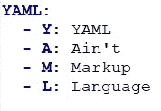

YAML

## 什么是 YAML？

*   YAML 是一种轻量级、人类可读的数据序列化语言。它旨在使格式易于读写。所以，任何人都能理解，就像一个非技术人员在 YAML 能读会写一样。
*   YAML 代表“YAML 不是标记语言”。
*   它类似于 XML 和 JSON，但是语法简单明了。
*   YAML 文件是用“，”创建的。yaml“或者”。yml "扩展。我们可以使用任何 IDE(集成开发环境)或文本编辑器来打开/创建 YAML 文件。
*   YAML 是 JSON 的超集。
*   这很容易，我们可以用一种简单的方式来表示复杂的映射。由于这个原因，现在在配置设置中使用 YAML。

## **XML vs JSON vs YAML**

以前我们用 XML，后来 JSON 出现了，现在是 YAML。

XML -> JOSN -> YAML

**XML、JSON 和 YAML 的例子**

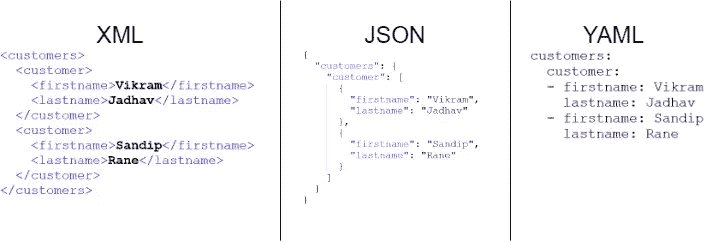

XML vs JSON vs YAML

现在我们可以看看 XML、JSON 和 YAML 之间有什么区别，以及它比 XML 和 JSON 更容易、更简单。

*   XML 和 JSON 很难阅读，但是 YAML 很容易阅读和理解。
*   对于 XML 中的层次结构，我们使用开始和结束标记。在 JSON 中我们使用大括号和方括号，在 YAML 中我们使用双空格字符。
*   XML 需要巨大的存储和网络带宽。JSON 比 XML 轻，YAML 比两者都轻。
*   XML 最适合需要控制模式的复杂项目。JSON 最适合 web 开发和通过 HTTP 传输数据。YAML 的配置最好。
*   XML 和 YAML 允许注释，但 JSON 不允许。

由于 YAML 易于阅读和理解，它被广泛用于在不同的 DevOps 工具和云应用程序中编写配置文件，如 YAML 被用于 Docker 和 Kubernetes。

**写 YAML 文件时要记住的要点**

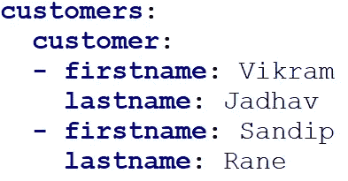

YAML example

*   使用空格缩进来表示结构。
*   地图是 YAML 文件的基本结构，就像字典一样。
*   我们不能在 YAML 使用制表符，使用空格。
*   YAML 区分大小写。

## **标量**

在 YAML，我们用键值对来写数据。

标量代表单个存储值。标量作为值分配给键名。您定义了一个带有名称、冒号和空格的键，然后为它保存一个值。

<key>:<value></value></key>

**例-** 名:维克拉姆

**注意-** 冒号(":)后的空格很重要

YAML 支持整数和浮点数值等常见类型，以及布尔和字符串等非数字类型。

**示例-**

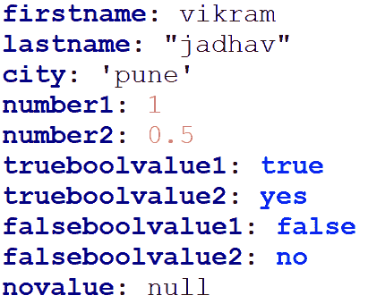

Scalar example

## **琴弦**

*   YAML 中的字符串不需要明确的双引号或单引号。
*   在 YAML，如果您的值包含特殊字符，请使用单引号或双引号。例如，这些特殊字符可能需要引号:{，}，[，]，，，&，:，*，#，？, |.-，<.>，=，！, %, @, \.
*   “是”和“否”应该用引号括起来(单引号或双引号),否则它们将被解释为真布尔值和假布尔值。

**折叠样式&字符串中的文字样式——**

*   使用>(折叠样式)删除字符串中的换行符。
*   使用|(文字样式)将字符串中的每个换行符转换为文字换行符。
*   您可以通过添加块换行指示符来控制字符串中最后一个新行以及任何尾随空白行(\n\n)的处理
*   >，|: "clip ":保留换行符，去掉尾随空行。
*   >-、|-: "strip ":去掉换行符，去掉尾随空行。
*   >+，|+: "keep ":保留换行符，保留尾随空白示例行

**例子——**

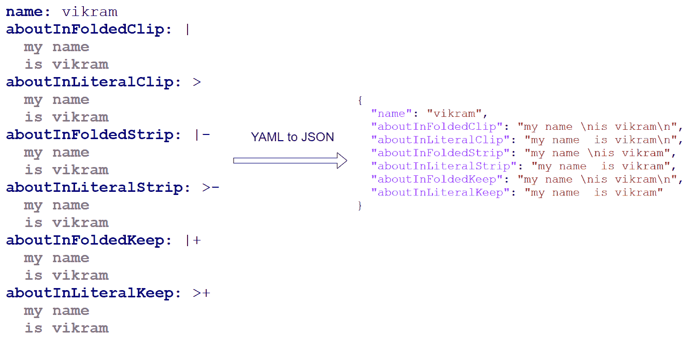

Folded style & Literal style in string

## **YAML 评论**

*   我们可以使用散列符号(#)在 YAML 文件中添加注释
*   YAML 支持单行注释，但不支持多行注释
*   在执行 YAML 的过程中，注释被跳过

**举例-**

# YAML 文件中的注释

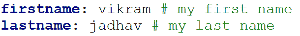

comments in YAML

## **YAML 的内隐型和外显型——**

*   当你赋值时，YAML 隐式地理解类型，但是如果你想显式地定义类型，你也可以这样做。
*   若要显式定义类型，请使用！！值前的[TypeName]。

**示例-**

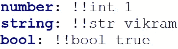

Explicit type in YAML

## **序列**

*   序列是按特定顺序列出的值。序列以破折号和空格(-)开头。
*   我们可以用块风格和流风格来写序列。
*   块样式使用空格来组织列表。
*   在流样式中，我们可以使用方括号内联编写序列。
*   我们可以把一个序列写成另一个序列。

**举例-**

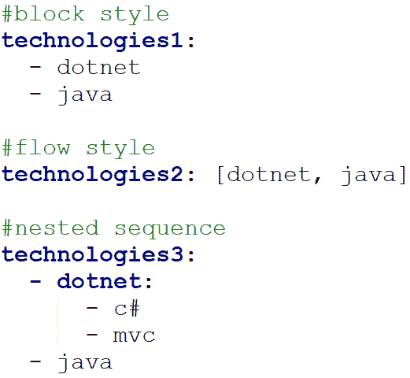

Sequences in YAML

## **字典-**

*   字典是嵌套在同一子组下的键值对的集合。
*   该键应该仅属于字符串类型。
*   字典定义为一个名称、一个冒号和一个空格，后跟一个或多个缩进的键值对。
*   通过使用字典，我们创建了像 Customer 这样的对象。

**举例-**

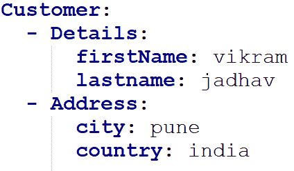

Dictionaries in YAML

## 复杂按键:

*   我们可以在 YAML 定义像多行键这样的复杂键。
*   使用？后跟一个空格，表示一个复合键的开始。

**举例-**

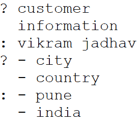

Complex keys

## 锚和别名-

*   如果我们想重复 YAML 文件中的某个部分，而不是在 YAML 文件中多次写入这个部分，我们可以使用锚和别名来减少冗余代码。
*   我们可以使用锚“&”来定义重复的部分。
*   要引用锚点，我们可以使用别名' * '。
*   YAML 锚点和别名不能包含“[”、“]”、“{”、“}”和“，”字符。

**举例-**

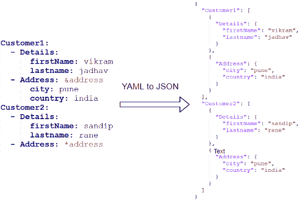

Anchors and Alias in YAML

*   我们可以在 YAML 使用'<<: before="" the="" alias.=""/>

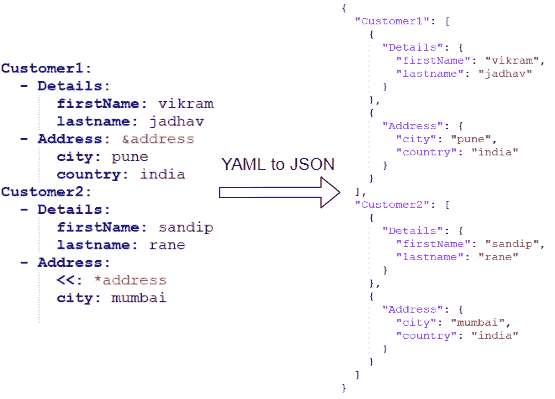

Override Anchor value

## **多文档-** 覆盖 YAML 中的锚值

*   在 YAML，文件以三个破折号(— -)开始，以三个句号(…)结束。
*   一些 YAML 处理器需要文档开始操作符。结束运算符通常是可选的。
*   我们可以在一个 YAML 文件中包含多个 YAML 文件。每个文档之间的分隔由三个破折号(— -)标记。

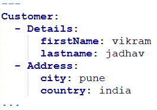

Document start and end

## **安全-**

*   YAML 是一种用户友好的数据格式化语言。YAML 不包含任何可执行命令，这使得 YAML 在与第三方交换文件时高度安全。
*   如果我们需要一个可执行的命令，那么我们需要将 YAML 与其他语言集成。

## 结论:

YAML 是一种人类可读的数据序列化语言。我们讨论了它的常用特性，比如定标器、序列、字典、复合键、锚和别名。由于其强大的语言功能，YAML 在基础设施中被用作编写配置文件和数据传输的代码。Docker 使用 YAML 创建 Dockerfile。在 Kubernetes 中，我们可以使用 YAML 创建存储和虚拟机。目前，YAML 广泛用于 DevOps 的管道开发。