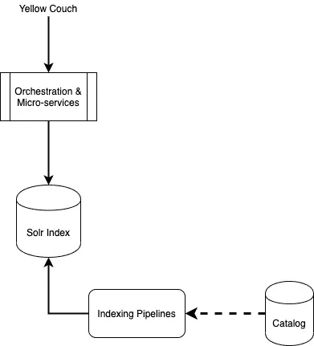
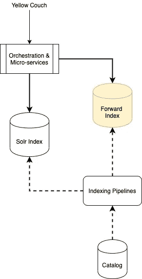
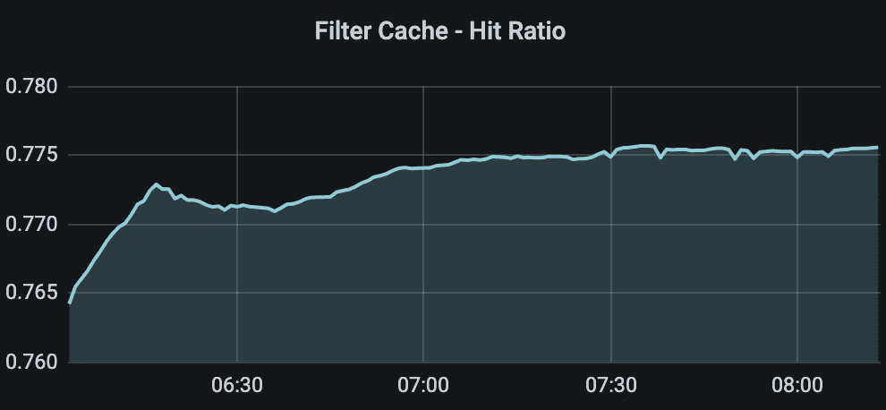
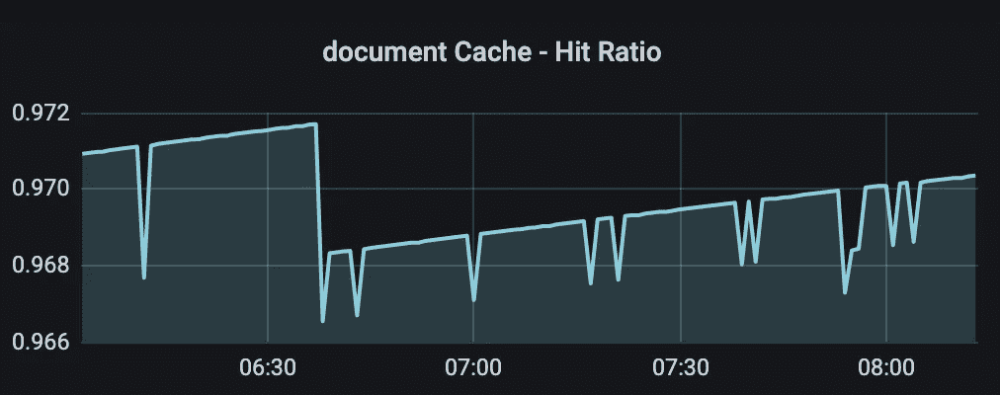
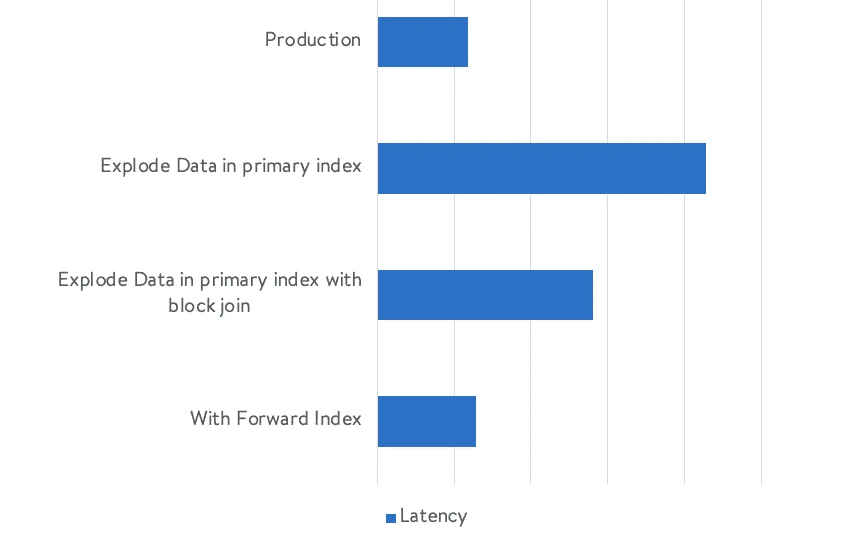

# 黄色沙发:两个 Solr 指数的故事

> 原文：<https://medium.com/walmartglobaltech/yellow-couch-tale-of-two-solr-indexes-9c39e635cf71?source=collection_archive---------0----------------------->

使用另一个 Solr 作为前向索引来解决 Andromeda 式搜索索引中的颜色和大小查询


Figure 1: A typical yellow chair from [Walmart Catalog](https://www.walmart.com/ip/Modern-Accent-Chair-Single-Sofa-Comfy-Fabric-Upholstered-Arm-Chair-Living-Room-Yellow/122173882?variantFieldId=actual_color)

在本帖中，我们将讨论如何解决颜色/尺寸查询和过滤器在搜索和项目页面中的可用性/合格性/价格差异问题。

# 问题陈述

当顾客对颜色或尺寸有意向时[例如，黄色沙发、特大床垫等]，我们在第一页上的结果从一开始就看起来非常相关。但是当我们转到商品页面时，有些商品可能没有我们想要的特定颜色的商品。

# 为什么会这样



Figure 2: 10..00 Feet Overview of Search Architecture

图 2 显示了任何电子商务搜索系统中的典型搜索查询路径。

一个查询首先命中我们的一个微服务，并经历搜索查询的所有动作[查询理解、重构、修正等]。]然后最后点击 Solr Index，它是从一个正在运行的索引管道中填充的。

> 现在，我们故事中的罪魁祸首是 Solr 索引或 Solr 中的数据模型。我们将一个项目所有可能的颜色或大小组合分组到一个文档中，并将其以非规范化格式[如下所示]存储在该索引中。因此，如果有任何彩色沙发可用，那么我们将该文档标记为可用，但我们不知道黄色是否可用。这是通过对我们的实时可用性服务 API(一个不同的服务)的另一个调用在项目页面上标识的。

```
Denormalized Format for presentation purpose:{id: 1,  color: [red, blue, green], available: true }
```

*问题:为什么不将所有项目组合的所有数据存储在搜索索引内的一个文档中？*

回答:沃尔玛在美国有 5000 多家商店，每家商店都有自己的供货情况、价格和资格信息。将所有信息存储在一个文档中对于索引来说是非常复杂和爆炸性的。

*问:为什么不分解索引并将每个变体存储为不同的文档*

答:这是我们尝试过的，但它给我们带来了巨大的延迟峰值，而且由于数据重复，索引大小也增加了。

# 系统设计

我们用一个前向索引解决了这个问题，细节如下。



Figure 3: What is better than 1 Solr Index: 2 Solr Index

图 3 显示了新的搜索设计，我们引入了一个新的数据存储[Forward Index]和它的另一个[Solr](https://lucene.apache.org/solr/)。

这个前向索引只有作为不同文档的变量项。因此，通过我们的编排层，我们在第一次调用 Primary Solr 之后进行另一次调用，以获取组中的相关项目。主 solr 返回最相关的组，第二 Solr 只计算出该组中最相关的颜色/尺寸项目。

```
Data Format in Forward Index:{parent_id: 1, id: 11,  color: red, available: true, price.....}
{parent_id: 1, id: 12,  color: yellow, available: false, price... }
```

我们对前向索引的查询主要是针对店铺可用性、资格、颜色和大小属性的[过滤查询](https://lucene.apache.org/solr/guide/6_6/common-query-parameters.html#CommonQueryParameters-Thefq_FilterQuery_Parameter)【FQ】。因此，我们充分利用文档缓存和过滤器缓存。下图显示了我们如何最大限度地利用 Solr 缓存。



Figure 4: [Filter Cache](https://lucene.apache.org/solr/guide/8_3/query-settings-in-solrconfig.html#filtercache) during the performance test



Figure 5: [Document Cache](https://lucene.apache.org/solr/guide/6_6/query-settings-in-solrconfig.html#QuerySettingsinSolrConfig-documentCache) during the performance test

对搜索查询延迟的整体延迟影响是最小的，因为这个调用与另一个微服务调用并行发生，后者发生在文档的后处理过程中，如图 6 所示。



Figure 6: Impact on Latency through various approaches

# 结论

我们的搜索路径中现在有两个 Solr 索引，其中一个有一个文档子集，用于过滤掉不相关的项目，并将相关的项目放在顶部。我们还有一个替代的索引管道来保持这个前向索引是最新的。因此，对于任何搜索查询，我们首先从主索引中获取前 N 个条目，然后基于二级调用进行过滤/提升/降级/交换。总而言之，颜色大小的查询现在工作得很好。

Solr 参考文件:

https://lucene.apache.org/solr/

我很想知道您是否想到了任何其他解决上述问题的创新和最佳方案，同样欢迎发表评论。:-)