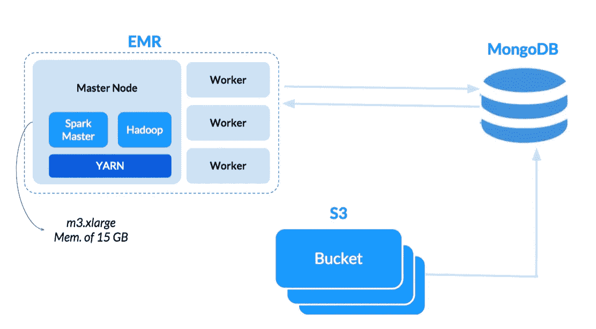

# Yelp 通过 PySpark、MongoDB、AWS EMR 评论情绪预测

> 原文：<https://medium.com/quick-code/yelp-reviews-sentiment-prediction-via-pyspark-mongodb-aws-emr-8bf0e21f5a92?source=collection_archive---------3----------------------->

作者:[尼查·鲁奇拉瓦特](https://medium.com/u/f8ecd6cdacf9?source=post_page-----8bf0e21f5a92--------------------------------)，[蒂娜·彭](https://medium.com/u/f9b481f9624?source=post_page-----8bf0e21f5a92--------------------------------)，[麦色·李](https://medium.com/u/13c0d3a0ad3?source=post_page-----8bf0e21f5a92--------------------------------)

情感分析或观点挖掘是一种常见的自然语言处理问题，用于确定文本是正面还是负面的。在一个顾客越来越多地在网上发表意见的世界里，企业了解自己的网上声誉至关重要。

我们将使用 Apache Spark 的机器学习库在 Yelp 数据集上探索一种简单的方法，以预测给定评论文本的情绪。我们还将分析哪些术语对积极或消极的餐馆评论贡献最大。

由于特征系数的可解释性，我们将使用**线性支持向量机**和**逻辑回归**来预测评论是正面还是负面。它们都是 NLP 应用的有效分类算法。

1.  **在 AWS EMR 实例上设置 MongoDB 和 Zeppelin Notebook**

我们设置了一个 AWS EMR 实例，有 1 个主实例和 3 个工作实例(每个实例都有一个 m3.xlarge，有 15 GB 内存和 8 个内核)。这对于 1.5 M 的评论子集很有效，但是更多的评论可以通过具有更大内存大小的节点或者具有更多节点的集群来处理。原始数据集存储在亚马逊 S3 桶中。MongoDB 设置在主节点上，Yelp 的表从 S3 导入，我们从那里加载到 Zeppelin Notebook。



要启动 PySpark 和 MongoDB 之间的连接:

```
from pyspark.sql import SparkSession
spark = SparkSession.builder.appName("yelp).getOrCreate()#connect to 'database' called yelp, 'collection' called review
review = spark.read.format("com.mongodb.spark.sql.DefaultSource")\
                .option("uri", "mongodb://127.0.0.1:27017/yelp.review").load()
```

**2。预处理评审数据**

首先，我们需要使用下面的函数清理评论文本，删除任何标点符号或数字。

```
import string
import redef remove_punct(text):
    regex = re.compile('[' + re.escape(string.punctuation) + '0-9\\r\\t\\n]')
    nopunct = regex.sub(" ", text)  
    return nopunct
```

我们还需要将星级转换为二进制等级，1 表示正面评价，0 表示负面评价。如果评价超过 4 星，则为正面评价；如果低于 4 星，则为负面评价。4 星以上的门槛是因为人们倾向于高估餐厅(例如，人们通常不认为 3 星餐厅是一家好餐厅)。

```
def convert_rating(rating):
    if rating >=4:
        return 1
    else:
        return 0
```

我们将把这些函数转换成 PySpark 的用户自定义函数，并在查询整个“review”集合时将它们应用于 text 和 rating 列。

```
from pyspark.sql.functions import udfpunct_remover = udf(lambda x: remove_punct(x))
rating_convert = udf(lambda x: convert_rating(x))#select 1.5 mn rows of reviews text and corresponding star rating with punc removed and ratings converted
resultDF = df.select('review_id', punct_remover('text'), rating_convert('stars')).limit(1500000)#user defined functions change column names so we rename the columns back to its original names
resultDF = resultDF.withColumnRenamed('<lambda>(text)', 'text')
resultDF = resultDF.withColumnRenamed('<lambda>(stars)', 'stars')
```

我们还需要对文本进行标记(分解成单词)并删除停用词(常见的英语术语，如“and”、“then”、“因此”)。这些都将使用现有的 SparkML 和管道库来完成。

```
from pyspark.ml.feature import *#tokenizer and stop word remover
tok = Tokenizer(inputCol="text", outputCol="words")
#stop word remover
stopwordrm = StopWordsRemover(inputCol='words', outputCol='words_nsw')# Build the pipeline 
pipeline = Pipeline(stages=[tok, stopwordrm])
# Fit the pipeline 
review_tokenized = pipeline.fit(resultDF).transform(resultDF).cache()
```

我们缓存清理后的数据，这样每次调用数据帧时都不需要重新计算。

**3)特征选择:选择并整合最重要的 n 元文法(可选)**

为了提高机器学习模型的准确性，我们尝试整合二元模型和三元模型。这是在停用词被移除之前通过标记化的文本列来完成的。

为了选择最重要的 n gram，我们将二元模型或三元模型的 [TF-IDF 矩阵](http://datameetsmedia.com/bag-of-words-tf-idf-explained/)分别输入到支持向量机模型中，并挑选出具有最大系数权重(正负)的 n gram。这很有效，因为 [SVM 已经被证明是特征选择的好方法](http://proceedings.mlr.press/v3/chang08a/chang08a.pdf)。

我们将这些 ngrams 连接回评论中，以便它们作为一个单词而不是两三个单独的单词被纳入模型中(例如，“伟大的客户服务”变成了“伟大的客户服务”)。

最好的模型由一元模型和三元模型组成。下面是我们如何选择三元模型的一个例子:

```
# add ngram column
n = 3
ngram = NGram(inputCol = 'words', outputCol = 'ngram', n = n)
add_ngram = ngram.transform(review_tokenized)# count vectorizer and tfidf
cv_ngram = CountVectorizer(inputCol='ngram', outputCol='tf_ngram')
cvModel_ngram = cv_ngram.fit(add_ngram)
cv_df_ngram = cvModel_ngram.transform(add_ngram)# create TF-IDF matrix
idf_ngram = IDF().setInputCol('tf_ngram').setOutputCol('tfidf_ngram')
tfidfModel_ngram = idf_ngram.fit(cv_df_ngram)
tfidf_df_ngram = tfidfModel_ngram.transform(cv_df_ngram)# split into training & testing set
splits_ngram = tfidf_df_ngram.select(['tfidf_ngram', 'label']).randomSplit([0.8,0.2],seed=100)
train_ngram = splits_ngram[0].cache()
test_ngram = splits_ngram[1].cache()# Convert feature matrix to LabeledPoint vectors
train_lb_ngram = train_ngram.rdd.map(lambda row: LabeledPoint(row[1], MLLibVectors.fromML(row[0])))
test_lb_ngram = train_ngram.rdd.map(lambda row: LabeledPoint(row[1], MLLibVectors.fromML(row[0])))# fit SVM model of only trigrams
numIterations = 50
regParam = 0.3
svm = SVMWithSGD.train(train_lb_ngram, numIterations, regParam=regParam)#extract top 20 trigrams based on weights
top_ngram = svm_coeffs_df_ngram.sort_values('weight')['ngram'].values[:20]
bottom_ngram = svm_coeffs_df_ngram.sort_values('weight', ascending=False)['ngram'].values[:20]
ngram_list = list(top_ngram) + list(bottom_ngram)
```

要在原文中连接这些顶级三元模型:

```
# replace the word with selected ngram
def ngram_concat(text):
    text1 = text.lower()
    for ngram in ngram_list:
        if ngram in text1:
            new_ngram = ngram.replace(' ', '_')
            text1 = text1.replace(ngram, new_ngram)
    return text1ngram_df = udf(lambda x: ngram_concat(x))
ngram_df = review_tokenized.select(ngram_df('text'), 'label')\
                          .withColumnRenamed('<lambda>(text)', 'text')
```

一旦实现了这一点，就需要重复步骤 2)中的管道，以使用串联的 ngram 更新标记化的列(而不是将管道应用于 resultDF，而是将其应用于 ngram_df)。

**4)构建最终的“单词包”TF-IDF 特征矩阵**

要构建最终的 TF-IDF 特征矩阵:

```
# count vectorizer and tfidf
cv = CountVectorizer(inputCol='words_nsw', outputCol='tf')
cvModel = cv.fit(review_tokenized)
count_vectorized = cvModel.transform(review_tokenized)tfidfModel = idf.fit(count_vectorized)
tfidf_df = tfidfModel.transform(count_vectorized)
```

**5)支持向量机**

为了测试模型的性能，我们将数据分为训练集和测试集:

```
# split into training and testing set
splits = tfidf_df.select(['tfidf', 'label']).randomSplit([0.8,0.2],seed=100)
train = splits[0].cache()
test = splits[1].cache()
```

我们在训练集上将 TF-IDF 特征矩阵拟合到 SVM 模型。一个超参数 regParam 用于控制过度拟合。值 0.3 在训练集和测试集上都产生了最好的 f1 分数。

```
numIterations = 50
regParam = 0.3
svm = SVMWithSGD.train(train_lb, numIterations, regParam=regParam)test_lb = test.rdd.map(lambda row: LabeledPoint(row[1], MLLibVectors.fromML(row[0])))
scoreAndLabels_test = test_lb.map(lambda x: (float(svm.predict(x.features)), x.label))
score_label_test = spark.createDataFrame(scoreAndLabels_test, ["prediction", "label"])
```

**6)正规化(弹性网)物流回归**

使用相同的训练数据，我们还应用了正则化逻辑回归。 [SVM 专注于寻找最大化最近点到边缘的距离的分离平面，而逻辑回归最大化数据的概率](http://www.cs.toronto.edu/~kswersky/wp-content/uploads/svm_vs_lr.pdf)(即离超平面越远越好)。在这种情况下，我们还调整了最佳超参数 RegParam 和 ElasticNetParam 以获得最佳结果。我们将模型拟合如下:

```
# Elastic Net Logit
lambda_par = 0.02
alpha_par = 0.3
lr = LogisticRegression().\
        setLabelCol('label').\
        setFeaturesCol('tfidf').\
        setRegParam(lambda_par).\
        setMaxIter(100).\
        setElasticNetParam(alpha_par)
lrModel = lr.fit(train)
lr_pred = lrModel.transform(test)
```

**7)评估**

请注意，由于数据集不平衡(正面评价多于负面评价)，f1 分数被选为评估基础。准确度不能说明全部情况，而 f1-作为准确度和召回率的加权平均值-可以揭示模型在识别预测相关性和正确预测真正相关结果的百分比方面的表现。

评估 SVM 模型:

```
f1_eval = MulticlassClassificationEvaluator(labelCol="label", predictionCol="prediction", metricName="f1")
svm_f1 = f1_eval.evaluate(score_label_test)
print("F1 score: %.4f" % svm_f1)
```

评估物流回归模型:

```
f1_eval = MulticlassClassificationEvaluator(labelCol="label", predictionCol="prediction", metricName="f1")
lr_f1 = f1_eval.evaluate(lr_pred)
print("F1 score: %.4f" % lr_f1)
```

**在测试集上，SVM 模型的 f1 值最高，为 87.32%。**逻辑回归模型在测试集上的 f1 值为 84.21%。

**8)特征分析**

我们可以使用来自最终 SVM 模型的系数权重来查看哪些术语对正面评论或负面评论的贡献最大。在这种情况下，与最积极的系数相关联的术语代表那些对积极评价贡献最大的术语。与最负系数相关联的术语表示对负面评价贡献最大的那些术语。

下面是一个单词云，用蓝色表示最“积极”的词语，用红色表示最“消极”的词语。


我们可以看到，最积极的词语包括“友好的员工”、“美味”、“出色的客户服务”、“美味的食物”。这表明顾客满意的重要因素是员工、食物口味和服务。可以通过删除诸如“棒极了”、“推荐”等短语来进一步改进。以便更多有意义的标记可以出现。

最负面的词语包括“分钟”、“价格过高”、“淡而无味”、“食物还可以”、“没什么特别的”。这表明，负面评价是由漫长的等待时间、价格过高的食物、糟糕的食物味道造成的，这种经历并不被视为什么特别的事情。

这篇文章总结了产生最佳结果的步骤。要查看我们尝试的所有步骤的所有代码，请查看这个 [GitHub](https://github.com/nicharuc/yelp-sentiment-prediction/blob/master/yelp_nlp_svm.md) 。

**请点击👏按钮下面几下，以示支持！⬇⬇谢谢！不要忘记遵循下面的快速代码。**

> 找到关于各种编程语言的[快速代码](http://www.quickcode.co/)的免费课程。获取 [Messenger](https://www.messenger.com/t/1493528657352302) 的新更新。