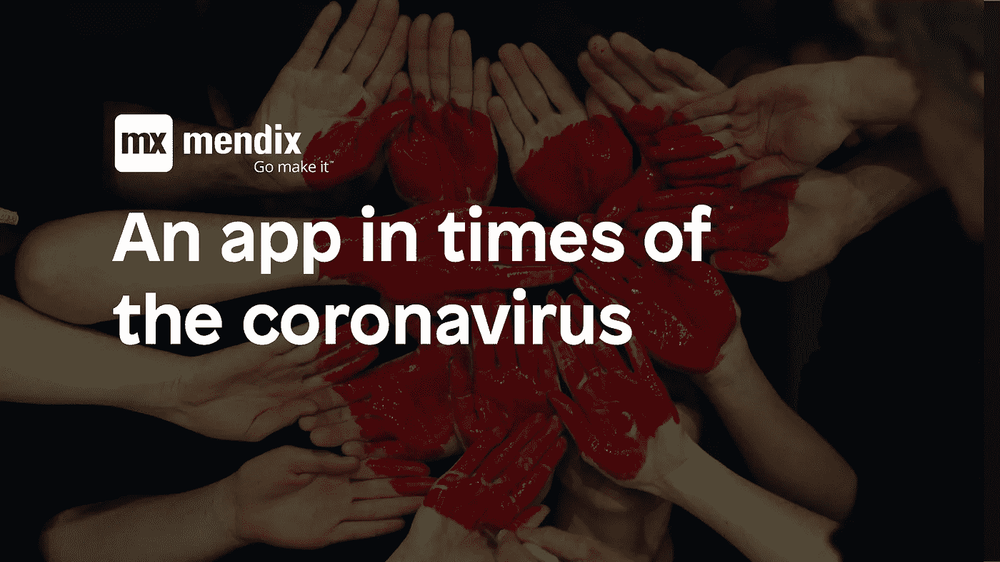

# 是的，我们帮助——冠状病毒时代的一款应用

> 原文：<https://medium.com/mendix/yes-we-help-an-app-in-times-of-the-coronavirus-df64be6b4873?source=collection_archive---------4----------------------->

一周前，德国政府呼吁采取行动，参加全国性的对抗冠状病毒的黑客马拉松。很快，五个西门子的反叛者决定由他们来为疫情的后果寻找解决方案。

在这篇博客中，你会发现对冠状病毒时期的解决方案和构思的简要介绍，以及对专家 Mendix 开发人员参与公益事业的请求。在接下来的博客中，应用程序开发人员将展示该应用程序是如何构建的，并将分享他们的经验和知识。

在病毒传播期间，许多人需要呆在家里，无法自己组织基本需求。通常邻居会帮忙，但他们需要先知道。我们的想法是一个移动应用程序，将需要支持的人与愿意提供支持的人联系起来。类似于门票系统，社区成员可以很容易地张贴他们的需求(杂货店购物，保姆等)。)并接受挑选这张票的人的帮助。这使得社区在社会距离遥远的时候保持团结。目前，该应用程序主要是在德国，但是，我们的目标是实现其他语言。

该应用程序是可扩展的，可以在世界各地使用，因此具有巨大的潜力。

这个团队由低代码爱好者、数字原生者、移居者和移民以及心地善良的人组成。

> 我们的应用程序还缺少的是让更多的人参与进来，尤其是愿意支持我们的低代码专家/门迪克斯专家。

如果你想支持一项伟大的事业，请联系托拜厄斯:【Tobias.Hornig@siemens.com 

要了解关于该应用程序的更多信息:

*   我们用一个叫做 Balsamiq 的工具建造了这个视觉模型:【https://balsamiq.cloud/ssm1w1k/p6d7luo
*   我们开始在门迪克斯开发我们的原型:[https://nachbarschaftsapp-sandbox.mxapps.io/](https://eur03.safelinks.protection.outlook.com/?url=https%3A%2F%2Fnachbarschaftsapp-sandbox.mxapps.io%2F&data=02%7C01%7CLars.Theunissen%40mendix.com%7Cf5f2b21d2d444894cedb08d7cf3ada83%7Cb4e3c78d8e3b46d8bc565540da23ba4d%7C0%7C0%7C637205723986332154&sdata=4W8RyPTCLwaBBjmXQeyy7axr%2BVRPE2sA5zxRKrjxc5U%3D&reserved=0)
*   我们制作了一个 YouTube 视频:

更多关于黑客马拉松的信息可以在[这里](https://wirvsvirushackathon.org/?lang=en)找到。