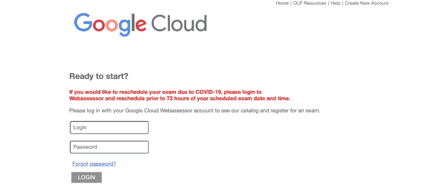
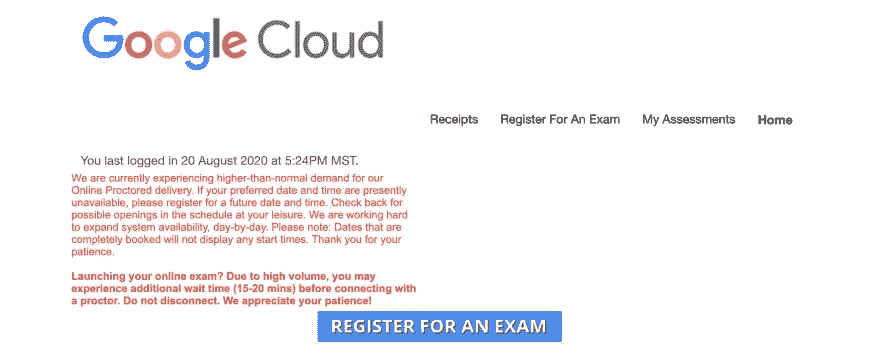
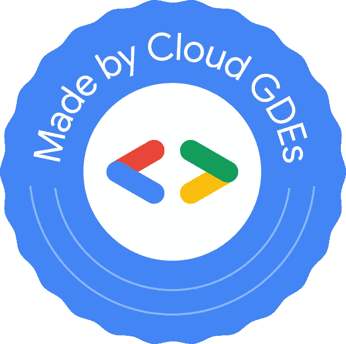

# 是的，你可以通过谷歌云助理工程师考试

> 原文：<https://medium.com/google-developer-experts/yes-you-can-pass-the-google-cloud-associate-engineer-exam-e4468a7bcf7d?source=collection_archive---------0----------------------->

大家好，

我在 2020 年 8 月 22 日参加了 Google Cloud 协理云工程师考试(通过)，这里有几个指点。我之前利用 Linux Academy 通过了 AWS 协理 Cloud Arch 考试，发现 Google Cloud 并不全面，但仍然非常有用。如果你有其他的云经验，比如 AWS，那么很容易将知识转化到 G-Cloud 上。然而，它确实需要经验(实验室或现实生活)和阅读来补充。谷歌的文档写得非常好，超级容易理解/遵循。

Google Cloud Certified Associate Cloud Engineer 考试面向擅长部署应用程序、监控运营和管理企业解决方案的 Google Cloud 工程师。协理云工程师可以使用谷歌云控制台和命令行界面来执行各种任务，以维护谷歌云平台上的一个或多个部署的解决方案。

云工程师助理考试旨在检验个人的专业知识:

*   设置云解决方案环境
*   规划和配置云解决方案
*   部署和实施云解决方案
*   确保云解决方案的成功运行
*   配置访问和安全性

由于新冠肺炎，我参加了远程考试。如果你想在家考试，这是一个好方法。

第一件事是去[https://webassessor.com/googlecloud](https://webassessor.com/googlecloud)，创建一个账户，并登录。

点击“注册考试”按钮

所以在那里，你可以搜索考试并付费。也许你在想:哦，这是远程的，我有机会看到我的笔记并在谷歌上搜索，就此打住，在开始考试之前，谷歌的一名代理人将通过网络评估员页面与你联系，他/她会问你一些问题，通过你的护照问你，要求你打开相机，以便查看并检查你所在的地方是否不受干扰。

其他事实:

*   测试时长:120 分钟。
*   费用是 125 美元。
*   最后的结果是通过或者失败。你永远看不到反馈，谷歌云评估似乎是一个黑匣子。
*   当你远程考试时，谷歌云可能需要 7-10 天来确认你的最终结果。为什么？我不确定，我想他们需要你再看一遍视频，以确保你在考试中没有抄袭或做违法的事情。

# Google 协理云工程师考试备考的重要题目有哪些？

毫无疑问，当我们讨论准备一场考试时，主要是我应该学什么，重要的题目是什么。但在分享准备谷歌云认证助理云工程师考试的重要话题之前，我想回答几个可能萦绕在你脑海中的问题。

在第一次尝试中，为自己准备重要的主题以清除考试是非常重要的。因此，根据我的经验，为了通过谷歌云认证助理云工程师考试，这里列出了一些你应该正确理解的重要主题。

# InternationalAssociationofMachinists 国际机械师协会

*   如何使用 CLI 列出和描述角色。
*   如何使用 GCP 控制台过滤角色和成员。
*   分配权限->角色->用户。

问题示例:

应用程序管理员负责管理项目中的所有资源。她想将几个服务帐户的责任委派给另一个管理员。如果创建了其他服务帐户，其他管理员也应该管理这些帐户。委托管理服务帐户所需权限的最佳方式是什么？

A.将 iam.serviceAccountUser 授予项目级别的管理员。->更正
B .将 iam.serviceAccountUser 授予服务帐户级别的管理员。
C .将 iam.serviceProjectAccountUser 授予项目级的管理员。
D .将 iam.serviceProjectAccountUser 授予服务帐户级别的管理员。

# 应用引擎

*   如何使用 CLI 在 App Engine 上部署应用程序？
*   应用引擎版本功能的使用案例。
*   如何在 App 引擎中分割多个版本之间的流量？
*   何时应该使用标准或灵活的功能。

问题示例:

您正在将一个 Python web 应用程序部署到 GCP。该应用程序仅使用自定义代码和基本 Python 库。您希望在可预见的未来偶尔使用应用程序，并希望最大限度地降低运行应用程序的成本和管理应用程序的 DevOps 开销。哪种计算服务是运行应用程序的最佳选择？

A.计算引擎
B. App 引擎标准环境- >正确
C. App 引擎灵活环境
D. Kubernetes 引擎

# VPC —网络

*   如何配置防火墙和用例。
*   共享 VPC。
*   VPC 对等 vs VPN vs 互连。
*   防火墙
*   虚拟专用网络
*   负载平衡器的类型和用例。

问题示例:

您已经创建了几个子网。大部分都在给 Stackdriver 发日志。一个子网没有发送日志。创建不转发日志的子网时，哪个选项可能配置错误？

A.流日志->正确
B .私有 IP 访问
C .堆栈驱动程序日志
D .可变长度子网掩码

# 项目

*   如何创建项目？
*   将项目与开票帐户链接。
*   如何列出和描述现有配置。
*   如何通过 CLI 创建和管理项目。

问题示例:

一家金融公司的应用程序需要访问数据库和云存储桶。没有预定义的角色可以授予所有需要的权限，而不授予一些不需要的权限。您决定创建一个自定义角色。定义自定义角色时，您应该遵循以下哪条原则？

A.职责轮换
B .最小原则
C .纵深防御
D .最小特权- >正确

# 账单账户

*   要求 roe 创建和管理计费账户。
*   理解计费账户、项目和组织之间的关系。
*   设置开票导出以估计每日/每月费用。

问题示例:

一家大型企业计划在多个细分领域使用 GCP。每个分部都独立管理，有自己的预算。大多数分支机构计划每月花费数万
美元。你会建议他们如何设置他们的帐单帐户？

A.使用单一自助计费帐户。
B .使用多个自助计费账户。
C .使用一个单独的开票账户。
D .使用多个已开具发票的记账账户。- >正确

# 计算引擎

*   市场场所的理解运用案例。
*   自动缩放类型何时使用外部 IP 地址。
*   元数据和标签的重要性。
*   高可用性。
*   了解托管和非托管实例组。

问题示例:

您公司的营销部门想要部署一个 web 应用程序，但不想管理服务器或集群。对他们来说，一个好的选择是:

A.计算引擎
B. Kubernetes 引擎
C. App 引擎- >正确
D .云函数

# 云存储(基于对象)

*   存储类。
*   多区域 vs 区域 vs 近线 vs 冷线。
*   存储类别的更改或转换。
*   使用生命周期策略自动删除对象和在不同存储类别之间转移对象。
*   规划和配置数据存储选项(云 SQL、— BigQuery、云扳手、云 Bigtable)。

问题示例:

您的经理请求您帮助降低云存储费用。你知道云存储中存储的一些文件很少被访问。对于这些文件，您会推荐哪种存储方式？

A.近线
B .区域
C .冷线- >正确
D .多区域

# 库伯内特发动机

*   docker 文件的部署过程。
*   如何创建 docker 文件以及对容器注册表的理解？
*   Kubernetes 中的自动缩放。
*   使用 pods 将容器应用程序部署到 Google Kubernetes 引擎。
*   配置 Google Kubernetes 引擎应用程序监控和日志记录。

问题示例:

哪个 gcloud 命令将创建一个名为 ch07-cluster-1 的四节点集群？
A. gcloud beta 容器集群创建 ch07-cluster-1—num-nodes = 4
b . g cloud 容器 beta 集群创建 ch07-cluster-1—num-nodes = 4
c . g cloud 容器集群创建 ch07-cluster-1—num-nodes = 4->正确
D. gcloud beta 容器集群创建 ch07-cluster-1 4

# 数据库

*   关系数据库:SQL 与 Spanner。
*   何时使用 BigQuery 和云 Bigtable。
*   使用产品初始化数据系统(例如，云 SQL、云数据存储、BigQuery、云扳手、云发布/订阅、云 Bigtable、云 Dataproc、云数据流、云存储)
*   大数据工具。
*   Dataproc 和数据流之间的区别。

问题练习:

贵公司的 IT 部门正在开发一个新的帐户管理应用程序，该应用程序需要事务和使用完全兼容的 SQL 执行关系数据库操作的能力。GCP 的数据存储选项包括:

A.扳手和云 SQL ->正确
B. Datastore 和 Bigtable
C .扳手和云存储
D. Datastore 和云 SQL

# 堆栈驱动程序

*   Stackdriver 在 Google cloud 中的重要性及其工作方式
*   创建和配置工作区
*   基于资源指标创建堆栈驱动程序警报
*   如何通过 GCP 控制台将不同 GCP 帐户的项目添加到单个 Stackdriver 帐户

问题示例:

什么是警觉疲劳，为什么它是一个问题？

A.对于不需要人工干预的事件，发送了太多的警报通知，最终 DevOps 工程师开始不太注意通知。->纠正
B .过多的警报会给系统带来不必要的负担。
C .太少的警报让 DevOps 工程师无法确定您的应用和基础设施的状态。
D .错误警报太多

# 我用于学习的资源

SiteTitle/linkCoursera [谷歌云平台基础:核心基础设施](https://www.coursera.org/learn/gcp-fundamentals) Linux Academy [谷歌认证助理云工程师](https://linuxacademy.com/cp/modules/view/id/791?redirect_uri=https://app.linuxacademy.com/search?query=Google%20Cloud%20Certified%20Associate%20Cloud%20Engineer%20)官方谷歌云认证助理云工程师学习指南(书)作者:Dan Sullivan - >你可以在 Amazon whiz labs[whiz labs](https://www.whizlabs.com/learn/course/google-cloud-associate-cloud-engineer)

关注 Whizlabs 网站。为了熟悉真正的形式考试，你可以参加他们的考试。当然，问题是不一样的，但是你会有一个很好的介绍。这个网站不是免费的，但也不贵。

# Qwiklabs —动手云实验室

Qwiklabs 为你提供了谷歌云平台的临时凭证，这样你就可以使用真实的东西来学习云——而不是模拟。从 30 分钟的个人实验室到多天的课程，从初级到专家，讲师指导或自定进度，主题包括机器学习、安全性、基础架构、应用程序开发等，我们都能满足您的需求。

*   谷歌云基础知识—[https://google.qwiklabs.com/quests/23](https://google.qwiklabs.com/quests/23)
*   云工程—[https://www.qwiklabs.com/quests/66](https://www.qwiklabs.com/quests/66)

# 官方链接

*   主链接—[https://cloud.google.com/certification/cloud-engineer](https://cloud.google.com/certification/cloud-engineer)
*   课题大纲—[https://cloud . Google . com/certification/guides/cloud-engineer](https://cloud.google.com/certification/guides/cloud-engineer)
*   实践考试—[https://cloud . Google . com/certification/practice-Exam/cloud-engineer](https://cloud.google.com/certification/practice-exam/cloud-engineer)

# 结论

通过认证考试总是很难，但并非不可能，你需要勇敢和大量的学习。如果您有任何疑问，我很乐意帮助您。您可以通过以下方式联系我或关注我:

[https://twitter.com/gelopfalcon](https://twitter.com/gelopfalcon)
[猎鹰教练 youtube 频道](https://www.youtube.com/channel/UCypyV-geyQF6gfBJlhb1DVA?view_as=subscriber)
[https://www.facebook.com/dockertico](https://www.facebook.com/dockertico)
[https://www.facebook.com/falconcoach87](https://www.facebook.com/falconcoach87)
https://www.meetup.com/gdg-costarica/

我将在我的 youtube 频道上教授你可以用来通过考试的技巧和问题。

保重，再见！

