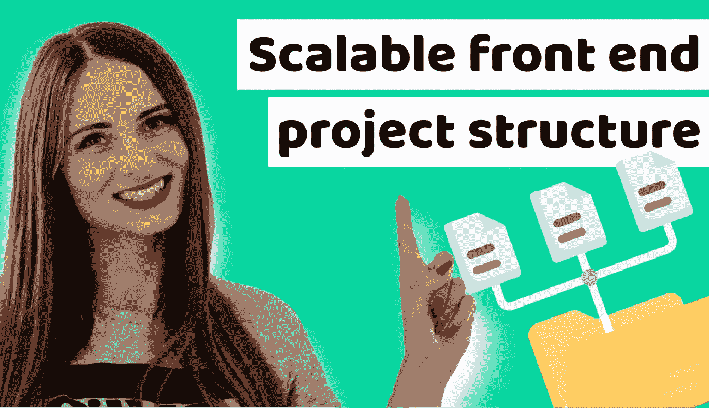

# 在你计划下一个前端应用程序的结构之前，你必须阅读这篇文章

> 原文：<https://medium.com/duomly-blockchain-online-courses/you-have-to-read-this-before-you-will-plan-the-structure-of-your-next-frontend-application-270ec4b677a5?source=collection_archive---------0----------------------->

[How to create a frontend project structure that scales and is easy to maintain?](https://www.blog.duomly.com/how-to-create-frontend-project-structure-that-scales-and-is-easy-to-maintain/)

本文最初发表于[https://www . blog . duomly . com/how-to-create-frontend-project-structure-that-scale-and-is-easy-maintenance/](https://www.blog.duomly.com/how-to-create-frontend-project-structure-that-scales-and-is-easy-to-maintain/)

# 前端项目结构介绍

前端从来没有像今天这样复杂。几年前，它是…