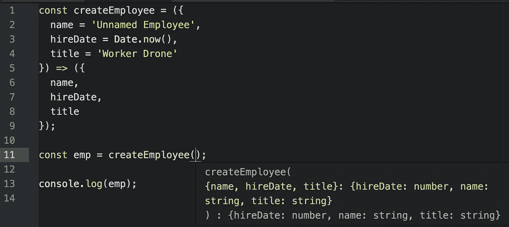
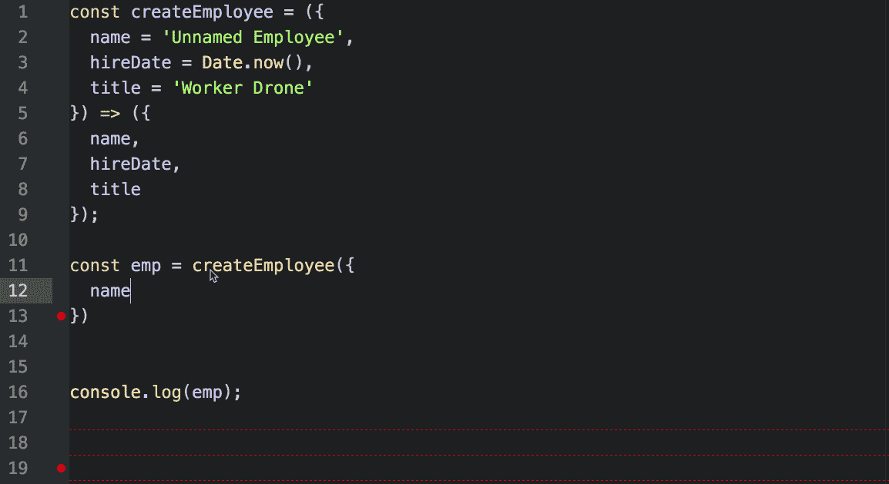
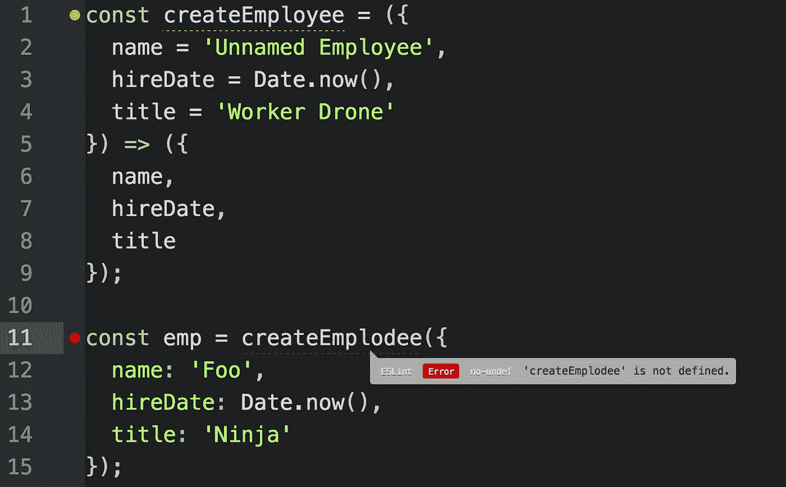

# 您可能不需要类型脚本(或静态类型)

> 原文：<https://medium.com/javascript-scene/you-might-not-need-typescript-or-static-types-aa7cb670a77b?source=collection_archive---------1----------------------->


Krispy Kreme — Scott Ableman (CC BY-NC-ND 2.0)

自从 Angular 2 项目决定采用 TypeScript 并以 TypeScript 编写所有文档示例以来，TypeScript 已经变得非常流行，但是它真的值得投资吗？

在我们开始之前，我先说我是静态类型支持的工具的粉丝，TypeScript 是目前 JavaScript 社区中我最喜欢的静态类型系统。

我来自一个使用静态类型语言的背景，包括 C/C++和 Java。JavaScript 的动态类型起初很难适应，但一旦我习惯了，就像从一个漫长黑暗的隧道中走出来，来到了光明中。静态类型有很多优点，但是动态类型也有很多优点。

我对技术栈和开发工具不感兴趣。我很实际。我做咨询，现在很多开发团队使用 Angular 2 和 TypeScript。如果我要给他们建议，我最好知道我在说什么。

我强烈建议您对新的和不同的技术堆栈和工具采取类似的开放态度。相信我，在你的职业生涯中，你会学到更多。

成为一名开发者意味着你选择了终生学习新事物。这是一个好主意，现在就和平解决这个问题。这并不意味着学习所有的新事物，但是如果你需要为你的工作学习新东西，或者仅仅是为了发现的快乐，要对新东西保持开放的态度。

> 发现的快乐是软件开发人员最大的乐趣之一。

几个月前，我决定同时尝试 Angular 2 和 TypeScript。我全职工作了几个月，为一个真正的开发团队开发一个真正的生产应用程序。

我的总体结论是这样的:

1.  Angular 2 有很多 React 中没有的东西，但所有这些额外的东西都没有让我更有效率，而且大多数好东西都可以在第三方模块中获得。
2.  TypeScript 碍事多于帮忙。它没有减少错误，也没有提高我们的生产力。

你可以在[“Angular 2 vs React:终极舞会”](/javascript-scene/angular-2-vs-react-the-ultimate-dance-off-60e7dfbc379c)中读到更多关于那次冒险的内容。

如果你已经是 TypeScript 的粉丝，你可能已经迫不及待地想对这篇文章发表评论了。在此之前，请阅读[“关于静态类型的惊人秘密”](/javascript-scene/the-shocking-secret-about-static-types-514d39bf30a3)。

要点:静态类型不会降低总体的错误密度，但是您可能仍然喜欢将它们用于开发工具。

每个人都在谈论静态类型的所有好处，但是相对来说很少有文章讨论它的缺点。让我们谈一谈这些。

# **静态类型如何阻碍维护**

类型注释显然会产生更多的语法噪音，这种语法使得代码更难阅读，更难维护。但是缺点更深一层。具体来说，静态类型会使所有这些事情变得更加困难(*不是不可能*，只是比它们需要的更复杂):

*   通用函数和多态性
*   高阶函数
*   对象组成

这很麻烦，因为我经常使用这些东西**，如果你是一个熟练的 JavaScript 程序员，你也很有可能经常使用它们。**

**我不想把这篇文章写成一本书，所以我们将集中讨论我最讨厌的静态类型:泛型函数。**

**一个**通用函数**是一个可以对多种类型的参数进行操作的函数。例如，计算总和的函数可能适用于数字，但也可能适用于提供返回数字的`.valueOf()`方法的对象(注意，在 JS 中，数字有一个`.valueOf()`方法，这使得使用相同的内部逻辑处理两种类型成为可能)。**

**在像 C++或 Java 这样的语言中，泛型函数需要类型构造函数或模板，它们接受类型参数以实现编译时函数多态性。**

**您需要解析的语法变成了多维的，因为单个函数实际上是两个函数:参数化的类型函数和实际执行行为的具体函数。**

**在动态类型语言中，不需要类型构造函数。解析类型对开发人员来说是抽象的。这种情况仍然会发生，但它发生在运行时的引擎盖下，开发人员不需要考虑它。**

**效果是开发人员不会被类型构造函数或模板语法分心。相反，开发人员可以使用 duck typing，*可选地*执行**运行时类型检查**。**

## **动态类型并不意味着没有类型检查**

**运行时类型检查是在程序运行时进行的类型检查，即在实际使用该类型的时候。动态类型检查内置在 JavaScript 中，但是它非常宽松，只有当你试图做一些超级疯狂的事情，比如调用`undefined`作为函数时，才会抛出错误。**

**当这种情况发生时，你的软件可能会崩溃。可能会导致生产中的服务器停机。哎呀。**

**为了进行更严格的类型检查，可以定义参数类型，然后用类型检查函数包装函数。**

**例如，使用 JavaScript + React，我们可以在开发模式下使用 React 的 PropTypes 进行自动动态类型检查，甚至可以为生产部署编译类型检查，因为一旦您验证了传递的类型是正确的，就不再需要它们了。**

**换句话说，应用程序不需要通过降低性能来从运行时类型检查中获益。**

**下面是一个简化的例子，说明如何在 JavaScript 中增强运行时类型检查:**

**一个更聪明的版本可以解析函数签名的文本，并从默认参数值中提取类型需求。例如，如果您试图传递一个`Date`对象而不是`hireDate`的纪元时间，您可能会抛出一个类型错误。**

**React 的 PropTypes 不是用这样的包装函数处理的。由于 React 是一个框架，它可以在组件生命周期中任意地、有条件地在任何地方插入类型检查。其他框架可以在开发和生产行为之间实现类似的区别:**

**如果您认为与静态类型相比，这听起来很麻烦，请考虑运行时类型检查的复杂性通常隐藏在框架或库中。上面这个应用程序的创建者只需要担心`createEmployee()`函数和它的`required`属性。换句话说，这比编写等价的静态类型注释要简单。**

> **注意:有一些开源库是为做我刚刚描述的事情而设计的。如果你想贡献一个实验性的，无论有没有 React 都可以在任何 JS 程序中轻松使用的工具，请查看 [rfx](https://github.com/ericelliott/rfx) 。**

## **输入错误会使我的应用程序停止运行吗？**

> **类型正确性并不能保证程序的正确性。**

**类型错误不是 bug 的唯一来源，抛出异常也不是响应 bug 时可能发生的最糟糕的事情。**

**希望你已经接受了我关于使用 TDD 的建议。静态类型很擅长捕捉类型错误，但是[对总体错误密度](/javascript-scene/the-shocking-secret-about-static-types-514d39bf30a3)影响不大，TDD 可以减少 40% — 80%的产品错误密度。代码审查也是降低 bug 密度的一种非常有效的方法。花在代码审查上的每一个小时可以节省 33 个小时的维护时间[1]。**

> **如果你同时使用 TDD 和代码评审，很少有类型错误会进入生产环境。**

**将运行时类型检查添加到这个组合中，您就拥有了一个针对发布错误的三层防线。我见过这些策略被用来为服务于数千万用户的生产应用程序提供百万以上的 LOC 代码库，并且错误密度非常低。**

**任何告诉你需要静态类型来发布大型复杂应用程序的人都是在吹牛。高质量的连续交付方法对 bug 密度和项目成功的影响比静态类型的存在与否要大得多。**

## **什么是鸭子打字？**

****Duck typing** 是一种类型检查的方法，它查看值的结构，而不是它的名称或类。这就像物体的特征检测。如果它像鸭子一样走路，像鸭子一样说话，我们就像对待鸭子一样对待它，即使它不是。**

**像 React 在 JS 中的 PropTypes 这样的系统是结构类型检查器，这意味着类型是基于其形状(其属性的名称和类型)而不是给定类型的名称或身份来检查的。**

**只有当所需的功能不存在时，才会引发类型错误。Duck typing 是有益的，因为在设计时，您没有任何办法知道程序的所有未来需求。如果将来你需要一个橡胶鸭子无人机，它仍然可以像普通鸭子一样飞行和嘎嘎叫，那该怎么办？**

**对于名义静态类型，您需要更改程序中处处使用 duck 的每个函数的类型签名——这个过程不容易通过自动化重构工具来辅助，因为需要更改的函数还不知道橡皮鸭无人机的存在。**

**有了鸭子类型和某些结构类型系统，你不需要改变签名来适应橡皮鸭无人机。**

# **概述**

**对于泛型函数，静态类型在两个方面阻碍了维护:**

1.  **模板和类型构造函数增加的复杂性使得在静态类型语言中设计和理解泛型函数变得更加困难。**
2.  **名义静态类型的限制使得将来向程序添加功能变得更加困难。**

**第二点不适用于结构化类型系统，如 TypeScript，它也检查功能可用性，而不是检查名称或标识。它确实适用于名义类型系统，包括 Java 和 C++。**

## **TypeScript 中的泛型函数**

**对于泛型来说，TypeScript 的复杂性增加了。看看标准 JavaScript 中的这个通用身份函数:**

```
const identity = arg => arg;
```

**与 TypeScript 中更嘈杂的静态类型函数相比:**

```
function identity<T>(arg: T): T {
  return arg;
}
```

**这两个函数实际上都不需要任何类型信息，因为值是在不使用任何参数特性的情况下传递的。**

**像 JavaScript 内置的动态类型系统可以选择使用静态数据流分析来推断和跟踪通过函数的标准 JavaScript 版本的参数类型。这就是像 [Tern.js](https://ternjs.net/) 和[脸书之流](https://flowtype.org/)这样的系统施展魔法的方式。(注意:Flow 是一个静态类型系统，具有动态推理&数据流分析功能…注释可选)。**

**例如，Flow 不需要类型构造函数来跟踪身份的类型。 ***编辑:*** *TypeScript 2 也加入了类似的功能。***

```
const identity = arg => arg;
const num:number = identity('NaN LOL');
// "String. This type is incompatible with number"
```

## **类型推理岩石**

**在 ES6 中，函数可以指定默认值，这些值可以由兼容的类型推理系统(如 Tern.js、TypeScript 和 Flow)用于类型推理。例如:**

```
const createEmployee = ({
  name = 'Unnamed Employee',
  hireDate = Date.now(),
  title = 'Worker Drone'
}) => ({
  name,
  hireDate,
  title
});
```

**下面是 atom-ternjs 显示的签名类型提示:**

****

**换句话说，只使用标准的动态类型 JavaScript 代码和支持推理的 IDE 工具，就可以获得静态类型系统 99%的好处。**

**TypeScript 的一个优点是，当推理功能不可避免地出现签名错误时(当一个函数包装另一个函数时，这种情况经常发生)，TypeScript 允许您手动为某个对象分配一个接口，以便在编辑器中显示正确的类型提示。**

**我希望 JavaScript 中有一种可选的 T2 方式来实现这一点。**

## **自动化重构呢？**

**两点:**

1.  **任何可以搜索依赖树并具有类型推断和数据流分析的开发工具，都可以完成大多数与静态类型工具相同的自动化重构。例如 Tern.js。**
2.  **在几十年的软件开发中，我可以用一只手来数清我花了几分钟以上的时间，用一种可以得到静态类型实质性帮助的方式来手动重构一些东西。**

## **自动完成呢？**

**每个像样的编辑器都有很好的自动完成插件。在 Tern.js、Flow 等的帮助下，许多支持类型推理…下面是 Atom 的内置`autocomplete-plus`功能:**

****

**Atom’s autocomplete-plus**

## **标识符名称错别字怎么办？**

**任何像样的过敏者都能发现这些错误。以下是 ESLint 的实际应用:**

****

**ESLint in action**

# **结论**

**在我看来，很多静态类型的拥护者并没有意识到现代动态类型工具的能力，比如运行时类型检查，以及带有数据流分析的类型推断。**

**如果您可以获得静态类型的 99%的好处，而没有额外的语法噪音和类型注释的认知开销，静态类型真的会给您带来开发人员生产力的净收益吗？**

> **静态类型真的值得权衡吗？**

**根据我的经验，答案是肯定的，也是否定的。**

****是的**，因为 TypeScript 的开发者工具目前比 Tern.js 和 Flow 的工具更好(据我所知)。所谓更好，我的意思是用户界面更好。比较好用。类型错误看起来就像来自 linter 的语法错误，格式非常漂亮。超级有用。我有点爱上它了。你可能也会坠入爱河。**

> **在我看来，TypeScript 提供了当今 JavaScript 世界中最好的开发人员工具体验。**

**如果 TypeScript 的工具默认为标准 JS 文件提供提示和类型推断，我会用它来代替 Tern.js，并向所有人推荐这个设置。简单的选择。**

> **注意:Tern.js 和 Flow 没有理由比不上 TypeScript 的开发人员工具 UX。有人只需要在编辑器/IDE 插件中投入一些 TLC。**

****没有**，因为随着 TypeScript 今天的工作，你需要教育你的团队中的开发人员如何正确地使用 TypeScript，以及如何使代码尽可能地不受语法干扰和注释的影响，同时仍然提供足够的类型线索和注释来使它值得。**

**我见过一个生产 TypeScript 项目有超过 1000 个类型错误，到处都是`any`注释(静态类型碍事时的逃生出口)。不管你听到多少，TypeScript 使运行大项目变得更容易，大项目伴随着大团队，开发人员教育和接受是软件开发中最难的问题之一。**

**TypeScript 是*绝对酷。*我真的很喜欢。但是它有很大的代价，忽视它是不明智的。在您决定使用 TypeScript 之前，仔细看看您的团队，非常认真和诚实地问自己:**

*   **你的团队准备好学习曲线了吗？**
*   **你是否有纪律去投资培训和指导，让你的开发人员跟上 TypeScript 的速度？**
*   **在未来的招聘中，你能一直保持同样的培训纪律吗？**
*   **从 ROI 的角度来看，最重要的是:TypeScript 提供的适度改进真的值得付出所有额外的努力吗？**

**或者:**

*   **你从标准 JS+tern . JS+ESLint+autocomplete+TDD+代码评审中获得的 99%的收益对你的团队来说够好了吗？**

> **提示:即使是静态类型，您仍然需要林挺、TDD 和代码审查来大大降低产品 bug 密度。**

**一句话:毫无疑问，静态类型感觉很好。咬一口热腾腾的油炸圈饼感觉很好。但是真的对你有好处吗？**

1.  **Glen w . Russell，“超大规模开发中的检验经验”， *IEEE 软件*，第 8 卷第 1 期(1991 年 1 月)，第 25–31 页。**

**想要加强你的 JavaScript 游戏吗？如果你不是会员，你就错过了。**

**[](https://ericelliottjs.com/product/lifetime-access-pass/)**

*****埃里克·艾略特*** *著有* [*【编程 JavaScript 应用】*](http://pjabook.com) *(奥赖利)，以及* [*【跟埃里克·艾略特学 JavaScript】*](http://ericelliottjs.com/product/lifetime-access-pass/)*。他为 Adobe Systems******尊巴健身*******华尔街日报*******【ESPN*******BBC****等顶级录音师贡献了软件经验********

****他大部分时间都在旧金山湾区和世界上最美丽的女人在一起。****