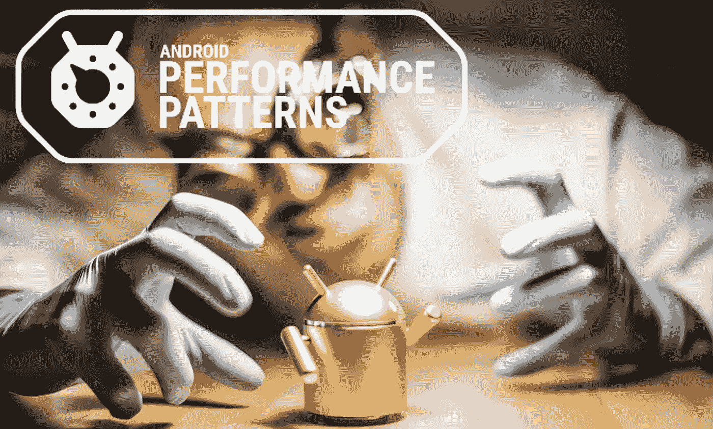
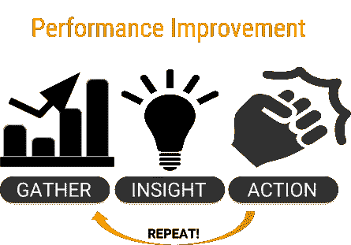

# 您、您的应用和 Android 性能

> 原文：<https://medium.com/androiddevelopers/you-your-app-and-android-performance-56485edc2a81?source=collection_archive---------4----------------------->

作为一名 Android 开发人员，你也是一名 Android 用户，你知道当一个应用程序无法加载，在每个动画中口吃，或随机崩溃，以及最重要的是，耗尽你设备的电池时是什么感觉。
**所以，你已经知道性能很重要**。

用户对响应迅速、运行流畅且一致、尊重手机有限电池资源的应用给予更高的评价。
**所以，你已经知道为什么性能很重要了。**

在这一系列 Android 性能模式文章中，你可以学习如何让你的应用程序具有高性能——快速、精简、礼貌。因为性能优化不仅仅是让你的应用快速计算和绘图，还包括优化应用资源，高效使用内存，以及在正确的时间以正确的方式完成正确的任务。

但是首先要做的是…

# 你的应用有性能问题吗？

简而言之，如果你的应用程序不能立即响应用户的操作，停顿，或者让用户在任何时候等待，那么你的应用程序就有性能问题。下面是对你的应用程序的最基本的性能测试——没有冗长的设置，没有花哨的工具，只有你的应用程序，你，还有一点诚实。准备好了吗？

1.  **在目标受众可能拥有的*最低端设备*** 上安装你的应用。(这个真的真的很重要！比方说，如果你在埃塞俄比亚开发了一个绘制油井地图的应用程序，你的主要受众可能没有最新的移动设备。)
2.  **像用户一样使用你的应用**，详细记录哪怕是最微小的等待、停顿或反应迟钝。也要注意随着时间的推移越来越慢。
3.  **将设备交给朋友，并在他们使用时做笔记。**(作为奖励，也听听他们的 UI 反馈。)
4.  如果你身边没有朋友，或者你想从更多的观众那里得到反馈，**考虑运行一个迷你可用性测试**，就像在[可用性咖啡馆视频](https://www.youtube.com/watch?v=0YL0xoSmyZI)中演示的那样。

**如果这些动手测试没有发现任何性能问题，那么恭喜您！**

但没那么快。这是真的，你已经无能为力了。或者，你可以更深入地研究，让你的应用程序表现得更好。为什么？因为你会增加你的潜在受众，包括连接速度较慢或设备简单的用户，这可能会让你在竞争中领先。

**现在，如果您收集了任何与性能相关的笔记，那么性能就是您的应用程序的一个问题。**

那么，下一步是什么？

一旦你主观地认为你的应用可以从性能调优中获益，我们有两个建议，一个客观的系统的方法来更快地发现和修复性能问题。

**1。使用性能分析工具**

Android 和 Android Studio 附带了许多性能分析工具，可以帮助您识别性能问题，并跟踪它们在代码中的位置。在您更改了代码之后，再次运行工具来测量您的更改的影响。比较结果以确保您已经修复了正确的问题，并找出您是否需要进行额外的性能改进。

**2。遵循性能调整生命周期**

性能调整生命周期包括三个阶段:

**收集信息**。使用[性能分析工具](http://developer.android.com/tools/performance/index.html)捕获关于您的应用的数据。我们将在以后的文章中更多地讨论如何使用工具来识别特定的问题。

**洞察**。花时间去理解你收集的数据对你的应用意味着什么。您可能需要使用多种工具反复收集信息，并获得洞察力，以查明问题(或问题！)是。

**行动起来。**收集所有信息和见解，确定并评估解决问题的不同方法。采取行动可以采取不同的形式，你决定做什么取决于你的情况和背景，这也可能包括编码资源、预算和截止日期。

一旦你采取了行动，验证你的改变有预期的结果:**收集第二组数据**。将它与你的原始数据进行比较。做出更多改变…然后清洗并重复，直到你的应用对所有用户动作的反应都一致流畅，不会结巴，也不会让用户等待。在所有目标设备上。

为了获得本节更有趣的版本，请观看 YouTube 上的 [Android 性能模式中的](https://www.youtube.com/playlist?list=PLOU2XLYxmsIKEOXh5TwZEv89aofHzNCiu)[工具不决定](https://www.youtube.com/watch?v=SA4j6KKjMRk)和[性能调整生命周期](https://youtu.be/_kKTGK-Cb_4)。如果你想提前了解，可以查看 Udacity 上的 [Android 性能课程。但最重要的是，加入我们的](https://www.udacity.com/course/android-performance--ud825) [Android Performance G+社区](https://plus.sandbox.google.com/communities/116342551728637785407)来获得关于构建高性能 Android 应用的伟大技巧，你猜对了。

敬请关注本系列的下一篇文章:
画出你所看到的！—可视化并减少过度绘制。