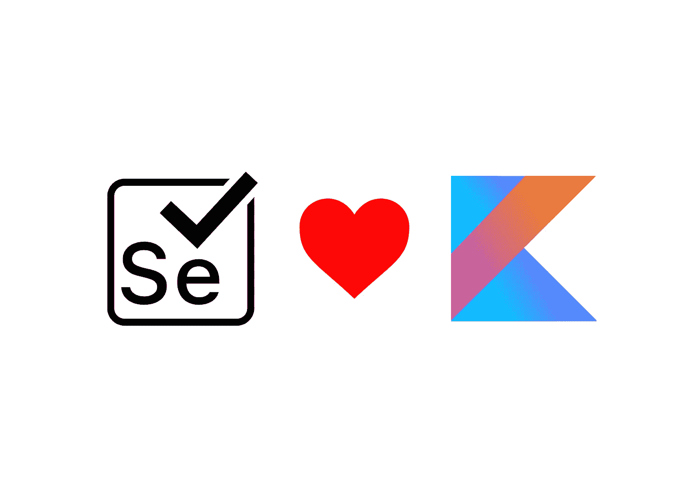
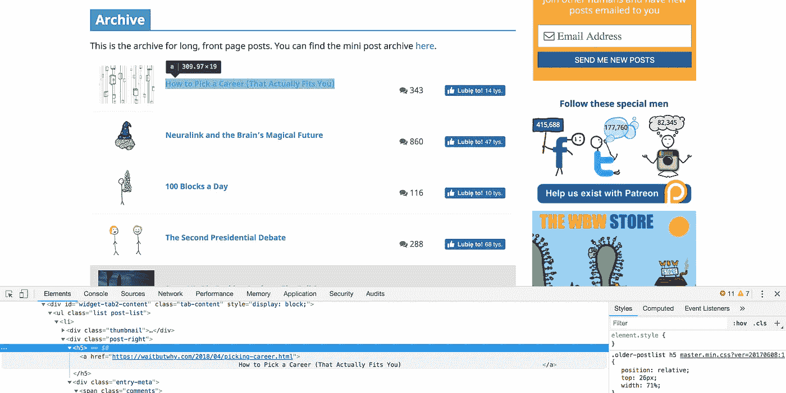
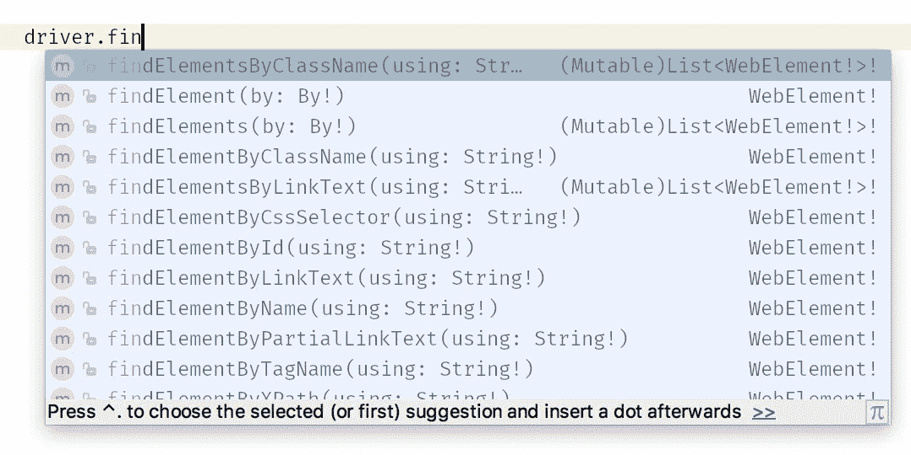
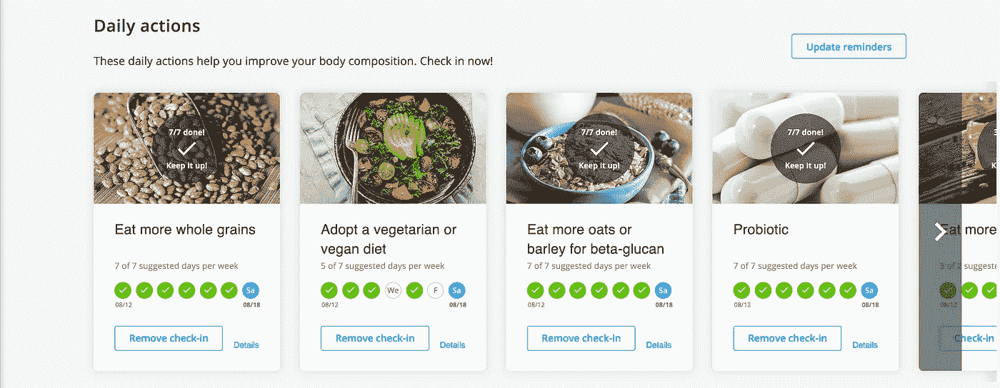

# 你在科特林的第一个硒数据刮刀

> 原文：<https://blog.kotlin-academy.com/your-first-selenium-data-scraper-in-kotlin-51ce22083fb9?source=collection_archive---------0----------------------->



很可能你每天都有一些例行任务要做。也许你一遍又一遍地查看 Twitter 或一些门户网站？也许你正在测试你的网站？或者你可能接到一个从某个网站收集大量数据的任务。这些动作中的一些可以使用应用程序或 API 来自动化。然而这并不总是可能的，相反，我们使用经典的点击和从我们的浏览器复制。虽然不需要这样。有许多替代方法可以为我们打开浏览器，进行一系列操作，包括在页面上移动和收集数据。其中最受欢迎的是[硒](https://www.seleniumhq.org/projects/ide/)。让我们从中得到一些乐趣，并制作一些样本数据收集器。

# 装置

当我们将 Kotlin 与 Gradle 一起使用时，我们只需添加以下依赖项即可使用 Selenium:

```
compile **group**: **'org.seleniumhq.selenium'**, **name**: **'selenium-java'**, **version**: **'2.41.0'**
```

或者，如果不使用 Gradle，可以使用 Maven 或者在项目中添加 Selenium jar。

你需要做的另一件事是你需要安装 [Chromedriver](https://sites.google.com/a/chromium.org/chromedriver/) 。好消息是，在 MacOS 上，你需要做的就是:

`brew install chromedriver`

现在，您已经准备好制作您的第一个数据刮刀了。

# 例 1。新闻报废

如果你需要了解在线时事通讯的新闻，你可以使用 RSS 订阅程序，比如 Feedly。尽管假设您最喜欢的门户网站不支持它。现在你每天都要查看很多次，寻找一些新闻。相反，我们将制作一个程序来为您检查并一个接一个地显示标题:

```
> bwwnews
How to Pick a Career (That Actually Fits You)
Neuralink and the Brain’s Magical Future
100 Blocks a Day
The Second Presidential Debate
SpaceX’s Big Fucking Rocket – The Full Story...
The Marriage Decision: Everything Forever or Nothi...
Wait But Hi – Full Report
Clueyness: A Weird Kind of Sad
...
> bwwnews
Nothing new on But Wait Why
```

(这只是一个例子！如果你想要新闻，我建议你使用邮件列表或者 RSS 订阅。)

怎么做？首先，我们需要初始化驱动程序:

```
**val** driver = ChromeDriver()
```

有了这个驱动程序，我们可以打开网站:

```
driver.get(**"https://waitbutwhy.com/archive"**)
```

找一些你可以用来识别新闻的东西:



这是一个困难的情况——我们要寻找的元素没有特定的类。我们将参考`post-right`,并利用我们对该网站如何构建的了解继续下去:

```
**val** titles = driver.findElementsByClassName(**"post-right"**)
        .*map* **{ it**.findElement(By.tagName(**"H5"**)) **}** .*map* **{ it**.findElement(By.tagName(**"A"**)) **}** .*map* **{ it**.*text* **}**
```

对于引用元素的不同方式，我建议使用色调:



我们只需要打印它，然后我们可以关闭驱动程序:

```
titles.*forEach*(::println)
driver.close()
```

一些有用的提示:如果您需要等待页面加载，请使用以下函数:

```
**fun** waitUntilPageIsReady(driver: ChromeDriver) {
    **val** executor = driver **as** JavascriptExecutor
    WebDriverWait(driver, 1)
            .until **{** executor.executeScript(**"return document.readyState"**) == **"complete" }** }
```

如果需要接受一些 cookies，使用`click`(可能的话，按 id 引用):

```
driver.findElementByClassName(**"intro_acceptAll--23PPA"**)?.click()
```

如果元素不一定在我们引用的容器内，我们需要捕捉一个错误或者使用`flatMap`:

```
**val** titles = driver.findElementsByClassName(**"post-right"**)
        .*flatMap* **{ it**.findElements(By.tagName(**"H5"**)) **}** .*map* **{ it**.findElement(By.tagName(**"A"**)) **}** .*map* **{ it**.*text* **}**
```

这是一个包含缓存并只显示新闻的版本:

```
**fun** main(args: Array<String>) {
    **val** driver = ChromeDriver()

    **val** file = File(**"BWWHistory.txt"**)
    **if** (!file.exists()) file.createNewFile()
    **val** history = file.*readLines*()

    driver.get(**"https://waitbutwhy.com/archive"**)

    **val** titles = driver.findElementsByClassName(**"post-right"**)
            .*map* **{ it**.findElement(By.tagName(**"H5"**)) **}** .*map* **{ it**.findElement(By.tagName(**"A"**)) **}** .*map* **{ it**.*text* **}

    val** new = titles - history
    **if** (new.isEmpty()) {
        *println*(**"Nothing new on But Wait Why?"**)
    } **else** {
        *println*(**"New articles:"**)
        new.*forEach* **{** *println*(**it**)
            file.*appendText*(**"$it\n"**)
        **}** }

    driver.close()
}
```

现在你只需要别名，你可以在你的系统的任何地方运行它。如果你想查看新闻，你可以启动你的程序，而不是查看网站。

[](https://leanpub.com/effectivekotlin/c/3YYtCtqCC6a4)

# 例 2。没有 API 的程序的 API

我用来改善健康饮食的一项服务是 Inside Tracker。它分析我的血液测试，并给我饮食建议。我发现它非常有用。不过，令人恼火的是，它有一个系统，只有在我申请推荐的情况下才进行跟踪，这真的不方便。尤其是缺乏移动或桌面应用程序是相当恼人的。他们希望我每天访问他们的网站，并填写它。我的想法是用一个简单的终端程序代替它:

```
Did you do "Eat more whole grains"? (y/n)
> y
Great!
Did you do "Adopt a vegetarian or vegan diet"? (y/n)
> n
Did you do "Eat more oats or barley for beta-glucan"? (y/n)
> 
Great!
Did you do "Probiotic"? (y/n)
> 
Great!
Did you do "Eat more fish"? (y/n)
```

我们来讨论一下动作的顺序。首先，我们需要登录:

```
**val** driver = ChromeDriver()
driver.get(**"https://www.insidetracker.com/public/login/"**)
driver.findElementByLinkText(**"Dismiss"**)?.click()
driver.findElementById(**"email"**).sendKeys(**"XXX@gmail.com"**)
driver.findElementById(**"password"**).sendKeys(**"XXX"**)
driver.findElementByName(**"submit"**).click()
```

然后我们可以得到卡片:

```
**val** cards = driver.findElementsByClassName(**"card-hover"**)
```

我们为他们每个人取了头衔:

```
**val** name = card.findElement(By.className(**"card__text"**)).*text*
```

请求用户操作并解释它(除“n”之外的所有内容都被解释为确认):

```
*println*(**"Did you do \"$**name**\"? (y/n)"**)
**val** resp = *readLine*()
**val** shouldBeChecked = resp != **"n"
if**(shouldBeChecked) {
     *println*(**"Great!"**)
}
```

我们检查动作是否已经被选中:

```
**val** cardWithNow = card.findElement(By.className(**"card__days-item--now"**))
**val** isChecked = **"card__days-item--check" in** cardWithNow.getAttribute(**"class"**)
```

然后，如果当前状态与期望的不同，我们切换操作:

```
**if**(isChecked != shouldBeChecked) {
    card.click()
    card.findElement(By.className(**"check-in-btn"**)).click()}
```

还需要一个技巧。在他们的网站上，你不会在一个页面上看到所有的动作。你需要滑动以移动到下一个操作:



简单的方法是使用右边的按钮滑动到下一个元素。问题是它只有在你悬停在某个动作上时才可见。你可以很容易地模拟它:

```
Actions(driver).moveToElement(card).perform()
```

然后按钮应该是可见的，我们可以点击它。只是为了避免我们在最后一个项目上时按钮不可见的情况，我们将检查它是否显示:

```
driver.findElementsByClassName(**"swiper-button-next"**)
      .*filter* **{ it**.*isDisplayed* **}** .*forEach* **{ it**.click() **}**
```

最后我们可以结束程序了:

```
driver.close()
driver.quit()
```

这是我最后的代码:

```
**fun** main(args: Array<String>) {
    **val** driver = ChromeDriver()
    driver.get(**"https://www.insidetracker.com/public/login/"**)
    driver.findElementByLinkText(**"Dismiss"**)?.click()
    driver.findElementById(**"email"**).sendKeys(**"XXX@gmail.com"**)
    driver.findElementById(**"password"**).sendKeys(**"XXX"**)
    driver.findElementByName(**"submit"**).click()
    **val** cards = driver.findElementsByClassName(**"card-hover"**)
    **for** (card **in** cards) {
        **val** name = card.findElement(By.className(**"card__text"**)).*text

        println*(**"Did you do \"$**name**\"? (y/n)"**)
        **val** resp = *readLine*()

        **val** cardWithNow = card.findElement(By.className(**"card__days-item--now"**))
        **val** isChecked = **"card__days-item--check" in** cardWithNow.getAttribute(**"class"**)
        **val** shouldBeChecked = resp != **"n"

        if**(shouldBeChecked) {
            *println*(**"Great!"**)
        }

        **if**(isChecked != shouldBeChecked) {
            card.click()
            card.findElements(By.className(**"check-in-btn"**)).*forEach* **{ it**.click() **}** }

        Actions(driver).moveToElement(card).perform()
        driver.findElementsByClassName(**"swiper-button-next"**)
                .*filter* **{ it**.*isDisplayed* **}** .*forEach* **{ it**.click() **}** }
    driver.close()
    driver.quit()
}
```

Program 相对于手动登记来说并不是一个很大的改进，但它是可编程的，现在我可以将它与我使用的其他程序或服务集成在一起。

# 摘要

制作这两个 Selenium 程序花了我不到 3 个小时。它真的很容易和有趣，我相信每个人都可以找到一天来玩它。

Selenium 也是一个强大的自动化工具。这是两个简单的例子，但是它应该给你一种感觉，每一个普通的动作，比如更新的签入或者执行某个动作的签入，都可以在任何网站上自动化。以下是更多关于如何使用它的想法:

*   检查您的视频在 YouTube 或 Google 网站上的位置。在一些排名中其他事物的位置。
*   在论坛和 Reddit 上自动分享内容。
*   在您使用的门户中查找并保存您想要跟踪的统计数据。

小心点。如果你在大型门户网站中过度使用自动操作，你可能会被封禁(我的朋友就这样在谷歌学术被封禁了，但他非常频繁地使用这个解决方案)。

你需要 Kotlin 工作室吗？请访问我们的网站,看看我们能为您做些什么。

了解卡帕头最新的重大新闻。学院、[订阅时事通讯](https://kotlin-academy.us17.list-manage.com/subscribe?u=5d3a48e1893758cb5be5c2919&id=d2ba84960a)、[观察推特](https://twitter.com/ktdotacademy)并在媒体上关注。

[](http://eepurl.com/diMmGv)