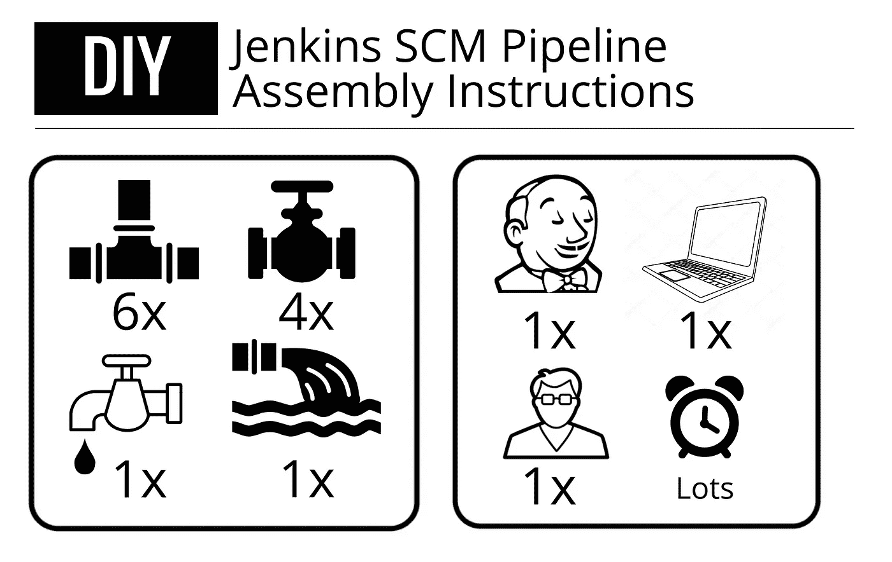
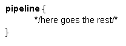
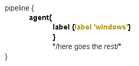
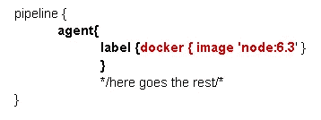
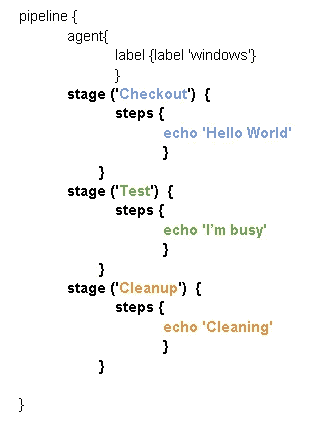
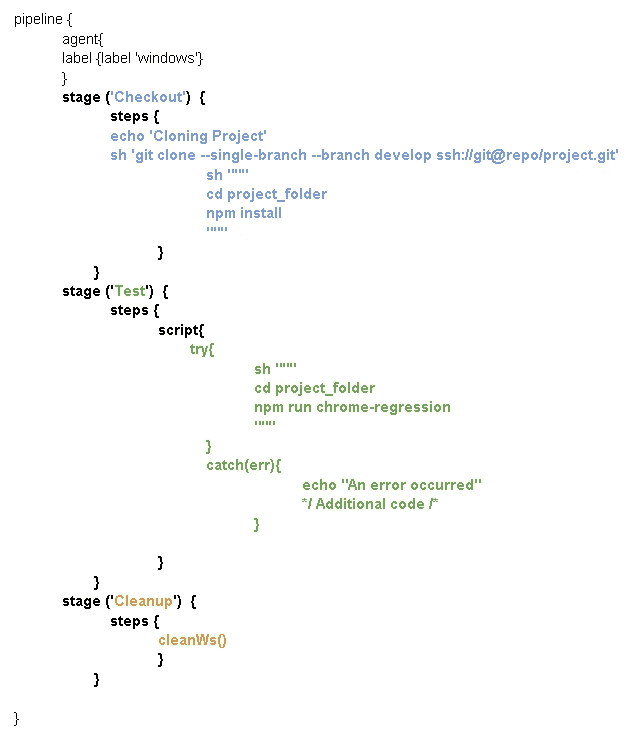
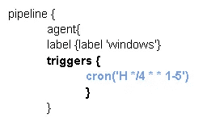
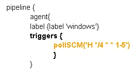
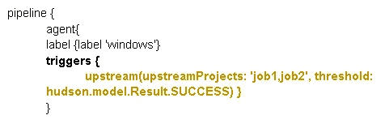

# 詹金斯供应链管理管道的第一步

> 原文：<https://medium.com/globant/your-first-steps-with-a-jenkins-scm-pipeline-3ffeb49cea1d?source=collection_archive---------0----------------------->



如果您以前从事过开发或测试自动化工作，您可能听说过管道。简单地说，这些是一组自动化构建、部署或编译软件的过程，其中自然包括测试自动化。

利用自动化服务器工具对于利用质量自动化是至关重要的，因为大多数时候，最终目标是有一组测试来帮助团队测试他们的构建、环境健康或软件的集成和回归。这通常被称为持续集成和持续部署，尽管这意味着非常不同的事情，但是我们不要偏离主题。

在这些工具中，也许最流行的是 Jenkins。虽然它可能不再像过去那样占有相同的市场份额，但它仍然是一款非常重要的软件。
首先让我们简单介绍一下 Jenkins:这是一款完全免费和开源的****自动化服务器**，它可以自动构建和部署，并连接到它将执行任务的环境。
Jenkins 提供了一个 Web 界面，可以帮助你设置你需要的大部分内容，但是当涉及到定义一个管道时，最好、最简单和最强大的方法是使用一个 **JenkinsFile** ，这也是我们在这里要讨论的。**

**简而言之，JenkinsFile 是一个 groovy (like)文件，包含 Jenkins 将为给定管道执行的所有命令。它允许流量控制，并且有一个[庞大的插件集合](https://www.jenkins.io/doc/pipeline/steps/)，可以做任何事情，从在各种平台上发送电子邮件、即时消息到所有你能想到的**集成**:亚马逊、Artifactory、Azure、Bitbucket、Docker、Github、谷歌、吉拉、Kubernetes、Office，你能想到的。**

**另一个好处是，您不需要 Jenkins 的任何管理员权限，因为这位于您的代码中，这意味着平台的所有者不需要让您完全控制该工具。**

**此外，如果您正在利用它的**多分支管道**特性，您甚至不必运行它所在的分支！您可以让它克隆一个不同的分支，甚至一个不同的存储库，然后运行它。它只需**提交到你的根目录**中，这是 Jenkins 首先要看的东西。**

**JenkinsFile 有两种类型:声明式和脚本式。它们的区别与语法有关，因为后者是“遗留”版本，所以我们将重点放在声明性上，它旨在使用声明性编程模型，但同样，让我们把它作为一个没有装饰的实用指南！**

**为了简单起见，我们将只关注构建管道，假设您的项目有一个现成的和配置好的 Jenkins 实例。**

**它们是不言自明的，但是让我们构建一个示例，这样我们就可以看到它的详细结构:**

**毫不奇怪，这是第一步:**

****

****代理人****

**您要定义的第二件事是哪个代理(机器)将执行这些步骤。请注意，这必须与已配置的代理相匹配。请查看[此链接](https://wiki.jenkins.io/display/JENKINS/Step+by+step+guide+to+set+up+master+and+agent+machines+on+Windows)了解更多信息。：**

****

**您也可以不使用标签，而是使用 **"agent any"** ，它将获取任何可用的代理，不管其设置如何，或者如果您有 docker 设置，您可以调用您需要的容器:**

****

**你可以在这里找到更多关于 docker 设置的信息。**

****阶段****

**阶段是一组步骤**,它们将按照编写的顺序发生。您可以创建一个来检查您的代码、数据设置、环境准备情况，或者您的构建的任何其他先决条件，然后创建一个来检查构建本身，并以清理、数据重置、报告等阶段来结束它。****

**Stages **还可以包含它们自己的代理、触发器和 post actions** ，我们稍后将会看到，但是请记住这一点，因为您可以在这些特性的基础上创建一个非常强大的管道来满足您的所有需求。**

****

****步骤****

**这些是您将在每个阶段执行的实际命令。如前所述，在这里您可以克隆任何分支，甚至不同的存储库，并运行主机代理支持的任何东西(它的操作系统和环境设置)。
让我们来看一个例子，它克隆了一个 git 项目的分支，为回归运行了一个 npm 脚本，然后使用[这个](https://www.jenkins.io/doc/pipeline/steps/ws-cleanup/) Jenkins 插件进行清理。**

****

**每一步的代码可以是你需要的任何东西，可能是启动/重启一个服务，运行一个 SQL 查询或者你需要的任何东西。**

**注意，在这种情况下，我们**作为脚本**跳过了这些步骤，这实际上是在声明性管道中使用**脚本化管道**语法的一种方式。虽然这不是一个标准的实践，但它是创建一些流控制的一个简单有效的方法，因为您还可以定义变量，或者像在本例中一样，使用一个 try catch 机制(您可以用它来重试其他步骤)**

**或者，您可以使用 UI 提供的[代码片段生成器](https://www.jenkins.io/doc/book/pipeline/getting-started/#snippet-generator)来帮助自己。**

****并发****

**在 Jenkins 中有不同的方法来管理并发性，但是对于我们的例子来说，最简单也可能是最有用的是**阶段并发性**。通常情况下，您需要在几个浏览器中运行您的测试，那么为什么不使用并行阶段，只是简单地改变浏览器来使用呢？**

****

**如您所见，只需添加一个额外的节点，其中包含您希望同时运行的所有阶段。**

**你也可以使用一个不同的 JenkinsFile 来创建不同的分支，这个 Jenkins file 可以克隆你的稳定分支，并且可以运行你需要的任何设置，但是我不会把它叫做并发性，也许是一个杂牌军？**

****触发****

**到目前为止，一切都很好，但是只有在 Jenkins web UI 上手动构建项目时，这个设置才会运行。那么少了什么呢？触发器。**

**有三种类型的触发器:**

**cron :简单地使用类似 cron 的时间戳，这是最友好的格式。**

****

****pollSCM** :如果你的目标是真正的 CI/CD 管道，这可能是更好的选择。它使用 cron 来定期检查源代码更改，如果发现任何更改，就会运行。**

****

****上游:**一个非常强大的功能，允许您根据上游作业结果对管道进行流量控制。简单地指出要看哪份工作，以及要确定什么样的门槛。
在前面的示例中，我们使用了一个简单的脚本化管道，我们也可以使用一个带有上游触发器的辅助阶段，该触发器仅在前者失败时触发。**

****

****帖子****

**Post 是一种在所有步骤完成后运行的阶段。利用报告是很有帮助的，因为在这个阶段您至少有两样东西:您的 Jenkins 日志，它是您的构建的输出，以及许多您可以使用的环境变量。**

**此外，**使用 emailext 插件，你可以在你的日志上使用 regex** 来构建你需要的任何东西！查看下面的示例(为了简单起见，我们跳过了所有阶段部分，post 出现在所有阶段之后，但可以在每个阶段使用)。可以根据构建的结果(总是、中止、失败、成功等)有条件地运行**

**下面的例子包括使用环境变量的电子邮件和使用 emailext 插件的日志正则表达式。**

```
post {
always {emailext attachmentsPattern: ‘project/reports/report.zip’,
mimeType: ‘text/html’,
attachLog: true,
subject: “Regression of: “ + env.JOB_NAME,
to: ‘team@client.com’,
body: ‘’’<html>
<body>
<h1>Summary of the automated TestExecution of today</h1>
<style>
table, th, td {border: 1px solid black; border-collapse: collapse;}
th{text-align: centre;background-color: #FFFFFF;}
</style>
<table style=”width:60%” >
<tr>
<th>Project Name</th>
<th>Build Number</th>
<th>Build URL </th>
</tr>
<tr>
<td>$PROJECT_NAME</td>
<td>$BUILD_NUMBER </td>
<td>$BUILD_URL</td>
</tr>
</table>
<table style=”width:60%” >
<tr>
<th>Browser</th>
<th>Scenarios</th>
<th>Steps</th>
<th>Time</th>
</tr>
<tr>
<td>Chrome</td><td>${BUILD_LOG_REGEX,regex=”(scenarios)”,linesBefore=0,linesAfter=0,maxMatches=1,showTruncatedLines=false}</td>
<td>${BUILD_LOG_REGEX,regex=”(steps)”,linesBefore=0,linesAfter=0,maxMatches=1,showTruncatedLines=false}</td>
<td>${BUILD_LOG_REGEX,regex=”([0–999]m[0–99]….[0–999]s)”,linesBefore=0,linesAfter=0,maxMatches=1,showTruncatedLines=false}</td>
</tr>
</table>
}
}
```

**我们在这里所做的是从一个文件夹中附加一个 zip 报告，然后要求 emailext 包含一个 Jenkins 日志的副本，将其发送到一个分发列表，然后添加一个包含两个表的基本 HTML 主体:一个包含构建信息及其链接，另一个包含日志上的 regex，该 regex 显示自动化框架日志的一个部分，该部分告知 cucumber 场景的数量、步骤以及所用的时间(在本例中为 test cafe+cumber js)**

**这就结束了对创建一个基于声明性 JenkinsFile 的 SCM 管道的非常基本的介绍。请随意使用我在整篇文章中提供的链接，但这里有完整的文档，有许多更多的部分、功能和条件，因此您可以根据自己的需要定制您的工作:[https://www.jenkins.io/doc/book/pipeline/syntax](https://www.jenkins.io/doc/book/pipeline/syntax)
这里有一个示例列表，可以给你新的想法，或者至少可以帮助你构建你正在寻找的东西:[https://www.jenkins.io/doc/pipeline/examples/](https://www.jenkins.io/doc/pipeline/examples/)**

**希望这能帮助你和詹金斯一起迈出第一步！**

**附注:我为代码片段选择了非常定制的格式，只是为了帮助你更好地理解这个过程，这需要将它们设置为图像以保存它，所以不幸的是复制粘贴无法完成。**