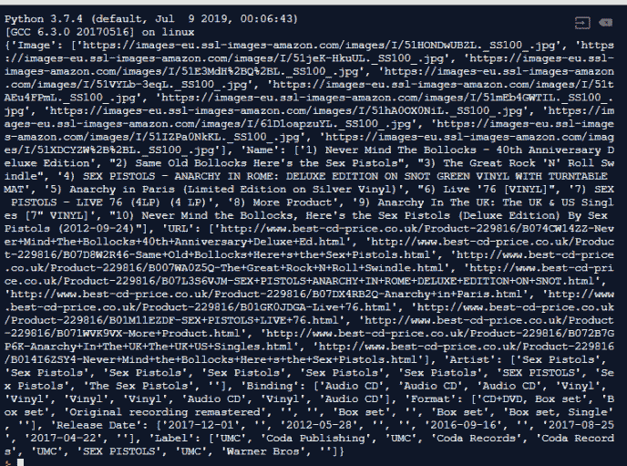

# 你的第一个用 Python 和美汤编写的网页抓取脚本

> 原文：<https://medium.com/quick-code/your-first-web-scraping-with-beautiful-soup-fae32e53edb6?source=collection_archive---------0----------------------->

今天我们将学习如何使用名为 Beautiful Soup 的 Python 库来废弃音乐网络商店。通过简单易读的代码，我们将从我们最喜欢的乐队中提取所有专辑的数据，并将其存储到一个. csv 文件中。

它简单，容易，甚至更好，是有效的。而且很有意思！

*If you prefer it, here’s the video version*

# 介绍

如果你知道什么是 Python，美汤和网页抓取，跳到[下一部分](https://letslearnabout.net/python/beautiful-soup/your-first-web-scraping-with-beautiful-soup/#importing-libraries)

如果你不知道，让我给你一个简单明了的解释:

*   **Python** :一种简单易学的编程语言。它是最常用的编程语言之一，因为它容易学习，因为它可以像英语一样阅读。
*   **Beautiful Soup**:Beautiful Soup 是一个库(一组预先写好代码)，它给我们提供了通过网络抓取从网站中提取数据的方法
*   网页抓取:一种从网站中提取数据的技术。

考虑到这一点，我们将安装 Beautiful Soup to scrap 网站， [Best CD Price](https://www.best-cd-price.co.uk/) 来获取数据并将其存储到一个. csv 文件中。我们走吧！

# 做好准备

如果您以前使用过 Python，请打开您最喜欢的 IDE，并在项目的文件夹中创建一个新环境。

如果你以前没用过 Python，我说的听起来很奇怪，不要慌。如果你不想安装，你不需要安装任何东西。只需打开 [repl.it](https://repl.it/) ，点击'+ next repl '，选择 Python 作为项目的语言，你就可以开始了:

在此图中，中间有一个白色的列，您将在其中编写代码，在您的右侧，一个黑色的终端将在其中显示输出，在您的左侧，一个列列出了所有 Python 文件。这个脚本只有一个文件。

# 导入库

如果我们必须只用 Python 编写所有代码，那将花费我们几天的时间，而不是不到 30 分钟。我们需要导入一些库来帮助我们。编写以下代码来导入它们:

我们正在进口:

*   [请求](https://2.python-requests.org/en/master/)获取 HTML 文件
*   [BeautifulSoup](https://www.crummy.com/software/BeautifulSoup/bs4/doc/) 从 HTML 文件中提取数据
*   [lxml](https://pypi.org/project/lxml/) 将 HTML 解析(或翻译)为 Python
*   熊猫可以操作我们的数据，打印并保存到一个文件中

如果我们点击“运行”,它将下载并安装所有的库。别担心，它只会在第一次安装它们。

# 获取 URL

从 URL 中抓取数据的第一步？正在获取那个 URL。

让我们简单点:去 [Best CD Price](http://www.best-cd-price.co.uk/) 搜索一个乐队，然后复制结果 URL。这是我的:[http://www . best-CD-price . co . uk/search-Keywords/1-/229816/sex+pistols . html](http://www.best-cd-price.co.uk/search-Keywords/1-/229816/sex+pistols.html)

导入代码后，键入以下内容:

运行代码，你会看到“一切都很酷！”消息。

我们已将我们的 URL 存储在“search_url”中。使用请求，我们使用“get”方法获取 URL，如果一切正常，我们的 URL 被成功获取，并带有 200 状态代码(成功)，我们打印“一切正常！”在我们的终点站。

Python 需要理解代码。要做到这一点，我们必须翻译它，或解析它。用以下代码替换最后一次打印:

我们用“lxml”解析器解析页面的文本，并打印结果。

听起来很熟悉？

我们将整个 URL 存储在“bs”变量中。现在，让我们拿我们需要的部分。

# 从 URL 中选择元素

现在有趣的部分开始了！

对我来说，网络抓取很有趣，尤其是因为这个过程的这一部分。我们就像犯罪现场的侦探，寻找可以追踪的线索。

复制搜索 URL 并将其粘贴到浏览器中。虽然推荐使用 Chrome，但这不是强制性的。右键单击网站的任意位置，然后选择“检查”。侧面的抽屉会打开。确保单击“元素”选项卡。

你看到的是网站的骨架:HTML 代码。

你可以将光标移动到一个 HTML 标签上，网站的这一部分就会被选中。

这相当于侦探放大镜。通过悬停在 HTML 标签上，我们可以知道我们需要选择哪一部分。

我发现了第一条线索。每张 CD 都包装在一个 li 标签(列表项)和一个 ul 标签(无序列表)中。那我们把他们都抓起来吧！

我们将我们的网站存储在“bs”变量中。我们使用“findAll”方法来查找每个“li”标签。但是由于有 192 个 li 元素，我们需要缩小范围。

我们将获取每个也有一个类“ResultItem”的 li 标签，然后打印所有标签和列表的长度。

我们得到整个列表和“10”，因为在我们的页面中有 10 个项目。看起来不错！

# 得到我们的第一张专辑

我们列出了 10 张(或更少，取决于乐队)专辑。让我们得到一个，看看我们如何提取所需的数据。然后，按照同样的过程，我们会得到其余的。

删除以前的打印内容，并键入以下内容:

选择所有 cd 后，我们将第一张 CD 存储到“CD”中并打印出来:

您也可以在网站上查看相同的结构:

让我们抓住这张光盘的信息！

按照与前面相同的技术，我们使用类“ProductImage”搜索“img”标记。现在方法是“find ”,因为我们只需要第一个实例，而不是每个实例

嗯，我们有元素，真的。但是我们只需要图像的 URL，它存储在“src”属性中。作为一个 Python 元素，我们可以使用['src']将其提取为一个普通属性

很好，我们提取了图像。让我们继续:

酷！只要几行字，我们就什么都有了！

我们不断提取我们需要的价值。如果元素是标签的属性，如“src”或“href”，我们使用[“href”]来提取它。如果它是开始和结束标签之间的文本，我们使用。'文本'。

由于不是每个相册都有相同的属性，我们首先尝试获取值，然后，如果它存在，我们尝试查找值。如果没有，我们就返回一个空字符串:

有些值有我们不需要的额外文本，如 format_album 或 release_date。我们用“replace”函数删除多余的文本，用一个空字符串替换该文本。

这是代码中最复杂的部分，但我相信你已经搞定了。

# 得到所有的专辑

我们可以从一张 CD 上获取信息，现在让我们对每张 CD 做同样的事情，并将它存储到一个对象中。

将“if page.status_code…”语句中的内容替换为

“数据”是我们的对象结构。我们将添加每个键中的每个值。相册的名称，数据['名称']，封面数据['图像']，等等。现在我们只需要循环遍历每一项，并将获取的值存储到数据对象中。

对于 list_all_cds 中的每个元素，我们将把它命名为“cd ”,并在 For 循环中运行代码。

获得每个值后，我们将数据值追加(或“添加”)到:

数据['图像']。附加(图像)

现在，印刷品。信息摆在那里，不错！

但是很难看，很难读…

还记得我们安装了“熊猫”图书馆吗？这将有助于我们显示数据和其他内容。

# 将相册存储在文件中

让我们用熊猫图书馆吧！将它复制到文件的末尾，在 for 循环之外:

Pandas(或 pd)给了我们一个“DataFrame”函数，我们在其中传递数据和列列表。就是这样。这足以创建一个漂亮的表。

“table.index = table.index +1”将第一个索引设置为“1”而不是“0”。

下一行创建一个. csv 文件，用逗号作为分隔符，并将编码设置为“UTF-8”。我们不想存储索引，所以我们将它设置为 false。

更好看！

但是现在检查你的左栏。您有一个“my_albums.csv”文件。所有东西都存放在那里！

恭喜你，你已经用 Python 写了你的第一个抓取脚本

# 加分！

您成功创建了自己的第一个抓取机器人。你可以通过切换网址刮任何乐队…

但是我们可以做得更好，对吗？

为什么不询问用户一个乐队的名字并搜索它。这能做到吗？

当然了。

用新代码替换旧代码:

这里我们要求用户输入一个波段，我们通过用“+”符号替换空格来格式化名称。这个网站搜索的时候就这样，所以我们也要这样。例:[http://www . best-CD-price . co . uk/search-Keywords/1-/229816/sex+pistols . html](http://www.best-cd-price.co.uk/search-Keywords/1-/229816/sex+pistols.html)

现在，我们的搜索 URL 使用格式化的乐队名称

这不是强制性的，但是在代码的开头使用 URL 来替换它是一种更好的做法。

现在这个文件有了每个乐队的名字，所以我们可以创建任意数量的文件，而不用重写它！让我们运行代码。

# 结论

在短短几分钟内，我们学会了如何:

*   获取网站
*   本地化我们要废弃的元素
*   分析我们需要点击什么 HTML 标签和类来检索值
*   如何将检索到的值存储到对象中
*   如何使用该对象创建文件
*   我们改进了代码，让我们的用户输入乐队的名字，并将其存储到一个文件中，以乐队的名字作为文件名。

我真的为你感到骄傲，直到本教程结束。

如果你发现代码有任何问题，记得和我的[回复代码](https://repl.it/@DavidMM1707/Best-CD-Price)进行比较，或者在 Twitter 上问我

记住，你可以在我的 [Python 教程](https://letslearnabout.net/tutorials-py/python-tutorials/)中了解更多关于 Python 的知识，或者在这里阅读[我的博客](https://letslearnabout.net/)