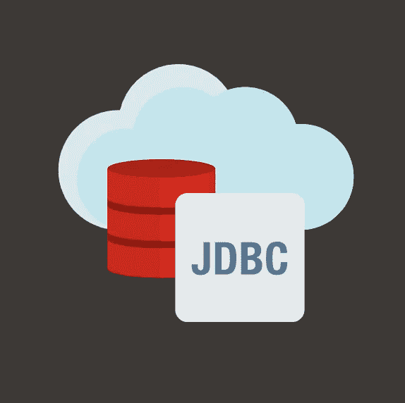

# Maven Central 上的 Oracle JDBC 驱动程序 19.7.0.0

> 原文：<https://medium.com/oracledevs/your-own-way-oracle-jdbc-drivers-19-7-0-0-on-maven-central-9a7dbb648995?source=collection_archive---------3----------------------->

# 用你自己的方式得到 JDBC 艺术品

核心 Oracle JDBC 驱动程序 jar(即 ojdbc8.jar)可以单独使用。然而，根据不同的用例，比如连接池、高可用性、到数据库云服务的连接、NLS 等等，需要额外的 jar。弄清楚某某用例需要哪些工件是令人难以置信的。

在 Maven Central 上之前的驱动程序打包中，我们已经预先建立了最常见用例所需的工件之间的依赖关系。熟悉 Maven 的 Java 开发人员已经排除了不想要的工件。然而，你们中的一些人告诉我们，你们更喜欢挑选自己需要的东西，而不是经历排除过程。

在这个版本中，以及以后，我们将让您在“挑选”和“预先建立”的依赖项之间进行选择。我们的 Maven 坐标没有变化。

# 挑选 JDBC 文物

从这个版本(19.7.0.0)开始，每个工件都是完全独立的，不会拖累任何其他工件。Maven Central 上的 19.7.0.0 工件的[列表](https://www.oracle.com/database/technologies/maven-central-guide.html#artifacts)和用途是什么？

## 材料清单(BOM)

19.7.0.0 版本中所有工件的完整列表。

下面是每个工件的概要描述(描述也可以在相应的 pom.xml 中找到)。

1)核心工件，一次只能一个，不能混用，有: *ojdbc8，ojdbc8_g，ojdbc8dms，ojdbc8dms_g，ojdbc10，ojdbc10_g，ojdbc10dms 和 ojdbc10dms_g*

*   ojdbc8:核心 diver 震击器，针对生产进行了优化，没有额外的仪器；它支持 JDBC 4.2 规范，可用于 JDK 8 号**、** JDK 9 号和 JDK 11 号
*   ojdbc10:核心驱动程序 jar，为生产优化，没有额外的工具；它支持 JDBC 规范 4.3，适用于 JDK 10 和 JDK 11
*   ojdbc8 DMS:ojdbc8 带有[动态监控服务](https://docs.oracle.com/en/database/oracle/oracle-database/19/jjdbc/JDBC-DMS-Metrics.html#GUID-601B7FA6-A11A-4927-A0AD-77AB6F5CF896)仪表
*   OJ DBC 10 DMS:OJ DBC 10 带有动态监控服务工具吗
*   ojdbc8_g:是带有调试工具的 OJ DBC 8；用于开发和测试
*   OJ DBC 10 _ g:OJ DBC 10 带有用于开发和测试的调试工具吗
*   OJ DBC 8d ms _ g:OJ DBC 8d ms 带有用于开发和测试的调试工具吗
*   OJ DBD 10 DMS _ g:OJ DBC 10 DMS 带有用于开发和测试的调试工具吗

2)可以与任何核心工件一起使用的配套工件有: *ucp、oraclepki、osdt_core、osdt_cert、ons、simplefan、xdb、xmlparserv2、orai18n* 和 *dms*

*   ucp:用于 Oracle 和非 Oracle 数据库的 Java 通用连接池
*   simplefan:简单快速应用程序通知(fan)库
*   ons:用于 FAN 事件的 Oracle 通知系统库
*   DMS:Oracle 动态监控系统(即可观察性)库
*   oraclepki:用于 Oracle wallets 的 Oracle PKI 提供者
*   osdt_cert:用于 Oracle wallets 的证书管理组件
*   osdt_core:用于 osdt_cert 的核心组件
*   xdb:支持 JDBC 4.x 标准 java.sql.SQLXML 接口
*   XML Parser v2:Oracle 数据库 XML 解析器库
*   orai18n:用于 NLS 或内部化支持的 Java 类

在您的 pom.xml 项目中，您可以通过配置一个<dependencymanagement>和一个<dependencies>块来提取相应的 jar，如下面的 Gist 文件所示。</dependencies></dependencymanagement>

Project’s POM.xml for pulling ojdbc8.jar

《使用 Maven 的 Oracle JDBC 开发人员指南》的“ [*DIY 使用 BOM*](https://www.oracle.com/database/technologies/maven-central-guide.html#DIY) ”选项卡中有一组基于用例的配方，您可以复制/粘贴。

# 使用预先建立的依赖关系

对于那些只想要所有数据库用例所需的工件的人，我们已经为生产、使用可观察性工具的生产、调试和使用可观察性工具的调试提供了一组预定义的依赖项。

以下 artifactid 提取了所有 Oracle 数据库用例所需的所有 jar:
**OJ DBC 8-生产、OJ DBC 8-调试、OJ DBC 8-可观察性、OJ DBC 8-可观察性-调试**:这些 artifactid 支持 JDBC 4.2 规范，用于 JDK 8 **、** 9 和 11。

**OJ DBC 10-生产，OJ DBC 10-调试，OJ DBC 10-可观察性，OJ DBC 10-可观察性-调试**:这些 artifactIds 支持 JDBC 4.3 与 JDK 10 和 11 一起使用。

示例:我想拉动生产罐

*   **ojd BC 8-production**artifact id 将提取 ojdbc8.jar、ucp.jar、oraclepki.jar、osdt_core.jar、osdt_cert.jar、ons.jar、simplefan.jar、xdb.jar、orai18n.jar 和 xmlparserv2.jar
*   **OJ DBC 10-production**artifact id 将提取 ojdbc10.jar、ucp.jar、oraclepki.jar、osdt_core.jar、osdt_cert.jar、ons.jar、simplefan.jar、xdb.jar、orai18n.jar 和 xmlparserv2.jar

您所需要做的就是将下面的依赖项添加到项目的 pom.xml 中的<dependencies>块下</dependencies>

《使用 Maven 的 Oracle JDBC 开发人员指南》的“ [*预先建立的依赖关系*](https://www.oracle.com/database/technologies/maven-central-guide.html#flavors) ”选项卡中有一些依赖关系示例，用于提取生产 jar(参见上面的示例)、使用可观察性工具的生产 jar、调试 jar 和使用可观察性工具的调试 jar。

# (用于命令)等待下面发表的消息

当我们在驱动程序和伴随 jar 中引入新的功能时，我们将通过 **@kmensah 宣布。**