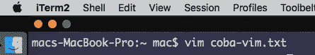

# Ini Alasan Saya Pindah Ke Vim

> 原文：<https://medium.easyread.co/yuk-belajar-pakai-vim-226894133299?source=collection_archive---------1----------------------->


[Image From Freepik](https://www.freepik.com/free-photo/cropped-view-of-hands-typing-on-laptop_1121914.htm)

Text editor, merupakan senjata utama yang selalu dipakai setiap hari nya oleh programmer.

Programmer gak mungkin bisa lepas dari text editor. karena kalau mau nulis kode pakai apalagi selain pakai text editor.

Kalian pasti udah tahu ya kalau ada banyak ragam pilihan text editor yang ada saat ini, SublimeText, VsCode , ATOM dan lain sebagainya yang tentunya menawarkan berbagai kelebihan dan kekurangannya masing-masing. Ada yang berbayar dan yang gratis.

Tapi kalian harus tahu salah satu Text Editor keren ini, yaitu **VIM** .

Ya vim namanya, ini adalah sebuah text editor yang jalan di terminal kalian.

agak aneh ya, text editor tapi jalannya di terminal.

seperti Text Editor lainnya , vim memiliki fungsi yang sama untuk menulis dan mengedit file.

oke oke jadi vim itu Text Editor , terus emang kenapa ya?

kalau kalian belum pernah nyobain vim silahkan buka terminal, lalu ketikkan vim coba-vim.txt .



vim coba-vim.txt

oke sekarang coba keluar dari vim!

Bingung om gimana caranya -_-

haha saat saya pertama kali nyoba vim, pusingnya tujuh keliling gak tahu gimana caranya buat keluar dari vim.

Coba Control+ c gak bisa. coba-coba nyerah , coba nyari di google , ketemu stackoverflow ternyata cuma perlu ngetik ini untuk keluar dari vim:

```
:q <Enter>
```

Emang buat kita yang pertama kali nyobain vim, di bagian ini yang paling ngebingungin karena beda banget dengan TextEditor kebanyakan.

Ini ada artikel bagus dari freecodecamp dia bilang, bahwa 1 dari setiap 20.000 visitor stackoverflow itu dateng cuma buat nanyain gimana caranya exit dari vim. wkwk

[](https://medium.freecodecamp.org/one-out-of-every-20-000-stack-overflow-visitors-is-just-trying-to-exit-vim-5a6b6175e7b6) [## How to Quit Vim and Exit the VI Editor — the most popular Stack Overflow question

### Vim is a popular keyboard-only code editor originally released in 1991\. It is famously difficult to learn, but many…

medium.freecodecamp.org](https://medium.freecodecamp.org/one-out-of-every-20-000-stack-overflow-visitors-is-just-trying-to-exit-vim-5a6b6175e7b6) 

di tulisan kali ini saya gak akan ngebahas gimana cara gunain vim secara praktikal, saya akan lebih ke cerita kenapa saya mau pakai vim di banding text editor lainnya.

Kalau Kalian mau panduam vim secara praktikal yang lengkap dan padat saya saranin Bukunya mas [Agung Setiawan](https://medium.com/u/1e432717add7?source=post_page-----226894133299--------------------------------) Software engineer bukalapak. Boleh di kepoin hehe.

[](https://agung-setiawan.com/bukuvim/) [## Vim untuk Semua

### "Vim untuk Semua" adalah buku yang mengajari bagaimana menggunakan vim untuk ngoding dengan efisien, serta menyenangkan…

agung-setiawan.com](https://agung-setiawan.com/bukuvim/) 

## Apa yang ngebuat vim ini spesial di banding text editor lain?

terus apa ya kelebihannya vim, kesan pertama nya aja ngebingunginnya ampun.

Ternyata ini dia spesialnya menurut saya.

## Gak Boleh Pakai Mouse

Hal ini juga yang ngebuat saya bingung saat pakai text editor vim ini. Saya biasa pakai SublimeText, sudah normal pakai mouse untuk pindahin cursor ke sana-sini.

Dan sekarang si vim akan maksa kita untuk gak pakai mouse dalam segala hal.

Jadi tangan kita hanya fokus di keyboard. jari-jari kita gak boleh pindah dari atas keyboard.

Walaupun sebenarnya kita bisa atur kok agar bisa pakai mouse di vim. Tapi secara default vim tidak mengizinkan menggunakan mouse.

Tanpa kalian sadari sebenarnya waktu yang kita butuhkan untuk berpindah dari keyboard ke mouse lalu dari mouse ke keyboard lagi itu membutuhkan waktu yang lumayan banyak.

Nah dengan vim ini kita akan belajar untuk tidak lagi membutuhkan mouse, semuanya bisa di lakukan hanya dengan keyboard saja. Kerenkan!

## Vim Text Editor Yang Efisien

untuk Text Editor modern seperti VsCode atau Atom, ternyata hanya untuk mengetikkan kode berikut membutuhkan memory yang banyak! bandingkan dengan vim!

```
**#include** <stdio.h>**int** main() {
  printf("Hello, world!\n");
}
```


KiloByte memory yang dibutuhkan untuk membuka 60 byte c file

[](https://medium.com/@caspervonb/why-i-still-use-vim-67afd76b4db6) [## Why I Still Use Vim

### And no, it’s not because I can’t figure out how to close it.

medium.com](https://medium.com/@caspervonb/why-i-still-use-vim-67afd76b4db6) 

Jadi kerasa gak worth it, ngabisin banyak memory komputer kita hanya untuk text editor.

## Vim Ngajarin Kita Untuk Produktif

Dengan pakai vim, saya jadi ngerasa vim ini ngajarin saya untuk ngelakuin semuanya dengan cara singkat dan efisien.

contoh nya ya seperti gak boleh pakai mouse itu, saya jadi terpaksa harus mengetahui dan menggunakan banyak shortcut key untuk mencapai satu tugas.

dan ini jadi nular ke semua nya, dengan vim saya jadi terus belajar gimana sih cara tercepat dan terbaik untuk melakukan suatu hal.

pas banget buat kalian para programmer, kita ini kan sebenernya campuran males dan pintar.

karena kemalasan dan kepintaran, kita jadi selalu mencari celah dan cara bagaimana mencapai suatu hal dengan cepat dan efisien.

## Vim Tahu Banget Kerjaannya Programmer

kalau kalian programmer kawakan, pasti tahu dong gimana kerjaan sehari-harinya programmer itu.

kalau kalian belum tahu ternyata waktu yang dibutuh kan untuk memaintenance atau improvement kode yang sudah ada itu lebih banyak di banding membuat kode baru atau fitur baru.

Bisa baca ini untuk tahu lebih tentang topik ini

[](https://medium.com/@haidarafifmaulana/buat-koding-mu-jadi-hidup-8a4cd761ed7d) [## Buat Kodemu jadi Supel

### harinya sebagai programmer pasti selalu berkutat dengan barisan kode.

medium.com](https://medium.com/@haidarafifmaulana/buat-koding-mu-jadi-hidup-8a4cd761ed7d) 

Di vim dikenal istilah mode normal, insert dan view :

*   Mode Normal : ini adalah mode yang paling sering kita gunakan. Ya namanya juga **normal.** di mode normal ini fokus nya untuk navigasi file dan edit-edit.
*   Mode Insert : ini adalah mode normalnya text editor pada umumnya. tapi ini bukan normanlnya vim hehe. di mode ini kita bisa bebas menginput text seperti layak nya text editor biasanya.
*   Mode view : ini adalah mode untuk kita menselect atau memblock text.

kalau kita renungin, kenapa ya mode normal nya vim itu fokus ke navigasi text dan pengeditan, tidak seperti text editor lainnya yang selalu dalam mode **Insert.**

ini lah hebatnya Vim, vim itu tahu banget kerjaannya programmer.

kita lebih banyak membaca dan mengedit kode legacy (kode yang sudah lama) di banding menulis kode yang baru.

Dan kita juga jadi paham, bahwa lebih baik kita mengurusi kode yang sudah ada / fitur lama dengan mengimprove dan memperbaikinya terlebih dahulu di bandingkan membuat fitur baru.

Karena kita programmer harus sadar dan pahami, bahwa dengan membuat fitur baru itu artinya menambah bug baru. Ya karena kita sama-sama tahu, enggak ada program yang sempurna 100%.

Oke, that’s all yang bisa saya sharing mengenai kisah saya menggunakan vim. di sini saya bukan mengatakan bahwa vim ini lebih baik dari Text Editor lain. Pandangan tiap orang berbeda-beda, dan kalau udah ngomongin mana yang lebih baik , gak akan ada habis-habisnya.

Untuk Tulisan praktikal Vim akan saya tulis di waktu berikutnya.

Jika Kalian ngerasa bermanfaat atas tulisan saya silahkan berikan claps dan share nya ya agar semakin banyak orang yang tahu akan Text Editor keren ini. Dan jangan Lupa untuk memberikan response nya di kolom di bawah ini !

Happy Coding 😄 😄 💻

**Terima Kasih Sudah Membaca :)**

Buat kalian yang baru memulai perjalanan menuju dunia programming boleh baca artikel renyah berikut :

[](https://medium.com/@haidarafifmaulana/bagaimana-memulai-karir-sebagai-software-developer-a54a8e576cde) [## Bagaimana Memulai karir sebagai Software Developer

### Pertanyaan bagaimana memulai ini adalah pertanyaan pasaran yang sering banget di tanyakan oleh pemula.

medium.com](https://medium.com/@haidarafifmaulana/bagaimana-memulai-karir-sebagai-software-developer-a54a8e576cde) 

Buat kalian yang baru memulai perjalan menuju dunia ReactJs dan VuesJs boleh baca artikel berikut ini :

[](https://medium.com/@haidarafifmaulana/app-pertama-dengan-react-serunya-ngoding-reactjs-2f13db5f732c) [## App Pertama dengan React, Serunya ngoding ReactJS

### Javascript gak ada habis keren nya. kalau udah ngomong javascript pengen banget di pelajarin semua nya.

medium.com](https://medium.com/@haidarafifmaulana/app-pertama-dengan-react-serunya-ngoding-reactjs-2f13db5f732c) [](https://medium.com/@haidarafifmaulana/reaksi-pertama-saat-coba-vue-js-4c2c1fbbd75a) [## Reaksi Pertama saat coba Vue js

### sampai beberapa waktu yang lalu saya gak ngerti kenapa javascript bisa jadi bahasa pemrograman no 1 paling banyak di…

medium.com](https://medium.com/@haidarafifmaulana/reaksi-pertama-saat-coba-vue-js-4c2c1fbbd75a) 

*Artikel ini di tulis oleh* [*Haidar Afif Maulana*](https://medium.com/u/631846fabf4?source=post_page-----226894133299--------------------------------) *, beliau adalah proffesional Full Stack Developer sejak 2014, beliau sering menulis artikel mengenai Software Engineering dan Programming. Follow profilnya untuk mendapatkan update-an terbaru artikel-artikel beliau.*

*Jika anda merasa artikel ini menarik dan bermanfaat, bagikan ke lingkaran pertemanan anda, agar mereka dapat membaca artikel ini.*