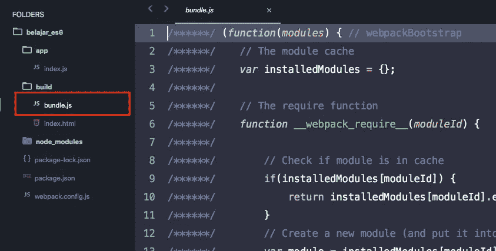
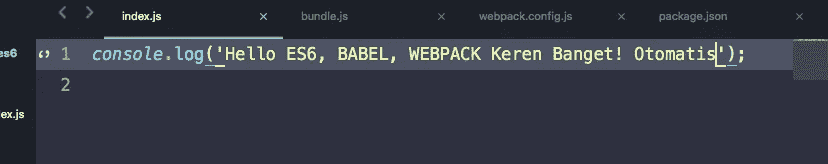

# Yuk Kenalan Dengan ES6 (part 1)

> 原文：<https://medium.easyread.co/yuk-kenalan-dengan-es6-part-1-dee0f97d3330?source=collection_archive---------1----------------------->


ES6

Javacript. Siapa yang gak kenal dengan javascript, bahasa pemrograman terpopuler lintas platform.

tapi ada banyak kah yang tahu *ecmascript ?*

kebanyak programmer pasti jarang denger kata tersebut, sekalipun untuk kita yang setiap hari nya ngulik front end pakai javascript.

dan ternyata ecmascript itu adalah javascript.

dan EcmaScriprt versi 5 (ES5) adalah bahasa javascript yang kita kenal v selama ini.

di dunia teknologi itu gak ada hal yang sama terus menerus, dan yang terus menerus sama itu adalah perubahaan itu sendiri.

tahun semakin bertambah, perkembangan teknologi semakin berkembang pesat.

saat ini ecmascript sudah mulai ke tahap. versi 8 (ES8).

kayaknya kita udah ketinggalan ya untuk belajar ES6 hehe,

tapi jangan pernah merasa ketinggal dalam mengikuti perkembangan teknologi.

kalau kita udah commit untuk terjun di teknologi maka artinya kita siap untuk long life learning.

jadi apa ya bedanya javascript dengan ES6?

*   syntax dan fiturnya
*   urusan class, module, object dan array serta manipulasi nya

tapi sayangnya saat ini kebanyak browser belum mendukung ES6 , jadi kita perlu tools untuk menangani masalah ini yaitu dengan menggunakan:

*   babel
*   webpack

oke kita mulai aja.

sebelum masuk tahap koding kita siapkan dulu environment koding nya agar bisa berjalan.

silahkan install node js dan npm. download di website resminya

[](https://nodejs.org/en/) [## Node.js

### Node.js® is a JavaScript runtime built on Chrome's V8 JavaScript engine. Node.js uses an event-driven, non-blocking I/O…

nodejs.org](https://nodejs.org/en/) 

jika sudah selesai di install, pastikan terinstall dengan benar. dengan cara buka terminal lalu ketikkan

```
node -v
npm -v
```


node dan npm version

sebelumnya saya sudah menyebutkan jika kita mau menjalankan ES6 maka kita perlu 2 hal yaitu **babel** dan **webpack.**

kenapa kita memerlukan babel? apa fungsi dari babel itu ?

oke, jadi babel itu adalah **transpiler** .

ini kata wikipedia

[](https://en.wikipedia.org/wiki/Source-to-source_compiler) [## Source-to-source compiler - Wikipedia

### A source-to-source compiler, transcompiler or transpiler is a type of compiler that takes the source code of a program…

en.wikipedia.org](https://en.wikipedia.org/wiki/Source-to-source_compiler) 

intinya fungsi babel itu adalah merubah kode ES6 menjadi kode ES5 atau javascript yang kita kenal sekarang.

karena kebanyakan browser sekarang baru mendukung ES5 (javascript).


Contoh transpiler dari ES6 ke ES5

di atas ini adalah contoh apa yang dilakukan oleh babel.

*let* dan *const* adalah cara penulisan variabel di ES6, lalu oleh babel diubah ke ES5 yang tadinya *let* atau *const* diubah jadi *var.*

selanjut nya **webpack.**

apa itu *webpack* dan kenapa menggunakan *webpack* ?

dalam ngoding javascript tentunya kita akan banyak menggunakan package-package agar javascript kita bisa jadi sebuah aplikasi.

dan kalau package nya banyak tentu harus ada yang ngatur, dan webpack inilah yang akan ngatur. bahkan webpack akan membundle modul-modul yang ada hanya menjadi satu file js saja.

dengan begitu aplikasi kita tidak akan meload banyak resource dan akan menyedikit kan kemungkinan adanya bug.

cukup intro nya kita langsung praktek. buka terminal:

buat sebuah direktori baru di tempat manapun.


dan jalankan npm init.

akan ada pertanyaan-pertanyaan seperti apa nama package nya, versi berapa, description nya, authornya.

silahkan di isi atau enter terus saja sampai selesai.


lalu jalankan command untuk menginstall webpack

```
npm install --save-dev webpack
```

silahkan buka folder belajar_es6 dengan text editor

buat direktori bernama **build** lalu buat file **index.html** di dalamnya.

isi dengan kode berikut:


index.html di folder build

lalu buat folder app dan buat file index.js di dalamnya, lalu ketikkan code berikut di dalamnya :


index.js

lalu kita harus buat configurasi webpack dengan membuat file webpack.config.js

lalu isi dengan kode berikut :


maksudnya adalah kita akan mengeksport kode ES6 yang ada di app/index.js ke build/bundle.js dan tentunya sudah dalam bentuk ES5 (javascript lama).

buka package.json, kita akan edit bagian scripts untuk menjalan webpack:


ubah jadi seperti berikut :


webpack build

lalu jalankan script tersebut di terminal

```
npm run build
```


perhatikan di direktori build sekarang sudah ada file bundle.js hasil dari webpack.



bundle.js

kita jalankan di browser jalankan file index.html yang ada di build ke browser


jalankan index.html di browser

oke! kita sudah lihat di console ada tulisan Hello ES6,BABEL, WEBPACK

kita coba eksprimen ubah tulisan yang ada di console.log di file app/index.js


lalu jalankan lagi file build/index.html di browser dan lihat console apakah berubah dengan yang di ketikkan.


console

ternyata hasilnya sama saja. kenapa ya ? itu karena file build/bundle.js tidak ikut otomatis terupdate ketika kita mengupdate file app/index.js

kita harus jalankan lagi command

```
npm run build
```

dan lihat lagi di console browser


keren! sekarang sudah berubah sesuai dengan yang kita ketikkan.

tapi rasanya kok ribet banget ya, setiap kali edit file js harus jalanin npm run build terus.

tenang aja, orang lain juga sudah memikirkan hal sama dan ada caranya supaya file bundle.js nya akan terupdate otomatis ketika file js di update.

jalankan command berikut :

```
npm install babel-core babel-loader webpack-dev-server babel-preset-es2015 babel-polyfill --save-dev
```

selesai terinstall buka file webpack.config.js , edit jadi seperti berikut


lalu edit file package.json jadi seperti berikut:


buka terminal dan jalankan command berikut :

```
npm run start
```


hasil npm run start

mulai sekarang kita jalankan aplikasi lewat alamat [http://localhost:3000](http://localhost:3000) .

mari coba ubah file app/index.js



lalu lihat di console apa yang terjadi


console

dan hasilnya akan ikut berubah sesuai dengan yang kita ubah di file app/index.js bahkan tanpa harus kita reload manual.

sepertinya tulisan ini jadi makin panjang, ada baiknya saya akan pecah menjadi beberapa bagian.

mungkin cukup untuk pengenalan pertama tentang ES6.

di bagian pertama ini kita sudah mengetahui apa itu ES6, bagaimana cara menjalankannya di browser, memahami babel, dan menggunakan webpack.

sampai bertemua di bagian berikut nya!

Happy Coding 😄 😄 💻