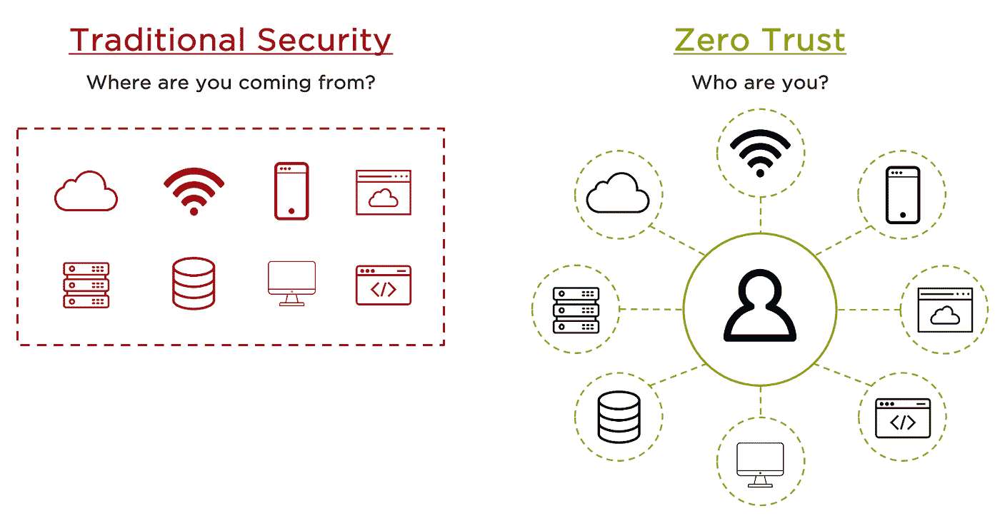
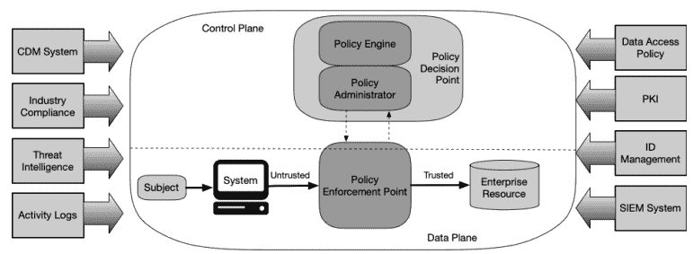
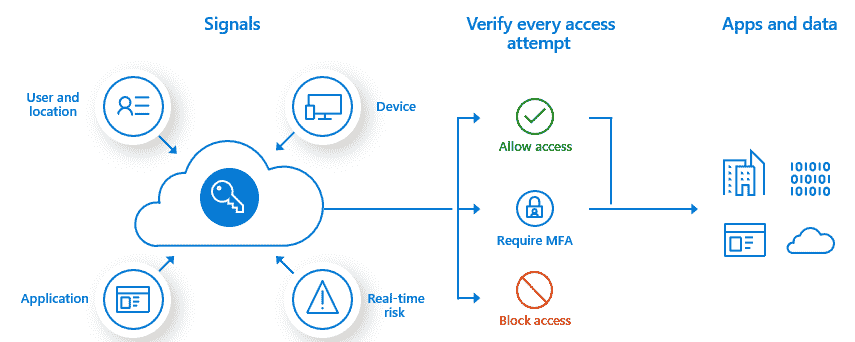
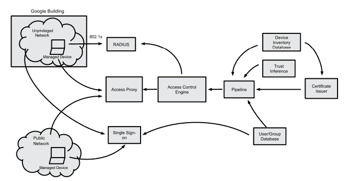

# 零信任模式—超越边界

> 原文：<https://medium.com/globant/zero-trust-model-beyond-the-perimeter-a4f4a97c7b8c?source=collection_archive---------2----------------------->

> **为什么零信任？**

*最初的术语是由 Forrester company 在 2010 年引入的，当时该公司认为当时的外围安全模式效率不高，应该随着新兴技术的发展而发展。事实上，建立公司边界并设置防火墙来分类和隔离可信和不可信网络的古老模式是有问题的，因为当边界被突破时，攻击者可以相对容易地访问公司的特权内部网。这种方法基于“信任和核实”的前提。*

> *另一方面，零信任是根据“永远不信任，永远验证”的原则创建的，在这种情况下，组织永远不应该信任任何内部或外部实体，无论流量或请求来自何处。这种方法破坏了定义明确的边界的古老概念，由于当前移动、协作和混合云技术的出现，边界变得越来越难以实施和划定。*

Figure 1\. Traditional Security VS Zero Trust

> **零信任的核心原则**

零信任模式依赖于在私有网络上进行任何访问或数据传输之前，对每个设备和个人进行强身份验证和授权，无论他们是在网络边界之内还是之外。采取零信任之旅的最重要原则如下:

***1)明确验证***

*始终根据所有可用的数据源进行身份验证和授权，包括用户身份、服务/工作负载、位置、数据分类和一些其他变量。使用这种方法，任何时候都没有受信任的区域、凭证或设备，考虑到 count 语句:*

*   *部署基于风险的有条件访问，确保工作流仅在风险级别变化时中断，允许持续验证，而不牺牲用户体验。*
*   *建立可扩展的动态策略模型，考虑工作负载、数据和用户的不断移动。*

***2)使用最低特权访问***

*通过及时和足够的访问(JIT/JEA)、基于风险的适应性策略和数据保护措施来限制用户访问，从而保护数据和工作效率。*

*无论何时使用凭证，包括服务帐户，给予尽可能少的特权是很重要的。因此，如果任务改变，范围也应该改变。许多攻击利用了特权过高的服务帐户，因为它们通常不受监控，并且通常过于宽松。*

***3)承担违约***

*利用网络、用户、设备和应用感知的分段访问，最大限度地减少整体攻击面并防止横向移动。验证所有会话都是端到端加密的。使用分析功能或特殊工具获得可见性和威胁检测。*

*如果确实发生了违规，最大限度地降低违规的影响至关重要。零信任限制了攻击者的凭证或访问路径的范围，为系统和人员提供了响应和缓解攻击的时间。*

> **零信任如何工作——部署**

零信任的大部分实施都符合[NIST 800–207](https://csrc.nist.gov/publications/detail/sp/800-207/final)架构全球标准，这得益于供应商中立性、兼容性以及针对现代攻击的保护，实现了大多数企业都渴望实现的云优先、随处工作的模式。

该框架的执行结合了强大的技术，如身份保护、下一代终端安全和基于风险的 MFA(多因素身份认证)。理想的零信任模型至少需要考虑以下身份属性:

*   *用户身份和凭证类型(人工、编程)*
*   *每个设备上的凭证特权*
*   *端点硬件/固件版本/ SO 版本和补丁级别*
*   *地理位置/国家请求*
*   *认证协议和风险*
*   *安装在端点上的应用程序*
*   *基线模式和先前事件检测*

Figure 2\. NIST 800–207 Zero Trust Framework

> **实施零信任的主要优势**

开始零信任之旅或采用该模式有很多好处，但最重要的有以下几点:

*   *允许组织采用无边界方法，从基于网络的安全性转移到基于身份和应用的安全性，平衡用户体验与风险。*
*   *它通过覆盖最广泛的攻击面，从用户到端点、网络和资源，不留漏洞。*
*   它提供了一个框架来正确管理将敏感应用程序和基础设施暴露给“业务合作伙伴”的风险。
*   *它可以确保 It 部门了解您的访问控制中的风险，并可以通过异常行为自动识别潜在风险，而这些异常行为是通过手动取证方法永远无法检测到的。*
*   *通过确保适当的控制到位来解决适当级别的风险，而不需要高压、顶级的控制方法，从而创建满意且高效的用户。*
*   *与专注于孤岛或资源的防御相比，需要更少的管理、技能和成本*

> ***Globant View —云顶提供商零信任方案***

Globant 通过其 CloudOps 和网络安全工作室寻求在我们实施基于云的解决方案或混合基础设施的绝大多数项目中，考虑零信任原则。本文包含了几组建议，供三大云提供商(AWS、Azure 和 GCP)考虑。

**T5 1)微软 Azure**

微软将其零信任模型集中于四个“信任”确定组件:

*   ***身份提供者:*** *建立用户的身份及相关信息。*
*   ***设备目录:*** *验证设备和设备完整性。*
*   ***策略评估服务:*** *确定用户和设备是否符合安全策略。*
*   ***访问代理:*** *决定可以访问哪些组织资源。*

为了更好地在项目中部署零信任，您需要确保使用以下一种或多种工具/技术:

***A)实施“Intune”进行设备管理和安全策略配置—*** *Intune 将设备配置要求推送到受管设备，并生成健康声明，存储在 Azure AD 中。当设备用户请求访问资源时，设备健康状态将作为与 Azure AD 的身份验证交换的一部分进行验证。*

***B)使用 Azure AD 进行用户和设备清点—*** *Azure AD 包含全套身份管理功能，包括多因素身份认证、设备注册、自助密码管理、PIM 和基于角色的访问控制。*

***C)使用 Azure AD“有条件访问”进行设备健康验证-*** *此功能使您能够从一个中心位置基于特定条件对您环境中的应用程序访问实施控制。它附带六个条件:用户/组、云应用、设备状态、位置(IP 范围)、客户端应用、登录风险。*

Figure 3\. Conditional access policies signals

***D)对管理“敏感数据”的所有系统实施 MFA—****根据条件访问策略中定义的信号或风险标签(中或高)实施可选的 MFA 控制*

***E)使用 Azure AD 特权身份管理(PIM)来管理和监控对您组织中重要资源的访问-*** *组织可以给予用户对 Azure 资源和 Azure AD 的即时(JIT)特权访问。PIM 有助于降低过度、不必要或滥用访问权限的风险。*

F)使用 Azure 广告访问审查来定期监控只有合适的人才能继续访问。

***2)谷歌云(GCP) —博彦科技***

BeyondCorp 是谷歌对零信任模式的实现。它由许多协作组件组成，以确保只有经过适当身份验证的设备和用户才有权访问企业应用程序。你可以在下面的链接中找到关于这个方法的更深入的细节:[https://cloud.google.com/beyondcorp](https://cloud.google.com/beyondcorp)。一般描述图形和组件包括以下内容:

Figure 4\. BeyondCorp components and access flow

**A)安全识别设备**

*使用* ***【设备清单数据库】*** *，这是一个元清单数据库，用于整合和标准化来自多个来源的设备信息，并使信息可用于 BeyondCorp 的下游组件。有了这个元库存，我们就知道了需要访问我们企业的所有设备。使用一个* ***【设备证书】*** *来唯一标识用户。安装后，证书将用于与企业服务的所有通信中。*

**B)安全地识别用户**

*BeyondCorp 还在一个* ***【用户和组数据库】*** *中跟踪和管理所有用户。将此数据库与管理所有用户的工作分类、用户名和组成员资格的人力资源流程相集成。随着员工加入公司、改变角色或职责或离开公司，这些数据库会更新。使用* ***【单点登录】*** *系统集中授权流程，然后对照“用户和组”数据库进行验证。*

**C)从网络中移除信任**

*BeyondCorp 定义并部署了一个* ***【非特权网络】*** *，仅连接到互联网、有限的基础设施服务(DNS、DHCP 和 NTP)和配置管理系统。在该网络和 Google 网络的其他部分之间使用严格管理的 ACL(访问控制列表)。谷歌使用* ***RADIUS 服务器*** *根据 802.1x 认证将设备分配到适当的 VLAN 网络。受管设备提供证书作为 802.1x 握手的一部分，并被分配给非特权网络，而公司网络中未被识别和不受管的设备被分配给补救网络或来宾网络。*

**D)外部化应用和工作流**

*通过* ***【面向互联网的访问代理】*** *向外部和内部客户端公开所需的应用程序，该代理在客户端和应用程序之间实施加密。访问代理是为每个应用程序配置的，它提供性能和安全特性，并在访问控制检查后适当地将请求委托给后端应用程序。*

**E)实施基于库存的访问控制**

*在访问代理中使用"* ***访问控制引擎"*** *"，在每个请求的基础上为企业应用提供服务级别授权。授权决策对用户、用户所属的组、设备证书和设备清单数据库中的设备工件做出断言。*

***3)亚马逊网络服务***

AWS 将零信任控制与针对用例及安全需求的灵活措施相结合。考虑应用这些建议来增强安全态势，并遵循零信任原则:

***A)使用静态许可和用户行为分析来认证和授权每个动作，而不仅仅是在“会话”开始时。***

*每个 AWS API 调用都是一个经过签名的请求，被单独认证和授权。*

***B)服务对服务的通信应遵循最佳安全实践，而不管任何密切的关系。停止在“隐藏”文件中存储凭据。***

*不管服务之间的耦合有多紧密，它们都应该使用短期凭证来调用每次都经过认证和授权的 API。使用参数存储和机密管理器等服务来安全地管理凭证。*

***C)在所有通信渠道上利用可扩展的端点和网络加密。使用 KMS、bucket SSE 和 EBS 加密卷等服务。***

*无论何种设备类型，从物联网到企业网络，都需要在“传输中”和“静态”实施加密，以确保数据安全。*

***D)消除资源间不必要的通路***

*将每个系统组件视为独立的，并设计 ACL 和安全组等网络控制来阻止不必要的通信。*

E)在适当的时候，利用网关功能来管理组件之间的通信。

*使用 API 网关允许您为 AuthN 和 AuthZ 实现速率限制、IAM 或自定义授权器。此外，您可以提供日志记录和指标。*

***F)在用户访问点实施适量的安全措施***

*利用虚拟桌面基础设施等像素代理来提供数据风险更高的服务，并利用身份感知代理来对不太敏感的资源进行网络访问。*

> **补充材料**

最后，补充本文信息的一些精彩材料:

1.  [CISA —零信任期限模型](https://www.cisa.gov/zero-trust-maturity-model)
2.  [零信任证券:企业指南](https://www.amazon.com/Zero-Trust-Security-Enterprise-Guide/dp/148426701X/ref=sr_1_1?crid=1C5C0MFBMQRL2&keywords=zero+trust&qid=1664921519&qu=eyJxc2MiOiIzLjYwIiwicXNhIjoiMy4wMyIsInFzcCI6IjIuNzgifQ%3D%3D&sprefix=zero+trust%2Caps%2C128&sr=8-1)
3.  [零信任项目:一个关于安全和业务协调策略的故事](https://www.amazon.com/Project-Zero-Trust-Strategy-Aligning/dp/1119884845/ref=sr_1_3_sspa?crid=1C5C0MFBMQRL2&keywords=zero+trust&qid=1664921519&qu=eyJxc2MiOiIzLjYwIiwicXNhIjoiMy4wMyIsInFzcCI6IjIuNzgifQ%3D%3D&sprefix=zero+trust%2Caps%2C128&sr=8-3-spons&psc=1&spLa=ZW5jcnlwdGVkUXVhbGlmaWVyPUEyVFhDRFZQRUczM0omZW5jcnlwdGVkSWQ9QTA5NjcyNTMxNzVORllQOVBMOUJTJmVuY3J5cHRlZEFkSWQ9QTA2MTY4ODkyUFlVODlVOUJOM0hKJndpZGdldE5hbWU9c3BfYXRmJmFjdGlvbj1jbGlja1JlZGlyZWN0JmRvTm90TG9nQ2xpY2s9dHJ1ZQ==)

**祝你在零信任之旅中好运……**

# 海罗！