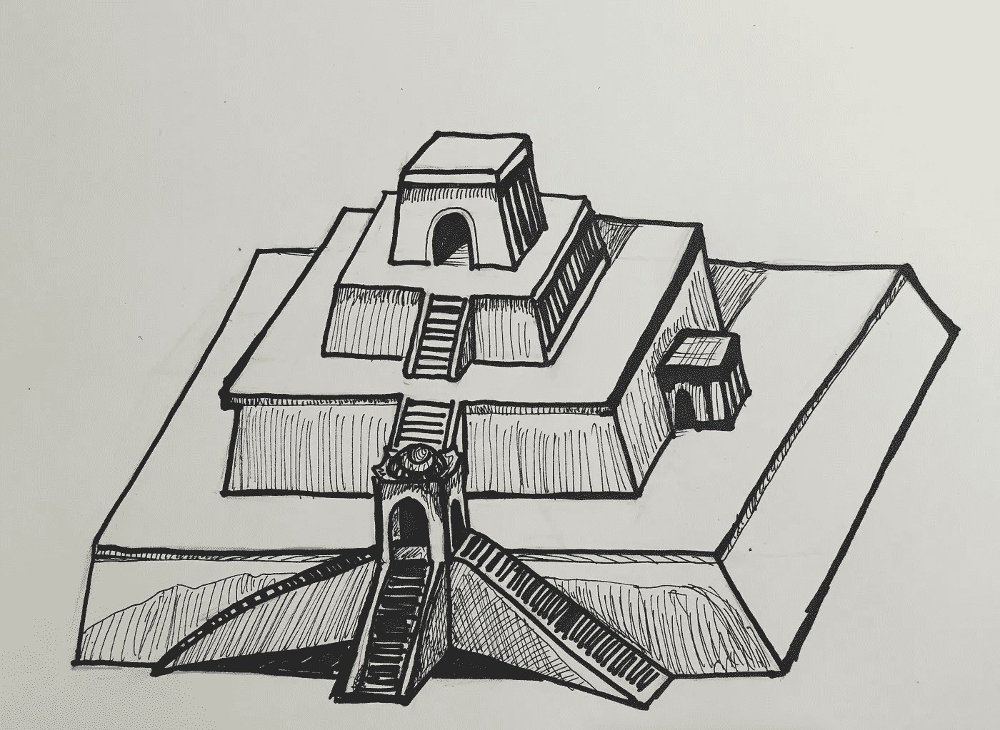
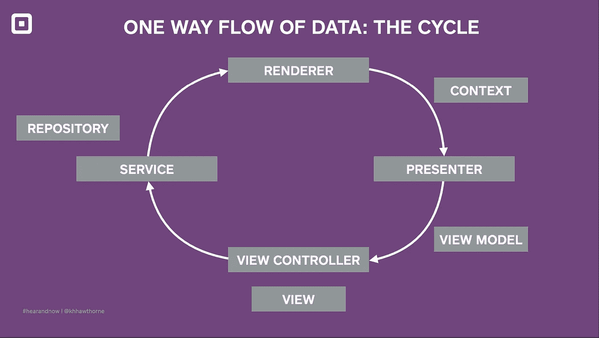

# 金字形神塔 iOS 应用架构

> 原文：<https://medium.com/square-corner-blog/ziggurat-ios-app-architecture-b54b3f7132f0?source=collection_archive---------1----------------------->

## 超越模型视图控制器的几个步骤

*作者* [*艾伦·芬伯格*](https://medium.com/u/6710389d9d0?source=post_page-----b54b3f7132f0--------------------------------) *。*

> 注意，我们已经行动了！如果您想继续了解 Square 的最新技术内容，请访问我们的新家[https://developer.squareup.com/blog](https://developer.squareup.com/blog)

早在六月份，我就发表了一篇关于[防止大规模视图控制器](https://www.youtube.com/watch?v=dgOdsh1Bq10)的演讲，并描述了一个在 Swift 中具有单向数据流的应用架构。当时，该架构没有附带的博客帖子，甚至没有名称。现在，两者兼而有之。我想介绍一下 **Ziggurat** :一种分层的、可测试的架构模式，包含了不可变的视图模型和单向数据流。

这种建筑以阶梯式金字塔命名，被称为“金字形神塔”。就像这个金字塔的阶梯一样，随着数据在应用程序的各个层中单向流动，数据复杂性也随之降低。这种单向的、不可改变的数据流减少了认知负荷，并导致了更小的班级。与金字形神塔相比，典型的模型-视图-控制器架构提供的指导更少，并且数据和状态可能从许多地方变异，包括视图控制器。

金字形神融合了各种演讲和文章的概念，我会在**进一步阅读/观看部分**列出。(剧透:它的灵感直接来自早期关于脸书的 [React Native](https://www.youtube.com/watch?v=mLSeEoC6GjU) 的讨论，与 [Flux](https://facebook.github.io/flux/docs/overview.html) 类似)。在这里引用的可选架构中，任何一个都是比模型-视图-控制器更好的选择。

我将介绍金字形神塔，描述它的背景，对比它的利弊，定义它的组成部分，并用一个[示例应用](https://github.com/alanf/ziggurat)展示它的作用。

# MVC 的问题

金字形神塔是[模型-视图-控制器](https://developer.apple.com/library/mac/documentation/General/Conceptual/DevPedia-CocoaCore/MVC.html) (MVC)的替代模式。MVC 是在应用程序中划分职责的一种基本方式，但是它没有充分地将角色和职责分开。以下是 MVC 应用程序中遇到的一些常见问题:

**海量视图控制器**

*   视图控制器可以修改数据、管理 I/O、从 API 获取数据、包含模型对象的真实来源，或者超出它们的用途:管理视图和 UI 事件。

**来自共享数据的棘手 Bugs】**

*   谁在修改这些数据，何时修改？如果没有精心的设计，答案可能是几乎任何人，几乎在任何时候，都有未知的、连锁的副作用。

**承担太多责任，难以测试代码**

*   当无视[单一责任原则](https://en.wikipedia.org/wiki/Single_responsibility_principle)时，界定和隔离行为的界限变得模糊或缺失。

实际上，MVC 缺乏分离性导致应用程序没有清晰的设计，变得难以测试和调试。为了在代码库中有效地工作，工程师不需要对应用的设计和数据模型进行逆向工程。

# 组件和单向数据流的描述

我将介绍金字形神塔模式的基础知识，但要获得更详细的描述，请参阅下面列出的参考资料:

*   一个用代码记录的所有组件实现该模式的示例应用程序是这里的。
*   示例应用程序还在文本[文件](https://github.com/alanf/ziggurat/blob/master/README.md#components-in-more-depth)中记录组件。
*   我关于[防止大规模视图控制器](https://www.youtube.com/watch?v=dgOdsh1Bq10)的演讲
*   Square 工程师 Kat Hawthorne 的[演讲](https://www.youtube.com/watch?v=4cP1p5VOrSI)和[幻灯片](https://speakerdeck.com/kathryneh/one-way-flow-of-data)是关于单向数据流的，下面这张幻灯片是我从哪里借来的:

金字形神塔的单向数据流如上图所示(并在此处的动作[中演示):](https://github.com/alanf/ziggurat)

*   外部触发(例如用户输入)发生。
*   一个*视图* *控制器*通知一个*服务*它收到了用户输入。
*   一个*服务*解析/验证这个输入，并且可能改变状态(只有*服务*改变状态)。然后*服务*调用*信号()*。
*   *signal()* 向渲染器指示该更新了。
*   *呈现器*调用*呈现器*，产生*视图模型*(在呈现循环期间*服务*不会被写入)。
*   然后*渲染器*将*视图* *模型*推入*视图* *控制器*。
*   渲染循环处于空闲状态，直到另一个外部触发器出现。

# 权衡

Ziggurat 架构解决了 MVC 应用程序的常见问题:

*   **海量视图控制器**
*   多层架构为功能提供了一个清晰的归宿，避免了大量的视图控制器。
*   **来自共享数据的棘手 bug**
*   减少了有状态性和可变性:服务层封装了可变性(将其限制到主线程)，呈现者和渲染是无状态和单向的。依赖注入而不是共享状态和全局单例。
*   **难以测试责任过大的代码**
*   更少、更薄的应用程序层平均分配责任。

# 丰富

金字形神塔在几个方面让生活变得更好，并且让我们这个拥有 iOS 经验(从没有到几年)的小团队能够在一个雄心勃勃的期限内完成任务。

首先，它通过为不熟悉代码库的工程师提供指南和护栏，明确定义了应用程序中的层和角色。对于新工程师来说，启动时间很短，因为每个组件的角色都是明确定义的，并且符合明确定义的心理模型。其次，金字形神塔模式使得添加测试变得容易。例如，我们使用视图模型层来比较作为预期输出的结构。这在 MVC 中是不可行的。

单向数据流阻止了 MVC 意大利面条，并大幅缩小了视图控制器。不可变类型、更小的对象(最好是结构)和更多的层减少了精神负担。由于视图层缺乏业务逻辑，现在以“无头”模式运行应用程序也更容易了；没有视图层，所有的业务逻辑都是可测试的；可以使用时间点视图模型快照重新创建视图状态。最后，我们发现这个应用程序是可移植的。由于有了层和依赖注入，从一个应用程序过渡到包含在另一个应用程序中的小程序变得很简单。

# 困难

金字形神塔让一些事情变得更加困难，比如动画。我们建议在少用动画的应用中使用金字形神塔。视图控制器动画可能会被 incomingupdate()调用中断，除非小心管理，否则这可能会导致闪烁。有了 [Flux](https://youtu.be/i__969noyAM?t=1096) ，这个问题通过和 React Native 一起使用就解决了。

此外，尽管它提供了额外的编译时检查，但一些样板代码是通过额外的层推送数据而产生的。单一数据更新管道还有一个潜在的瓶颈。与 React 不同，属性不是键值观察；相反，更新以视图模型结构的形式一点一点地出现。可能需要一些优化，比如丢弃无关的渲染调用或者用 diffing 修剪视图模型。

依赖注入需要仔细的设计。我们最初的方法产生了一个大的对象图。我们有循环依赖，这导致了重构。

# 结论

新项目提供了尝试新想法的机会。MVC 有许多明显的弱点，并且已经声名狼藉。与此同时，关于 Flux、React Native 以及在 Swift 中更广泛地使用值类型等主题的许多讨论已经获得了势头。

我们构建了一个完整的 Swift 应用，其架构融合了这些想法。我们对使用单向数据流、可测试性、依赖注入、轻量级视图控制器和值类型视图模型的结果感到满意。

金字形神塔也有利弊，但是到目前为止，它为我们提供了很好的服务。我希望你能考虑采纳一些(或者全部！)的想法，尤其是在决定采用 MVC 架构之前。

# 进一步阅读/观看

我看过早期与 React 相关的视频，它们是金字形神塔的直接灵感。 [Flux](https://youtu.be/i__969noyAM?t=1096) 和 [React Native](https://www.youtube.com/watch?v=mLSeEoC6GjU) 使用类似的概念，都是用 JavaScript 实现的。

Flux 是一个健壮的、以动作为中心的模式，与 React Native 很好地匹配。Ziggurat 很容易用在动画最少的应用程序中，但不能为复杂的动画提供解决方案，这些动画可能会被不可预测的重新渲染打断。(Flux 也有这个问题，它对本地地址作出反应。)

我们希望你发现 Ziggurat 模式是有帮助的，并且/或者发现下面文章中涉及的 MVC 的许多更好的替代方案之一:

*   [OS 架构模式](/ios-os-x-development/ios-architecture-patterns-ecba4c38de52)
*   [MVVM 不太好](http://khanlou.com/2015/12/mvvm-is-not-very-good/)
*   [Swift 中的 MVVM](https://www.objc.io/issues/13-architecture/mvvm) 和 MVVM[介绍](http://artsy.github.io/blog/2015/09/24/mvvm-in-swift/)
*   [在 Swift 中控制复杂性](https://realm.io/news/andy-matuschak-controlling-complexity/)
*   [介绍 React Native](https://www.youtube.com/watch?v=KVZ-P-ZI6W4)
*   [通](https://facebook.github.io/flux/docs/overview.html)(和[通话](https://youtu.be/i__969noyAM?t=1096))
*   [使用 VIPER 构建 iOS 应用](https://www.objc.io/issues/13-architecture/viper/)
*   [Swift 中 iOS 的简单静态表格视图](https://github.com/venmo/Static)

感谢 Ruby Chen 的插图。

 [## 艾伦·芬伯格-简介

### 债务:最初的 5000 年给我留下了深刻的印象，所以我急切地阅读了大卫·格雷伯的《规则的乌托邦》。它…

medium.com](/@dunbar151)