# 将 Zoom 与您的 Mendix 应用程序集成

> 原文：<https://medium.com/mendix/zoom-integration-with-your-mendix-app-46305b59b5ca?source=collection_archive---------0----------------------->

## 在这篇博客中，我将向您展示如何使用 zoom API 将 ZOOM 与任何 Mendix 应用程序集成。Zoom 的 API 允许开发者向 Zoom 请求信息，并代表用户在他们的平台上执行操作。

## Zoom 的 API 下的所有 API 都是通过 HTTPS 在指定的 URL 访问的。所有请求的基本 URL 是[https://api.zoom.us/v2](https://api.zoom.us/v2)，完整的 URL 根据被访问资源的端点而有所不同。

# 今天就开始建设

如果您还没有 Zoom 帐户，请点击此处的“注册”链接创建一个:[https://market place . Zoom . us .](https://marketplace.zoom.us.)一旦您激活了您的帐户，您就可以作为开发者帐户加入了。

> **下一步**

1.  要开始构建应用程序，请单击**构建应用程序**按钮。

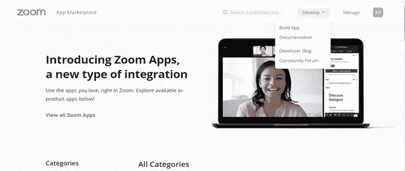

一个 **JSON Web 令牌** (JWT)允许您使用一个紧凑的 JSON 对象创建提供安全数据传输的令牌。

为此，请在 **Zoom 应用程序市场**中注册一个 JWT。使用从 JWT 应用程序生成的令牌，并开始向缩放 API 发出 API 请求。

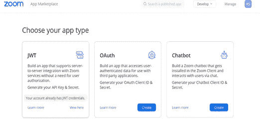

1.  **选择 JWT 应用类型**并在信息选项卡中输入详细信息。
2.  点击下一步→复制**授权**的 JWT 令牌(即根据 API key 和 API secret key 生成)

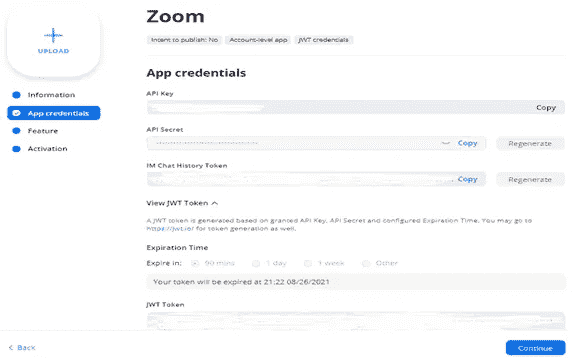

3.点击**继续**然后点击**激活**你的应用。

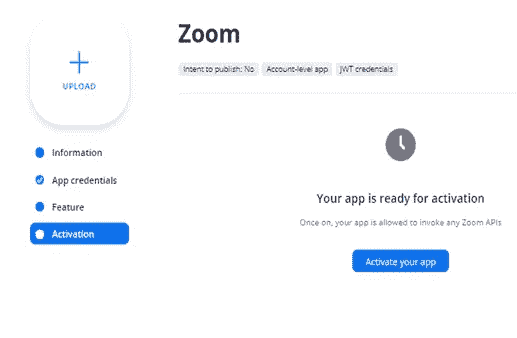

# **在 Studio Pro**

> **步骤:**

创建一个新项目，并创建一个配置实体和概述页面来存储 jwt 令牌，作为使用 zoom API 的授权

## **创建会议**

1.  创建一个名为**的实体，用以下属性满足**:

*   **主题**
*   **开始日期时间**
*   **持续时间**
*   **议程**
*   **密码**

2.然后**创建**或**生成**概览页面以存储会议详情。要创建会议，请使用 https://api.zoom.us/v2/users/me/meetings 的[API。](https://api.zoom.us/v2/users/me/meetings)

3.创建一个名为 **body** 的字符串变量来传递给 rest 调用。

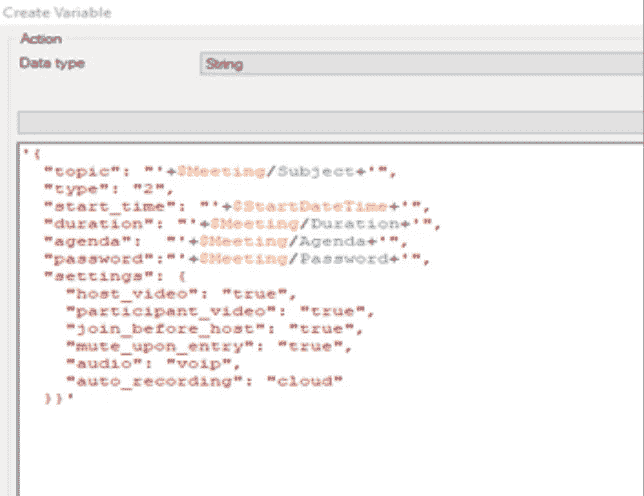

4.rest 呼叫活动中的常规选项卡如下所示:

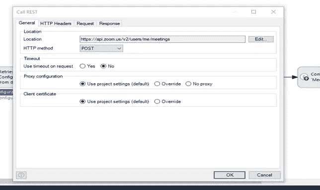

5.将配置中存储的 JWT 令牌作为 HTTP headers 选项卡中的**授权** **令牌**传递给 Zoom 的 API。

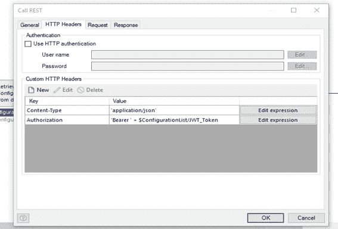

6.在请求主体中传递创建的主体变量。现在**在保存会议按钮**中调用这个微流。

7.将此添加到应用程序的导航中，并在本地运行应用程序，以配置 JWT 令牌(取自缩放 JWT 应用程序)

8.**通过输入所需的详细信息创建会议**，然后保存会议。

如果到目前为止您已经正确地完成了所有操作，会议将会根据您在 Mendix 应用程序中输入的详细信息在您的 zoom 应用程序中创建。

[https://www.mendix.com/pricing/basic-package/](https://www.mendix.com/pricing/basic-package/)

## **列出会议:**

1.要列出为用户安排的所有会议，请使用以下 API。

[**https://api.zoom.us/v2/users/me/meetings**](https://api.zoom.us/v2/users/me/meetings)。

2.如下图所示配置**通用选项卡**

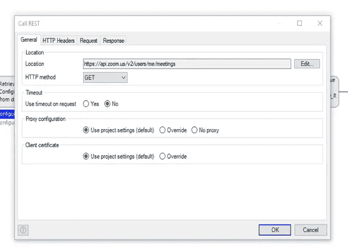

3.通过将 JWT 令牌作为**授权**传递来配置 **HTTP Headers 选项卡**。

4.创建一个 **JSON 结构**，如下所示。

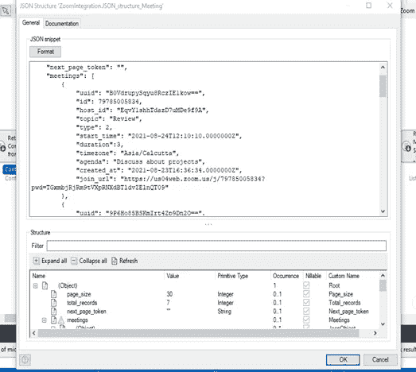

5.然后创建一个**导入映射**，如下所示，使用之前创建的 JSON 结构。

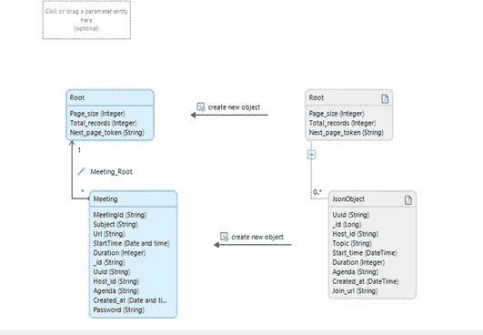

5.检索响应并将其映射到会议实体。

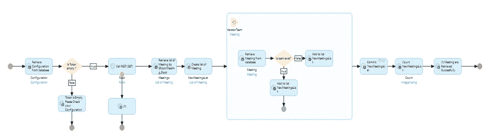

6 .将此添加到导航中，**在本地运行应用程序**和**单击检索会议**，请求将被发送到 API，用户的会议将被成功检索。

7 .您可以看到所有会议的**开始时间、持续时间、加入 URL 和密码**等。

## 添加邀请:

您还可以使用以下 API 将被邀请者添加到会议中。

> 为了使用**邀请 API** ，缩放应用程序需要获得**许可**。

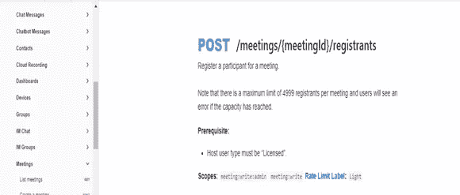

作为变通办法，您也可以使用 Mendix 电子邮件模块将会议邀请 url 和密码发送到与会者的邮箱**。**

接下来，你可以期待在这个实现上的 **Mendix 市场**中的一个公共模块。

> 在此之前，请尽情体验吧！注意安全！编码快乐！

## **阅读更多**

 [## 简介- API 参考

### Zoom API 是开发人员从 Zoom 访问资源集合的主要方式。应用程序可以读写…

marketplace.zoom.us](https://marketplace.zoom.us/docs/api-reference/introduction)  [## 应用市场

### 编辑描述

marketplace.zoom.us](https://marketplace.zoom.us/)  [## JSON Web 令牌(JWT) -授权-文档

### 单个 JWT 由三个部分组成:报头、有效负载和签名，用.分隔每个部分。比如说…

marketplace.zoom.us](https://marketplace.zoom.us/docs/guides/auth/jwt) 

*来自出版商——*

如果你喜欢这篇文章，你可以在我们的 [*中页*](https://medium.com/mendix) *找到更多喜欢的。对于精彩的视频和直播会话，您可以前往*[*MxLive*](https://www.mendix.com/live/)*或我们的社区*[*Youtube PAG*](https://www.youtube.com/c/MendixCommunity/community)*e .*

*希望入门的创客，可以注册一个* [*免费账号*](https://signup.mendix.com/link/signup/?source=direct) *，通过我们的* [*学苑*](https://academy.mendix.com/link/home) *即时获取学习。*

有兴趣更多地参与我们的社区吗？你可以加入我们的 [*Slack 社区频道*](https://join.slack.com/t/mendixcommunity/shared_invite/zt-hwhwkcxu-~59ywyjqHlUHXmrw5heqpQ) *或者想更多参与的人，看看加入我们的*[*Meet ups*](https://developers.mendix.com/meetups/#meetupsNearYou)*。*